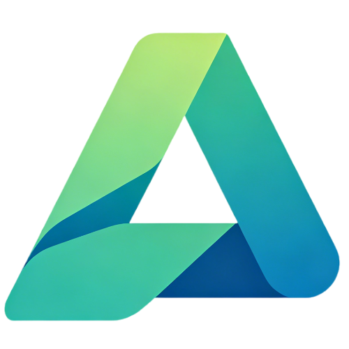

<p align="center">
  
</p>

<h1 align="center">Awesome Study Agent</h1>

<p align="center">
  <b>从零走到一，系统掌握 AI Agent。</b>
</p>

<p align="center">
  <a href="https://github.com/NieAnSHOW/awesome-study-agent"></a>
  <a href="https://github.com/NieAnSHOW/awesome-study-agent"></a>
  <a href="LICENSE"></a>
  <a href="https://github.com/NieAnSHOW/awesome-study-agent"></a>
</p>

一个面向零基础学习者的 AI Agent 系统性知识库。**15 个基础模块 + 3 个深度指南 + 6 个附录**，目标是让你读完就能干活。

[GitHub 仓库](https://github.com/NieAnSHOW/awesome-study-agent) · [在线阅读](https://agent.nieanshow.cn/)

---

## 这是啥

一门把 AI Agent 从概念到实战讲明白的课程。不讲数学公式，不堆算法术语——从一个从来没写过程序的人也能看懂的角度出发，把 Agent 拆成你能消化的知识点。

截至今天，知识库有 **154 篇 Markdown 文档**，覆盖：
- **基础知识**（15 个模块，~100 篇文章）
- **深度指南**（3 个专题，40+ 篇文章）
- **附录参考**（6 个工具页）

所有内容由 **DeepSeek V4** 辅助生成，用 **VitePress** 构建，主题基于 **vitepress-theme-teek**。

---

## 内容架构

### 基础路径（15 个模块）

| 模块 | 主题 | 篇数 |
|------|------|------|
| 一 | AI 概述与 Agent 概念 | 5 |
| 二 | 大语言模型基础 | 6 |
| 三 | 提示词工程 | 6 |
| 四 | Agent 基础与架构 | 6 |
| 五 | RAG 与知识增强 | 7 |
| 六 | AI 编程工具（Cursor / Claude Code） | 7 |
| 七 | Agent 生态与 MCP 协议 | 7 |
| 八 | 模型训练与优化 | 7 |
| 九 | Agent Skills 系统 | 6 |
| 十 | OpenClaw 开源 AI 助手 | 6 |
| 十一 | WorkBuddy 数字员工实践 | 7 |
| 十二 | AI 视频生成 | 7 |
| 十三 | 多模态 AI 技术 | 7 |
| 十四 | AI 图像生成 | 8 |
| 十五 | Markdown 阅读工具 | 7 |

每个模块 5-8 篇文章，从概念到上手，附带「检验标准」——过不了就别急着往下走。

### 深度指南（3 个专题）

每个专题 14 篇文章，比基础模块深一个层次：

- **Agent Skills 系统**：从认知科学到企业级治理，14 篇
- **大模型上下文管理**：从原理到工具链全景，14 篇
- **OpenClaw 深度指南**：从 Gateway 架构到安全模型，14 篇

### 附录（6 个页面）

术语表 · 工具清单 · 提示词模板库 · FAQ · 资源推荐 · 更新日志

---

## 快速开始

```bash
# 安装依赖
pnpm install

# 启动本地开发服务器
pnpm run docs:dev

# 构建生产版本
pnpm run docs:build
```

依赖：Node.js + pnpm 10.6.5。

---

## 学习路线

三句话：

- **零基础**：按模块一走到十五，再挑一个深度指南深耕
- **有基础**：先看 Agent 架构和生态协议，直接冲深度指南
- **独立开发**：AI 编程工具 → Agent 架构 → MCP → Skills 深度 → 动手做产品

多读一篇不如多动手一次。先做出来。

---

## Tech Stack

- **构建**：[VitePress](https://vitepress.dev/) ^1.6.4
- **主题**：[vitepress-theme-teek](https://www.npmjs.com/package/vitepress-theme-teek) ^1.5.4
- **内容驱动**：DeepSeek V4
- **包管理**：pnpm 10.6.5
- **协议**：MIT License

---

## 从哪开始

[序言：课程大纲](config/preface.md) → [开始学习](config/basics/01-ai-overview/)

或者直接看目录结构找到你感兴趣的模块。

> 有问题提 Issue，想贡献提 PR，觉得有用点个 Star。
