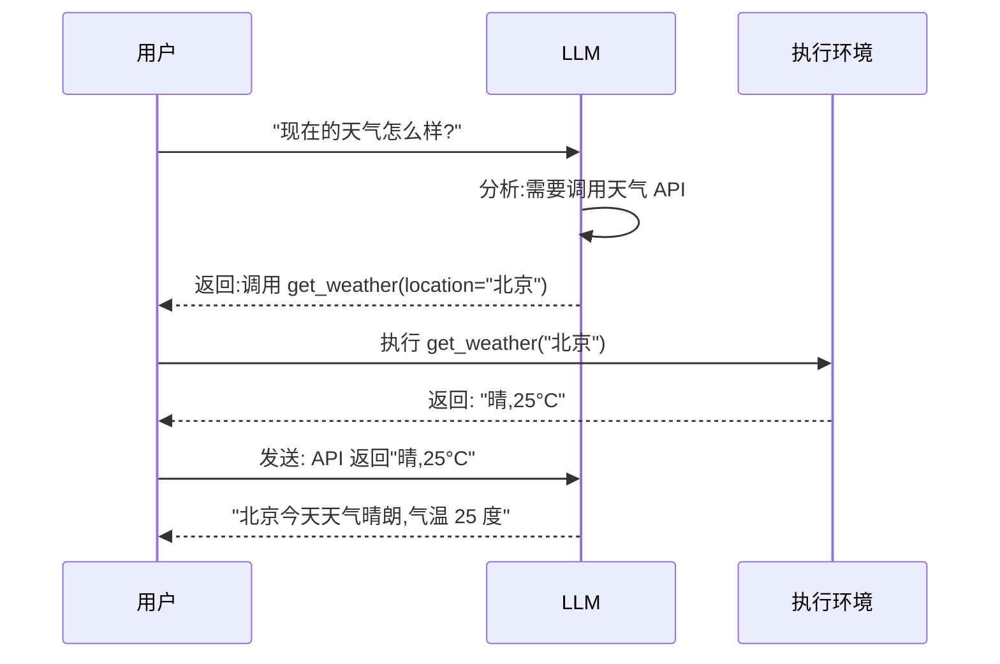

# Function Calling

> **学习目标**: 理解 Function Calling 的原理、主流实现差异和应用场景
>
> **预计时间**: 50 分钟
>
> **难度等级**: ⭐⭐⭐☆☆

---

## 核心概念

### 什么是 Function Calling?

**Function Calling**(或称 Tool Use)是让 LLM 能够调用外部函数的能力。

::: tip 通俗理解
传统 LLM 像一个被困在房间里的人,只能凭空回答问题。Function Calling 给这个房间装了一部电话,让 LLM 可以"打电话"请求外部帮助——查询数据库、调用 API、执行代码等。
::

**工作流程**:



**关键点**:
- LLM **不直接执行**函数,只是返回"调用什么函数、用什么参数"
- 外部代码执行函数,然后把结果**发回**给 LLM
- LLM 基于结果生成最终回答

---

## 主流实现对比

### OpenAI Function Calling

**发布时间**: 2023 年 6 月(首个推出)

**核心特点**:

#### 1. 结构化输出

```python
from openai import OpenAI

client = OpenAI()

# 定义函数
tools = [
    {
        "type": "function",
        "function": {
            "name": "get_weather",
            "description": "获取指定城市的天气",
            "parameters": {
                "type": "object",
                "properties": {
                    "location": {
                        "type": "string",
                        "description": "城市名称"
                    },
                    "unit": {
                        "type": "string",
                        "enum": ["celsius", "fahrenheit"]
                    }
                },
                "required": ["location"]
            }
        }
    }
]

# 调用
response = client.chat.completions.create(
    model="gpt-4o",
    messages=[{
        "role": "user",
        "content": "北京现在多少度?"
    }],
    tools=tools
)

# 检查是否需要调用函数
if response.choices[0].finish_reason == "tool_calls":
    tool_call = response.choices[0].message.tool_calls[0]
    function_name = tool_call.function.name
    arguments = json.loads(tool_call.function.arguments)

    # 执行函数
    result = get_weather(arguments["location"])

    # 发送结果回 LLM
    follow_up = client.chat.completions.create(
        model="gpt-4o",
        messages=[
            {"role": "user", "content": "北京现在多少度?"},
            response.choices[0].message,
            {
                "role": "tool",
                "tool_call_id": tool_call.id,
                "content": json.dumps(result)
            }
        ]
    )

    print(follow_up.choices[0].message.content)
```

#### 2. 并行函数调用

**优势**: 一次调用多个函数,减少往返次数。

```python
response = client.chat.completions.create(
    model="gpt-4o",
    messages=[{
        "role": "user",
        "content": "比较北京和上海的天气"
    }],
    tools=tools
)

# OpenAI 会并行返回两个 tool_calls
tool_calls = response.choices[0].message.tool_calls
# [
#   {"name": "get_weather", "arguments": {"location": "北京"}},
#   {"name": "get_weather", "arguments": {"location": "上海"}}
# ]
```

#### 3. JSON Schema 验证

**严格模式**(2024 年更新):

```python
tools = [
    {
        "type": "function",
        "function": {
            "name": "create_user",
            "parameters": {
                "type": "object",
                "properties": {
                    "name": {"type": "string"},
                    "age": {"type": "integer"},
                    "email": {"type": "string", "format": "email"}
                },
                "required": ["name", "email"],
                "additionalProperties": False  # 拒绝额外字段
            }
        },
        "strict": True  # 启用严格模式
    }
]
```

**保证**: 返回的 JSON 一定符合 Schema,不会是格式错误的数据。

---

### Anthropic Tool Use

**发布时间**: 2023 年 8 月

**核心特点**:

#### 1. 更具表现力的工具定义

```python
import anthropic

client = anthropic.Anthropic()

# 定义工具
tools = [
    {
        "name": "get_weather",
        "description": "获取天气信息",
        "input_schema": {
            "type": "object",
            "properties": {
                "location": {
                    "type": "string",
                    "description": "城市名称,如 '北京'",
                    "minLength": 2,
                    "maxLength": 50
                },
                "unit": {
                    "type": "string",
                    "enum": ["celsius", "fahrenheit"],
                    "description": "温度单位"
                }
            },
            "required": ["location"]
        }
    }
]

# 调用
message = client.messages.create(
    model="claude-3-5-sonnet-20250119",
    max_tokens=1024,
    tools=tools,
    messages=[{
        "role": "user",
        "content": "北京现在多少度?"
    }]
)

# 检查是否需要使用工具
if message.stop_reason == "tool_use":
    for block in message.content:
        if block.type == "tool_use":
            tool_name = block.name
            tool_input = block.input

            # 执行工具
            result = get_weather(tool_input["location"])

            # 继续对话
            response = client.messages.create(
                model="claude-3-5-sonnet-20250119",
                max_tokens=1024,
                messages=[
                    {"role": "user", "content": "北京现在多少度?"},
                    message,
                    {
                        "role": "user",
                        "content": [
                            {
                                "type": "tool_result",
                                "tool_use_id": block.id,
                                "content": json.dumps(result)
                            }
                        ]
                    }
                ]
            )

            print(response.content[0].text)
```

#### 2. 顺序工具调用

**特点**: Claude 倾向于顺序思考,一个工具的结果可能影响下一个工具的选择。

```python
# 示例: 先搜索文件,再读取内容
messages = [{"role": "user", "content": "找到配置文件并读取数据库密码"}]

# 第一轮: 调用搜索工具
response = client.messages.create(
    model="claude-3-5-sonnet-20250119",
    messages=messages,
    tools=[search_tool, read_file_tool]
)

# Claude 先调用 search_files
search_result = execute_tool(response)

# 第二轮: 基于搜索结果调用 read_file
response = client.messages.create(
    model="claude-3-5-sonnet-20250119",
    messages=messages + [response, tool_result_message(search_result)],
    tools=[search_tool, read_file_tool]
)

# Claude 读取找到的文件
```

**优势**: 适合需要多步推理的任务。

**劣势**: 比并行调用慢。

#### 3. 工具链能力

Claude 擅长将多个工具组合成复杂的工作流:

```python
# 示例: 代码审计流程
tools = [
    {"name": "search_code", "description": "搜索代码"},
    {"name": "analyze_function", "description": "分析函数"},
    {"name": "check_security", "description": "安全检查"},
    {"name": "generate_report", "description": "生成报告"}
]

# Claude 会自动规划:
# 1. search_code 找到相关函数
# 2. analyze_function 分析每个函数
# 3. check_security 检查安全问题
# 4. generate_report 汇总报告
```

---

## 技术对比

### 功能对比表

| 特性 | OpenAI | Anthropic |
|------|--------|-----------|
| **执行方式** | 并行调用 | 顺序调用 |
| **Schema 标准** | JSON Schema(部分) | JSON Schema(完整) |
| **参数验证** | 严格模式可选 | 内置验证 |
| **工具链** | 基础 | 强 |
| **流式响应** | ✅ | ✅ |
| **多模态** | ✅ | ✅ |
| **代码执行** | Code Interpreter | MCP 代码执行 |

### 性能对比

**场景**: 处理一个需要 3 个 API 调用的任务

| 指标 | OpenAI(并行) | Anthropic(顺序) |
|------|-------------|-----------------|
| **API 调用次数** | 2 次 | 4 次 |
| **总耗时** | ~3 秒 | ~6 秒 |
| **Token 消耗** | ~800 | ~1200 |
| **成本** | $0.002 | $0.003 |

> 假设每次 API 调用 1.5 秒,OpenAI 的并行调用节省了时间。

### 适用场景

| 场景 | 推荐方案 | 理由 |
|------|---------|------|
| **简单 CRUD** | OpenAI | 并行调用快 |
| **复杂推理** | Anthropic | 顺序调用更可靠 |
| **代码任务** | Anthropic | 工具链能力强 |
| **消费级应用** | OpenAI | 生态成熟,文档全 |
| **企业应用** | Anthropic | 安全性强,审计好 |

---

## 实现细节

### OpenAI 实现原理

**提示词工程**:

OpenAI 在系统提示中注入了工具定义:

```python
# 实际发送给 GPT 的提示(简化)
system_prompt = f"""
You are a helpful assistant with access to the following tools:

Tools:
{json.dumps(tools, indent=2)}

When you need to use a tool, respond with a JSON object containing:
- "name": the tool name
- "arguments": a JSON object with the parameters

Example:
{{
  "name": "get_weather",
  "arguments": {{"location": "北京"}}
}}
"""
```

**模型微调**:

GPT-4 经过微调,学会:
1. 识别何时需要使用工具
2. 正确生成工具调用 JSON
3. 解析工具返回结果
4. 基于结果生成回答

### Anthropic 实现原理

**Constitutional AI**:

Claude 使用训练时的"规则"来约束工具调用:
- 工具调用前要解释原因
- 不能滥用工具
- 要考虑工具调用的后果

**示例**:

```
用户: "删除所有文件"

Claude(未经训练): 调用 delete_all_files()
Claude(经过训练): 这会删除所有数据,你确定吗?
                 具体要删除哪些文件?
```

---

## 最佳实践

### 1. 工具设计

**单一职责**:

```python
# 好: 每个工具做一件事
tools = [
    {"name": "get_user"},
    {"name": "update_user"},
    {"name": "delete_user"}
]

# 不好: 一个工具做太多事
tools = [
    {"name": "user_crud"}  # 创建、读取、更新、删除都在一个函数
]
```

**清晰的描述**:

```python
{
    "name": "search_files",
    "description": "在代码库中搜索文件。支持按文件名、文件内容、修改时间过滤。",
    "parameters": {
        "properties": {
            "pattern": {
                "description": "搜索模式,支持通配符(*.py, test_*)",
                "type": "string"
            }
        }
    }
}
```

**参数验证**:

```python
def get_weather(location: str, unit: str = "celsius") -> dict:
    # 验证
    if not location or len(location) < 2:
        raise ValueError("地点名称至少 2 个字符")

    if unit not in ["celsius", "fahrenheit"]:
        raise ValueError("单位只能是 celsius 或 fahrenheit")

    # 执行逻辑
    ...
```

### 2. 错误处理

**优雅降级**:

```python
try:
    result = call_tool(tool_name, arguments)
except ToolNotFoundError:
    # 工具不存在,用通用能力
    result = generic_fallback(arguments)
except ToolTimeoutError:
    # 工具超时,返回缓存或默认值
    result = get_cached_result(arguments)
except Exception as e:
    # 其他错误,告诉 LLM
    result = {"error": str(e)}

# 把错误发给 LLM,让它决定如何处理
response = client.messages.create(
    messages=[...],
    messages=[{
        "role": "tool",
        "content": json.dumps(result)
    }]
)
```

### 3. 成本优化

**缓存工具结果**:

```python
from functools import lru_cache

@lru_cache(maxsize=100)
def get_weather(location: str) -> dict:
    # 相同查询不会重复调用 API
    return api_call(location)
```

**批量处理**:

```python
# 不好: 循环调用
for item in items:
    result = process_item(item)  # N 次 API 调用

# 好: 批量处理
results = process_batch(items)  # 1 次 API 调用
```

**Token 优化**:

```python
# 只发送必要的上下文
messages = [
    {"role": "user", "content": user_query},
    {"role": "tool", "content": summarize_result(tool_result)}
    # ^ 不要发送完整的大 JSON,发送摘要
]
```

### 4. 安全性

**输入验证**:

```python
def execute_sql(sql: str) -> list:
    # 检查危险操作
    dangerous_keywords = ["DROP", "DELETE", "TRUNCATE", "ALTER"]
    if any(kw in sql.upper() for kw in dangerous_keywords):
        raise PermissionError("不允许修改数据库")

    # 执行只读查询
    return db.execute(sql)
```

**权限控制**:

```python
tools = {
    "admin": [delete_user, update_system],
    "user": [get_profile, update_profile],
    "guest": [get_public_info]
}

# 根据用户角色分配工具
allowed_tools = tools[user.role]
```

**审计日志**:

```python
def call_tool(tool_name: str, args: dict):
    # 记录调用
    logger.info(f"Tool call: {tool_name} with {args}")

    # 执行
    result = execute(tool_name, args)

    # 记录结果
    logger.info(f"Tool result: {result}")

    return result
```

---

## 实际案例

### 案例 1: 数据分析 Agent

**需求**: 用户可以用自然语言查询数据库。

**实现**:

```python
tools = [
    {
        "name": "execute_sql",
        "description": "执行 SQL 查询(只读)",
        "parameters": {
            "type": "object",
            "properties": {
                "sql": {
                    "type": "string",
                    "description": "SQL SELECT 查询"
                }
            }
        }
    },
    {
        "name": "visualize",
        "description": "将数据转换为图表",
        "parameters": {
            "type": "object",
            "properties": {
                "data": {"type": "array"},
                "chart_type": {
                    "type": "string",
                    "enum": ["bar", "line", "pie"]
                }
            }
        }
    }
]

# 用户: "画出上个月每天的新用户数"
# 1. LLM 生成 SQL
# 2. execute_sql 返回数据
# 3. visualize 生成图表
```

**效果**:
- 非技术人员也能查询数据
- 减少数据团队负担
- 查询时间从 2 天(提需求→等结果)降到 2 分钟

---

### 案例 2: 客户服务 Agent

**需求**: 自动处理常见客服问题。

**实现**:

```python
tools = [
    {
        "name": "query_order",
        "description": "查询订单状态"
    },
    {
        "name": "process_refund",
        "description": "处理退款申请"
    },
    {
        "name": "update_address",
        "description": "修改配送地址"
    },
    {
        "name": "escalate_to_human",
        "description": "转接人工客服"
    }
]

# Agent 根据问题自动选择工具:
# "我的快递还没到" → query_order
# "我要退款" → process_refund
# "改个地址" → update_address
# "太复杂了" → escalate_to_human
```

**效果**:
- 自动处理 70% 的咨询
- 人工客服只处理复杂问题
- 客户满意度提升(响应更快)

---

### 案例 3: 代码审查 Agent

**需求**: 自动审查代码质量。

**实现**:

```python
tools = [
    {
        "name": "read_file",
        "description": "读取源代码"
    },
    {
        "name": "run_linter",
        "description": "运行代码检查工具"
    },
    {
        "name": "run_tests",
        "description": "运行单元测试"
    },
    {
        "name": "check_security",
        "description": "检查安全问题"
    }
]

# 工作流:
# 1. read_file 读取代码
# 2. run_linter 检查风格
# 3. run_tests 验证功能
# 4. check_security 扫描漏洞
# 5. 汇总审查报告
```

**效果**:
- 每次提交自动审查
- 及早发现 bug
- 代码质量提升 40%

---

## 思考题

::: info 检验你的理解
1. **OpenAI 的并行调用和 Anthropic 的顺序调用,各有什么优劣?如何选择?**

2. **为什么 LLM 不直接执行函数,而是返回"调用什么函数"?这样设计有什么好处?**

3. **设计一个 Function Calling 系统来"在线预订餐厅",需要哪些工具?考虑错误处理和边界情况。**

4. **如何防止 Agent 滥用工具(如频繁调用 API、执行危险操作)?**
:::

---

## 本节小结

通过本节学习,你应该掌握了:

✅ **Function Calling 原理**
- LLM 返回工具调用,外部执行,结果返回
- OpenAI 并行 vs Anthropic 顺序
- JSON Schema 和参数验证

✅ **技术差异**
- OpenAI:快、并行、生态好
- Anthropic:可靠、工具链强、安全性好

✅ **最佳实践**
- 工具设计:单一职责、清晰描述
- 错误处理:优雅降级
- 成本优化:缓存、批量处理
- 安全性:输入验证、权限控制

✅ **实际应用**
- 数据分析、客服、代码审查
- 根据场景选择合适的实现

---

**下一步**: 在[下一节](/agent-ecosystem/07-agent-ecosystem/06-orchestration)中,我们将学习 Agent 编排——如何让多个 Agent 协作完成复杂任务。

---

[← 返回模块目录](/agent-ecosystem/07-agent-ecosystem) | [继续学习:Agent 编排 →](/agent-ecosystem/07-agent-ecosystem/06-orchestration)
