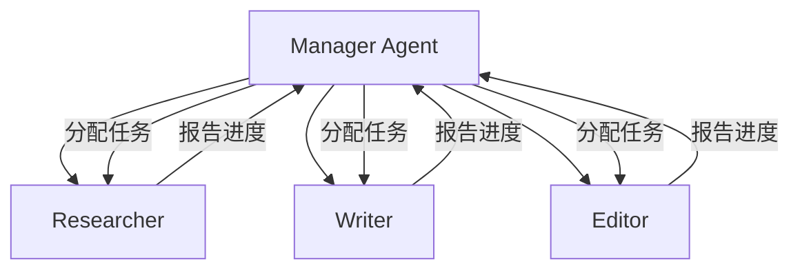
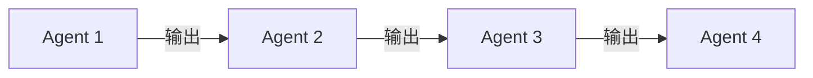
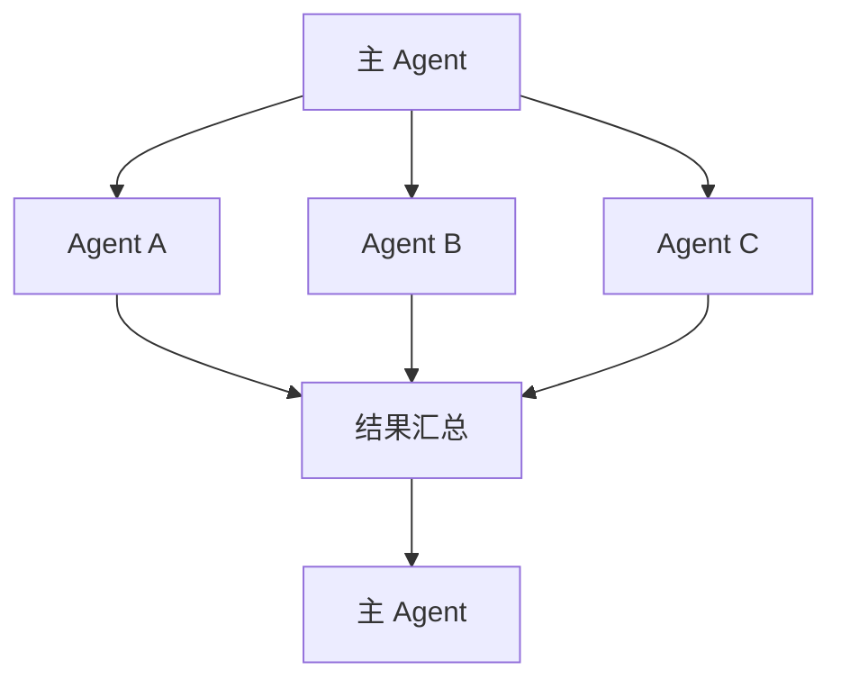
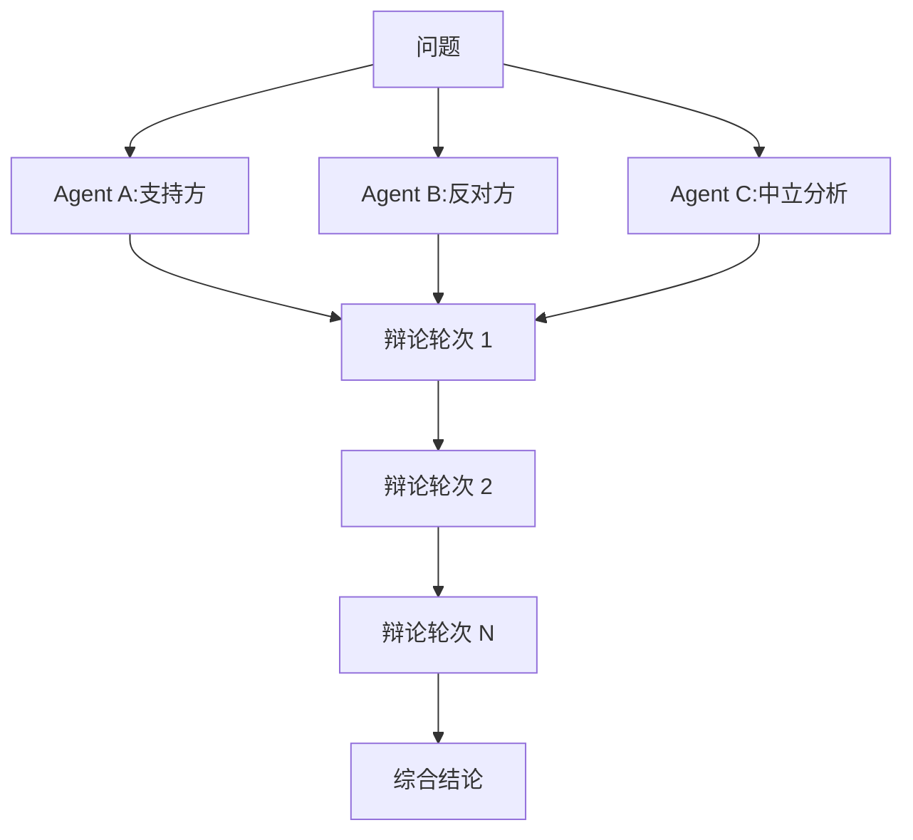
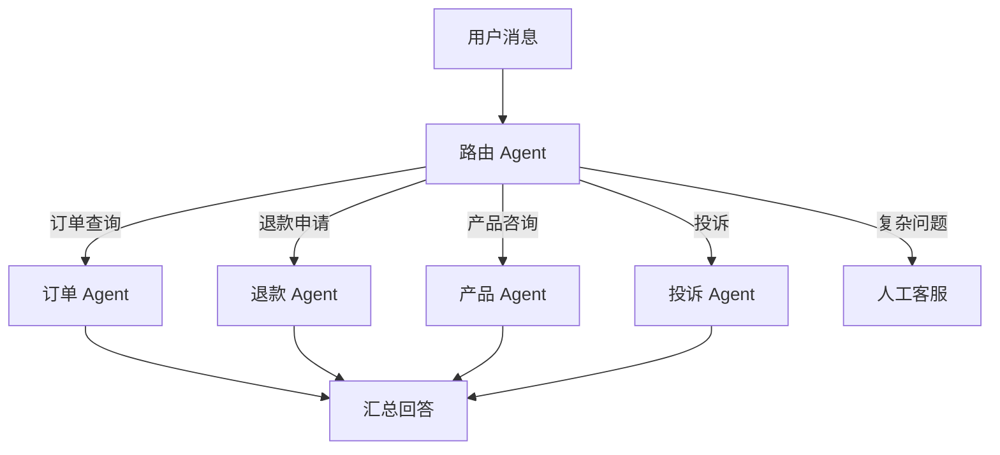

# Agent 编排

> **学习目标**: 掌握多 Agent 协作模式、架构设计和生产环境最佳实践
>
> **预计时间**: 60 分钟
>
> **难度等级**: ⭐⭐⭐⭐☆

---

## 核心概念

### 什么是 Agent 编排?

**Agent 编排**(Orchestration)是指协调多个 Agent 协同工作,完成单个 Agent 难以处理的复杂任务。

::: tip 通俗理解
单个 Agent 像一个全能工人,什么都能干但都不精。编排像组建专业团队——研究员负责调研、作家负责写作、编辑负责审核、质检负责验收。团队协作完成复杂项目。
::

**为什么需要编排?**

| 单 Agent | 多 Agent 编队 |
|---------|--------------|
| 任务切换开销大 | 专注各自领域 |
| 上下文窗口有限 | 分工减少上下文 |
| 难以并行执行 | 可以并行工作 |
| 单点故障 | 容错性好 |

---

## 协作模式

### 1. ReAct 模式

**ReAct** = **Re**asoning + **Act**ing(推理+行动)

**工作流程**:

```
Thought(思考): 用户想要天气信息
Action(行动): 调用 get_weather("北京")
Observation(观察): 返回 "晴,25°C"
Thought(思考): 信息足够,可以回答
Action(行动): 生成回答
```

**代码实现**:

```python
from langchain.agents import AgentExecutor, create_react_agent
from langchain.tools import Tool

# 定义工具
tools = [
    Tool(
        name="Search",
        func=search_api,
        description="搜索最新信息"
    ),
    Tool(
        name="Calculator",
        func=calculator,
        description="执行数学计算"
    )
]

# 创建 ReAct Agent
agent = create_react_agent(
    llm=llm,
    tools=tools,
    prompt=prompt_template
)

# 执行
agent_executor = AgentExecutor(
    agent=agent,
    tools=tools,
    verbose=True
)

result = agent_executor.invoke({
    "input": "计算 Apple 股价涨幅(昨天 vs 今天)"
})
```

**执行轨迹**:

```
> Entering new AgentExecutor chain...

Thought: 我需要获取 Apple 昨天和今天的股价
Action: Search[Apple stock price yesterday and today]
Observation: 昨天 $192.50,今天 $195.30

Thought: 现在计算涨幅
Action: Calculator[(195.30 - 192.50) / 192.50 * 100]
Observation: 1.45

Thought: 我有答案了
Action: Finish[Apple 股价今天上涨了 1.45%]

> Finished chain.
```

**适用场景**:
- 需要多步推理的任务
- 工具选择不确定
- 需要探索性搜索

**优势**: 思维链透明,易于调试

**劣势**: 步骤多时成本高,容易陷入循环

---

### 2. 分层协作(Hierarchical)

**架构**:



**实现(CrewAI)**:

```python
from crewai import Agent, Task, Crew

# 定义 Manager
manager = Agent(
    role="项目经理",
    goal="协调团队完成报告",
    backstory="你有 10 年项目管理经验",
    allow_delegation=True  # 关键:允许委托任务
)

# 定义团队成员
researcher = Agent(
    role="研究员",
    goal="收集数据和资料",
    backstory="你是信息搜集专家",
    verbose=True
)

writer = Agent(
    role="作家",
    goal="撰写文章",
    backstory="你是技术写作专家",
    verbose=True
)

editor = Agent(
    role="编辑",
    goal="审核和修改文章",
    backstory="你有敏锐的文字把关能力",
    verbose=True
)

# 定义任务
research = Task(
    description="调研 2025 年 AI Agent 发展趋势",
    agent=researcher,
    expected_output="一份研究报告,包含 3-5 个关键趋势"
)

write = Task(
    description="基于研究报告撰写博客文章",
    agent=writer,
    context=[research],  # 依赖 research 任务
    expected_output="1500 字的技术博客"
)

review = Task(
    description="审核文章质量",
    agent=editor,
    context=[write],
    expected_output="审核意见和最终文章"
)

# 组建团队
crew = Crew(
    agents=[manager, researcher, writer, editor],
    tasks=[research, write, review],
    process="hierarchical",  # 分层模式
    manager_agent=manager
)

# 执行
result = crew.kickoff()
```

**Manager 的决策逻辑**:

```
Manager 收到任务 "写一份 AI 行业报告"

1. 分解任务:
   - 需要数据收集 → 分配给 Researcher
   - 需要内容撰写 → 分配给 Writer
   - 需要质量审核 → 分配给 Editor

2. 监控进度:
   - Researcher 完成后,通知 Writer 开始
   - Writer 完成后,通知 Editor 审核

3. 处理异常:
   - Researcher 找不到数据 → 调整搜索策略或分配给备用研究员
   - Editor 发现质量问题 → 退回给 Writer 修改

4. 汇总结果:
   - 收集所有子任务结果
   - 生成最终报告
```

**适用场景**:
- 复杂项目需要多阶段处理
- 需要专业分工
- 要求质量把控

**实际案例**: 某咨询公司用此模式生成行业分析报告:
- 研究员 Agent:收集 50+ 数据源
- 分析师 Agent:提取关键洞察
- 作家 Agent:撰写报告
- 审核 Agent:检查准确性和格式
- **结果**: 报告生成时间从 2 周缩短到 4 小时[^1]

---

### 3. 顺序协作(Sequential)

**流程**:



**实现**:

```python
from crewai import Crew, Agent, Task

# 定义 Agent
agent1 = Agent(role="数据清洗")
agent2 = Agent(role="数据分析")
agent3 = Agent(role="报告生成")
agent4 = Agent(role="邮件发送")

# 定义任务链
task1 = Task(
    description="清洗原始数据",
    agent=agent1
)

task2 = Task(
    description="分析清洗后的数据",
    agent=agent2,
    context=[task1]  # 依赖 task1
)

task3 = Task(
    description="生成分析报告",
    agent=agent3,
    context=[task2]  # 依赖 task2
)

task4 = Task(
    description="发送报告邮件",
    agent=agent4,
    context=[task3]  # 依赖 task3
)

# 创建 Crew
crew = Crew(
    agents=[agent1, agent2, agent3, agent4],
    tasks=[task1, task2, task3, task4],
    process="sequential"  # 顺序执行
)

result = crew.kickoff()
```

**适用场景**:
- 流水线式工作
- 每个阶段依赖前一阶段
- 要求严格的执行顺序

**示例**: 数据处理流水线
1. 数据收集 Agent:从 API 获取数据
2. 数据清洗 Agent:处理缺失值和异常
3. 数据分析 Agent:计算指标
4. 报告生成 Agent:产出可视化报告

---

### 4. 并行协作(Parallel)

**架构**:



**实现(LangGraph)**:

```python
from langgraph.graph import StateGraph, END

# 定义状态
class AgentState(TypedDict):
    query: str
    results: list

# 并行节点
def agent_a(state: AgentState):
    result = search_web(state["query"])
    return {"results": state["results"] + [("web", result)]}

def agent_b(state: AgentState):
    result = search_database(state["query"])
    return {"results": state["results"] + [("db", result)]}

def agent_c(state: AgentState):
    result = search_docs(state["query"])
    return {"results": state["results"] + [("docs", result)]}

# 汇总节点
def aggregate(state: AgentState):
    # 合并所有结果
    combined = merge_results(state["results"])
    return {"final_result": combined}

# 构建图
workflow = StateGraph(AgentState)

workflow.add_node("agent_a", agent_a)
workflow.add_node("agent_b", agent_b)
workflow.add_node("agent_c", agent_c)
workflow.add_node("aggregate", aggregate)

# 设置并行执行
workflow.add_edge("start", "agent_a")
workflow.add_edge("start", "agent_b")
workflow.add_edge("start", "agent_c")

# 所有 Agent 完成后汇总
workflow.add_edge("agent_a", "aggregate")
workflow.add_edge("agent_b", "aggregate")
workflow.add_edge("agent_c", "aggregate")

workflow.add_edge("aggregate", END)

app = workflow.compile()
```

**执行时间对比**:

| 模式 | 单 Agent | 顺序协作 | 并行协作 |
|------|---------|---------|---------|
| **任务数** | 10 | 10 | 10 |
| **每任务耗时** | 1 分钟 | 1 分钟 | 1 分钟 |
| **总耗时** | 10 分钟 | 10 分钟 | **1 分钟** |
| **吞吐量** | 10 个/10 分钟 | 10 个/10 分钟 | 10 个/1 分钟 |

**适用场景**:
- 任务之间无依赖
- 需要快速完成
- 多数据源查询

**示例**: 全局搜索
- Web 搜索 Agent:查找网络资源
- 数据库 Agent:查询内部数据
- 文档 Agent:搜索知识库
- 三个 Agent 同时工作,结果汇总

---

### 5. 辩论协作(Debate)

**概念**: 多个 Agent 从不同角度分析问题,通过辩论达成共识。

**流程**:



**实现**:

```python
from langchain.agents import AgentExecutor
from langchain.chat_models import ChatAnthropic

# 创建三个 Agent
pro_agent = Agent(
    role="支持方",
    instructions="论证该方案的优点",
    llm=ChatAnthropic(model="claude-3-5-sonnet")
)

con_agent = Agent(
    role="反对方",
    instructions="指出该方案的风险和问题",
    llm=ChatAnthropic(model="claude-3-5-sonnet")
)

neutral_agent = Agent(
    role="中立分析",
    instructions="平衡各方观点,给出客观评估",
    llm=ChatAnthropic(model="claude-3-5-sonnet")
)

# 辩论 3 轮
topic = "公司应该全面采用远程办公"
arguments = []

for round in range(3):
    # 支持方发言
    pro_arg = pro_agent.debate(topic, previous_arguments=arguments)
    arguments.append(("pro", pro_arg))

    # 反对方发言
    con_arg = con_agent.debate(topic, previous_arguments=arguments)
    arguments.append(("con", con_arg))

    # 中立方分析
    neutral_arg = neutral_agent.analyze(topic, arguments)
    arguments.append(("neutral", neutral_arg))

# 最终综合
conclusion = neutral_agent.synthesize(topic, arguments)
```

**辩论示例**:

```
[Round 1]

支持方: 远程办公可以节省 30% 的办公场地成本,员工满意度提升 40%

反对方: 但协作效率下降,团队凝聚力减弱,新人培养困难

中立: 需要平衡成本效益和团队协作

[Round 2]

支持方: 可用混合模式,每周 2-3 天在办公室

反对方: 混合模式仍有管理挑战,需要重新设计工作流程

中立: 混合模式是可行方案,但需要配套措施

[Round 3]

支持方: 配合异步协作工具和定期团建,可以保持团队凝聚力

反对方: 承认混合模式+工具支持可以缓解问题

中立: 建议 3 天远程 + 2 天在办公室,投资协作工具,每月团建

[结论]
推荐采用混合远程模式,预期节省成本 15-20%,员工满意度提升 20-25%,
需要投资协作工具和定期线下活动。
```

**适用场景**:
- 重要决策需要多角度分析
- 避免偏见和盲点
- 复杂问题的风险评估

**实际应用**: 投资决策、产品策略、政策评估

---

## 生产环境最佳实践

### 1. 监控和可观测性

**追踪 Agent 行为**:

```python
from langfuse import Langfuse

langfuse = Langfuse()

@langfuse.observe()
def run_agent(agent, task):
    # 自动追踪:
    # - 输入输出
    # - Token 消耗
    # - 执行时间
    # - 工具调用
    return agent.execute(task)
```

**关键指标**:

| 指标 | 说明 | 告警阈值 |
|------|------|---------|
| **任务成功率** | 完成任务的比例 | < 95% |
| **平均响应时间** | 单次任务耗时 | > 30 秒 |
| **Token 消耗** | 每 1000 个任务的平均 Token | 异常增长 |
| **工具调用失败率** | 工具调用失败比例 | > 5% |
| **Agent 切换次数** | 单个任务的 Agent 切换 | > 10 次 |

**可视化监控**:

```python
# Langfuse Dashboard
- 任务执行轨迹(类似火焰图)
- Agent 交互网络图
- 成本趋势分析
- 错误分布热力图
```

---

### 2. 错误处理和重试

**层级重试**:

```python
from tenacity import retry, stop_after_attempt, wait_exponential

class AgentOrchestrator:
    @retry(
        stop=stop_after_attempt(3),
        wait=wait_exponential(multiplier=1, min=2, max=10)
    )
    def execute_agent(self, agent, task):
        try:
            return agent.run(task)
        except Exception as e:
            logger.error(f"Agent {agent.name} failed: {e}")
            # 尝试备用 Agent
            if agent.backup:
                return self.execute_agent(agent.backup, task)
            raise

    @retry(stop=stop_after_attempt(2))
    def execute_task(self, task):
        # 任务级重试
        for agent in self.agents:
            try:
                return self.execute_agent(agent, task)
            except Exception:
                continue
        raise TaskFailedError("All agents failed")
```

**优雅降级**:

```python
# 理想情况: 5 个 Agent 并行工作
# 情况 1: 1 个 Agent 失败 → 用其余 4 个的结果
# 情况 2: 2 个 Agent 失败 → 继续执行,降低置信度
# 情况 3: 3 个以上失败 → 放弃并行,改用单 Agent
```

---

### 3. 成本控制

**Token 预算**:

```python
class BudgetAwareOrchestrator:
    def __init__(self, budget_per_task=10000):
        self.budget = budget_per_task
        self.spent = 0

    def execute(self, task):
        # 预估成本
        estimated = self.estimate_cost(task)

        if estimated > self.budget:
            # 使用更便宜的模型
            return self.execute_with_cheaper_model(task)

        # 执行并追踪
        result = self.run_agents(task)
        self.spent += result.tokens_used

        return result
```

**智能路由**:

```python
def route_agent(task):
    complexity = analyze_complexity(task)

    if complexity == "low":
        return cheap_agent  # GPT-3.5 级别
    elif complexity == "medium":
        return standard_agent  # GPT-4 级别
    else:
        return premium_agent  # Claude Opus 级别
```

---

### 4. 安全和合规

**权限隔离**:

```python
# 每个 Agent 有独立的权限配置
agent_permissions = {
    "researcher": ["web_search", "read_database"],
    "writer": ["read_files", "write_files"],
    "admin": ["all"]
}

def check_permission(agent, tool):
    if tool not in agent_permissions[agent.name]:
        raise PermissionError(f"{agent.name} 无权限使用 {tool}")
```

**数据脱敏**:

```python
def sanitize_output(agent, result):
    # 移除敏感信息
    if "credit_card" in result:
        result["credit_card"] = mask_card(result["credit_card"])

    if "ssn" in result:
        result["ssn"] = "***-**-****"

    return result
```

**审计日志**:

```python
# 记录所有 Agent 操作
audit_log = {
    "timestamp": "2025-01-27T10:30:00Z",
    "agent": "researcher",
    "action": "search_database",
    "parameters": {"query": "customer data"},
    "result": "returned 5 records",
    "tokens_used": 1234,
    "user": "alice@company.com"
}
```

---

## 实际案例

### 案例: 电商智能客服系统

**需求**: 24/7 处理客户咨询

**架构**:



**Agent 分工**:

| Agent | 能力 | 工具 |
|-------|------|------|
| **路由** | 识别意图 | 文本分类器 |
| **订单** | 查询订单状态 | ERP API |
| **退款** | 处理退款 | 支付系统 API |
| **产品** | 回答产品问题 | 产品知识库 |
| **投诉** | 记录投诉 | 工单系统 |
| **人工** | 转接人工 | 客服系统 |

**工作流程**:

```python
# 用户: "我的订单什么时候到?"

# 1. 路由 Agent 识别意图
intent = router_agent.classify("我的订单什么时候到?")
# → intent: "order_query", confidence: 0.95

# 2. 分配给订单 Agent
order_info = order_agent.handle(
    intent="order_query",
    user_id="user123"
)
# → order_info: {status: "已发货", eta: "2025-01-29"}

# 3. 生成回答
response = generator_agent.generate(
    template="您的订单{status},预计{eta}送达",
    data=order_info
)
# → "您的订单已发货,预计 1 月 29 日送达"
```

**效果**:

| 指标 | 人工客服 | Agent 系统 |
|------|---------|-----------|
| **响应时间** | 5 分钟 | 5 秒 |
| **并发处理** | 10 人/客服 | 无限制 |
| **成本** | $10,000/月 | $1,500/月 |
| **自动解决率** | 0% | 73% |
| **客户满意度** | 4.2/5 | 4.5/5 |

---

## 思考题

::: info 检验你的理解
1. **对比 ReAct、分层、顺序、并行、辩论五种协作模式,各有什么适用场景?**

2. **设计一个"自动写研究报告"的 Agent 系统,需要哪些 Agent?如何编排?**
   - 提示:考虑数据收集、分析、写作、审核

3. **如何监控多 Agent 系统的性能?哪些指标最重要?**

4. **在生产环境中,如何处理 Agent 失败、超时、成本失控等问题?**
:::

---

## 本节小结

通过本节学习,你应该掌握了:

✅ **协作模式**
- ReAct:推理+行动的循环
- 分层:Manager-Worker 架构
- 顺序:流水线式处理
- 并行:同时执行独立任务
- 辩论:多角度分析

✅ **生产实践**
- 监控:追踪 Agent 行为和性能
- 错误处理:重试和降级策略
- 成本控制:预算管理和智能路由
- 安全合规:权限隔离和数据脱敏

✅ **实际应用**
- 电商客服系统案例
- 根据场景选择合适的协作模式
- 平衡性能、成本、质量

---

**下一步**: 在[下一章](07-hermes-agent-overview)中，我们将了解一个全新的项目——Hermes Agent，一个具备自学习循环的开源 Agent 平台。

---

[← 返回模块目录](/agent-ecosystem/07-agent-ecosystem) | [继续学习:Hermes Agent 概述 →](/agent-ecosystem/07-agent-ecosystem/07-hermes-agent-overview)

---

[^1]: CrewAI 官方案例, "Automated Report Generation", https://www.crewai.com/case-studies/report-generation
