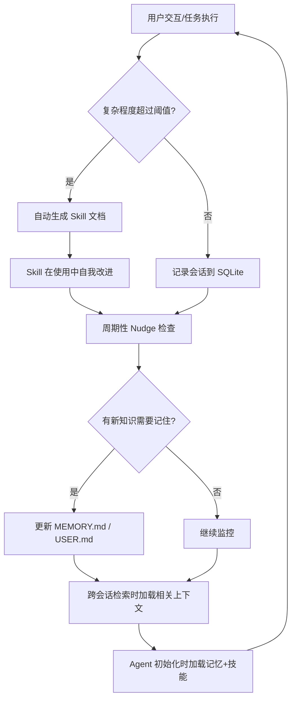

# Hermes Agent 概述

> **学习目标**: 了解 Hermes Agent 的项目背景、核心架构和自学习循环机制
>
> **预计时间**: 40 分钟
>
> **难度等级**: ⭐⭐☆☆☆
>
> **更新时间**: 2026年5月

---

## Hermes Agent 是什么

### NousResearch 背景

Hermes Agent 出自 **Nous Research** 之手。这家研究实验室成立于 2023 年，由 Jeffrey Quesnelle、Karan Malhotra、Teknium 和 Shivani Mitra 联合创办，是知名模型系列 **Hermes、Nomos、Psyche** 的缔造者。2025 年 4 月，Nous Research 完成了由 Paradigm 领投的 5000 万美元 A 轮融资，估值达到 10 亿美元。

这层背景很重要——Hermes Agent 不是一家产品公司推出的框架，而是**由训练模型的人构建的 Agent**。这意味着它对模型的工作方式、能力边界、调用效率有第一手的理解。

### 项目定位

Hermes Agent 是一个**带自学习循环的开源 AI Agent**。它的核心定位是：

> 一个驻扎在你的服务器上、记得自己学到的东西、随着运行时间增长而越来越强的自主 Agent。

用通俗的话说：**它不是对话即忘的聊天机器人，也不是绑定在 IDE 里的编码助手。它是一个真正的"成长型"Agent。**

与其他 Agent 框架相比，Hermes Agent 的差异化在于：

| 维度 | 传统 Agent 框架 | Hermes Agent |
|------|---------------|--------------|
| **记忆** | 会话内记忆，会话结束即清零 | 跨会话持久记忆，SQLite + FTS5 全文本搜索 |
| **技能** | 人工编写工具 | 自动从任务中生成技能，技能在使用中自我改进 |
| **自省** | 无 | 周期性 Nudge 机制，主动判断什么值得记住 |
| **用户模型** | 无 | 跨会话构建用户偏好画像 |
| **部署** | 通常绑定笔记本 | 服务器端运行，支持 6 种终端后端 |

### 开源影响力

Hermes Agent 于 **2026 年 2 月 25 日** 首次发布，采用 **MIT 许可证**。发布后迅速获得社区关注，至 2026 年 5 月已获得 **超过 132,000 个 GitHub Star**，成为增长最快的开源 Agent 项目之一。

---

## 核心架构

Hermes Agent 的架构可以分为三个主要层次：**Gateway 消息层、Agent 核心层、Skills 系统层**。

### 整体架构

```
┌──────────────────────────────────────────────────────────────────┐
│                     Gateway 消息层                                 │
│                                                                   │
│   CLI (终端)    Gateway (消息网关)    ACP (编辑器集成)               │
│   API Server     Batch Runner         Python Library               │
│                                                                   │
│   20+ 平台适配器: Telegram / Discord / Slack / WhatsApp / 飞书 ...  │
└──────────────────────────┬─────────────────────────────────────────┘
                           │
                           ▼
┌──────────────────────────────────────────────────────────────────┐
│                      Agent 核心层                                 │
│                                                                   │
│  ┌──────────────┐  ┌──────────────┐  ┌──────────────┐             │
│  │ Prompt       │  │ Provider     │  │ Tool         │             │
│  │ Builder      │  │ Resolution   │  │ Dispatch     │             │
│  │ (提示词组装)  │  │ (提供商选择)  │  │ (工具调度)    │             │
│  └──────┬───────┘  └──────┬───────┘  └──────┬───────┘             │
│         │                 │                 │                     │
│  ┌──────┴───────┐  ┌──────┴───────┐  ┌──────┴───────┐             │
│  │ Compression  │  │ 3 API 模式   │  │ Tool Registry│             │
│  │ & Caching    │  │ 适配不同      │  │ 62个工具     │             │
│  │              │  │ 模型后端      │  │ 52个工具集   │             │
│  └──────────────┘  └──────────────┘  └──────────────┘             │
└──────────────────────────┬─────────────────────────────────────────┘
                           │
                           ▼
┌──────────────────────────────────────────────────────────────────┐
│                      Skills 系统层                                │
│                                                                   │
│  ┌────────────────────┐  ┌────────────────────┐                    │
│  │ 自学习循环          │  │ 跨会话记忆系统      │                    │
│  │                    │  │                    │                    │
│  │ Skill 自动创建     │  │ SQLite + FTS5 搜索  │                    │
│  │ Skill 自我改进     │  │ MEMORY.md / USER.md  │                   │
│  └────────┬───────────┘  └────────┬───────────┘                    │
│           │                       │                               │
│  ┌────────┴───────────┐  ┌────────┴───────────┐                    │
│  │ 周期性 Nudge       │  │ Tool Backends       │                    │
│  │ 主动判断值得记忆    │  │ (工具执行后端)       │                    │
│  │                    │  │ Terminal/Browser/    │                    │
│  │                    │  │ Web/MCP/File/Vision  │                    │
│  └────────────────────┘  └────────────────────┘                    │
└──────────────────────────────────────────────────────────────────┘
```

### 各层职责说明

**Gateway 消息层**：
- **CLI** (`cli.py`)：完整的终端交互界面，支持多行编辑、斜杠命令自动补全、对话历史
- **Gateway** (`gateway/run.py`)：消息网关，统一处理来自不同聊天平台的消息，管理 20+ 平台适配器
- **ACP** (`acp_adapter/`)：编辑器协议适配，支持 VS Code、Zed、JetBrains 等 IDE
- **API Server**：暴露 OpenAI 兼容的 HTTP 端点
- **Batch Runner**：批量轨迹生成，用于研究和评估

**Agent 核心层**（`run_agent.py` 中的 `AIAgent` 类，约 13,700 行）：
- **Prompt Builder**：从多个来源组装系统提示词——人格设定（SOUL.md）、记忆（MEMORY.md、USER.md）、技能文档、上下文文件、工具使用指南
- **Provider Resolution**：将 `(provider, model)` 映射到具体的 API 模式、密钥和端点，支持 18+ 个提供商
- **Tool Dispatch**：中央工具注册表，62 个注册工具，负责工具发现、模式收集和调度
- **Compression & Caching**：上下文压缩和 Anthropic 提示缓存

**Skills 系统层**：
- **自学习循环**：自动从复杂任务中创建 Skill 文档，并随着使用持续自我改进
- **跨会话记忆**：基于 SQLite + FTS5 的全文本搜索记忆系统，包含 MEMORY.md（项目记忆）和 USER.md（用户画像）
- **周期性 Nudge**：每完成约 15 次任务主动判断哪些信息值得持久化
- **Tool Backends**：多种工具执行后端，包括终端（7 种）、浏览器（5 种）、Web（4 种）、MCP 动态集成、File、Vision 等

---

## 自学习循环机制

这是 Hermes Agent 最核心、也最区别于其他框架的特性。Nous Research 称之为 **"封闭式学习循环"**（Closed Learning Loop）。

### 机制总览



### 1. 技能自动创建与改进

当 Hermes Agent 完成一个**复杂任务**（通常需要 5 次及以上的工具调用），它会**自动创建一份 Skill 文档**。

Skill 是一份结构化的 Markdown 文件，包含：
- 任务描述：这个技能解决什么问题
- 执行步骤：具体的操作流程
- 已知失败点：什么情况下这个方案不适用
- 验证步骤：如何确认任务完成

当下次遇到类似任务时，Agent 会先加载相关的 Skill 到上下文窗口，然后按照已验证的流程执行——**不需要从零推理**。

**更关键的是**：在执行过程中，如果 Agent 发现更好的方法，它会**实时更新 Skill 文档**。这意味着技能在使用中持续改进，不需要人工介入。

### 2. 跨会话记忆系统

Hermes Agent 的记忆系统分三个层次：

| 层次 | 形式 | 用途 |
|------|------|------|
| **会话记忆** | 当前对话上下文 | 即时交互，会话结束后不保留 |
| **持久记忆** | MEMORY.md / USER.md 文件 | 项目上下文、环境信息、用户偏好 |
| **技能记忆** | Skill Markdown 文档 | "怎么做"的过程性知识 |

**持久记忆详解**：
- **MEMORY.md**：存储项目上下文、环境细节、用户告知过 Agent 的信息
- **USER.md**：构建用户行为模型——偏好、工作风格、喜欢的解释方式

这两个文件由 Agent 自动更新，你也能直接阅读和编辑——**完全透明，没有黑箱**。

**会话搜索**：每段对话都以 SQLite 数据库存储，启用 FTS5 全文本搜索。当 Agent 启动新会话时，如果检测到与之前某段对话相似——相同任务类型、相同领域——它会**主动搜索过往对话**并用 LLM 总结出有用的上下文。

### 3. 周期性 Nudge 机制

这是自学习循环的**"自驱动"部分**。

传统 Agent 需要用户明确告诉它"记住这个"。Hermes Agent 不同——它有一个 **Nudge 机制**，每完成一定数量的任务（约 15 次）就会**主动判断**：

- 过去这段对话有什么值得记住的？
- 有没有反复出现的模式？
- 用户的偏好有没有变化？

它不需要等待指示。它会**自主决定哪些信息值得持久化**。

### 对比传统 Agent

| 维度 | 传统 Agent | Hermes Agent |
|------|-----------|--------------|
| 每次交互 | 从零推理 | 携带过往经验 |
| 重复任务 | 每次都重新处理 | 加载已有 Skill，更快更准 |
| 用户理解 | 无 | 跨会话构建用户画像 |
| 知识留存 | 需人工干预 | 自动判断什么值得记住 |
| 成长性 | 静态 | 越用越强 |

---

## 多平台支持

### Gateway 统一架构

Hermes Agent 通过一个**统一的 Gateway 进程**管理所有平台连接。你只需启动一次 `hermes gateway start`，就能同时接入多个平台。

架构示意：

```
                        ┌─────────────────┐
                        │   Gateway 进程    │
                        │  gateway/run.py  │
                        └────────┬────────┘
                                 │
          ┌──────────────────────┼──────────────────────┐
          │          │          │          │            │
          ▼          ▼          ▼          ▼            ▼
       Telegram   Discord    Slack    WhatsApp    Signal ...
```

在同一 Gateway 下，Agent 的**上下文、记忆、技能在所有平台间共享**——你可以在 Telegram 上开始一个任务，走到一半切换到终端继续。

### 支持平台列表

| 平台 | 类型 | 功能支持 |
|------|------|---------|
| **CLI/TUI** | 终端 | 完整功能，含所有工具 |
| **Telegram** | 即时通讯 | 消息、文件、图片、语音 |
| **Discord** | 即时通讯 | 消息、语音频道、线程 |
| **Slack** | 企业通讯 | 消息、文件、多个工作区 |
| **WhatsApp** | 即时通讯 | 消息、文件、图片 |
| **Signal** | 安全通讯 | 消息、文件、图片 |
| **Email** | 邮件 | 收发邮件 |
| **SMS** | 短信 | 短信交互 |
| **Home Assistant** | 智能家居 | 设备控制 |
| **Matrix** | 开源通讯 | 消息、语音 |
| **Mattermost** | 企业通讯 | 消息、语音 |
| **DingTalk** | 钉钉 | 消息、文件 |
| **Feishu/Lark** | 飞书 | 消息、文件、语音 |
| **WeCom** | 企业微信 | 消息、语音 |
| **BlueBubbles** | iMessage | 消息、文件、图片 |
| **QQ** | 即时通讯 | 消息、语音 |

### 各平台配置要点

不同的平台在功能上有一些细微差异：

- **Telegram**：支持群组 @提及 触发响应（只在你 @Agent 时才回应）
- **Discord**：需要启用"Message Content Intent"权限；支持语音频道实时对话
- **Slack**：默认只在私信中工作，需订阅 `message.channels` 事件才能在公共频道使用
- **微信/企业微信**：通过社区桥接方案集成

所有平台都共享同样的工具集和记忆系统，区别主要在于消息格式和权限管理。

---

## 模型兼容性

### 支持的模型提供商

Hermes Agent 是**模型无关的**——不绑定任何特定模型提供商。支持的提供商包括：

| 提供商 | 说明 |
|--------|------|
| **Nous Portal** | Nous Research 自营门户 |
| **OpenRouter** | 200+ 模型，一键切换 |
| **OpenAI** | GPT 系列模型 |
| **Anthropic** | Claude 系列模型 |
| **NVIDIA NIM** | Nemotron 等 |
| **Hugging Face** | 开源模型端点 |
| **z.ai/GLM** | 智谱 GLM 系列 |
| **Kimi/Moonshot** | 月之暗面 |
| **MiniMax** | MiniMax 模型 |
| **深度求索** | DeepSeek 系列 |
| **自定义端点** | 任何 OpenAI 兼容接口 |

### 动态切换提供商

你可以在运行时用一条命令切换模型，**不需要修改代码或重启进程**：

```bash
hermes model openai:gpt-4o
hermes model openrouter:anthropic/claude-sonnet-4
hermes model nous:nous-hermes-4
```

在聊天会话中也可以使用斜杠命令切换：

```
/model openrouter:anthropic/claude-sonnet-4
```

如果当前提供商不够稳定，Agent 会自动切换到备用提供商——**内置故障转移**。

### 模型适配策略

Hermes Agent 支持三种 API 执行模式，自动根据选择的提供商确定：

| 模式 | 对应提供商 |
|------|-----------|
| **chat_completions** | OpenAI 格式兼容（OpenRouter、DeepSeek、智谱等） |
| **codex_responses** | OpenAI Responses API |
| **anthropic_messages** | Anthropic Messages API |

每种模式决定了消息格式、工具调用方式和缓存策略。三种模式最终都收敛到统一的内部消息格式，对上层逻辑完全透明。

---

## 核心特点总结

### 与已有 Agent 框架的对比

| 维度 | LangGraph | CrewAI | MAF | OpenClaw | Hermes Agent |
|------|----------|--------|-----|---------|--------------|
| **核心范式** | 图结构工作流 | 角色驱动协作 | 企业级多 Agent 协作 | 多 Agent 编排 | 单 Agent 自学习 |
| **记忆机制** | 持久化状态 | 任务间依赖 | 状态管理 + 对话记忆 | 会话记忆 | 三层记忆 + FTS5 搜索 |
| **自我改进** | 无 | 无 | 无 | 无 | 自动生成+改进 Skill |
| **多平台** | 无原生支持 | 无原生支持 | Azure 生态集成 | 有 | 20+ 平台统一 Gateway |
| **模型绑定** | 无 | 无 | 无 | 无 | 模型无关，运行时切换 |
| **用户画像** | 无 | 无 | 无 | 无 | 跨会话构建 |
| **部署方式** | Python 库 | Python 库 | Python/C# 库 / Azure 云服务 | Python 库 | 服务器端常驻服务 |
| **许可证** | MIT | MIT | MIT | MIT | MIT |

### 适用场景分析

**适合使用 Hermes Agent 的场景**：

1. **个人助手级**：需要一个跨平台的 AI 助手，能记住你的偏好、工作方式、历史任务
2. **研究与实验**：需要 Agent 从经验中学习、累积知识，而不是每次从零开始
3. **多平台部署**：需要在 Telegram、Discord、邮件等多个渠道使用同一个 Agent
4. **长期任务自动化**：定时报告、数据备份、自动审计等需要周期性执行的任务

**不太适合的场景**：

1. **复杂多 Agent 编排**：Hermes 的核心是单 Agent 自学习，如果需要复杂的多 Agent 协作，CrewAI 或 LangGraph 可能更合适
2. **轻量级单次调用**：如果只是做一个简单的 API 调用，不需要启动整个 Hermes
3. **企业级平台集成**：如果深度使用 Azure/.NET 生态，Microsoft Agent Framework 可能更合适

---

## 思考题

::: info 检验你的理解
- [ ] 能说出 Hermes Agent 的核心定位和差异化特点
- [ ] 能解释自学习循环的工作原理（技能创建 + 记忆系统 + Nudge 机制）
- [ ] 了解 Hermes Agent 支持哪些平台和模型提供商
- [ ] 能根据场景判断是否适合使用 Hermes Agent
- [ ] 理解 Hermes Agent 与传统 Agent 框架（LangGraph、CrewAI）的本质区别
- [ ] 知道为什么"由模型训练者构建"这个背景是重要的
:::

---

## 本节小结

通过本节学习,你应该掌握了:

✅ **Hermes Agent 背景**
- Nous Research 的项目背景与定位
- 开源影响力与 MIT 许可

✅ **核心架构**
- Gateway 消息层 / Agent 核心层 / Skills 系统层 三层架构
- 自学习循环（技能创建 + 记忆系统 + Nudge 机制）

✅ **平台与模型支持**
- 20+ 平台适配器，统一 Gateway
- 模型无关架构，运行时动态切换提供商

✅ **适用场景判断**
- 个人助手、研究实验、多平台部署
- 复杂多 Agent 编排等场景的局限

---

**下一步**: 现在你已经了解了 Hermes Agent 的理论知识，接下来可以进入实战部署环节。

---

## 延伸阅读

- [Hermes Agent 官方网站](https://hermes-agent.nousresearch.com/)
- [Hermes Agent GitHub 仓库](https://github.com/NousResearch/hermes-agent)
- [Hermes Agent 官方文档](https://hermes-agent.nousresearch.com/docs/)
- [深入了解 Skills 系统](/agent-ecosystem/07-agent-ecosystem/04-skills-system)
- [Function Calling 基础](/agent-ecosystem/07-agent-ecosystem/05-function-calling)

---

[← 返回模块目录](/agent-ecosystem/07-agent-ecosystem)
