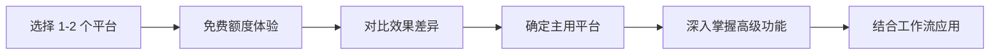

# 中国 AI 绘画平台

> **学习目标**：了解中国主流 AI 绘画平台（通义万相、文心一格、即梦、可灵、腾讯混元等）的核心特性、定价策略和适用场景
>
> **预计时间**：45 分钟
>
> **难度**：⭐⭐

---

## 中国 AI 绘画市场概览

2026 年，中国 AI 绘画市场已形成**"四强领跑、多极并进"**的格局。阿里巴巴、百度、字节跳动、快手四大互联网巨头各自推出了代表产品，同时 MiniMax、智谱 AI 等创业公司也凭借独特的技术路线崭露头角。

与国际平台相比，中国 AI 绘画平台具有以下显著特点：

| 维度 | 中国平台特点 | 原因 |
|------|-------------|------|
| **中文理解** | 天然优势，古风诗词、成语典故皆可驾驭 | 训练数据以中文为主 |
| **中国风格** | 水墨、工笔、国潮等风格表现出色 | 重点优化的文化领域 |
| **定价** | 免费额度慷慨，订阅价格更低 | 激烈竞争驱动低价策略 |
| **生态整合** | 深度绑定云计算、社交、电商生态 | 平台型公司的协同效应 |
| **合规性** | 内置内容安全审核 | 符合中国监管要求 |
| **海外访问** | 无需 VPN 可直接使用 | 国内服务器部署 |

::: tip 学习建议
中国 AI 绘画平台正在快速发展，很多平台在中文场景的理解和表现上已经超越了国际竞品。如果你主要处理中文内容创作（电商详情页、社交媒体配图、中国风设计等），建议优先体验中国平台。
:::

---

## 1. 通义万相（阿里云）

### 一句话定位

**通义万相是阿里巴巴旗下"通义"大模型家族的核心图像生成产品**，依托阿里云强大的算力基础设施，在中文语义理解和多样化风格支持方面表现突出。

### 核心能力

#### 最新版本：Wan 2.6 系列（2025 年 12 月）

Wan 2.6 系列共包含五个模型：文生视频、图生视频、参考视频、图像生成、文生图，覆盖了从静态图像到动态视频的完整创作链路。

**图像生成能力：**

- **文图混合输出**：将多张图像+文本进行逻辑推理式整合输出，支持图表、插画、海报设计
- **多图像融合**：任意参考、组合或替换多张图像的内容
- **商业级一致性**：保持角色、风格或元素在多张图中的一致性
- **美学迁移**：从参考图像中提取色彩、风格、构图要素
- **精准镜头与光影控制**：可指定视角、景深、光照细节
- **中文/英文长文本支持**：在海报、信息图、数据图表中准确渲染文字

**视频生成能力：**

- **角色扮演**：国内首个支持角色扮演的视频生成模型，可参考外观和声音
- **多镜头叙事**：将简单提示转换为多镜头脚本，保持主体和场景一致性
- **音画同步**：自然的多人物对话、语音生成、音乐/歌曲生成
- **15 秒长视频**：单次生成最长 15 秒视频

**多风格支持：** 通义万相支持 20+ 种创作风格，包括写实、动漫、水墨画、油画、赛博朋克等，其中 **水墨画和中国风** 的表现尤为出色。

#### 技术实力

| 指标 | 数据 |
|------|------|
| 发布日期 | 2023 年 7 月 7 日 |
| 累计生成图像 | 3.9 亿+ |
| 累计生成视频 | 7000 万+ |
| 开源模型 | 20+ 个（2025 年 2 月起） |
| 社区下载量 | 3000 万+（HuggingFace 和第三方平台） |
| 基础模型参数量 | 5B（Composer 模型） |

### 功能矩阵

```
文生图 ── 核心功能，20+ 风格可选
├── 图生图（风格迁移、相似图生成）
├── 涂鸦生图（手绘草图转图像）
├── 虚拟试衣（个人照片、全家福）
├── AI 艺术字（文字艺术效果）
├── 风格迁移
├── 电商背景生成
└── 图像编辑（超分辨率、去杂物、智能修图）

文生视频 ── 进阶功能
├── 图生视频
├── 视频编辑/延长
└── 角色扮演视频

平台接入 ── 企业级功能
├── 阿里云百炼平台 API
├── LoRA / DreamBooth 模型定制
└── 企业级微调服务
```

### 定价策略

| 类型 | 价格 | 说明 |
|------|------|------|
| **免费额度** | 注册 50 灵感值 | 每次生成消耗 1 点 |
| **每日登录** | 50 灵感值/天 | 持续登录可持续使用 |
| **API 调用** | 按量计费 | 通过阿里云百炼平台 |
| **企业定制** | 自定义报价 | 支持 LoRA、DreamBooth 微调 |

### 优劣势分析

**优势：**
- 中文语义理解能力行业领先，能处理古风诗词、成语等复杂中文提示
- 阿里云生态整合完善，与通义千问、通义听悟等产品无缝协同
- 中国风（国风、水墨）表现极佳
- 开源策略积极，20+ 模型开源降低了开发者门槛
- 免费额度慷慨，适合长期轻度使用

**劣势：**
- 国际化程度不如 Midjourney，英文提示词效果一般
- 图像艺术感不及 Midjourney V8 的精致程度
- 部分高级功能需要阿里云账号和实名认证

### 适用场景

- **电商设计**：产品图、详情页、营销海报
- **中国风创作**：国风插画、传统节日设计、文化海报
- **企业内容制作**：演示文稿配图、品牌视觉素材
- **视频内容**：短视频素材、产品演示视频
- **开发者应用**：通过阿里云 API 集成到自有系统

---

## 2. 文心一格（百度）

### 一句话定位

**文心一格是百度基于文心大模型（ERNIE-ViLG）的 AI 绘画平台**，以中国风美学见长，拥有超 600 万注册用户。**2025 年 4 月 1 日起已整体并入文心一言平台**。

### 核心能力

#### 技术架构

文心一格基于 **ERNIE-ViLG 2.0 跨模态大模型**，融合了 GAN 和扩散模型两种架构的优势。其核心技术特点包括：

- **知识增强**：基于知识图谱的提示词理解，让模型理解"落霞与孤鹜齐飞"等诗意表达
- **渐进式扩散**：从粗粒度到细粒度的渐进式生成
- **跨模态匹配**：生成后通过图文匹配算法对输出进行排序筛选

#### 已支持功能

- **文生图**：10+ 种风格（国风、油画、水彩、动漫、写实等）
- **图生图**：以图生图、风格迁移
- **图像编辑**：扩图、涂抹消除、涂抹编辑、图像拼接、清晰度增强
- **海报创作**：一键生成营销海报
- **艺术字**：AI 艺术文字生成
- **实验室功能**：人体动作→创作、线稿→创作、定制模型

#### 商业案例

| 案例 | 合作方 | 说明 |
|------|--------|------|
| AI 线下广告 | 京东 | 电商 618 首个 AI 线下广告，生产周期从周级到天级，成本节约约 80% |
| 品牌故事板 | 联想昭阳 | AIGC 品牌营销故事板生成 |
| AI 包装设计 | 周黑鸭 | AI 包装设计大赛 |
| 画展 | 798 艺术节 | AI 绘画展览 |

### 重要变化：并入文心一言

::: warning 平台变更
**2025 年 4 月 1 日**，文心一格的完整服务已合并至百度**文心一言**（wenxin.baidu.com）平台。这意味着：
- 原有文心一格用户可以通过文心一言平台继续使用 AI 绘画功能
- 百度推出了 **"一格+一言"联合套餐**（99 元/月），同时覆盖对话和绘画场景
- 文心一格独立网站仍然可以访问，但核心功能已经整合到文心一言中

这是百度"All in 文心一言"战略的体现，将对话、绘画、搜索等 AI 能力整合为统一平台。
:::

### 定价策略

**免费模式：**
- 新用户注册：50 电量
- 每日免费：通过签到、分享、公开作品获取

**电量购买（按需）：**
| 电量包 | 价格 | 单价 |
|--------|------|------|
| 80 电量 | 9.9 元 | ~0.12 元/电量 |
| 200 电量 | 15.9 元 | ~0.08 元/电量 |
| 800 电量 | 49.9 元 | ~0.06 元/电量 |
| 10000 电量 | 599 元 | ~0.06 元/电量 |

**会员订阅（含图像+对话功能）：**

| 会员等级 | 月费 | 连续月费 | 核心权益 |
|----------|------|---------|----------|
| 白银 | 69 元 | 66 元 | AI 创作，3 并发任务 |
| 黄金 | 139 元 | 119 元 | 5 并发，海报/艺术字/编辑 |
| 铂金 | 339 元 | 299 元 | 10 并发，优先处理 |
| 联合套餐 | 99 元 | - | 文心一言 + 绘画功能 |

### 优劣势分析

**优势：**
- 国风创作能力顶尖，诗词转绘画效果出色
- 商用版权清晰，企业案例丰富
- 与文心一言整合后功能更全面
- 免费获取电量的途径多

**劣势：**
- 图像整体质量和艺术感不及通义万相和即梦
- 并入文心一言后，绘画功能的独立性降低
- 会员定价偏高，性价比不如通义万相的免费模式
- 国际影响力有限

### 适用场景

- **中国风设计**：国潮品牌视觉、传统节日海报、文化创意
- **电商大促素材**：618、双十一等活动的 AI 广告和海报
- **品牌营销创意**：故事板、包装设计、营销视觉

---

## 3. 即梦 / Jimeng AI（字节跳动）

### 一句话定位

**即梦 AI（Jimeng AI）是字节跳动旗下的 AI 图像和视频创作平台**，在人像写真、写实风格方面表现卓越，MAU 已突破千万，与剪映和抖音生态深度整合。

### 核心能力

#### 最新图像模型：Seedream 5.0 Lite（2026 年 2 月）

- **2K 输出 < 1.8 秒**：惊人的生成速度
- **实时网络搜索**：在生成时可以实时获取网络信息辅助创作
- **精确编辑控制**：支持局部重绘、精准调整
- **逻辑推理**：理解复杂多步骤需求
- **内置领域知识**：生物学、建筑学等垂直领域知识辅助创作
- **4K 分辨率支持**：高分辨率输出

#### 最新视频模型：Seedance 2.0（2026 年 2 月）

- **架构**：双分支扩散 Transformer
- **多模态输入**：最多接受 **9 张图像 + 3 个视频 + 3 段音频 + 文本**（共 12 个文件）
- **最长 60 秒视频**：单次生成
- **多镜头连贯视频**：支持"蒙太奇"转场
- **音画同步**：口型同步、音效、环境声音
- **参考输入**：图像（构图、角色）、视频（运镜、复杂运动）

#### 市场表现

| 指标 | 数据 |
|------|------|
| MAU（月活用户） | **1012 万**（2025 年 9 月，QuestMobile） |
| Q2 2025 环比增长 | **68.2%** |
| 国内版 | jimeng.jianying.com |
| 国际版 | dreamina.capcut.com |
| 开发团队 | 剪映（Jianying/CapCut）团队 |
| 发布历程 | 2024 年 3 月 Dreamina → 2024 年 5 月 更名即梦 |

### 功能矩阵

```
图像创作 ──
├── 文生图（20+ 风格：超现实、肖像、动漫等）
├── 图生图
├── 群像生成（系列相关图像）
├── 最高 8K 分辨率输出
└── HD 无损优化

视频创作 ──
├── 文生视频 / 图生视频
├── 运镜控制、速度调节、起止帧设置
├── 最长 60 秒视频
├── 动作模仿（上传人像照 + 参考视频）
├── 故事创作（脚本→分镜→视频）
└── 数字人口型同步

智能画布 ──
├── 多层编辑
├── 局部重绘、一键扩图、物体移除、抠图
└── AI 融合合成

其他功能 ──
├── AI 音乐生成（人声+伴奏）
├── 创意社区（提示词分享）
└── DeepSeek 集成（提示词生成辅助）
```

### 定价策略

| 等级 | 月费 | 说明 |
|------|------|------|
| **免费** | 0 元 | 每天 60-100 积分，基础功能 |
| **基础版** | ~79 元 | 更多积分，生成速度加快 |
| **标准版** | ~139 元 | 额外功能解锁 |
| **高级版** | ~649 元 | 高用量 + 全部功能 |
| **年付标准版** | ~659 元/年 | 相当于 ~55 元/月 |

> 视频生成消耗：5 秒视频约 60 积分，15 秒视频约 90 积分

### 生态整合

即梦与字节跳动生态的深度整合是其最大竞争优势：

- **剪映（CapCut）**：创作素材可一键导出到剪映继续编辑
- **抖音（Douyin/TikTok）**：可直接发布到抖音平台
- **社交分享**：创意社区内置，作品曝光渠道丰富
- **提示词生态**：社区内大量高质量提示词可直接复用

### 竞争定位

| 对比对象 | 即梦的优势 | 即梦的劣势 |
|----------|-----------|-----------|
| **vs 可灵 Kling** | 美学输出更好、生成速度更快、数字人口型同步更佳 | 视频物理真实感稍弱 |
| **vs Midjourney** | 中文创作者友好、生成本地生态完整、速度更快 | 艺术精致感有差距 |
| **vs 通义万相** | 人像写真效果更好、社交生态整合更强 | 企业级 API 和云服务不如阿里云成熟 |

### 优劣势分析

**优势：**
- 人像写真和写实风格表现极其出色
- 生成速度行业领先（2K < 1.8 秒）
- 字节生态深度整合（抖音+剪映），内容分发便捷
- 多模态输入能力最强（12 文件同时输入）
- MAU 增长迅猛，社区活跃度高

**劣势：**
- 艺术风格多样性不如 Midjourney
- 视频生成能力仍在追赶可灵
- 对实名认证要求较高
- 企业级应用生态不如通义万相完善

### 适用场景

- **社交媒体创作**：抖音封面、小红书配图、短视频素材
- **人像写真**：头像生成、形象照、写真风格创作
- **电商素材**：产品图、详情页、推广海报
- **短视频创作者**：从脚本到素材的一站式生成
- **快速原型**：需要快速出图的场景

---

## 4. 可灵 / Kling AI（快手）

### 一句话定位

**可灵 AI（Kling AI）是快手推出的 AI 图像与视频生成平台**，以"All-in-One"多模态架构为特色，在视频生成领域处于国内领先地位，全球创作者已超过 6000 万。

### 核心能力

#### 最新版本：Kling 3.0 系列（2026 年 2 月）

Kling 3.0 系列包含四个模型：Kling Video 3.0、Kling Video 3.0 Omni、Kling Image 3.0、Kling Image 3.0 Omni。

**统一架构：** 采用 **All-in-One 多模态架构**，单个原生架构同时支持文生视频、图生视频、参考视频、视频内编辑等多种模式。

**图像生成能力（Kling Image 3.0 Omni）：**

- **2K / 4K 输出**：最高 4K 分辨率
- **文字保留**：图像中文字的高准确率保留和生成（Logo、字幕、品牌元素）
- **高质量写实输出**：逼真的光影、材质细节

**视频生成能力（Kling Video 3.0）：**

- **多镜头故事板**：可指定时长、景别（Shot Size）、视角、叙事内容、运镜方式
- **角色一致性**：从参考视频中提取角色视觉特征+声音特征，在新场景中忠实还原
- **照片级真实感**：生动的表情、动态表现、真实角色
- **原生音频生成**：多语言、方言、口音支持
- **最长 15 秒视频**（单次生成）

#### 市场数据

| 指标 | 数据 |
|------|------|
| 全球创作者 | **6000 万+** |
| 累计生成视频 | **6 亿+** |
| 企业客户 | **30000+** |
| 2025 年前三季营收 | **7 亿元+**，全年预计超 10 亿元 |
| 发布 | 2024 年 6 月 6 日 |

#### 版本演进

| 版本 | 时间 | 核心更新 |
|------|------|---------|
| 1.0 | 2024 年 6 月 | 初始发布，1080p 输出，2 分钟视频 |
| 1.5 | 2024 年 | 质量提升，直接 1080p 输出 |
| 1.6 | 2024 年 12 月 | 运动效果、质量改进 |
| 2.0 | 2025 年 4 月 | 语义响应大幅提升；Kling Image 2.0；多模态视频编辑 |
| 2.1 | 2025 年 5 月 | 效率提升 +65%，成本降低 |
| 2.5 Turbo | 2025 年 9 月 | 成本再降 30% |
| 2.6 | 2025 年 12 月 | 首个"音画同步"模型 |
| O1 | 2025 年 12 月 | 思维链（Chain-of-Thought）模型 |
| **3.0** | **2026 年 2 月** | **All-in-One 架构、多镜头故事板、4K 输出** |

### 竞争定位

可灵在 AI 视频生成领域与即梦形成直接竞争：

| 维度 | 可灵 Kling | 即梦 Jimeng |
|------|-----------|------------|
| **视频质量** | 电影级，物理真实感强 | 美学风格更好 |
| **生成速度** | 中等 | 更快 |
| **多镜头** | 3.0 原生支持 | 通过 Seedance 2.0 支持 |
| **音画同步** | 2.6 起支持 | Seedance 2.0 支持 |
| **数字人/口型** | 支持 | 更加成熟 |
| **商业模式** | 积分+会员 | 订阅制 |
| **营收** | 7亿+/前三季（2025） | 尚未公开 |

可灵在国际市场表现突出，曾亮相**釜山国际电影节**（2025 年 9 月）和 **MIPCOM 戛纳**（2025 年 10 月），与 Runway 在国际市场直接竞争。其营收能力在国内 AI 视频平台中遥遥领先。

### 定价策略

采用免费积分+会员/积分系统的混合模式：
- **免费体验**：新用户赠送免费积分
- **全球会员**：3 个等级可选
- **Ultra 订阅**：可提前体验 3.0 系列最新功能

### 优劣势分析

**优势：**
- 视频生成质量国内领先，电影级视觉效果
- All-in-One 架构让多模态切换无缝流畅
- 多镜头故事板功能是差异化亮点
- 营收能力强，商业模式已验证（2025 前三季 7 亿元+）
- 国际市场拓展成功，全球创作者 6000 万+

**劣势：**
- 静态图像生成方面不如通义万相和即梦
- 定价偏高，尤其高频使用时成本较高
- 国内实名认证要求严格

### 适用场景

- **短视频/中视频创作**：高质量 AI 视频素材
- **电影级概念预览**：影视分镜、广告创意预览
- **品牌营销视频**：产品展示、品牌故事
- **广告创作**：需要高质量视觉效果的广告素材
- **多镜头叙事**：需要多角度、多场景连贯叙事的长内容

---

## 5. 腾讯混元（Tencent Hunyuan）

### 一句话定位

**腾讯混元是腾讯推出的多模态大模型产品**，混元生图作为其图像生成能力模块，深度整合于微信生态和腾讯云体系，在平衡多模态能力和 ToB 行业定制方面有独特优势。

### 核心能力

最新版本为 **混元图像 3.0**，具备以下能力：

- **自主思考布局**：可自主思考图像的布局、构图、笔触
- **千字级语义理解**：理解千字级别复杂文本语义
- **丰富风格多样性**：写实、动漫、插画等多样化风格
- **指令编辑**：支持基于已有图像进行指令式编辑
- **AI 肖像摄影**：一键生成专业级肖像照

**技术特点：**

| 维度 | 说明 |
|------|------|
| 基础模型 | 腾讯混元大模型 |
| 中文理解 | 基于高质量中文图文对训练，东方审美倾向 |
| 生态入口 | **微信小程序**、**公众号**、腾讯云 API |
| 商业模式 | ToC 免费体验 + ToB 云 API 按量计费 |
| 加速版本 | Turbo 版：超高压编解码，快速响应 |

### 生态整合

腾讯混元的最大优势在于 **微信生态的深度嵌入**：

- **微信小程序**：用户无需额外安装 App，在微信内即可使用
- **公众号集成**：内容创作者可在公众号编辑器中直接调用
- **腾讯云 API**：企业客户通过腾讯云 API 接入，支持定制化解决方案
- **企业定制**：ToB 行业定制的图像生成解决方案

### 定价策略

采用 **API 按量计费** 模式，通过腾讯云平台调用。同时微信小程序提供一定免费额度供用户体验。

### 优劣势分析

**优势：**
- 微信生态入口庞大，触达用户效率最高
- ToB 行业定制经验丰富
- 企业级 API 成熟，与腾讯云深度绑定
- 多模态能力均衡，文本+图像+视频一体化

**劣势：**
- 图像生成质量与通义万相、即梦有差距
- 产品独立性和品牌知名度不如竞品
- 个人用户端的免费体验限制较多

### 适用场景

- **微信生态创作者**：公众号配图、小程序用图
- **企业定制方案**：垂直行业图像生成解决方案
- **企业级开发**：通过腾讯云 API 集成到业务系统

---

## 6. 其他值得关注的平台

除了上述四大平台外，还有多个特色鲜明的 AI 绘画产品和创业公司值得关注。

### MiniMax — 海螺 AI

MiniMax 是中国 AI 领域的明星创业公司，其旗下的 **海螺 AI（Hailuo AI）** 平台提供了 Image-01 文生图模型：

| 特性 | 说明 |
|------|------|
| **精准提示词控制** | 依托海螺 AI 视频生成的技术积累 |
| **电影级构图** | 光影、复杂场景、艺术构图精准 |
| **高保真渲染** | 皮肤纹理、面部表情、产品细节 |
| **批量处理** | 每次最多 9 张，每分钟 10 次请求 |
| **定价** | 约竞品 1/10 的价格，极具竞争力 |
| **MCP 服务** | 2026 年 3 月发布官方 MCP Server，支持 Claude Desktop |

海螺 AI 的亮点在于**极高的性价比**——Image-01 模型在保持不错质量的同时，定价仅为竞品的十分之一左右，适合预算有限的用户和批量生成场景。

### 智谱 AI — CogView-4

智谱 AI（Zhipu AI）是中国 AI 独角兽，于 **2025 年 3 月 4 日** 开源了 CogView-4 图像生成模型：

| 特性 | 说明 |
|------|------|
| **参数量** | 6B（60 亿） |
| **开源协议** | **Apache 2.0** |
| **首创能力** | **首个支持图像中生成中文文字的开源模型** |
| **双语输入** | 用 GLM-4 编码器替换 T5，支持中英双语 |
| **任意提示词长度** | 支持无限长度的文本描述 |
| **任意分辨率** | 在范围内（最高 2048）生成任意分辨率图像 |
| **硬件需求** | ~12GB GPU 即可运行 |
| **基准测试** | DPG-Bench 综合评分开源第一 |

CogView-4 的开源意义重大——它是首个 Apache 2.0 协议的开源图像生成模型，并且是首个支持生成中文文字的开源模型。虽然其生成速度和质量与商业模型仍有差距（在 A800 GPU 上生成 1024×1024 约需 70 秒），但其开放性质使其成为研究和二次开发的优秀基础模型。

### 星绘（Xinghui）

**星绘是字节跳动推出的社交化 AI 图像生成应用**，定位与即梦不同：

- 主打 **社交属性**，用户可以生成个性化头像、写真
- 更偏向 **C 端消费级应用**，操作简单
- 与 **抖音** 深度关联，一键分享至社交平台
- 强调 **人像生成** 和 **风格化自拍**

如果说即梦是字节跳动的专业创作工具，星绘则是面向大众消费者的轻量级社交创作应用。

### 美图 WHEE

**WHEE 是美图公司（Meitu）推出的 AI 设计平台**：

- 基于美图在图像处理领域多年的技术积累
- 提供 **文生图、图生图、AI 改图** 等核心功能
- 与美图秀秀、美颜相机等产品形成生态矩阵
- 定位 **轻量级 AI 设计工具**，适合非专业用户快速出图
- 在 **人像美颜** 方面有独特优势（美图的传统强项）

---

## 7. 中国平台与国际平台对比

### 综合能力对比表

| 对比维度 | 通义万相 | 文心一格 | 即梦 Jimeng | 可灵 Kling | Midjourney | DALL-E 3 |
|---------|---------|---------|------------|-----------|-----------|---------|
| **中文理解** | ✅✅✅ | ✅✅✅ | ✅✅✅ | ✅✅✅ | ✅✅ | ✅✅✅ |
| **图像质量** | ⭐⭐⭐⭐ | ⭐⭐⭐⭐ | ⭐⭐⭐⭐ | ⭐⭐⭐⭐ | ⭐⭐⭐⭐⭐ | ⭐⭐⭐⭐ |
| **中国风格** | ✅✅✅ | ✅✅✅ | ✅✅ | ✅✅✅ | ✅ | ✅ |
| **生成速度** | 快 | 中 | 很快 | 中 | 很快 | 中 |
| **视频生成** | 支持 | 不支持 | 强 | 最强 | 不支持 | 不支持 |
| **开源** | ✅ 20+ 模型 | ❌ | ❌ | ❌ | ❌ | ❌ |
| **生态整合** | 阿里云 | 百度 | 抖音/剪映 | 快手 | 独立 | ChatGPT |
| **免费额度** | 50/天 | 签到获取 | 60-100/天 | 试用积分 | 无免费 | 2 张/天 |
| **月费起步** | 免费 | 69-339 元 | 79 元起 | 积分制 | $10-120 | $20 (ChatGPT) |
| **商用版权** | 明确 | 明确 | 明确 | 明确 | 需授权 | 各有不同 |

### 中文理解能力对比

```
Midjourney ── 可以理解简单中文和基础英文提示
    DALL-E 3 ── 通过 GPT-4 自动重写中文提示
 通义万相 ── 原生中文理解，成语、诗词、国风词汇均可
 文心一格 ── 知识增强的中文理解
 即梦 Jimeng ── 原生中文理解，社区有大量中文提示词参考
 可灵 Kling ── 原生中文理解，视频提示词中复杂语义理解领先
```

### 定价对比（月均费用）

```
中国平台免费模式：
通义万相   ████████████████████ 0元（每日登录）
即梦       ████████████████████ 0元（每日60-100积分）
文心一格   ████████████░░░░░░░░ 签到获取

中国平台付费模式：
文心一格   ████████████████████ 69-339元/月
即梦       ██████████████████░░ 79-649元/月
通义万相   ████████░░░░░░░░░░░░ API按量计费

国际平台付费模式：
Midjourney ████████████████████ $10-120/月（月付）
DALL-E 3   ████████████████████ $20/月（ChatGPT Plus）
```

---

## 8. 场景化选型指南

没有"最好的平台"，只有"最适合你"的平台。以下是针对不同场景的选型建议：

### 电商设计

| 场景 | 推荐平台 | 理由 |
|------|---------|------|
| 产品图生成 | **通义万相** | 电商背景生成专业，阿里生态原生适配 |
| 营销海报 | **即梦 / 通义万相** | 速度快、风格多样 |
| 大促素材批量生成 | **通义万相** | API 成熟、企业级支持 |

### 社交媒体创作

| 场景 | 推荐平台 | 理由 |
|------|---------|------|
| 抖音封面/配图 | **即梦** | 与抖音原生整合，一键发布 |
| 小红书笔记配图 | **即梦 / 通义万相** | 中国风/写实风格表现好 |
| 微信公众号配图 | **腾讯混元 / 通义万相** | 微信生态直接调用/通用性佳 |
| 人像写真 | **即梦** | 人像写真行业最佳 |

### 品牌与广告

| 场景 | 推荐平台 | 理由 |
|------|---------|------|
| 品牌视觉设计 | **通义万相 / Midjourney** | 质量高、风格可控 |
| 广告视频 | **可灵** | 视频生成能力最强 |
| 中国风品牌 | **文心一格 / 通义万相** | 国风美学表现最佳 |
| 多镜头叙事 | **可灵 3.0** | 原生多镜头故事板功能 |

### 开发与企业集成

| 场景 | 推荐平台 | 理由 |
|------|---------|------|
| 构建 AI 绘画应用 | **通义万相** | 阿里云 API 完善，文档齐全 |
| 开源模型定制 | **CogView-4（智谱）** | Apache 2.0 开源，可自由修改 |
| 低成本批量生成 | **海螺 AI（MiniMax）** | 仅竞品 1/10 价格 |
| 本地部署 | **CogView-4** | 12GB GPU 可运行 |

### 快速决策矩阵

```
你需要做什么？
│
├── 中文内容创作 → 通义万相 🔥（最佳综合选择）
│
├── 短视频/广告视频 → 可灵 Kling 🔥（视频能力最强）
│
├── 社交媒体内容 → 即梦 Jimeng 🔥（抖音/剪映生态）
│
├── 国风/传统文化 → 文心一格 / 通义万相
│
├── 企业级集成 → 腾讯混元 / 通义万相
│
├── 开源部署/研究 → CogView-4（智谱）
│
└── 极致性价比 → 海螺 AI（MiniMax）
```

::: tip 选型核心原则
- **质量优先**：选择通义万相或 Midjourney
- **速度优先**：选择即梦（2K 在 1.8 秒内）
- **视频优先**：选择可灵（视频领域最强）
- **价格优先**：使用中国平台的免费模式或 MiniMax
- **生态优先**：根据你的主要平台选择对应产品（阿里云↔通义、抖音↔即梦、微信↔混元）
- **开源优先**：本地部署选 CogView-4 或通义万相开源模型
:::

---

## 9. 本章小结

中国 AI 绘画平台在 2025-2026 年取得了令人瞩目的进展，形成了**各具特色、差异化竞争**的格局：

### 核心要点回顾

1. **通义万相（阿里云）**：最均衡的综合选手，中文理解力强，开源策略积极，阿里云生态完善。适合电商、企业级应用和中国风创作。

2. **文心一格（百度）**：国风美学专家，拥有丰富的商业案例。2025 年 4 月已并入文心一言平台。适合品牌营销和传统文化设计。

3. **即梦 Jimeng（字节跳动）**：人像写真和质量领先，生成速度最快（2K < 1.8秒），与抖音/剪映生态深度绑定。MAU 突破千万，是增长最快的平台。适合社交媒体和快速出图场景。

4. **可灵 Kling（快手）**：AI 视频生成赛道领跑者，All-in-One 架构带来无缝多模态体验，全球创作者 6000 万+，营收能力已验证。适合高质量视频创作和广告制作。

5. **腾讯混元**：微信生态入口优势明显，ToB 定制能力强，但个人用户端存在感较弱。适合微信生态创作者和企业级解决方案。

6. **创业公司亮点**：MiniMax 海螺 AI 以极致性价比突围；智谱 CogView-4 以 Apache 2.0 开源协议和中文文字生成能力开创先河。

### 中国 AI 绘画平台的优势

- **中文理解天然领先**：原生中文训练数据让中国平台在处理中文提示词时更具优势
- **免费额度慷慨**：多数平台提供丰厚的免费额度，轻度使用可以零成本
- **本地生态整合**：与抖音、微信、阿里云等平台深度绑定，内容分发便捷
- **差异化竞争**：每个平台都有明确的差异化定位，用户可以根据需求精准选择

### 与国际平台的差距

- **艺术感与美学**：Midjourney 在艺术审美方面仍保持领先
- **国际影响力**：中国平台的海外用户基数和品牌认知度还在增长阶段
- **开源社区生态**：虽然在追赶，但 Stable Diffusion / FLUX 的开源生态仍然更为成熟

### 学习路径建议



1. **体验阶段**：选择通义万相 + 即梦，利用免费额度体验两家风格差异
2. **选择阶段**：根据你的主要需求确定主用平台
3. **深入阶段**：学习该平台的高级参数和技巧
4. **应用阶段**：将 AI 绘画融入你的实际工作中

---

::: info 实践任务
1. 注册 2-3 个中国平台，用同一段提示词（如"雨后江南古镇，水墨风格，一只乌篷船在河道中穿行"）测试各平台的效果差异
2. 对比即梦和可灵在视频生成方面的差距，思考哪个更适合你的场景
3. 如果你是电商运营人员，尝试用通义万相生成产品详情页素材并评估效果
4. 如果你是自媒体创作者，尝试用即梦生成抖音封面图并观察数据表现
:::

---

**导航：** [← 返回章节目录](/agent-ecosystem/14-ai-image-generation) | [继续学习：提示词工程与创作 →](/agent-ecosystem/14-ai-image-generation/05-prompt-and-creation)
