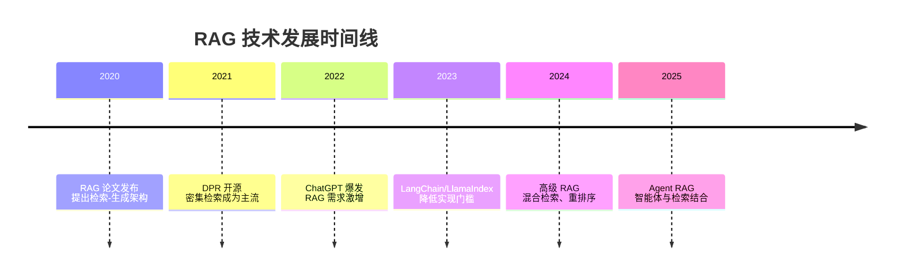

# 什么是 RAG?

> **学习目标**:理解 RAG 的核心概念、解决什么问题以及为何如此重要
>
> **预计时间**:50 分钟
>
> **难度等级**:⭐⭐☆☆☆

---

## 核心概念

### RAG 的定义

**RAG**(Retrieval-Augmented Generation,检索增强生成)是一种让大语言模型在生成答案时能够参考外部资料的技术架构。

::: tip 通俗理解
想象你在参加开卷考试:

- **没有 RAG 的 LLM**:像闭卷考试,只能凭记忆(训练数据)答题,遇到新题或细节问题就答不上来
- **有 RAG 的 LLM**:像开卷考试,可以查阅参考书(外部知识库),找到相关信息后组织答案
:::

### RAG 解决的核心问题

大语言模型有三个致命弱点,RAG 都能很好地解决:

| 问题 | 表现 | RAG 的解决方案 |
|------|------|---------------|
| **知识过时** | 模型不知道训练完成后发生的事情 | 从实时数据源检索最新信息 |
| **幻觉问题** | 模型会编造错误信息但说得头头是道 | 基于检索到的事实回答,减少编造 |
| **私有数据** | 模型无法访问企业内部或个人数据 | 连接私有知识库,处理专有信息 |

::: details 真实案例
某公司用 ChatGPT 搭建客服机器人,遇到三个问题:
1. 客户问"你们上月发布的新产品有什么功能?" → GPT 回答"我不知道"
2. 客户问"退款政策是什么?" → GPT 编造了不存在的政策
3. 客户问"我的订单 #12345 在哪?" → GPT 根本无法访问订单系统

使用 RAG 后,这三个问题都解决了:检索产品文档、退款政策和订单数据库,让 GPT 基于真实信息回答。
:::

---

## RAG 的前世今生

### 起源(2020年)

RAG 这个概念由 Facebook AI Research(现 Meta AI)在 2020 年的论文中正式提出[^1]。论文作者包括 Patrick Lewis 等人,他们发现:

- 单纯扩大模型规模不能解决知识密集型任务
- 检索和生成应该紧密结合,而不是简单串联

### 发展脉络



### 为什么 2023 年后突然火了起来?

三个因素叠加:

1. **ChatGPT 让大家看到了 LLM 的潜力**,但也暴露了局限
2. **企业不想把数据喂给 OpenAI**,隐私和安全要求催生私有部署
3. **开源工具链成熟**,LangChain、LlamaIndex 让 RAG 开发变得简单

---

## RAG vs 其他方案

很多人会混淆 RAG、微调和提示工程。它们都是提升 LLM 能力的方法,但适用场景完全不同。

### 与微调(Fine-tuning)对比

| 维度 | RAG | 微调 |
|------|-----|------|
| **知识更新** | 秒级(向量化新文档) | 周/月级(重新训练) |
| **可解释性** | 高(可标注来源) | 低(黑盒模型) |
| **成本** | 低(不需要 GPU 训练) | 高(需要算力和数据) |
| **知识范围** | 事实性知识(文档、数据) | 风格、格式、领域术语 |
| **适用场景** | 问答系统、知识库客服 | 特定风格对话、代码生成 |

::: tip 选型建议
- **需要最新信息?** → 用 RAG
- **需要特定说话风格?** → 用微调
- **两者都需要?** → RAG + 微调组合
:::

### 与长上下文(Long Context)对比

现在一些模型支持 128K 甚至更长的上下文窗口,有人问"还需要 RAG 吗?"

**答案是需要**,原因:

1. **检索更精准**:长上下文需要大海捞针,RAG 直接定位相关内容
2. **成本更低**:长上下文推理费用是 RAG 的 10-100 倍
3. **性能更好**:研究表明,在 10M+ 知识库上,RAG 准确率显著优于长上下文[^2]

### 与搜索增强对比

传统搜索引擎也能增强 LLM,为什么还需要向量检索?

| 方法 | 原理 | 优势 | 劣势 |
|------|------|------|------|
| **关键词搜索** | 词匹配 | 快速、精确 | 无法理解语义 |
| **向量检索** | 语义相似度 | 理解意图 | 需要向量化 |
| **混合检索** | 两者结合 | 兼顾语义和精确 | 复杂度高 |

::: example 例子
查询:"苹果发布"

- **关键词搜索**:返回所有包含"苹果"和"发布"的新闻
- **向量检索**:理解你问的是科技公司,返回 iPhone/Mac 相关内容
- **最佳实践**:先用向量检索找语义相关内容,再混合关键词精确匹配
:::

---

## RAG 的典型应用场景

### 1. 企业知识库问答

**场景**:新员工入职培训、内部文档查询

**问题**:公司有数千份文档(手册、政策、技术文档),员工找不到信息

**RAG 方案**:
```
用户问题: "报销流程是什么?"
      ↓
RAG 系统检索财务文档
      ↓
找到 3 份相关文档
      ↓
LLM 总结:根据财务手册第 5 章,你需要...
      ↓
标注来源:【员工手册 2024 版 - 5.2 节】
```

### 2. 客服自动化

**场景**:电商、SaaS 公司的客户支持

**传统方案**:
- 关键词匹配:太死板,理解不了复杂问题
- 人工客服:成本高,响应慢

**RAG 方案**:
- 理解自然语言提问
- 从产品文档、历史工单中检索答案
- 生成个性化回复
- 无法解决时自动转人工

**效果**:某电商使用 RAG 后,客服自动解决率从 30% 提升到 70%[^3]

### 3. 科研文献助手

**场景**:研究者需要快速找到相关论文和方法

**RAG 方案**:
- 索引 arXiv、PubMed 等数据库
- 用自然语言查询文献
- 让 LLM 跨论文总结观点

**例子**:
```
用户: "2024 年有什么新方法改进了 Transformer 的注意力机制?"
RAG: 检索到 7 篇相关论文,总结出三个主流方向:
1. 线性注意力(论文 A、B)
2. 局部注意力(论文 C、D)
3. 稀疏注意力(论文 E、F、G)
```

### 4. 代码库问答

**场景**:开发者快速理解大型代码库

**RAG 方案**:
- 将代码分块并嵌入语义信息(函数注释、文档字符串)
- 用自然语言查询代码功能
- 生成代码示例和解释

**例子**:
```
开发者: "这个项目里怎么处理用户认证的?"
RAG: 认证逻辑在 src/auth/ 目录下:
- login.py: 实现了 OAuth2.0
- middleware.py: JWT 验证
[显示相关代码片段]
```

### 5. 法律/医疗咨询

**场景**:律师查阅判例、医生参考医学指南

**优势**:
- **准确性高**:基于权威资料,减少幻觉
- **可溯源**:每个答案都有出处
- **专业性**:让 LLM 基于专业文献回答,而不是通用知识

---

## RAG 的局限性

### 1. 检索质量依赖数据库

如果知识库中没有相关信息,RAG 也无能为力。这就像开卷考试,但书上恰好没写答案。

**缓解方法**:
- 明确告知用户"未找到相关信息"
- 结合网络搜索(实时检索最新信息)
- 允许模型回退到通用知识

### 2. 检索延迟

相比纯 LLM 问答,RAG 增加了检索步骤,响应时间增加 200-500ms。

**优化方向**:
- 使用高性能向量数据库
- 建立缓存机制(常见问题直接返回)
- 流式输出(边生成边显示)

### 3. 上下文窗口限制

LLM 能处理的上下文长度有限(通常 4K-32K tokens),检索的内容太多会超出限制。

**解决方案**:
- 只检索最相关的 top-k 文档
- 压缩检索内容(提取关键信息)
- 使用长上下文模型(如 Claude 200K)

### 4. 复杂推理能力有限

RAG 擅长事实性问答,但不擅长需要多步推理或跨文档综合的问题。

**改进方法**:
- 使用 Agent RAG(让 LLM 自主决定检索策略)
- 结合思维链(CoT)提示
- 多轮检索(逐步收集信息)

---

## 思考题

::: info 检验你的理解
1. **假设你要为一家公司搭建内部知识库,你会选择 RAG 还是微调?为什么?**

2. **RAG 能完全解决 LLM 的幻觉问题吗?如果能,如何做到?如果不能,还有什么问题?**

3. **以下场景哪些适合 RAG,哪些不适合?为什么?**
   - 客户询问某产品的具体功能
   - 写一首关于春天的诗
   - 总结本周行业新闻
   - 翻译技术文档

4. **查阅一篇 RAG 相关论文或技术博客,总结它提出的改进方法。**
:::

---

## 本节小结

通过本节学习,你应该掌握了:

✅ **核心概念**
- RAG = 检索 + 生成
- 解决知识过时、幻觉、私有数据三大问题
- 就像给 LLM 配备了"开卷考试"的参考书

✅ **发展历程**
- 2020 年论文提出,2023 年工具成熟后爆发
- 企业隐私需求和 LLM 局限性推动普及

✅ **适用场景**
- 知识密集型问答:企业文档、客服、科研、代码
- 需要事实准确性和可追溯性的场景

✅ **局限性**
- 检索质量决定效果
- 增加响应延迟
- 复杂推理仍需改进

---

**下一步**:在[下一节](/ai-basics/05-rag-knowledge/02-rag-pipeline)中,我们会深入 RAG 的技术细节,看看完整的检索-生成流程是如何工作的。

---

[← 返回模块目录](/ai-basics/05-rag-knowledge) | [继续学习:RAG 流程 →](/ai-basics/05-rag-knowledge/02-rag-pipeline)

---

[^1]: Lewis et al., "Retrieval-Augmented Generation for Knowledge-Intensive NLP Tasks", NeurIPS 2020
[^2]: "Needles in the Haystack: A Comprehensive Evaluation of Retrieval-Augmented Models for Long-Context Tasks", 2024
[^3]: 数据来源:某电商公司的技术博客(已匿名处理)
