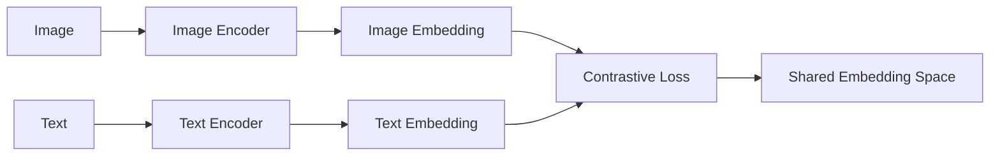
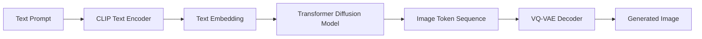
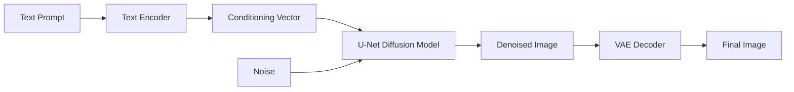
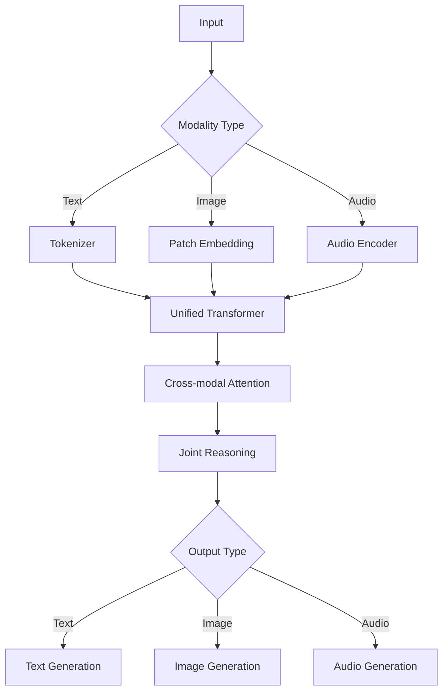
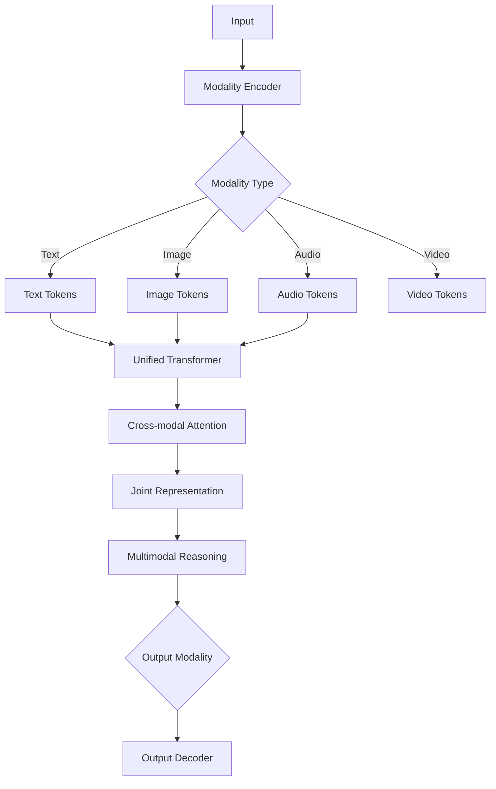
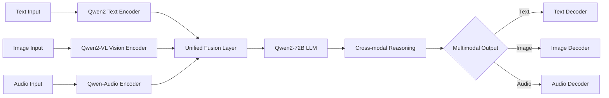

# 多模态架构

## 多模态 AI 架构演进

从单模态处理到多模态融合，AI 架构经历了三次重大演进。本节将详细介绍主流的多模态架构设计。

## 第一代架构：双编码器（Dual-Encoder）

### CLIP 架构

**架构设计**：



**技术特点**：

1. **独立的编码器**
   - 图像编码器：ViT（Vision Transformer）或 ResNet
   - 文本编码器：Transformer（如 BERT）

2. **对比学习目标**
```python
# CLIP 对比损失函数
def contrastive_loss(image_embeddings, text_embeddings):
    # 正样本对：配对的图像和文本
    positive_pairs = cosine_similarity(image_embeddings, text_embeddings)

    # 负样本对：不匹配的图像和文本
    negative_pairs = create_negative_samples(image_embeddings, text_embeddings)

    # 对比损失：拉近正样本，推远负样本
    loss = -log(exp(positive_pairs / temperature) /
             sum(exp(negative_pairs / temperature)))

    return loss
```

3. **统一的嵌入空间**
   - 图像和文本映射到同一高维空间
   - 余弦相似度计算
   - 支持零样本分类和检索

**能力范围**：
- ✅ 图像-文本检索
- ✅ 零样本分类
- ✅ 文本-图像相似度计算
- ❌ 文本生成图像
- ❌ 跨模态推理

### 第一代架构的优势与局限

**优势**：
- 架构简单，易于实现
- 对比学习训练稳定
- 零样本学习能力强

**局限**：
- 无法生成内容
- 跨模态理解浅层
- 需要大量配对数据

## 第二代架构：扩散生成（Diffusion Generation）

### DALL-E 2 架构

**架构设计**：



**技术特点**：

1. **两阶段生成**
   - 第一阶段：文本到图像 Token 序列（Transformer）
   - 第二阶段：Token 序列到图像（VQ-VAE）

2. **扩散过程**
```python
# DALL-E 2 扩散过程
class DALLE2:
    def forward(self, text_embeddings):
        # 扩散正向过程（训练时）
        for t in self.timesteps:
            noise = gaussian_noise(t)
            noisy_image = image + noise
            predicted_noise = self.model(noisy_image, text_embeddings, t)
            loss = mse(predicted_noise, noise)

        # 扩散逆向过程（推理时）
        for t in reversed(self.timesteps):
            predicted_noise = self.model(current_image, text_embeddings, t)
            current_image = denoise_step(current_image, predicted_noise, t)

        return current_image
```

3. **CLIP 引导**
   - 使用预训练的 CLIP 文本编码器
   - 集成图像和文本的嵌入空间
   - 改善文本-图像对齐

### Stable Diffusion 架构

**架构设计**：



**技术特点**：

1. **U-Net 架构**
   - 编码器-解码器结构
   - 跳跃连接保留细节
   - 文本条件注入

2. **变分自编码器（VAE）**
   - 压缩图像到潜在空间
   - 减少计算复杂度
   - 保持高质量重建

3. **Latent Diffusion**
```python
# Stable Diffusion 潜在空间扩散
class StableDiffusion:
    def forward(self, text_embedding):
        # 压缩到潜空间
        latent = vae.encode(image)

        # 潜空间扩散
        for t in timesteps:
            noise_pred = unet(latent, text_embedding, t)
            latent = denoise_step(latent, noise_pred, t)

        # 解压回图像空间
        image = vae.decode(latent)
        return image
```

### 第二代架构的能力范围

- ✅ 文本生成高质量图像
- ✅ 图像编辑和变体
- ✅ 风格迁移
- ✅ Inpainting 和 Outpainting
- ⚠️ 跨模态理解有限
- ⚠️ 需要多步推理

## 第三代架构：统一 Transformer（Unified Transformer）

### GPT-4V 架构

**架构设计**：



**技术特点**：

1. **统一的多模态输入处理**
```python
# GPT-4V 统一编码器
class GPT4VEncoder:
    def encode(self, multimodal_input):
        tokens = []
        positions = []

        for modality, data in multimodal_input.items():
            if modality == 'text':
                token, pos = self.text_tokenizer(data)
            elif modality == 'image':
                token, pos = self.image_patch_encoder(data)
            elif modality == 'audio':
                token, pos = self.audio_encoder(data)

            tokens.append(token)
            positions.append(pos)

        return concat(tokens), concat(positions)
```

2. **跨模态注意力机制**
```python
# 跨模态注意力
class CrossModalAttention(nn.Module):
    def forward(self, query_modality, key_modalities, value_modalities):
        # Query 来自一个模态（如文本）
        # Key 和 Value 来自所有模态
        all_keys = concat([k for k in key_modalities])
        all_values = concat([v for v in value_modalities])

        # 计算跨模态注意力权重
        attention_weights = softmax(
            query @ all_keys.T / sqrt(d_k)
        )

        # 加权聚合所有模态的信息
        output = attention_weights @ all_values
        return output
```

3. **统一的多模态推理**
```python
# 统一的多模态 Token 处理
class UnifiedTransformer(nn.Module):
    def forward(self, multimodal_tokens, positions):
        # 统一的注意力层
        for layer in self.layers:
            # 跨模态注意力
            output = self.cross_modal_attention(
                query_modality='text',
                key_modalities=['image', 'audio', 'video'],
                value_modalities=['image', 'audio', 'video'],
                tokens=multimodal_tokens
            )

            # 自注意力
            output = self.self_attention(output)
            multimodal_tokens = output

        # 生成多模态输出
        return self.generate_multimodal_output(multimodal_tokens)
```

### Gemini 架构

**架构设计**：



**技术特点**：

1. **原生多模态训练**
   - 从零开始的多模态联合训练
   - 非预训练模型拼接
   - 深度跨模态对齐

2. **模态特定的编码器**
   - 文本：标准 Transformer 编码器
   - 图像：视觉 Transformer（ViT）
   - 音频：音频 Transformer 或 WaveNet
   - 视频：时空 Transformer

3. **灵活的模态组合**
   - 支持任意模态输入组合
   - 动态模态选择
   - 模态缺失处理

### Qwen-VL 架构

**架构设计**：



**技术特点**：

1. **模块化架构**
   - 可插拔的模态编码器
   - 统一的融合层
   - 共享的 LLM 主干

2. **分层融合策略**
```python
# Qwen-VL 分层融合
class QwenVLFusion(nn.Module):
    def __init__(self):
        # 底层融合：模态特定特征
        self.low_level_fusion = LowLevelFusion()

        # 中层融合：跨模态对齐
        self.mid_level_fusion = CrossModalAttention()

        # 高层融合：语义统一
        self.high_level_fusion = SemanticFusion()

    def forward(self, text_features, image_features, audio_features):
        # 底层：提取模态特定特征
        text_low = self.text_encoder(text_features)
        image_low = self.vision_encoder(image_features)
        audio_low = self.audio_encoder(audio_features)

        # 中层：跨模态对齐
        aligned_features = self.mid_level_fusion(
            text_low, image_low, audio_low
        )

        # 高层：语义统一
        unified_features = self.high_level_fusion(aligned_features)

        return unified_features
```

3. **多模态输出能力**
   - 文本生成和续写
   - 图像生成和编辑
   - 音频生成和编辑
   - 跨模态内容转换

## 架构对比

| 特性 | 第一代（CLIP） | 第二代（DALL-E 2） | 第三代（GPT-4V） | 第四代（GPT-4o/Llama 4） |
|------|-----------------|---------------------|-------------------|--------------------------|
| 训练目标 | 对比学习 | 扩散生成 | 统一多模态训练 | 原生多模态联合训练 |
| 架构复杂度 | 低（双编码器） | 中（两阶段） | 高（统一 Transformer） | 高（端到端统一） |
| 融合方式 | 后期融合（嵌入对齐） | 条件引导 | 跨模态注意力 | 早期融合（Early Fusion） |
| 内容生成 | ❌ | ✅（图像） | ✅（多模态） | ✅（实时多模态） |
| 跨模态推理 | ⚠️（浅层） | ⚠️（有限） | ✅（深度） | ✅（原生深度） |
| 推理步数 | 1 | 50-100 | 可变 | 1（单次前向传播） |
| 计算需求 | 低 | 中 | 高 | 高（MoE 优化） |
| 应用场景 | 检索、分类 | 生成 | 理解、生成、推理 | 实时交互、Agent |

## 第四代架构：原生多模态（Native Multimodal）

### GPT-4o 架构

**核心突破**：第一个真正意义上的"全能"模型——文本、视觉、音频通过同一神经网络端到端处理。

**技术特点**：

1. **统一 Token 化**
```python
# GPT-4o 统一编码
class GPT4oEncoder:
    def encode(self, input_stream):
        tokens = []
        for item in input_stream:
            if item.type == 'text':
                tokens.extend(self.text_tokenizer(item.data))
            elif item.type == 'image':
                tokens.extend(self.vision_encoder(item.data))
            elif item.type == 'audio':
                tokens.extend(self.audio_encoder(item.data))
        # 所有模态的 token 在同一空间
        return tokens  # 统一的 token 序列
```

2. **单次前向传播**
   - 不需要模态间转换
   - 实时语音对话延迟 < 300ms
   - 视觉和文本推理同时进行

### Llama 4 早期融合架构

**核心突破**：无独立视觉编码器，文本和视觉 token 在主干网络中直接交互。

**技术特点**：

1. **早期融合（Early Fusion）**
```python
# Llama 4 早期融合
class Llama4EarlyFusion:
    def __init__(self):
        self.backbone = MoETransformer(
            num_experts=128,    # 128 个专家
            active_params=17B,  # 每次激活 17B
            total_params="400B+"  # 总参数量
        )

    def forward(self, text_tokens, image_tokens):
        # 不是分别编码再融合
        # 而是直接拼接送入统一主干
        unified_input = concat([text_tokens, image_tokens])
        return self.backbone(unified_input)
```

2. **MoE 架构**
   - 总参数量大但推理成本低
   - 动态激活相关专家
   - Llama 4 Scout：1000 万 token 上下文窗口

### 架构演进趋势

```
第一代 → 分离编码，后期对齐（CLIP）
第二代 → 条件引导生成（DALL-E 2）
第三代 → 统一 Transformer + 跨模态注意力（GPT-4V）
第四代 → 早期融合 + 统一 Token 化（GPT-4o、Llama 4）

趋势：从"拼接"到"原生"，从"多步推理"到"单次前向"
```

## 学习检验

#### 架构理解

- [ ] 能描述四代多模态架构的核心区别
- [ ] 能画出 CLIP、DALL-E 2、GPT-4V、GPT-4o 的架构图
- [ ] 理解对比学习、扩散生成、统一 Transformer、早期融合的技术原理
- [ ] 能分析不同架构的适用场景

#### 技术能力

- [ ] 能根据任务需求选择合适的多模态架构
- [ ] 能设计多模态编码器和融合模块
- [ ] 能实现跨模态注意力机制
- [ ] 能优化多模态模型的推理效率

---

[下一节：跨模态对齐 →](./03-cross-modal-alignment.md)
