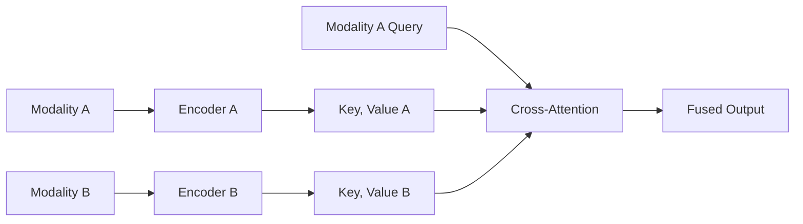
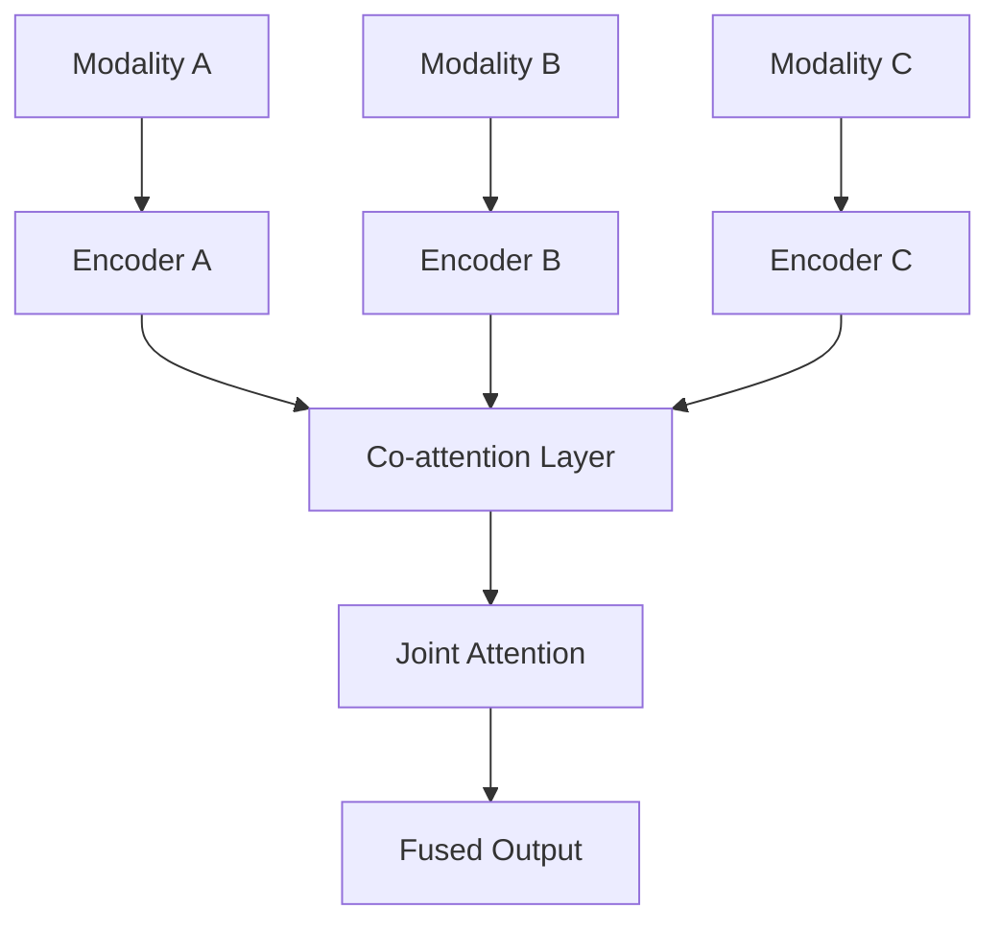
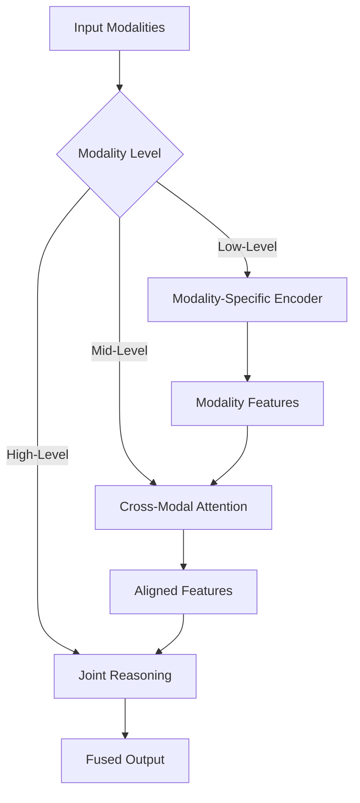
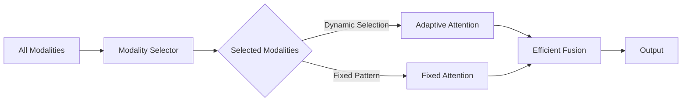
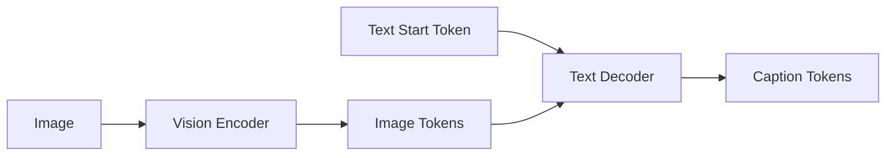
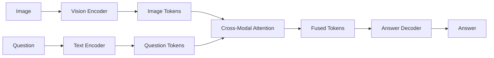
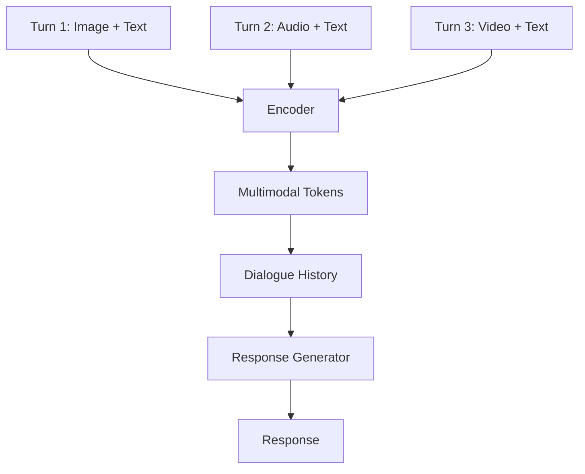

# 多模态 Transformer

## Transformer 在多模态 AI 中的应用

Transformer 架构通过自注意力机制，为多模态 AI 提供了强大的建模能力。本节将介绍多模态 Transformer 的关键技术。

## 自注意力机制回顾

### 标准 Self-Attention

**公式**：
```
Attention(Q, K, V) = softmax(QK^T / sqrt(d_k))V
```

**实现**：
```python
# 标准 Self-Attention
class SelfAttention(nn.Module):
    def __init__(self, d_model, n_heads):
        self.d_model = d_model
        self.n_heads = n_heads
        self.d_k = d_model // n_heads

        # 线性变换矩阵
        self.W_q = nn.Linear(d_model, d_model)
        self.W_k = nn.Linear(d_model, d_model)
        self.W_v = nn.Linear(d_model, d_model)

    def forward(self, x):
        batch_size, seq_len, d_model = x.shape

        # 线性变换
        Q = self.W_q(x)  # [batch, n_heads, seq_len, d_k]
        K = self.W_k(x)  # [batch, n_heads, seq_len, d_k]
        V = self.W_v(x)  # [batch, n_heads, seq_len, d_k]

        # 缩放点积注意力
        scores = torch.matmul(Q, K.transpose(-2, -1)) / \
                 torch.sqrt(torch.tensor(self.d_k, dtype=torch.float32))

        attention_weights = F.softmax(scores, dim=-1)

        # 加权求和
        output = torch.matmul(attention_weights, V)

        return output
```

### 多头注意力（Multi-Head Attention）

**架构**：
```python
# 多头注意力
class MultiHeadAttention(nn.Module):
    def __init__(self, d_model, n_heads):
        super().__init__()
        self.d_model = d_model
        self.n_heads = n_heads
        self.d_k = d_model // n_heads

        # 多个注意力头
        self.heads = nn.ModuleList([
            SelfAttention(d_model, n_heads) for _ in range(n_heads)
        ])

        # 输出投影
        self.W_o = nn.Linear(d_model, d_model)

    def forward(self, x):
        # 并行计算多个注意力头
        head_outputs = [head(x) for head in self.heads]
        concat_heads = torch.cat(head_outputs, dim=-1)

        # 输出投影
        output = self.W_o(concat_heads)
        return output
```

**优势**：
- 并行计算
- 捕捉不同子空间的信息
- 提升表达能力

## 多模态注意力机制

### 1. 跨模态注意力（Cross-modal Attention）

#### 架构设计



#### 实现示例

```python
# 跨模态注意力
class CrossModalAttention(nn.Module):
    def __init__(self, d_model, n_heads):
        super().__init__()
        self.d_model = d_model
        self.n_heads = n_heads
        self.d_k = d_model // n_heads

        # Query、Key、Value 的线性变换
        self.W_q = nn.Linear(d_model, d_model)
        self.W_k_a = nn.Linear(d_model, d_model)  # 模态 A 的 Key
        self.W_k_b = nn.Linear(d_model, d_model)  # 模态 B 的 Key
        self.W_v_a = nn.Linear(d_model, d_model)  # 模态 A 的 Value
        self.W_v_b = nn.Linear(d_model, d_model)  # 模态 B 的 Value

    def forward(self, query_modality, modality_a, modality_b):
        # Query 来自 query_modality
        Q = self.W_q(query_modality)

        # Key 和 Value 来自两个模态
        K_a = self.W_k_a(modality_a)
        K_b = self.W_k_b(modality_b)
        K = torch.cat([K_a, K_b], dim=1)  # 拼接两个模态的 Key

        V_a = self.W_v_a(modality_a)
        V_b = self.W_v_b(modality_b)
        V = torch.cat([V_a, V_b], dim=1)  # 拼接两个模态的 Value

        # 缩放点积注意力
        scores = torch.matmul(Q, K.transpose(-2, -1)) / \
                 torch.sqrt(torch.tensor(self.d_k, dtype=torch.float32))

        attention_weights = F.softmax(scores, dim=-1)

        # 加权求和
        output = torch.matmul(attention_weights, V)
        return output
```

#### 使用场景

**文本-图像跨模态注意力**：
```python
# 文本 Query 关注图像 Key-Value
text_query = text_encoder("描述这张图片")
image_keys, image_values = image_encoder(input_image)

# 文本关注图像的哪些部分
cross_attention_output = cross_modal_attention(
    query_modality=text_query,
    modality_a=image_keys,
    modality_b=image_values
)

# 输出：文本关注的图像区域的表示
```

**图像-音频跨模态注意力**：
```python
# 图像 Query 关注音频 Key-Value
image_query = image_encoder(input_image)
audio_keys, audio_values = audio_encoder(input_audio)

# 图像关注音频的哪些部分
cross_attention_output = cross_modal_attention(
    query_modality=image_query,
    modality_a=audio_keys,
    modality_b=audio_values
)

# 输出：图像关注的音频时序的表示
```

### 2. 联合多模态注意力（Co-attention）

#### 架构设计



#### 实现示例

```python
# 联合多模态注意力
class CoAttention(nn.Module):
    def __init__(self, d_model, n_heads):
        super().__init__()
        self.d_model = d_model
        self.n_heads = n_heads
        self.d_k = d_model // n_heads

        # 所有模态共享的 Query、Key、Value 变换
        self.W_q = nn.Linear(d_model, d_model)
        self.W_k = nn.Linear(d_model, d_model)
        self.W_v = nn.Linear(d_model, d_model)

    def forward(self, modalities):
        # 模态列表
        # modality_a, modality_b, modality_c, ...

        # 为所有模态计算 Q、K、V
        Q_list = [self.W_q(mod) for mod in modalities]
        K_list = [self.W_k(mod) for mod in modalities]
        V_list = [self.W_v(mod) for mod in modalities]

        # 拼接所有模态的 K 和 V
        K = torch.cat(K_list, dim=1)  # [batch, n_modalities, n_heads, seq_len, d_k]
        V = torch.cat(V_list, dim=1)

        # 每个 Query 关注所有模态的 Key-Value
        outputs = []
        for i, Q in enumerate(Q_list):
            # 模态 i 的 Query 关注所有模态的 K 和 V
            scores = torch.matmul(Q, K.transpose(-2, -1)) / \
                     torch.sqrt(torch.tensor(self.d_k, dtype=torch.float32))

            attention_weights = F.softmax(scores, dim=-1)
            output = torch.matmul(attention_weights, V)
            outputs.append(output)

        return concat(outputs)
```

#### 使用场景

**三模态联合注意力**：
```python
# 文本、图像、音频的联合注意力
text_features = text_encoder(text_input)
image_features = image_encoder(image_input)
audio_features = audio_encoder(audio_input)

modalities = [text_features, image_features, audio_features]

# 每个模态都关注其他两个模态
co_attention_output = co_attention(modalities)

# 输出：融合三个模态信息的表示
```

### 3. 分层多模态注意力（Hierarchical Multimodal Attention）

#### 架构设计



#### 实现示例

```python
# 分层多模态注意力
class HierarchicalMultimodalAttention(nn.Module):
    def __init__(self, d_model, n_heads):
        super().__init__()
        self.d_model = d_model

        # 底层：模态特定编码器
        self.text_encoder = TextEncoder(d_model)
        self.image_encoder = ImageEncoder(d_model)
        self.audio_encoder = AudioEncoder(d_model)

        # 中层：跨模态注意力
        self.mid_level_attention = CrossModalAttention(d_model, n_heads)

        # 高层：联合推理层
        self.high_level_reasoning = JointReasoningLayer(d_model, n_heads)

    def forward(self, text, image, audio):
        # 底层：提取模态特定特征
        text_features = self.text_encoder(text)
        image_features = self.image_encoder(image)
        audio_features = self.audio_encoder(audio)

        # 中层：跨模态对齐
        # 文本 Query 关注图像和音频
        text_aligned = self.mid_level_attention(
            query_modality=text_features,
            modality_a=image_features,
            modality_b=audio_features
        )

        # 高层：联合推理
        all_features = [text_aligned, image_features, audio_features]
        fused_output = self.high_level_reasoning(all_features)

        return fused_output
```

### 4. 稀疏多模态注意力（Sparse Multimodal Attention）

#### 架构设计



#### 实现示例

```python
# 稀疏多模态注意力
class SparseMultimodalAttention(nn.Module):
    def __init__(self, d_model, n_heads, n_modalities):
        super().__init__()
        self.d_model = d_model
        self.n_heads = n_heads
        self.n_modalities = n_modalities

        # 模态选择器
        self.modality_selector = ModalitySelector(n_modalities)

        # 自适应注意力
        self.adaptive_attention = AdaptiveAttention(d_model, n_heads)

    def forward(self, modalities):
        # 根据任务或输入选择相关的模态
        selected_indices = self.modality_selector(modalities)

        # 只对选中的模态计算注意力
        selected_modalities = [modalities[i] for i in selected_indices]

        # 自适应注意力
        output = self.adaptive_attention(selected_modalities)
        return output

class ModalitySelector(nn.Module):
    def __init__(self, n_modalities):
        super().__init__()
        self.n_modalities = n_modalities
        # 学习模态重要性权重
        self.modality_weights = nn.Parameter(torch.ones(n_modalities))

    def forward(self, modalities):
        # 计算 Softmax 权重
        weights = F.softmax(self.modality_weights, dim=0)

        # 选择权重高的模态
        selected_indices = torch.topk(weights, k=self.n_modalities // 2).indices
        return selected_indices
```

## 高效的多模态 Transformer

### 1. Flash Attention

**核心思想**：
通过重排和分块计算，减少内存访问，提升注意力计算效率

**优化效果**：
- 计算速度提升 2-4 倍
- 内存使用减少 50-80%
- 支持更长的序列

### 2. 线性 Attention

**核心思想**：
将注意力复杂度从 O(n²) 降到 O(n)，支持更长的序列

**算法类型**：
- Linear Attention：核技巧近似
- Performer：随机特征映射
- Linformer：低秩近似

**优势**：
- 线性复杂度
- 支持超长序列
- 内存效率高

### 3. 多模态压缩

#### Token 合并

**核心思想**：
相似或冗余的 Token 合并，减少序列长度

**实现示例**：
```python
# Token 合并
class TokenMerger:
    def __init__(self, similarity_threshold=0.9):
        self.threshold = similarity_threshold

    def merge(self, tokens):
        merged_tokens = []
        used_indices = []

        for i, token_i in enumerate(tokens):
            if i in used_indices:
                continue

            # 查找相似的 Token
            similar_indices = self.find_similar_tokens(
                token_i, tokens, used_indices
            )

            if len(similar_indices) > 0:
                # 合并相似 Token
                merged_token = self.merge_tokens(
                    [token_i] + [tokens[j] for j in similar_indices]
                )
                merged_tokens.append(merged_token)
                used_indices.extend([i] + similar_indices)
            else:
                merged_tokens.append(token_i)
                used_indices.append(i)

        return merged_tokens
```

## 多模态 Transformer 的应用

### 1. 图像描述生成（Image Captioning）



### 2. 视觉问答（Visual Question Answering）



### 3. 多模态对话（Multimodal Dialogue）



## 学习检验

#### 技术理解

- [ ] 理解 Transformer 自注意力机制的基本原理
- [ ] 掌握跨模态注意力、联合多模态注意力的区别
- [ ] 理解高效注意力机制的优化策略
- [ ] 能分析不同注意力机制的适用场景

#### 实践能力

- [ ] 能实现基本的自注意力机制
- [ ] 能设计跨模态注意力模块
- [ ] 能优化多模态 Transformer 的计算效率
- [ ] 能选择合适的注意力机制处理特定多模态任务

---

[下一节：应用场景 →](./05-applications.md)
