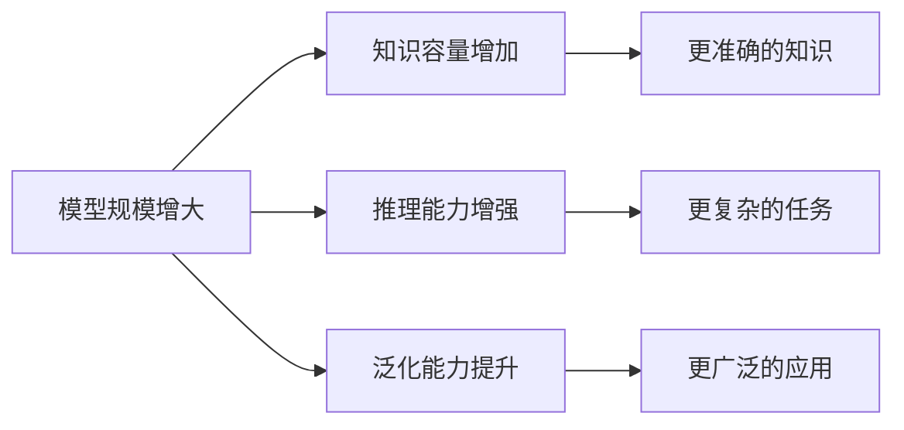

# 什么是大语言模型?

> **学习目标**:理解 LLM 的定义、特征和发展历程
>
> **预计时间**:45 分钟
>
> **难度等级**:⭐⭐☆☆☆

---

## 核心概念

### 什么是语言模型?

**语言模型(Language Model)**是一种能够计算一个词序列出现概率的机器学习模型。简单来说,它的任务是**预测下一个词**。

::: tip 通俗理解
想象你在玩一个填空游戏:
> "今天天气真____"

语言模型会计算:
- "好" 的概率:85%
- "不错" 的概率:10%
- "糟糕" 的概率:5%

模型选择概率最高的词来补全句子。
:::

### 什么是"大"语言模型?

大语言模型(Large Language Model, LLM)的"大"主要体现在三个方面:

| 维度 | 传统语言模型 | 大语言模型 |
|------|------------|-----------|
| **参数量** | 百万级(10^6) | **百亿至万亿级(10^10-10^12)** |
| **训练数据** | GB 级别 | **TB 至 PB 级别** |
| **能力范围** | 单一任务 | **多任务通用能力** |

::: details 参数量的直观理解
- **GPT-2(2019)**:15 亿参数 ≈ 一个中型公司的员工数
- **GPT-3(2020)**:1750 亿参数 ≈ 中国网民总数
- **GPT-4(2023)**:估计万亿级参数 ≈ 人脑神经元数量(860 亿)
:::

---

## LLM 的核心特征

### 1. 基于深度学习

LLM 使用深度神经网络,特别是**Transformer 架构**,从海量文本中学习语言模式。

### 2. 预训练+ 微调范式

```
┌─────────────────┐      ┌─────────────────┐
│   预训练阶段     │  →   │   微调阶段       │
│  (基础能力)     │      │  (任务适配)     │
└─────────────────┘      └─────────────────┘
     海量通用数据              特定任务数据
     (无监督)                 (有监督)
```

### 3. 涌现能力(Emergent Abilities)

当模型规模超过某个临界值时,会突然展现出训练时未明确教授的能力:

::: info 涌现能力示例
- **上下文学习(In-Context Learning)**:通过示例学习新任务
- **思维链推理(Chain-of-Thought)**:分步骤解决复杂问题
- **指令遵循**:理解和执行自然语言指令
:::

### 4. 通用性

同一个模型可以处理多种任务:
- 文本生成、问答、翻译
- 代码编写、调试、解释
- 逻辑推理、数学计算
- 创意写作、摘要总结

---

## 发展历程

### 第一阶段:统计语言模型(2000s)

**代表方法**:n-gram 模型、HMM

**特点**:
- 基于统计规律
- 只考虑局部上下文
- 能力有限

**局限性**:
```
输入:"我昨天去了___"
n-gram 可能预测:"图书馆"、"公园"
但无法理解"去"的语义和上下文逻辑
```

### 第二阶段:神经网络语言模型(2010s)

**代表模型**:Word2Vec(2013)、LSTM(2014)

**突破**:
- 词的分布式表示(Word Embedding)
- 捕捉长距离依赖
- 更好的语义理解

**局限性**:
- 顺序计算,训练慢
- 仍有能力瓶颈

### 第三阶段:预训练模型(2017-2019)

**代表模型**:
- **Transformer(2017)**:Google 发表《Attention Is All You Need》[^1]
- **BERT(2018)**:双向编码器
- **GPT-2(2019)**:15 亿参数

**核心创新**:
- 自注意力机制
- 并行化训练
- 预训练+ 微调范式

### 第四阶段:大语言模型时代(2020-至今)

**里程碑模型**:

| 时间 | 模型 | 参数量 | 意义 |
|------|------|-------|------|
| 2020.05 | GPT-3 | 1750 亿 | 证明规模化的威力[^2] |
| 2022.11 | ChatGPT | 未公开 | 对话式 AI 爆发 |
| 2023.03 | GPT-4 | 万亿级 | 多模态能力 |
| 2023.12 | Gemini 1.5 | - | 100 万 token 上下文 |
| 2024.01 | DeepSeek R1 | - | 推理能力突破 |
| 2025.01 | GPT-4.5 | - | 统一智能体验 |

---

## LLM 的"大"有什么意义?

### 能力提升



### 规模法则(Scaling Laws)

OpenAI 的研究发现[^3],模型性能与三个因素呈幂律关系:

$$Performance \propto (Parameters)^{\alpha} \times (Data)^{\beta} \times (Compute)^{\gamma}$$

**核心发现**:
- 模型越大,性能越好
- 数据越多,性能越好
- 算力越强,性能越好
- 三者之间存在最优比例

### 临界点效应

::: tip 关键发现
当模型规模超过约 **100 亿参数**时,会涌现出小模型不具备的能力:
- 少样本学习(Few-shot Learning)
- 复杂推理
- 代码生成
- 跨任务迁移
:::

---

## 常见误解

### ❌ 误解 1:LLM 就是搜索引擎

LLM 不是搜索引擎,而是**概率生成模型**
- 搜索引擎:检索已有信息
- LLM:基于模式生成新内容

### ❌ 误解 2:LLM 真正"理解"语言

学术界对此仍有争议[^4]
- **支持观点**:大模型涌现出类人理解能力
- **反对观点**:只是统计模式匹配,缺乏真实理解

### ❌ 误解 3:LLM 越大越好

规模不是唯一因素:
- 数据质量 > 数据数量
- 架构设计很重要
- 对齐训练不可或缺

### ❌ 误解 4:LLM 会取代人类

LLM 是辅助工具,不是替代品:
- 擅长模式识别和生成
- 缺乏真实世界体验
- 需要人类监督和引导

---

## 应用场景

### 📝 内容创作
- 文章写作、剧本创作
- 营销文案、产品描述
- 诗歌、小说等创意写作

### 💻 编程开发
- 代码生成、补全
- Bug 诊断和修复
- 代码解释和文档生成

### 🎓 教育培训
- 个性化辅导
- 作业批改
- 知识问答

### 💼 商业应用
- 客户服务自动化
- 数据分析和报告
- 市场调研

### 🔬 科学研究
- 文献综述
- 假设生成
- 实验设计辅助

---

## 思考题

::: info 检验你的理解
1. **什么是语言模型的核心任务?**
   - A. 理解人类语言
   - B. 预测下一个词
   - C. 生成有意义的内容

2. **大语言模型的"大"主要体现在哪些方面?**

3. **为什么说 LLM 会"涌现"能力?这与传统软件有何不同?**

4. **查找并体验至少两个不同的 LLM(如 ChatGPT、Claude、DeepSeek、通义千问),对比它们在回答同一个问题时的差异。**
:::

---

## 本节小结

通过本节学习,你应该掌握了:

✅ **核心概念**
- 语言模型的定义和任务
- LLM 的"大"体现在参数量、数据量、能力范围
- 预训练+ 微调范式

✅ **发展历程**
- 从统计模型到神经模型
- Transformer 的革命性意义
- GPT 系列的演进

✅ **关键特征**
- 涌现能力、通用性
- 规模法则和临界点效应

---

**下一步**:在[下一节](/basics/02-llm-fundamentals/02-how-llm-works)中,我们将深入探讨 LLM 的工作原理,揭秘 Transformer 架构和注意力机制。

---

[← 返回模块目录](/basics/02-llm-fundamentals) | [继续学习:LLM 如何工作? →](/basics/02-llm-fundamentals/02-how-llm-works)

---

[^1]: Vaswani et al., "Attention Is All You Need", NeurIPS 2017
[^2]: Brown et al., "Language Models are Few-Shot Learners", NeurIPS 2020
[^3]: Kaplan et al., "Scaling Laws for Neural Language Models", 2020
[^4]: "Do Large Language Models Understand What They Are Saying?", AAAI 2023
