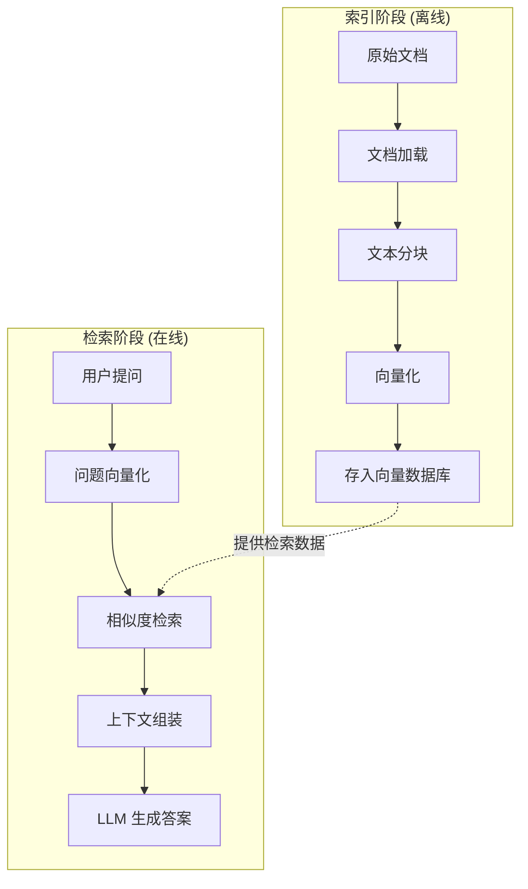

# RAG 流程

> **学习目标**:掌握 RAG 系统的完整工作流程和每个组件的作用
>
> **预计时间**:60 分钟
>
> **难度等级**:⭐⭐⭐☆☆

---

## 整体架构

### 标准的 RAG 流程

一个完整的 RAG 系统包含两个阶段:**索引阶段**(离线)和**检索阶段**(在线)。



### 关键组件

| 阶段 | 组件 | 作用 |
|------|------|------|
| **索引** | 文档加载器 | 读取 PDF、网页、数据库等 |
|  | 文本分块器 | 把长文档切成小块 |
|  | 嵌入模型 | 文本 → 向量 |
|  | 向量数据库 | 存储和检索向量 |
| **检索** | 查询编码器 | 问题 → 向量 |
|  | 检索器 | 找到最相关的文档块 |
|  | 重排序器 | (可选)优化检索结果 |
| **生成** | 提示模板 | 组装上下文和问题 |
|  | LLM | 基于上下文生成答案 |

---

## 索引阶段详解

### 1. 文档加载(Document Loading)

**目标**:从各种来源读取原始数据。

**常见数据源**:

| 类型 | 示例 | 工具 |
|------|------|------|
| **文本文档** | PDF、DOCX、TXT | LangChain loaders, PyPDF2 |
| **网页内容** | HTML、Markdown | BeautifulSoup, playwright |
| **数据库** | MySQL、PostgreSQL | SQLDatabaseLoader |
| **代码仓库** | GitHub、GitLab | GitLoader |
| **Notion/Confluence** | 企业知识库 | 专用 API |
| **音视频** | (需先转录) | Whisper, AssemblyAI |

**代码示例**(使用 LangChain):
```python
from langchain_community.document_loaders import PyPDFLoader, WebBaseLoader

# 加载 PDF
loader = PyPDFLoader("company_policy.pdf")
pdf_docs = loader.load()

# 加载网页
loader = WebBaseLoader("https://example.com/docs")
web_docs = loader.load()
```

**关键考虑**:
- **文本提取质量**:PDF 扫描件需要 OCR
- **元数据保留**:文件名、页码、作者等信息有助于追溯来源
- **批量处理**:大型知识库需要并行加载

### 2. 文本分块(Text Chunking)

**为什么要分块?**

1. **上下文窗口限制**:LLM 无法一次处理整本书
2. **检索精度**:小块更聚焦,相关性更强
3. **成本控制**:减少 token 消耗

**分块策略对比**:

| 策略 | 方法 | 优点 | 缺点 | 适用场景 |
|------|------|------|------|----------|
| **固定大小** | 每 N 个字符切分 | 简单高效 | 可能破坏语义 | 通用文档 |
| **递归分块** | 按段落→句子→词递归 | 保持语义完整 | 仍有边界问题 | 结构化文本 |
| **语义分块** | 根据句子相似度 | 语义连贯 | 计算成本高 | 长文档、论文 |
| **专用分块** | 代码按函数,Markdown 按章节 | 最精准 | 需要解析器 | 代码、技术文档 |

**代码示例**:
```python
from langchain_text_splitters import RecursiveCharacterTextSplitter

# 递归分块(推荐)
splitter = RecursiveCharacterTextSplitter(
    chunk_size=1000,           # 每块约 1000 字符
    chunk_overlap=200,         # 块之间重叠 200 字符
    separators=["\n\n", "\n", "。", " ", ""]  # 按优先级切分
)

chunks = splitter.split_documents(docs)
```

**分块参数调优建议**:

::: tip 经验法则
- **chunk_size**:根据 LLM 上下文窗口
  - 4K 模型:500-800 字符
  - 8K 模型:1000-1500 字符
  - 32K+ 模型:2000-4000 字符

- **chunk_overlap**:chunk_size 的 10-25%
  - 太小:信息在边界处丢失
  - 太大:检索结果冗余

- **实际测试**:
  1. 从推荐值开始
  2. 用真实查询测试检索质量
  3. 观察答案完整度
  4. 迭代调整
:::

### 3. 向量化(Embedding)

**核心思想**:把文本变成高维空间中的点,语义相近的文本距离更近。

**直观理解**:

```
"猫"  → [0.2, -0.5, 0.8, ...]
"狗"  → [0.3, -0.4, 0.7, ...]  ← 距离近
"汽车" → [-0.6, 0.9, -0.2, ...] ← 距离远
```

**向量的维度**:
- 小模型(如 MiniLM):384 维
- 中型模型(如 BGE-base):768 维
- 大模型(如 OpenAI text-embedding-3):3072 维

**常见嵌入模型**:

| 模型 | 维度 | 特点 | 成本 |
|------|------|------|------|
| **text-embedding-3-small** | 1536 | OpenAI 最新,性价比高 | API 付费 |
| **bge-large-zh-v1.5** | 1024 | 中文效果顶尖 | 开源免费 |
| **e5-large-v2** | 1024 | 多语言支持好 | 开源免费 |
| **jina-embeddings-v2** | 768 | 长文本支持好 | 部分开源 |

**代码示例**:
```python
from langchain_openai import OpenAIEmbeddings

# 使用 OpenAI 嵌入
embeddings = OpenAIEmbeddings(model="text-embedding-3-small")

# 或使用开源模型
from langchain_community.embeddings import HuggingFaceEmbeddings
embeddings = HuggingFaceEmbeddings(
    model_name="BAAI/bge-large-zh-v1.5"
)

# 文本 → 向量
text = "RAG 是一种检索增强生成技术"
vector = embeddings.embed_query(text)
print(f"向量维度:{len(vector)}")  # 输出:1536 或 1024
```

### 4. 存入向量数据库

**向量数据库的作用**:
- 存储文本块和对应的向量
- 快速找到与查询向量最相似的文本块
- 支持元数据过滤(按日期、类别等筛选)

**主流向量数据库对比**:

| 数据库 | 特点 | 适用场景 | 许可证 |
|--------|------|----------|--------|
| **Chroma** | 轻量级,易集成 | 原型开发、学习 | MIT |
| **FAISS** | Facebook 出品,纯库 | 大规模检索 | MIT |
| **Pinecone** | 托管服务,免运维 | 生产环境 | 商业 |
| **Milvus** | 功能完善,可扩展 | 企业级部署 | MPL |
| **Qdrant** | Rust 实现,高性能 | 性能敏感场景 | Apache 2.0 |

**代码示例**(Chroma):
```python
import chromadb
from chromadb.config import Settings

# 创建客户端
client = chromadb.Client(Settings())

# 创建 collection
collection = client.create_collection(
    name="knowledge_base",
    metadata={"hnsw:space": "cosine"}  # 使用余弦相似度
)

# 存入数据
collection.add(
    documents=[chunk.page_content for chunk in chunks],
    embeddings=[embeddings.embed_query(chunk.page_content) for chunk in chunks],
    metadatas=[chunk.metadata for chunk in chunks],
    ids=[f"chunk_{i}" for i in range(len(chunks))]
)
```

---

## 检索阶段详解

### 1. 问题编码

将用户问题转换成向量,使用与索引阶段相同的嵌入模型。

```python
query = "公司请假政策是什么?"
query_vector = embeddings.embed_query(query)
```

### 2. 相似度检索

**核心算法**:计算查询向量和所有文档块向量的相似度,返回 top-k 个最相关的块。

**相似度计算方法**:

| 方法 | 公式 | 范围 | 特点 |
|------|------|------|------|
| **余弦相似度** | cos(θ) = A·B / (\|A\|\|B\|) | [-1, 1] | 只看方向,不看长度(推荐) |
| **点积** | A·B | (-∞, +∞) | 考虑向量长度 |
| **欧氏距离** | -\|A - B\| | (-∞, 0] | 几何距离 |

**代码示例**:
```python
# 检索最相关的 5 个文档块
results = collection.query(
    query_embeddings=[query_vector],
    n_results=5  # top-k
)

# 提取文档内容
retrieved_docs = results['documents'][0]
print(f"检索到 {len(retrieved_docs)} 个相关文档块")
```

### 3. 上下文组装

**目标**:将检索到的文档块和用户问题组合成一个完整的提示。

**标准提示模板**:
```python
prompt_template = """
你是一个专业的问答助手。请基于以下上下文回答用户的问题。

上下文:
{context}

问题: {question}

回答要求:
1. 只使用上下文中的信息,不要编造
2. 如果上下文中没有相关信息,明确说明
3. 保持回答简洁准确
4. 引用具体的来源(如文档名称、页码)

回答:
"""

# 组装提示
context = "\n\n---\n\n".join(retrieved_docs)
prompt = prompt_template.format(
    context=context,
    question=query
)
```

**提示工程技巧**:

::: tip 优化提示
1. **明确指令**:"只使用提供的上下文"减少幻觉
2. **格式要求**:"引用来源"增强可追溯性
3. **兜底策略**:"如果上下文中没有相关信息,明确说明"
4. **角色定位**:"你是专业的法律顾问/技术专家..."
5. **输出格式**:可以用 JSON 等结构化输出方便后续处理
:::

### 4. LLM 生成答案

```python
from langchain_openai import ChatOpenAI

llm = ChatOpenAI(model="gpt-4o-mini", temperature=0)

answer = llm.invoke(prompt)
print(answer.content)
```

**温度参数选择**:
- **0.0-0.3**:事实性问答,要求准确(RAG 推荐范围)
- **0.4-0.7**:创意写作,需要多样性
- **0.8-1.0**:高度创造性任务

---

## 完整代码示例

```python
from langchain_community.document_loaders import PyPDFLoader
from langchain_text_splitters import RecursiveCharacterTextSplitter
from langchain_openai import OpenAIEmbeddings, ChatOpenAI
from langchain_chroma import Chroma
from langchain.chains import RetrievalQA

# 1. 加载文档
loader = PyPDFLoader("knowledge_base.pdf")
docs = loader.load()

# 2. 分块
splitter = RecursiveCharacterTextSplitter(
    chunk_size=1000,
    chunk_overlap=200
)
chunks = splitter.split_documents(docs)

# 3. 向量化并存储
embeddings = OpenAIEmbeddings(model="text-embedding-3-small")
vectorstore = Chroma.from_documents(
    documents=chunks,
    embedding=embeddings,
    collection_name="kb"
)

# 4. 创建检索器
retriever = vectorstore.as_retriever(
    search_type="similarity",
    search_kwargs={"k": 5}  # 检索 top-5
)

# 5. 创建 RAG 链
llm = ChatOpenAI(model="gpt-4o-mini", temperature=0)
qa_chain = RetrievalQA.from_chain_type(
    llm=llm,
    chain_type="stuff",
    retriever=retriever,
    return_source_documents=True  # 返回来源文档
)

# 6. 提问
query = "公司的年假政策是什么?"
result = qa_chain({"query": query})

print(f"答案:{result['result']}")
print(f"来源:{[doc.metadata for doc in result['source_documents']]}")
```

---

## 常见问题与优化

### 问题 1: 检索内容不相关

**原因**:
- 分块策略不当,语义被切断
- 嵌入模型不匹配领域(如用通用模型处理医学术语)
- 查询和文档的语言不一致

**解决方案**:
```python
# 1. 调整分块参数
splitter = RecursiveCharacterTextSplitter(
    chunk_size=500,  # 减小块大小,更聚焦
    chunk_overlap=100
)

# 2. 使用领域专用嵌入模型
embeddings = HuggingFaceEmbeddings(
    model_name="microsoft/BiomedNLP-PubMedBERT"
)

# 3. 查询重写(query rewriting)
expanded_query = f"Original query: {query}\nRephrased: {rewrite_query(query)}"
```

### 问题 2: 答案缺少细节

**原因**:
- top-k 太小,信息不足
- 分块太小,上下文破碎

**解决方案**:
```python
# 1. 增加检索数量
retriever = vectorstore.as_retriever(
    search_kwargs={"k": 10}  # 从 5 增加到 10
)

# 2. 使用更大的分块
splitter = RecursiveCharacterTextSplitter(
    chunk_size=2000,  # 从 1000 增加到 2000
    chunk_overlap=400
)

# 3. 多轮检索
# 先检索相关文档,再在这些文档中精检
```

### 问题 3: 响应速度慢

**性能瓶颈分析**:

| 组件 | 平均耗时 | 优化方法 |
|------|----------|----------|
| 文档加载 | 100-500ms | 并行加载、缓存 |
| 向量化 | 50-200ms/段 | 批量处理、GPU 加速 |
| 向量检索 | 20-100ms | 使用高性能向量库、索引优化 |
| LLM 生成 | 1-5s | 流式输出、模型量化 |

**优化代码**:
```python
# 1. 启用缓存(重复查询直接返回)
from langchain.cache import InMemoryCache
langchain.llm_cache = InMemoryCache()

# 2. 批量向量化
vectors = embeddings.embed_documents(
    [chunk.page_content for chunk in chunks]
)  # 一次处理多个

# 3. 流式输出
for chunk in llm.stream(prompt):
    print(chunk.content, end="", flush=True)
```

---

## 思考题

::: info 动手实践
1. **搭建一个最简 RAG 系统**:
   - 下载一篇 PDF 文档
   - 使用 LangChain 加载、分块、向量化
   - 创建向量数据库
   - 提问并观察结果

2. **对比不同分块策略的效果**:
   - 固定大小 vs 递归分块
   - chunk_size: 500 vs 1000 vs 2000
   - chunk_overlap: 0 vs 100 vs 300
   - 用同一组查询测试,记录检索质量差异

3. **分析真实案例**:
   - 找一个开源的 RAG 项目(如 GitHub 上的 chat-pdf)
   - 阅读它的代码
   - 总结它做了哪些优化?
:::

---

## 本节小结

通过本节学习,你应该掌握了:

✅ **RAG 的两个阶段**
- 索引阶段:文档 → 分块 → 向量化 → 存储
- 检索阶段:问题 → 向量化 → 检索 → 组装 → 生成

✅ **关键组件**
- 文档加载器、分块器、嵌入模型、向量数据库
- 检索器、重排序器、提示模板、LLM

✅ **实现方法**
- 使用 LangChain 快速搭建
- 参数调优(分块大小、top-k、温度)

✅ **常见问题**
- 检索不相关、答案不完整、响应慢
- 对应的优化策略

---

**下一步**:在[下一节](/basics/05-rag-knowledge/03-embedding)中,我们会深入探讨向量化技术,理解为什么机器能通过数字计算理解文本语义。

---

[← 返回模块目录](/basics/05-rag-knowledge) | [继续学习:向量化 →](/basics/05-rag-knowledge/03-embedding)

---

[^1]: 本节代码示例基于 LangChain 0.1.x 版本,实际使用时请参考最新文档
