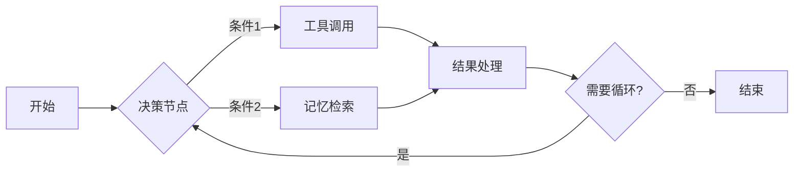
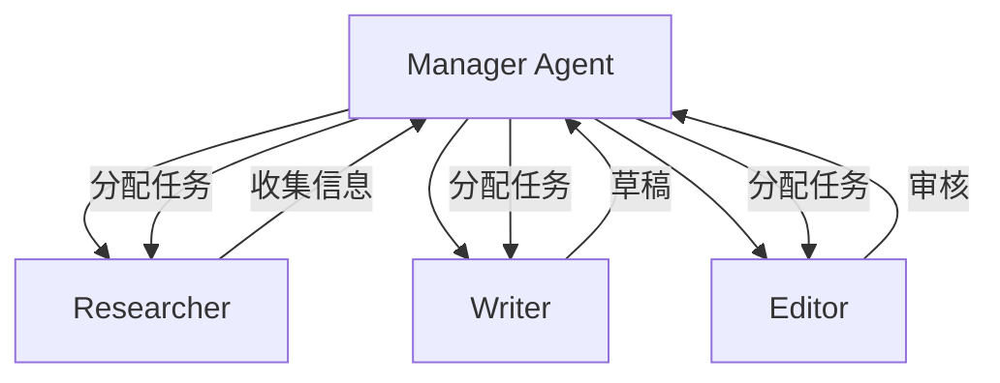
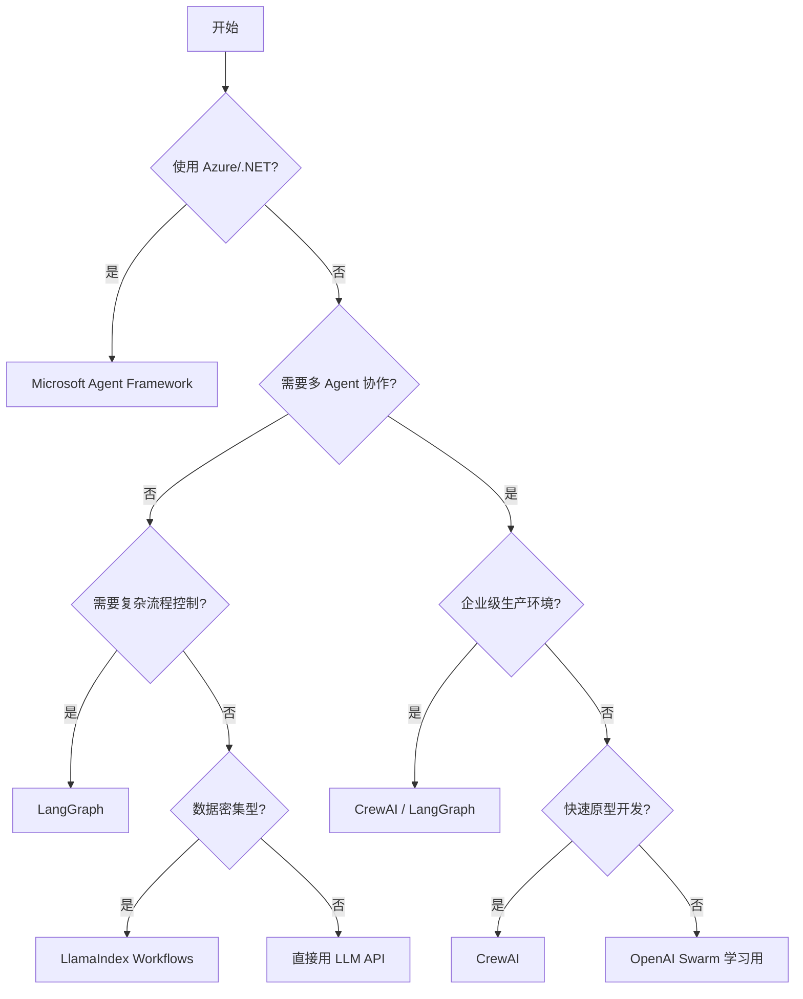

# Agent 框架

> **学习目标**: 了解主流 Agent 框架的特点、适用场景和选择方法
>
> **预计时间**: 60 分钟
>
> **难度等级**: ⭐⭐⭐☆☆
>
> **更新时间**: 2026年3月

---

## 核心概念

### 什么是 Agent 框架?

Agent 框架是构建 AI 应用的开发工具,提供了一些现成的组件和模式,让你不必从零开始。

::: tip 通俗理解
搭建 Agent 就像装修房子。框架是开发商提供的"硬装"——水管、电线、墙体结构都做好了,你只需要决定放什么家具、刷什么颜色的墙。
::

**框架解决的问题**:
- 记忆管理
- 工具调用
- 多轮对话
- 任务规划
- Agent 协作

---

## 主流框架对比(2026 年)

### LangGraph 1.0

**发布时间**: 2025 年 10 月 18 日（1.0.0）

**稳定性承诺**: ✅ 在 2.0 版本之前不会有破坏性更新

**核心特点**:

LangGraph 采用**图结构**来定义 Agent 的执行流程,而不是传统的链式结构。



**关键特性**:

| 特性 | 说明 |
|------|------|
| **持久化状态管理** | 智能体执行中断后可无缝续跑，服务器宕机重启也能精准恢复 |
| **原生人工介入(Human-in-the-loop)** | 新增API，可在工作流中设置审核节点，高风险场景自动暂停等待人工确认 |
| **多智能体协作** | 支持多个智能体之间的分工协作、信息同步、任务分发 |
| **时间旅行调试** | 回到任意历史状态查看和修改 |
| **流式响应** | 实时返回中间结果 |
| **稳定性承诺** | 直到 2.0 版本不会有破坏性更新 |

**适用场景**:
- 需要复杂流程控制的 Agent
- 多步骤、有循环的任务
- 需要调试和监控的生产环境

**代码示例**:

```python
from langgraph.graph import StateGraph, END

# 定义状态
class AgentState(TypedDict):
    messages: list
    next_action: str

# 定义节点
def research_node(state: AgentState):
    # 研究逻辑
    return {"messages": state["messages"] + ["研究结果"]}

def write_node(state: AgentState):
    # 写作逻辑
    return {"messages": state["messages"] + ["草稿"]}

# 构建图
workflow = StateGraph(AgentState)
workflow.add_node("research", research_node)
workflow.add_node("write", write_node)

workflow.add_edge("research", "write")
workflow.add_edge("write", END)

workflow.set_entry_point("research")
app = workflow.compile()
```

**采用情况**: 根据LangChain 2025 年调研,57.3% 的大型企业已在生产环境使用基于 LangGraph 的 Agent[^1]。

---

### Microsoft Agent Framework (MAF)

**发布时间**: 2025 年末（AutoGen 与 Semantic Kernel 正式合并）

**背景**: 微软将 AutoGen 和 Semantic Kernel 合并成统一框架，解决 C#、Python 和 Java 之间的功能对齐问题。

**核心特点**:

**双语言支持**: Python 和 C# 同步更新，统一长期路径

**统一能力组合**:
- AutoGen 的简洁智能体/团队抽象
- Semantic Kernel 的会话状态管理、中间件管道、OpenTelemetry、过滤器和检查点
- 全新的基于图的显式工作流，用于确定性的多智能体编排

**生态绑定**: 与 Azure AI Foundry 深度绑定，同时保持完全开源和模型无关

**插件生态**:

```python
from semantic_kernel import Kernel
from autogen_agentchat import Agent

# 创建内核
kernel = Kernel()

# 加载插件
kernel.add_plugin(
    file_search_plugin,
    plugin_name="file_search"
)

# 创建 Agent
agent = Agent(
    name="researcher",
    kernel=kernel,
    tools=["file_search.search"]
)
```

**适用场景**:
- 深度使用 Azure 生态
- 需要企业级支持
- .NET 环境

**优势**:
- 官方支持和文档完善
- 与 Azure、Office 365 深度集成
- 商业许可,适合企业合规

---

### CrewAI

**定位**: 多 Agent 协作框架（角色驱动）

**核心概念**: 通过"角色-任务-流程"模型，让多个 Agent 以角色扮演的方式协作完成复杂任务。

**架构模式**:



**核心优势**:
- 直观的角色抽象，易于理解和实现
- 自动生成管理者 Agent，支持层级化协作
- 快速上手，社区生态活跃
- 原生支持 Agent-to-Agent 协议
- **无代码/低代码支持**，易用性极强
- 内置成熟的任务委托和结果反馈机制

**典型工作流**:

```python
from crewai import Agent, Task, Crew

# 定义角色
researcher = Agent(
    role="研究专家",
    goal="收集最新的 AI 技术信息",
    backstory="你是一名资深技术研究员"
)

writer = Agent(
    role="技术作家",
    goal="将研究结果转化为易懂的文章",
    backstory="你擅长解释复杂技术概念"
)

# 定义任务
task1 = Task(
    description="调研 2025 年 Agent 框架发展",
    agent=researcher
)

task2 = Task(
    description="撰写技术博客",
    agent=writer,
    context=[task1]  # 依赖 task1 的结果
)

# 组建团队
crew = Crew(
    agents=[researcher, writer],
    tasks=[task1, task2],
    process="sequential"  # 顺序执行
)

result = crew.kickoff()
```

**适用场景**:
- 内容生产流水线
- 复杂业务流程自动化
- 需要专业分工的任务

**实际案例**: 某金融公司用 CrewAI 构建了财报分析团队——研究员 Agent 收集数据、分析师 Agent 处理数据、报告生成器 Agent 产出报告,整个过程从 3 天缩短到 2 小时[^2]。

---

### OpenAI Swarm

**定位**: 轻量级多 Agent 编排框架（实验性）

**当前状态（2026）**: ⚠️ 仍为实验性状态，未见重大进展更新

**特点**:
- 代码量少,核心逻辑只有几百行
- 几乎完全在客户端运行
- 基于 ChatCompletions API,无需额外依赖
- 主打工效（ergonomic）与轻量（lightweight）

**示例**:

```python
from swarm import Agent, Swarm

client = Swarm()

# 定义 Agent
sales_agent = Agent(
    name="销售助手",
    instructions="你负责产品咨询和报价"
)

support_agent = Agent(
    name="技术支持",
    instructions="你负责故障排查和技术指导"
)

# 定义交接函数
def transfer_to_support():
    return support_agent

sales_agent.functions = [transfer_to_support]

# 运行
response = client.run(
    agent=sales_agent,
    messages=["我的产品无法连接"]
)
```

**适用场景**:
- 学习多 Agent 概念
- 快速原型验证
- 简单的 Agent 协作

**限制**:
- ⚠️ 官方标注为"实验性"，2026年未见重大进展
- 功能相对基础，缺乏持久化和监控
- 缺乏长期维护承诺，不建议生产使用
- 存在 Java 等复刻项目，但官方更新较少

---

## 框架选择指南

### 决策树



### 对比总结（2026）

| 框架 | 学习曲线 | 生产就绪 | 社区活跃度 | 最佳场景 |
|------|---------|---------|-----------|----------|
| **LangGraph 1.0** | 中等 | ⭐⭐⭐⭐⭐ | 🔥🔥🔥 很高 | 复杂流程控制、长周期任务 |
| **Microsoft Agent Framework** | 低(有 .NET 经验) | ⭐⭐⭐⭐⭐ | 🔥🔥🔥 官方支持 | Azure 生态、企业级应用 |
| **CrewAI** | 低 | ⭐⭐⭐⭐ | 🔥🔥🔥 高 | 多 Agent 协作、无代码/低代码 |
| **LlamaIndex Workflows** | 中等 | ⭐⭐⭐⭐ | 🔥🔥 增长中 | RAG+Agent 融合场景 |
| **Swarm** | 很低 | ⭐⭐ | 🔥 中等 | 学习原型、实验研究 |
| **ZeroClaw** | 高（Rust） | ⭐⭐⭐ | 🔥 小众 | 边缘部署、资源敏感环境 |

---

## 新兴框架

### LlamaIndex Workflows 1.0

**发布时间**: 2025 年底

**定位**: 轻量级事件驱动框架，用于构建复杂的 Agent 系统和任务编排

**核心特性**:
- **异步优先架构**: 基于 Python asyncio，支持并发调用多个 LLM 和工具，显著提升性能
- **事件驱动模型**: 通过事件触发各个步骤，支持暂停、恢复和有状态的执行
- **人机协作**: 内置人类反馈循环（human-in-the-loop），可以在关键节点等待人工审核
- **可观测性**: 集成 OpenTelemetry 和 Jaeger 追踪，提供完整的执行可视化
- **灵活路由**: 支持条件分支、并行处理和复杂的任务依赖关系

**适用场景**: 内容生成、客户支持自动化、研究助手等

### Phidata

**特色**: Agentic RAG（搜索增强生成）

```python
from phi.agent import Agent
from phi.knowledge.pdf import PDFKnowledgeBase

agent = Agent(
    knowledge=PDFKnowledgeBase(
        path="./docs"
    )
)
```

Agent 可以主动搜索知识库获取完成任务所需的信息,而不是被动接收上下文。

### Smolagents

Hugging Face 发布的极简框架，主打轻量级和安全性。

### ZeroClaw（2026 年新增）

**定位**: Rust 极致性能派

**特点**:
- 单静态二进制文件，<5MB 内存占用
- 毫秒级启动
- 支持 22+ LLM 提供商
- 设计哲学："零开销、零妥协"
- 适合部署在边缘服务器、VPS 或任何对资源敏感的环境

### OpenClaw（2026 年新增）

**定位**: OpenClaw 的高效替代方案

**2026 年新特性**:
- 多 Agent 玩法升级：从"单一角色使用"升级为"团队化协同"
- 多团队并行运作
- 支持工作空间隔离与双向通信

---

## 实践建议

### 从简单开始

不要一上来就用复杂框架。很多任务用基础 LLM API + 几个工具调用就能完成。

**推荐路径**:

```
1. 直接调用 API (1-2 个简单工具)
   ↓
2. LangChain 基础功能 (需要工具链时)
   ↓
3. LangGraph/CrewAI (多 Agent 或复杂流程)
   ↓
4. 自研框架 (大型团队,有特殊需求)
```

### 关注生态系统

选择框架不只是看代码,还要看:

- **文档质量**: LangGraph 文档很全,Swarm 几乎没有
- **社区支持**: 出问题能找到答案吗?
- **更新频率**: 项目还在活跃维护吗?
- **周边工具**: 有调试工具、监控平台吗?
- **2026 年趋势**:
  - 🔥 多 Agent 协同成为最值得关注的方向
  - 🔥 任务时限从分钟级扩展到天或周
  - 🔥 Human-in-the-loop 成为标配
  - 🔥 统一框架（大厂整合能力）
  - 🔥 从实验阶段迈向大规模生产应用

### 生产环境考虑

| 考虑因素 | 问题 |
|---------|------|
| **稳定性** | 框架会频繁更新导致代码失效吗? |
| **性能** | 框架本身的开销有多大? |
| **调试** | 出问题后能快速定位吗? |
| **成本** | Token 消耗、API 调用次数 |
| **安全** | 敏感数据处理、权限控制 |

---

## 思考题

::: info 检验你的理解
1. **LangGraph 和传统 LangChain Agent 的主要区别是什么?**
   - A. LangGraph 使用图结构,LangChain 使用链式结构
   - B. LangGraph 只支持 Python,LangChain 支持多语言
   - C. LangGraph 是付费的,LangChain 免费使用

2. **假设你要构建一个客户服务 Agent,需要查询订单、处理退款、升级工单,你会选择哪个框架?为什么?**

3. **CrewAI 的 Manager-Worker 模式适合什么场景?举例说明。**

4. **为什么说 Swarm"不适合生产环境"?实际使用中会遇到什么问题?**
:::

---

## 本节小结

通过本节学习,你应该掌握了:

✅ **主流框架（2026）**
- LangGraph 1.0：图结构、持久化状态、原生人工介入、稳定性承诺
- Microsoft Agent Framework：AutoGen + Semantic Kernel 统一框架、双语言支持
- CrewAI：多 Agent 协作、无代码/低代码支持、角色驱动
- OpenAI Swarm：轻量级定位、仍为实验性状态
- LlamaIndex Workflows 1.0：事件驱动架构、异步优先
- 新兴框架：ZeroClaw（Rust 极致性能）、OpenClaw（团队化协同）

✅ **生产环境就绪度评估**
- ⭐⭐⭐⭐⭐：Microsoft Agent Framework、LangGraph 1.0
- ⭐⭐⭐⭐：CrewAI、LlamaIndex Workflows
- ⭐⭐：OpenAI Swarm（实验性质）

✅ **社区活跃度排名**
- 🔥🔥🔥：LangChain/LangGraph、Microsoft Agent Framework、CrewAI
- 🔥🔥：LlamaIndex、OpenAI Swarm
- 🔥：ZeroClaw（小众但增长中）

✅ **选择方法**
- 根据场景选择框架（企业级/快速原型/实验研究）
- 评估生产环境需求（稳定性、性能、调试、成本、安全）
- 考虑生态系统完整性

✅ **实践路径**
- 从简单到复杂的渐进式学习
- 关注稳定性和可维护性
- 关注 2026 年核心趋势（多 Agent 协同、长周期任务、人机协作）

---

**下一步**: 在[下一节](/basics/07-agent-ecosystem/02-agent-platforms)中,我们将了解 Agent 平台,看看如何在不写代码的情况下快速构建 Agent。

---

[← 返回模块目录](/basics/07-agent-ecosystem) | [继续学习:Agent 平台 →](/basics/07-agent-ecosystem/02-agent-platforms)

---

[^1]: LangChain, "State of Agent Engineering Survey 2025", https://www.langchain.com/state-of-agents
[^2]: CrewAI 官方案例研究, "Financial Report Automation", https://www.crewai.com/case-studies
