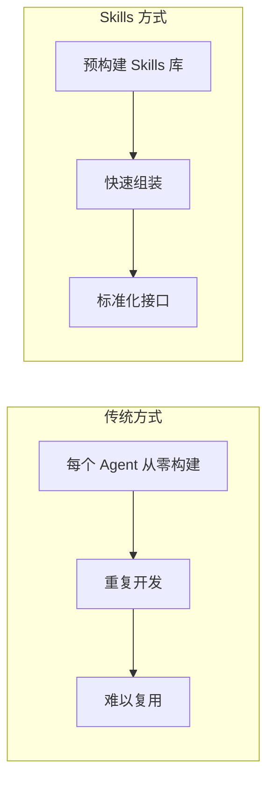
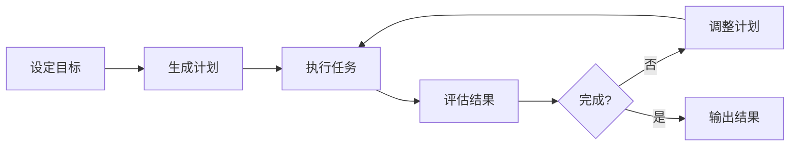

# Agent 平台

> **学习目标**: 了解主流 Agent 平台的能力、使用场景和接入方式
>
> **预计时间**: 50 分钟
>
> **难度等级**: ⭐⭐☆☆☆

---

## 核心概念

### 框架 vs 平台

| | 框架 | 平台 |
|---|------|------|
| **控制权** | 完全掌控代码 | 受限于平台能力 |
| **开发门槛** | 需要编程能力 | 低代码/无代码 |
| **部署成本** | 自己运维 | 平台托管 |
| **灵活性** | 高 | 中等 |
| **上线速度** | 慢 | 快 |

**框架**适合: 定制化需求高、技术团队充足

**平台**适合: 快速验证 MVP、非技术团队、标准化场景

---

## Claude Agent 平台

### Claude Agent SDK

**发布时间**: 2025 年 9 月

**定位**: 在 Claude 之上构建 Agent 的工具集

**核心能力**:

#### 1. 约束工具访问

Claude Agent 允许你精确控制 Agent 可以使用哪些工具,而不是给它"无限权限"。

```python
from anthropic import Anthropic

client = Anthropic()

# 定义可用工具
tools = [
    {
        "name": "read_file",
        "description": "读取文件内容",
        "input_schema": {
            "type": "object",
            "properties": {
                "path": {"type": "string"}
            },
            "required": ["path"]
        }
    }
]

# 调用时约束工具
response = client.messages.create(
    model="claude-3-5-sonnet-20250119",
    max_tokens=1024,
    tools=tools,
    messages=[{
        "role": "user",
        "content": "读取 config.yaml 文件"
    }],
    # 关键:只允许使用指定工具
    tool_choice={"type": "any", "disable_parallel_tool_use": True}
)
```

**安全价值**: 减少意外调用危险 API 的风险。

#### 2. 运营护栏

平台提供了多层防护:

- **输出过滤**: 自动检测和拦截不当内容
- **速率限制**: 防止 Token 消耗失控
- **审计日志**: 记录所有 Agent 行为

#### 3. IDE 深度集成

**JetBrains 集成**(2025 年 9 月):

- 在 IntelliJ IDEA、PyCharm 中直接运行 Claude Agent
- Agent 可以读写项目文件、运行终端命令
- 实时查看 Agent 的思考过程

**使用场景**: 代码重构、自动化测试生成、文档更新

---

### Claude Agent Skills

**发布时间**: 2025 年 10 月(开放标准发布:2025 年 12 月 18 日)

**概念**: Skills 是可复用的 Agent 能力模块,类似"插件"。

**传统方式 vs Skills**:



**Skill 示例**:

```yaml
# skill: 文件搜索
name: file_search
description: "在代码库中搜索文件"

tools:
  - grep
  - find

instructions: |
  你是一个文件搜索专家。
  使用 grep 搜索文件内容,find 搜索文件名。
  返回匹配的文件路径和相关行。
```

**使用 Skill**:

```python
from anthropic import AnthropicBedrock

agent = AnthropicBedrock().agent(
    name="代码审计员",
    skills=["file_search", "code_analysis", "security_scan"]
)

agent.run("检查项目中的安全漏洞")
```

**官方 Skills 库**:
- 代码操作:读写、搜索、重构
- 数据处理:CSV、JSON、数据库查询
- Web 操作:抓取、API 调用
- 文档处理:PDF、Markdown、Word

**开放标准**: 2025 年 12 月,Anthropic 将 Skills 作为开放标准发布,允许社区贡献和维护[^1]。

**适用计划**: Max、Pro、Team 和 Enterprise

---

## OpenAI Agents 平台

### Assistants API

**定位**: OpenAI 的托管 Agent 服务

**核心特性**:

#### 1. 持久化状态

Assistant 会"记住"对话历史,不需要每次都重新发送上下文。

```python
from openai import OpenAI

client = OpenAI()

# 创建 Assistant(只需一次)
assistant = client.beta.assistants.create(
    name="客服助手",
    instructions="你是客服代表,负责回答产品问题",
    model="gpt-4o",
    tools=[{"type": "code_interpreter"}]
)

# 创建线程
thread = client.beta.threads.create()

# 多轮对话
message = client.beta_threads.messages.create(
    thread_id=thread.id,
    role="user",
    content="如何重置密码?"
)

run = client.beta.threads.runs.create(
    thread_id=thread.id,
    assistant_id=assistant.id
)
# Assistant 自动管理上下文
```

**优势**:
- 减少 Token 消耗(不用重复发送历史)
- 简化代码逻辑

**限制**:
- 数据存储在 OpenAI 服务器
- 最多保留 30 天(免费版)

#### 2. Code Interpreter

内置的 Python 执行环境,Agent 可以运行代码。

```python
assistant = client.beta.assistants.create(
    tools=[{"type": "code_interpreter"}],
    model="gpt-4o"
)

# 上传文件
file = client.files.create(
    file=open("sales_data.csv", "rb"),
    purpose="assistants"
)

# Agent 会自动编写代码分析数据
message = client.beta_threads.messages.create(
    thread_id=thread.id,
    role="user",
    content="分析销售趋势,生成图表",
    attachments=[{
        "file_id": file.id,
        "tools": [{"type": "code_interpreter"}]
    }]
)
```

**适用场景**:
- 数据分析和可视化
- 数学计算
- 文件格式转换

#### 3. 文件搜索

上传文档后,Assistant 会自动建立索引,支持语义搜索。

```python
assistant = client.beta.assistants.create(
    tools=[{"type": "file_search"}],
    model="gpt-4o",
    tool_resources={
        "file_search": {
            "vector_stores": [{
                "file_ids": ["file-abc", "file-def"]
            }]
        }
    }
)
```

**技术原理**: 后台使用向量数据库,无需自己搭建。

---

### Agents SDK(2025)

**更新**: OpenAI 在 2025 年推出了更易用的 Agents SDK,简化了 Assistant API 的调用。

**改进**:
- 更直观的 Python/JavaScript API
- 内置流式响应
- 更好的错误处理

```python
from openai import OpenAI
from openai.agents import Agent

client = OpenAI()

agent = Agent(
    client=client,
    name="研究助手",
    instructions="搜索最新的论文并总结",
    model="gpt-4o"
)

# 流式响应
for chunk in agent.stream("搜索 2025 年 Agent 框架进展"):
    print(chunk, end="")
```

---

## AutoGPT / BabyAGI

### AutoGPT

**GitHub Stars**: 172,000+(截至 2025 年 1 月)

**特点**: 自主 Agent 的先驱项目

**工作原理**:



**示例**:

```bash
# 命令行运行
autogpt --task "创建一个天气网站" --mode "continuous"
```

AutoGPT 会自己:
- 搜索天气 API 文档
- 选择技术栈
- 编写代码
- 测试部署
- 根据错误调整

**优势**:
- 高度自主
- 适合探索性任务

**问题**:
- Token 消耗大(多次自我对话)
- 容易陷入循环
- 难以控制

---

### BabyAGI

**GitHub Stars**: 21,000+

**定位**: 更轻量的自主 Agent

**特点**:
- 代码简洁(核心逻辑约 200 行)
- 任务驱动(基于待办列表)
- 适合学习

**工作流程**:

```python
# BabyAGI 核心循环
while tasks:
    # 1. 取第一个任务
    task = tasks.pop(0)

    # 2. 执行任务(用 LLM)
    result = execute_task(task)

    # 3. 生成新任务(如果需要)
    new_tasks = generate_new_tasks(result)
    tasks.extend(new_tasks)

    # 4. 存储结果
    save_result(task, result)
```

**使用场景**:
- 学习 Agent 原理
- 快速原型
- 简单的自动化任务

---

## 平台对比

### 功能对比

| 特性 | Claude Agent | OpenAI Assistants | AutoGPT | BabyAGI |
|------|-------------|-------------------|---------|---------|
| **托管** | ✅ | ✅ | ❌(本地运行) | ❌(本地运行) |
| **持久化记忆** | ✅ | ✅ | ❌ | ❌ |
| **工具调用** | ✅(Skills) | ✅ | ✅ | ✅ |
| **代码执行** | ✅(MCP) | ✅(Code Interpreter) | ✅ | ✅ |
| **流式响应** | ✅ | ✅ | ❌ | ❌ |
| **控制粒度** | 高 | 中 | 低 | 低 |
| **学习曲线** | 中 | 低 | 高 | 中 |

### 成本对比(估算)

假设处理 100 个用户咨询:

| 平台 | Token 消耗 | API 调用费用 | 存储/其他 | 月成本估算 |
|------|-----------|-------------|----------|-----------|
| **Claude Agent** | ~200K | $0.60 | $0 | $0.60 |
| **OpenAI Assistants** | ~250K | $1.25 | $0.20(存储) | $1.45 |
| **AutoGPT(自建)** | ~800K | $4.00 | $5.00(服务器) | $9.00 |
| **BabyAGI(自建)** | ~500K | $2.50 | $5.00(服务器) | $7.50 |

> 注:成本基于 2025 年 1 月定价,实际消耗取决于任务复杂度。

---

## 实际案例

### 案例 1: 客户服务自动化

**需求**: 某电商公司要 24/7 回答客户问题。

**方案对比**:

| 方案 | 开发时间 | 月成本 | 效果 |
|------|---------|--------|------|
| **自建(用 LangChain)** | 4 周 | $300 | 高度定制,但维护成本高 |
| **OpenAI Assistants** | 3 天 | $500 | 快速上线,功能够用 |
| **Claude Agent** | 1 周 | $200 | 平衡方案,可控性强 |

**最终选择**: Claude Agent + Skills

**原因**:
- 需要精确控制工具访问(不能让 Agent 随意退款)
- Claude 的代码能力更强,能处理订单查询
- Skills 可以复用(订单查询、物流跟踪等)

---

### 案例 2: 代码审查 Agent

**需求**: 自动审查 PR,给出改进建议。

**技术选型**: Claude Agent SDK + JetBrains 集成

**实现**:

```python
agent = Agent(
    name="代码审查员",
    skills=[
        "read_code",
        "run_tests",
        "check_style",
        "security_scan"
    ],
    instructions="""
    审查代码时关注:
    1. 潜在 bug
    2. 安全问题
    3. 性能优化
    4. 代码风格

    给出具体的改进建议,而不是泛泛而谈。
    """
)

# 在 IDE 中运行
agent.review_pr(pr_id=123)
```

**效果**:
- 审查时间从 30 分钟降到 5 分钟
- 捕获了 60% 的人为疏忽
- 开发者满意度高(建议具体可操作)

---

### 案例 3: 数据分析 Agent

**需求**: 市场团队要定期分析销售数据。

**技术选型**: OpenAI Assistants + Code Interpreter

**优势**:
- 不用自己搭建 Python 环境
- 数据安全(文件加密存储)
- 自动生成可视化

**工作流程**:

```
用户上传 CSV
  ↓
Assistant 分析数据
  ↓
生成 Python 代码
  ↓
执行代码,生成图表
  ↓
返回分析报告
```

**结果**: 分析师从"写代码"变成"提问",效率提升 5 倍。

---

## 平台选择指南

### 快速决策树

```
需要快速上线?
  ├─ 是 → 团队有编程经验?
  │        ├─ 是 → Claude Agent(控制力强)
  │        └─ 否 → OpenAI Assistants(最简单)
  │
  └─ 否 → 需要高度定制?
           ├─ 是 → 用框架(见上一节)
           └─ 否 → 看成本
                    ├─ 预算充足 → Claude
                    └─ 预算有限 → OpenAI
```

### 具体建议

| 场景 | 推荐平台 | 理由 |
|------|---------|------|
| **客服机器人** | Claude Agent | 安全控制好,代码能力强 |
| **数据分析** | OpenAI Assistants | Code Interpreter 方便 |
| **学习 Agent** | BabyAGI | 代码简洁,易理解 |
| **内部工具** | Claude Agent | 企业级安全,审计日志 |
| **MVP 验证** | OpenAI Assistants | 3 天上线 |

---

## 思考题

::: info 检验你的理解
1. **Claude Agent Skills 和 OpenAI Assistants 的"工具"有什么本质区别?**

2. **为什么说 AutoGPT "不适合生产环境"?实际使用中会遇到什么问题?**

3. **假设你要为学校构建一个"作业答疑 Agent",会选择哪个平台?说明理由。**
   - 提示:考虑成本、隐私、安全性

4. **Code Interpreter 的局限是什么?什么情况下需要自己搭建执行环境?**
:::

---

## 本节小结

通过本节学习,你应该掌握了:

✅ **平台能力**
- Claude Agent SDK 和 Skills 系统
- OpenAI Assistants API 的核心功能
- AutoGPT/BabyAGI 的原理和定位

✅ **选择方法**
- 框架 vs 平台的权衡
- 不同场景的最佳实践
- 成本和效果对比

✅ **实际应用**
- 客服、代码审查、数据分析等案例
- 平台选型的决策依据

---

**下一步**: 在[下一节](/basics/07-agent-ecosystem/03-mcp-protocol)中,我们将学习 MCP 协议——连接 Agent 和工具的通用标准。

---

[← 返回模块目录](/basics/07-agent-ecosystem) | [继续学习:MCP 协议 →](/basics/07-agent-ecosystem/03-mcp-protocol)

---

[^1]: Anthropic Engineering Blog, "Introducing Claude Agent Skills as an Open Standard", December 2025. https://www.anthropic.com/engineering/skills-open-standard
