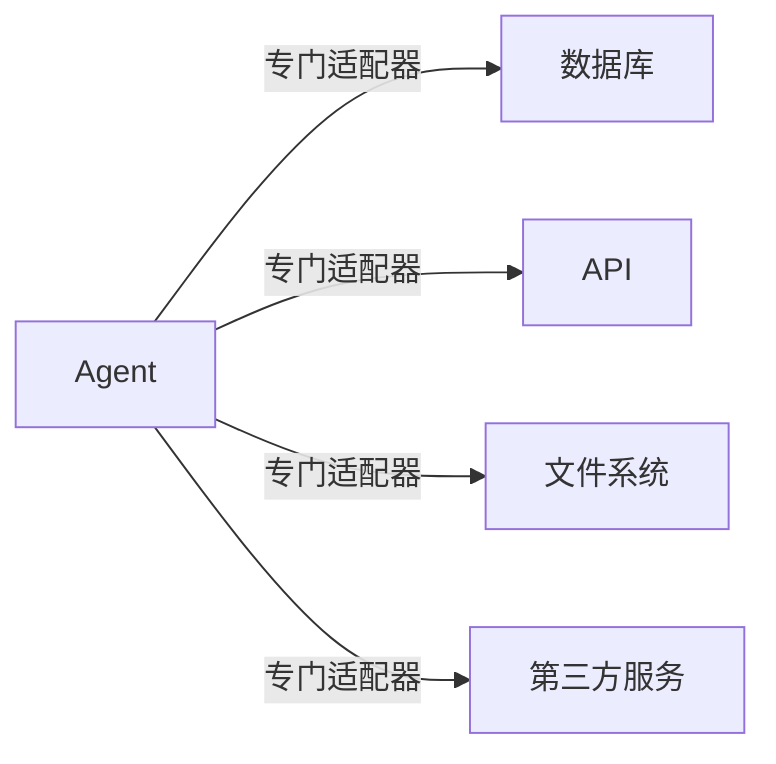
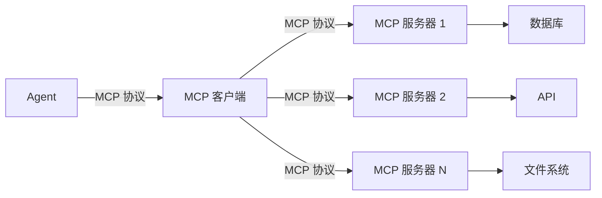
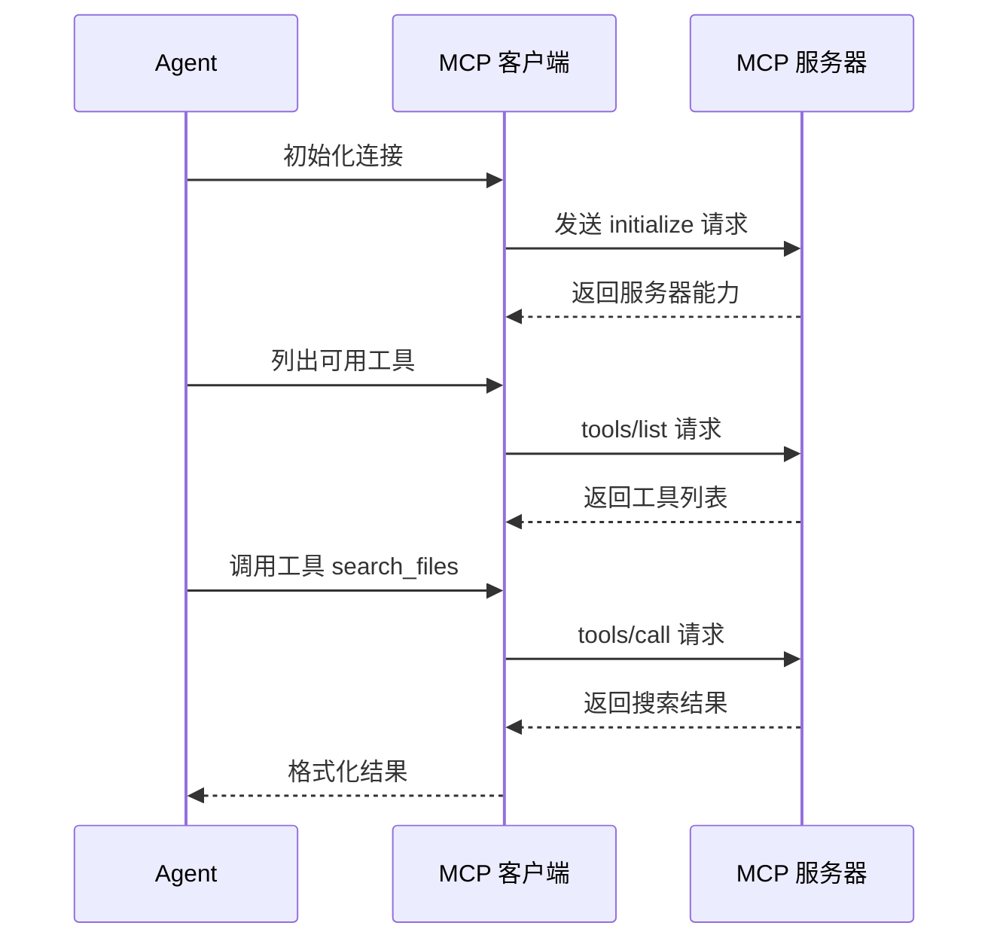

# MCP 协议

> **学习目标**: 理解 MCP 协议的设计理念、技术架构和应用场景
>
> **预计时间**: 45 分钟
>
> **难度等级**: ⭐⭐⭐☆☆

---

## 核心概念

### 什么是 MCP?

**MCP**(Model Context Protocol)是 Anthropic 在 2024 年推出的开放协议,用于连接 AI 应用和外部数据源。

::: tip 通俗理解
MCP 是 Agent 的"USB 接口"。就像 USB 让各种设备能连接电脑,MCP 让 Agent 能连接各种工具和数据源,而不需要为每个工具写专门的代码。
::

**解决的核心问题**:

**之前**:



每个工具都要写专门适配器,开发量大、维护困难。

**使用 MCP 后**:



统一协议,一套代码适配所有工具。

---

## MCP 发展历程

### 关键时间点

| 时间 | 事件 | 意义 |
|------|------|------|
| 2024 年 4 月 | Anthropic 发布 MCP 白皮书 | 提出统一协议概念 |
| 2024 年 6 月 | MCP 规范 0.5 发布 | 支持基本的工具调用 |
| 2024 年 10 月 | Claude Desktop 支持 MCP | 桌面应用集成 |
| 2024 年 11 月 | GitHub 上超过 5,000 个 MCP 服务器 | 社区快速增长 |
| 2025 年 6 月 | 授权处理规范更新 | 企业级安全能力 |
| 2025 年 11 月 | 规范候选版发布 | API 稳定,承诺向后兼容 |

### 采用情况

**2025 年 11 月数据**:
- **超过 13,000 个 MCP 服务器**在 GitHub 上发布[^1]
- **237 个组织**公开支持 MCP 协议
- **60% 的 Claude 企业用户**在使用 MCP 集成[^2]

**主流采用者**:
- 云服务商: AWS、Google Cloud、Azure
- 开发工具: GitLab、Jira、Notion
- 数据平台: Snowflake、Databricks、MongoDB

---

## MCP 架构

### 基本组件

```
┌─────────────────────────────────────────────────────┐
│                    Agent 应用                        │
│  (Claude Desktop、Claude Code、自定义应用)            │
└──────────────────┬──────────────────────────────────┘
                   │
                   │ MCP 客户端
                   │
┌──────────────────┴──────────────────────────────────┐
│              MCP 传输层(JSON-RPC 2.0)               │
│         支持 stdio、SSE、WebSocket 等传输            │
└──────────────────┬──────────────────────────────────┘
                   │
                   │
      ┌────────────┼────────────┐
      │            │            │
┌─────▼─────┐ ┌───▼────┐ ┌─────▼─────┐
│ MCP 服务器 1│ │MCP 服务器 2│ │MCP 服务器 N│
│(文件系统)   │ │(数据库)    │ │(API 集成) │
└───────────┘ └─────────┘ └───────────┘
```

### MCP 服务器

**定义**: MCP 服务器是实现了 MCP 协议的程序,对外提供工具、资源和提示。

**核心能力**:

#### 1. 工具(Tools)

Agent 可以调用的函数。

```json
{
  "name": "search_files",
  "description": "在代码库中搜索文件",
  "inputSchema": {
    "type": "object",
    "properties": {
      "query": {
        "type": "string",
        "description": "搜索关键词"
      },
      "file_type": {
        "type": "string",
        "enum": ["py", "js", "ts", "md"],
        "description": "文件类型"
      }
    },
    "required": ["query"]
  }
}
```

#### 2. 资源(Resources)

Agent 可以读取的数据源(文件、数据库记录、API 返回)。

```json
{
  "uri": "file:///project/config.yaml",
  "name": "项目配置",
  "description": "当前项目的配置文件",
  "mimeType": "text/yaml"
}
```

#### 3. 提示(Prompts)

预定义的提示模板,Agent 可以直接使用。

```json
{
  "name": "code_review",
  "description": "代码审查提示",
  "arguments": [
    {
      "name": "pr_number",
      "description": "PR 编号",
      "required": true
    }
  ]
}
```

---

## MCP 工作流程

### 典型交互流程



### 代码示例

**服务器端(Python)**:

```python
from mcp.server import Server
from mcp.types import Tool, TextContent

app = Server("file-system-server")

@app.list_tools()
async def list_tools() -> list[Tool]:
    return [
        Tool(
            name="read_file",
            description="读取文件内容",
            inputSchema={
                "type": "object",
                "properties": {
                    "path": {"type": "string"}
                },
                "required": ["path"]
            }
        ),
        Tool(
            name="search_files",
            description="搜索文件",
            inputSchema={
                "type": "object",
                "properties": {
                    "pattern": {"type": "string"}
                },
                "required": ["pattern"]
            }
        )
    ]

@app.call_tool()
async def call_tool(name: str, arguments: dict) -> list[TextContent]:
    if name == "read_file":
        with open(arguments["path"]) as f:
            content = f.read()
        return [TextContent(type="text", text=content)]

    elif name == "search_files":
        # 实现搜索逻辑
        results = search(arguments["pattern"])
        return [TextContent(type="text", text=str(results))]

# 启动服务器
if __name__ == "__main__":
    app.run(transport="stdio")
```

**客户端配置**:

```json
{
  "mcpServers": {
    "filesystem": {
      "command": "python",
      "args": ["/path/to/server.py"],
      "env": {
        "PROJECT_ROOT": "/Users/user/project"
      }
    }
  }
}
```

---

## MCP 的优势

### 1. 标准化接口

**之前**: 每个工具都要学习不同的 API

```python
# 读取文件
with open("file.txt") as f:
    content = f.read()

# 调用 GitHub API
response = requests.get(
    "https://api.github.com/repos/user/repo/contents/file.txt"
)
content = base64.b64decode(response.json()["content"])

# 查询数据库
cursor.execute("SELECT content FROM files WHERE path = ?", ("file.txt",))
content = cursor.fetchone()[0]
```

**使用 MCP**: 统一的调用方式

```python
# 都是 MCP 工具调用
result1 = await mcp_client.call_tool("fs.read", {"path": "file.txt"})
result2 = await mcp_client.call_tool("github.read", {"repo": "user/repo", "path": "file.txt"})
result3 = await mcp_client.call_tool("db.query", {"sql": "SELECT content FROM files..."})
```

### 2. 安全控制

**权限隔离**: MCP 服务器运行在独立进程,Agent 只能调用暴露的工具,不能直接访问系统。

**授权管理**(2025 年 6 月更新):

```python
@app.call_tool()
async def call_tool(name: str, arguments: dict) -> list[TextContent]:
    # 检查权限
    if not check_permission(name, arguments):
        raise PermissionError(f"无权限调用 {name}")

    # 执行工具
    return await execute_tool(name, arguments)
```

**细粒度控制**:

```json
{
  "permissions": {
    "fs.read": ["allowed_paths": ["./project"]],
    "fs.write": ["allowed_paths": ["./project/temp"]],
    "github.read": ["allowed_repos": ["user/repo1", "user/repo2"]],
    "db.query": ["allowed_tables": ["public.users"]]
  }
}
```

### 3. 性能优化

**代码执行**: MCP 支持在服务器端执行代码,减少 Token 消耗。

**传统方式**:

```
Agent 需要处理 100 个文件
  ↓
每次读取文件都要把内容传给 LLM
  ↓
Token 消耗:100 次 × 500 tokens = 50,000 tokens
成本:约 $0.15
```

**MCP 方式**:

```
Agent 需要处理 100 个文件
  ↓
在 MCP 服务器端执行处理脚本
  ↓
只返回最终结果
Token 消耗:1 次 × 200 tokens = 200 tokens
成本:约 $0.0006
```

**性能提升**: 成本降低 **99.6%**[^3]

### 4. 跨平台兼容

同一个 MCP 服务器可以在不同客户端使用:

- **Claude Desktop**: 桌面应用直接调用
- **Claude Code**: IDE 集成
- **自定义应用**: 通过 SDK 接入
- **其他 AI 应用**: 只要支持 MCP 协议

---

## Top 10 MCP 应用场景

### 1. RAG 和 Agent 内存

**MCP 服务器**: 向量数据库集成

```python
@app.tool()
def search_memory(query: str) -> str:
    """在向量数据库中搜索相关记忆"""
    results = vector_db.search(query, top_k=5)
    return format_results(results)
```

**使用**: Agent 可以跨会话访问长期记忆。

---

### 2. 实时数据访问

**MCP 服务器**: 实时数据源(股票、天气、新闻)

```python
@app.tool()
def get_stock_price(symbol: str) -> float:
    """获取实时股价"""
    return stock_api.get_realtime_price(symbol)
```

**优势**: 数据不限于训练截止时间。

---

### 3. 企业数据集成

**场景**: 访问企业内部系统(CRM、ERP、知识库)

**MCP 服务器**: 封装内部 API,提供统一接口

```python
@app.tool()
def query_customer(customer_id: str) -> dict:
    """查询客户信息"""
    return crm_api.get_customer(customer_id)

@app.tool()
def get_order_history(customer_id: str) -> list:
    """获取订单历史"""
    return erp_api.get_orders(customer_id)
```

**安全**: 不需要开放内部系统给外部,只暴露必要的 MCP 工具。

---

### 4. 代码库集成

**MCP 服务器**: 代码搜索、AST 分析、Git 历史

```python
@app.tool()
def search_code(query: str, language: str = None) -> list:
    """在代码库中搜索"""
    return code_index.search(query, language)

@app.tool()
def get_git_blame(file_path: str, line: int) -> str:
    """获取代码行修改历史"""
    return git.blame(file_path, line)
```

**应用**: Claude Code 的核心能力来源。

---

### 5. API 编排

**场景**: 调用多个第三方 API

**MCP 服务器**: 封装复杂的工作流

```python
@app.tool()
def book_flight(origin: str, destination: str, date: str) -> dict:
    """预订机票"""
    # 1. 搜索航班
    flights = flight_api.search(origin, destination, date)

    # 2. 比价
    best = compare_prices(flights)

    # 3. 预订
    booking = flight_api.book(best["id"])

    # 4. 发送确认邮件
    email_api.send_confirmation(booking)

    return booking
```

**价值**: Agent 只需调用一个工具,复杂逻辑在服务器端处理。

---

### 6. 文档处理

**MCP 服务器**: PDF、Word、Excel 解析

```python
@app.tool()
def extract_pdf_text(file_path: str) -> str:
    """提取 PDF 文本"""
    return pdf_parser.parse(file_path)

@app.tool()
def parse_excel(file_path: str, sheet: str) -> list[dict]:
    """解析 Excel 表格"""
    return excel_parser.parse(file_path, sheet)
```

---

### 7. 数据库查询

**MCP 服务器**: SQL 查询接口

```python
@app.tool()
def execute_sql(sql: str) -> list[dict]:
    """执行 SQL 查询(只读)"""
    if not is_read_only(sql):
        raise PermissionError("只允许读操作")

    return db.execute(sql)
```

**安全**: 可以限制只允许 SELECT 查询,防止数据修改。

---

### 8. Web 抓取

**MCP 服务器**: 网页内容提取

```python
@app.tool()
def scrape_webpage(url: str) -> dict:
    """抓取网页内容"""
    html = http.get(url)
    return {
        "title": extract_title(html),
        "content": extract_main_content(html),
        "links": extract_links(html)
    }
```

---

### 9. 任务自动化

**MCP 服务器**: 定时任务、工作流触发

```python
@app.tool()
def schedule_report(report_type: str, schedule: str):
    """定时生成报告"""
    task_scheduler.create(
        name=f"generate_{report_type}",
        schedule=schedule,
        handler=lambda: generate_report(report_type)
    )
```

---

### 10. 测试和验证

**MCP 服务器**: 运行测试、代码检查

```python
@app.tool()
def run_tests(test_path: str = None) -> dict:
    """运行测试套件"""
    return pytest_runner.run(test_path)

@app.tool()
def lint_code(file_path: str) -> list:
    """代码检查"""
    return linter.check(file_path)
```

---

## 构建自己的 MCP 服务器

### 步骤 1: 安装 SDK

```bash
npm install @modelcontextprotocol/sdk
# 或
pip install mcp
```

### 步骤 2: 定义服务器

```python
from mcp.server import Server
from mcp.types import Tool, TextContent

app = Server("my-custom-server")

@app.list_tools()
async def list_tools() -> list[Tool]:
    return [
        Tool(
            name="my_tool",
            description="我的自定义工具",
            inputSchema={
                "type": "object",
                "properties": {
                    "input": {"type": "string"}
                },
                "required": ["input"]
            }
        )
    ]

@app.call_tool()
async def call_tool(name: str, arguments: dict) -> list[TextContent]:
    if name == "my_tool":
        result = process(arguments["input"])
        return [TextContent(type="text", text=result)]
```

### 步骤 3: 注册到客户端

**Claude Desktop 配置** (`~/Library/Application Support/Claude/claude_desktop_config.json`):

```json
{
  "mcpServers": {
    "my-server": {
      "command": "python",
      "args": ["/path/to/my_server.py"]
    }
  }
}
```

### 步骤 4: 使用

在 Claude 中直接调用:

```
请用 my_tool 处理这段文本
```

---

## 思考题

::: info 检验你的理解
1. **MCP 协议解决了什么核心问题?为什么需要统一协议?**

2. **MCP 服务器和普通的 API 封装有什么区别?优势在哪里?**

3. **假设你要为公司内部系统构建 MCP 服务器,需要考虑哪些安全问题?**
   - 提示:权限控制、数据隔离、审计日志

4. **为什么说 MCP 可以"降低 Token 消耗"?分析技术原理。**
:::

---

## 本节小结

通过本节学习,你应该掌握了:

✅ **MCP 协议**
- 统一 Agent 和工具的接口
- 标准化的工具、资源、提示
- 2025 年的广泛应用

✅ **技术架构**
- 客户端-服务器模型
- JSON-RPC 2.0 传输
- 三大核心能力(工具、资源、提示)

✅ **实际应用**
- Top 10 应用场景
- 构建自定义 MCP 服务器
- 安全和性能优化

---

**下一步**: 在[下一节](/basics/07-agent-ecosystem/04-skills-system)中,我们将深入探讨 Claude Agent Skills 系统——如何复用和组合 Agent 能力。

---

[← 返回模块目录](/basics/07-agent-ecosystem) | [继续学习:Skills 系统 →](/basics/07-agent-ecosystem/04-skills-system)

---

[^1]: MCP 官方博客, "One Year of MCP: A Milestone", November 2025. http://blog.modelcontextprotocol.io/one-year-of-mcp/
[^2]: Anthropic 内部数据(未公开详细报告)
[^3]: Anthropic Engineering Blog, "Code Execution with MCP: Performance Deep Dive", June 2025. https://www.anthropic.com/engineering/code-execution-with-mcp
