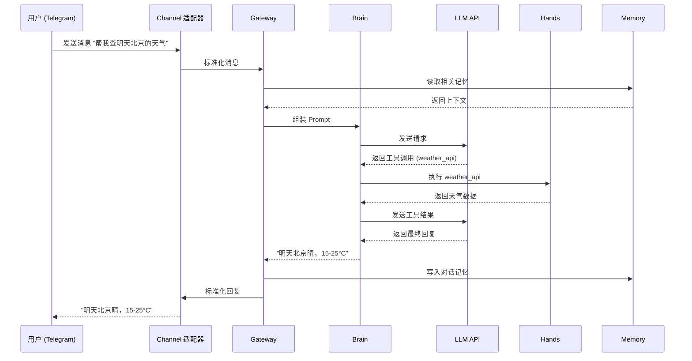

# OpenClaw 架构

> **学习目标**: 理解 OpenClaw 的 Gateway 中心架构、六大核心组件和数据流机制
>
> **预计时间**: 25 分钟
>
> **难度等级**: ⭐⭐⭐☆☆

---

## 一、Gateway 中心架构

### 1.1 整体架构图

OpenClaw 采用 **Gateway 中心架构**——一个单进程 Node.js 应用同时处理所有功能[^1]：

```
┌──────────────────────────────────────────────────────────┐
│                    OpenClaw Gateway                       │
│                   (端口 18789)                            │
│                                                          │
│  ┌──────────┐ ┌──────────┐ ┌──────────┐ ┌────────────┐  │
│  │  Brain    │ │  Hands   │ │  Memory  │ │ Heartbeat  │  │
│  │ (LLM调用) │ │ (工具执行)│ │ (记忆读写)│ │ (定时任务)  │  │
│  └──────────┘ └──────────┘ └──────────┘ └────────────┘  │
│                                                          │
│  ┌──────────────────────────────────────────────────────┐ │
│  │                  Channels (通道层)                     │ │
│  │  Telegram │ WhatsApp │ Discord │ Slack │ ...         │ │
│  └──────────────────────────────────────────────────────┘ │
│                                                          │
│  ┌──────────────────────────────────────────────────────┐ │
│  │                  Skills (技能层)                       │ │
│  │  Skill A │ Skill B │ Skill C │ ...                   │ │
│  └──────────────────────────────────────────────────────┘ │
└──────────────────────────────────────────────────────────┘
         ▲                           ▲
         │ WebSocket                 │ API 调用
         ▼                           ▼
   [消息平台]                    [LLM 提供商]
```

### 1.2 单进程设计

OpenClaw 选择单进程而非微服务架构，这是一个有意的设计决策：

| 方面 | 单进程 | 微服务 |
|------|--------|--------|
| 部署复杂度 | 一个 Node.js 进程 | 多个服务 + 容器编排 |
| 资源消耗 | 低 | 高 |
| 调试难度 | 简单，一个进程 | 复杂，分布式追踪 |
| 扩展性 | 有限（个人助手够用） | 高 |

对于个人 AI 助手场景，单进程是正确的选择——你不需要分布式系统来服务一个人。

---

## 二、六大核心组件

| 组件 | 职责 | 类比 |
|------|------|------|
| **Brain** | 调用 LLM 进行推理和决策 | 大脑——思考和判断 |
| **Hands** | 执行工具调用（文件操作、API 调用等） | 双手——执行动作 |
| **Memory** | 读写持久化记忆 | 海马体——记住和回忆 |
| **Heartbeat** | 定时触发 Agent 执行任务 | 心跳——让 Agent 活着 |
| **Channels** | 连接各消息平台的适配器 | 耳朵和嘴——接收和发送消息 |
| **Skills** | 加载和执行技能模块 | 技能包——各种能力 |

### 2.1 Brain（大脑）

Brain 是 LLM 的调用层。它负责：

- 将用户消息、记忆上下文、Skills 指令组合成 Prompt
- 调用配置的 LLM API
- 解析 LLM 返回的工具调用请求
- 将工具执行结果反馈给 LLM

Brain 本身不做决策——决策由 LLM 完成。Brain 只是一个高效的"翻译层"，把各组件的信息翻译成 LLM 能理解的格式。

### 2.2 Hands（双手）

Hands 是工具执行引擎。当 Brain 解析出 LLM 要调用某个工具时，Hands 负责实际执行：

```
LLM 输出: "调用工具 web_search，参数 { query: '今天天气' }"
    ↓
Hands 查找 web_search 工具
    ↓
Hands 执行工具，返回结果
    ↓
Brain 将结果反馈给 LLM
```

Hands 支持的工具类型包括：文件读写、HTTP 请求、代码执行、系统命令等。Skills 可以往 Hands 中注册新工具。

### 2.3 Memory（记忆）

Memory 系统将聊天历史和 Agent 的"理解"持久化到本地 Markdown 文件中。下一节会详细展开。

### 2.4 Heartbeat（心跳）

Heartbeat 是 OpenClaw 区别于大多数聊天机器人的关键组件：

```yaml
# heartbeat 配置示例
heartbeat:
  enabled: true
  interval: 300  # 秒，5 分钟一次
  tasks:
    - check_emails
    - summarize_news
    - remind_todos
```

每次心跳触发时，Agent 会执行一轮完整的"思考"——检查当前状态、记忆、待办任务，决定是否需要主动行动。

### 2.5 Channels（通道）

每个消息平台对应一个 Channel 适配器。适配器负责：

1. 监听平台消息
2. 将消息转换为统一格式
3. 将 Agent 回复转换回平台格式

这意味着你添加新平台时，只需要安装对应的 Channel 适配器，核心逻辑完全复用。

### 2.6 Skills（技能）

Skills 是可插拔的能力模块，遵循 SKILL.md 标准（在模块 09 中详细介绍过）。OpenClaw 运行时加载 Skills 后，Agent 就获得了对应的能力。

---

## 三、数据流全景

### 3.1 消息处理流程

下面是一次用户消息的完整处理流程：



### 3.2 Heartbeat 触发流程

Heartbeat 的执行流程和用户消息类似，区别在于触发源是定时器而非用户：

```
定时器触发 (每 5 分钟)
    ↓
Gateway 启动 Heartbeat 轮次
    ↓
Memory 读取待办任务列表
    ↓
Brain 组装 Prompt: "现在是你的定期检查时间，以下是你的待办..."
    ↓
LLM 决定是否需要执行任务
    ↓
如果需要 → Hands 执行 → Memory 更新状态 → Channel 通知用户
如果不需要 → 等待下一次心跳
```

### 3.3 实际例子

假设你在 SOUL.md 中写了"每天早上 9 点提醒我站会"，Heartbeat 的实际执行过程：

1. 心跳触发，Brain 读取记忆，发现当前时间是 9:00
2. Brain 组装 Prompt，包含 SOUL.md 中的指令和记忆中的待办
3. LLM 判断：需要发送站会提醒
4. Hands 调用 Channel 发送消息
5. 你在 Telegram 上收到："早上好！9 点了，别忘了站会。"
6. Memory 记录已发送提醒

---

## 四、设计理念

### 4.1 四条核心原则

| 原则 | 体现 | 为什么 |
|------|------|--------|
| **单进程** | 一个 Node.js 进程包含所有功能 | 个人助手不需要分布式，简单即正确 |
| **本地优先** | 数据存在 `~/.openclaw/` | 隐私和安全，数据永远不离开你的机器 |
| **模型无关** | 支持所有主流 LLM | 不被任何提供商锁定，灵活切换 |
| **透明可读** | 配置和记忆都是 Markdown | 人类可以直接阅读和编辑，不需要特殊工具 |

### 4.2 Markdown 作为配置格式

OpenClaw 大量使用 Markdown 作为配置和存储格式：

- **SOUL.md**：Agent 身份定义
- **SKILL.md**：技能描述
- **Memory 文件**：Agent 的记忆存储

这不是偷懒。Markdown 是人类最容易阅读和编辑的格式。当你想查看或修改 Agent 的记忆时，打开文本编辑器就行，不需要数据库客户端或管理面板。

### 4.3 与模块 04 Agent 基础的呼应

回顾模块 04 中学过的 Agent 基本结构：

```
Agent = 感知 → 推理 → 行动 → 记忆
```

OpenClaw 的组件完美映射到这个结构：

| Agent 基本结构 | OpenClaw 组件 |
|---------------|---------------|
| 感知 | Channels（接收消息） |
| 推理 | Brain + LLM（思考和决策） |
| 行动 | Hands（执行工具） |
| 记忆 | Memory（持久化存储） |

理解了基础架构再看 OpenClaw，会发现它就是把 Agent 的抽象概念做成了一个具体可运行的产品。

---

## 思考题

::: info 检验你的理解
1. OpenClaw 为什么选择单进程而不是微服务架构？这种选择有什么代价？
2. Heartbeat 和普通聊天机器人的"定时推送"有什么本质区别？
3. 如果 Memory 系统出现故障，Agent 的行为会有什么变化？
4. OpenClaw 的四条设计原则中，哪一条对你个人最重要？为什么？
:::

---

## 本节小结

- Gateway 中心架构：单进程 Node.js 应用，端口 18789，同时处理所有功能
- 六大核心组件：Brain（推理）、Hands（执行）、Memory（记忆）、Heartbeat（心跳）、Channels（通道）、Skills（技能）
- 数据流：用户消息经过 Channel → Gateway → Brain → LLM → Hands → Memory 的完整处理链路
- 设计理念：单进程、本地优先、模型无关、透明可读——每一项都服务于"个人 AI 助手"这个定位

**下一步**: 理解了架构之后，下一节动手实操——安装 OpenClaw、连接消息平台、写出你的第一个 SOUL.md。

---

[← 返回模块首页](/basics/10-openclaw) | [继续学习:快速上手 OpenClaw →](/basics/10-openclaw/03-getting-started)

---

[^1]: OpenClaw 官方文档, "Architecture Overview". https://docs.openclaw.org/architecture
[^2]: Peter Steinberger, "Why Single-Process Architecture Works for AI Agents", 2026. https://steipete.me/posts/openclaw-architecture
