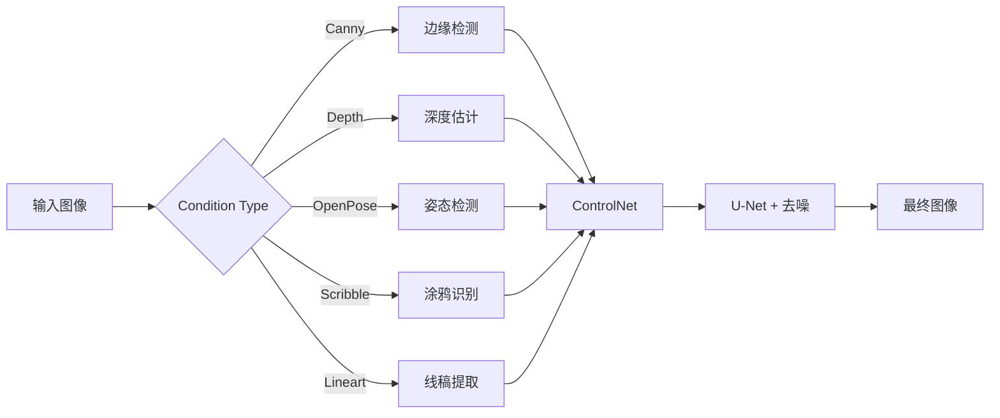

# 开源生态与本地部署

> **学习目标**：掌握 Stable Diffusion 开源生态体系，了解本地部署方案的选择与配置，学会使用 ControlNet、LoRA 等核心技术进行精细控制
>
> **预计时间**：60 分钟
>
> **难度**：⭐⭐⭐

---

如果说 Midjourney 和 DALL-E 3 是"开箱即用的照相馆"，那么开源生态就是一座你可以自由改造的"暗房"。Stable Diffusion 的开源模式彻底改变了 AI 绘画的格局——任何人都可以免费获取模型、在自己的电脑上运行、按需定制、无限制地商用（取决于许可证）。

本章将带你全面了解这个庞大的开源生态系统。

---

## 1. Stable Diffusion 生态谱系

### 1.1 模型演进时间线

Stable Diffusion 的模型家族经历了多次重大升级，每一代都带来了显著的进步：

| 模型 | 发布时间 | 参数量 | 核心改进 | 硬件需求 |
|------|---------|--------|---------|---------|
| **SD 1.4** | 2022 年 8 月 | ~0.9B | 开源先驱，引爆 AI 绘画浪潮 | 4GB VRAM |
| **SD 1.5** | 2022 年 10 月 | ~0.9B | 社区标准，最广泛的基础模型 | 4GB VRAM |
| **SD 2.1** | 2022 年 12 月 | ~0.9B | 改进过滤机制，更高分辨率 | 4GB VRAM |
| **SDXL** | 2023 年 7 月 | ~3.5B | 质量飞跃，原生 1024×1024 | 8GB VRAM |
| **SD 3.5 Medium** | 2024 年 10 月 | ~2B | 新架构，改进文本渲染 | 9.9GB VRAM |
| **SD 3.5 Large** | 2024 年 10 月 | ~8B | 最强提示词遵循能力 | 16GB+ VRAM |

::: tip 模型选择建议
- 如果你只有 **4-6GB VRAM**：SD 1.5 仍然是最佳选择，生态成熟、资源丰富
- 如果你有 **8-12GB VRAM**：SDXL 或 SD 3.5 Medium 是不错的平衡点
- 如果你有 **16GB+ VRAM**：FLUX.2 [klein] 4B 或 SD 3.5 Large 可以发挥全部潜力
:::

### 1.2 FLUX 家族（Black Forest Labs）

FLUX 由 Stable Diffusion 的原作者团队（Robin Rombach 等人）创立的 Black Forest Labs 开发。2024 年 8 月推出以来快速迭代，在文本渲染、提示词遵循度上超越了 Stability AI 官方模型。

**技术架构**：Latent Flow Matching + Mistral-3 24B 视觉语言模型 + Rectified Flow Transformer

**模型变体：**

| 模型 | 参数量 | 许可证 | 最佳用途 | 硬件要求 |
|------|--------|--------|---------|---------|
| **FLUX.2 [pro]** | - | 商业 API | 生产级最高质量 | BFL API |
| **FLUX.2 [flex]** | - | 商业 API | 开发者控制，步数/指导度可调 | BFL API |
| **FLUX.2 [dev]** | 32B | 非商业开源 | 研究、微调 | 48GB+ VRAM |
| **FLUX.2 [klein] 4B** | 4B | **Apache 2.0** | 本地推理，亚秒级生成 | ~8GB VRAM (RTX 3090/4070+) |
| **FLUX.2 [klein] 9B** | 9B | 非商业开源 | 更高质量本地部署 | 16GB+ VRAM |

**FLUX.2 [klein] 4B 的亮点**（2026 年 1 月发布）：
- **亚秒级推理**：在消费级显卡上可达到接近实时的生成速度
- **低显存占用**：仅需约 8GB VRAM，RTX 3090/4070 即可流畅运行
- **Apache 2.0 许可证**：可自由商用、修改、分发
- **全能模型**：文生图、单图编辑、多图编辑集成于单一模型

**版本演进**：

```
FLUX.1 (2024.8) → FLUX.2 (2025.11) → FLUX.2 [klein] (2026.1)
 12B, Apache 2.0      32B 旗舰         4B/9B 轻量级
```

::: info FLUX vs SD 主要差异
FLUX 在 **文字渲染**（准确率 92%）、**提示词遵循度**、**空间关系理解**（错误率降低 37%）上明显优于 SD 系列；而 SD 的 **社区生态**（LoRA/Checkpoint 数量）和 **许可证开放性**上更具优势。两者并非替代关系，而是各有千秋。
:::

### 1.3 社区微调模型

除了官方基础模型，社区贡献了大量高质量的微调模型（Checkpoint），它们在特定风格或领域上表现卓越：

| 模型名称 | 基础模型 | 风格定位 | 推荐场景 |
|---------|---------|---------|---------|
| **Realistic Vision** | SD 1.5 | 超写实摄影风格 | 人像、产品摄影 |
| **DreamShaper** | SD 1.5 / SDXL | 艺术与写实的完美平衡 | 通用创作 |
| **Juggernaut XL** | SDXL | 高质量写实，光影出色 | 商业视觉、渲染 |
| **RevAnimated** | SD 1.5 | 2.5D 动画风格 | 插画、角色设计 |
| **Counterfeit** | SD 1.5 | 动漫/二次元风格 | ACG 内容创作 |
| **RealStock** | SDXL | 商业图库风格 | 商业素材、营销图片 |

### 1.4 模型来源平台

| 平台 | 定位 | 特点 |
|------|------|------|
| **[Civitai](https://civitai.com)** | 社区模型分享 | 最大社区模型市场，涵盖 Checkpoint、LoRA、Embedding、ControlNet 等 |
| **[Hugging Face](https://huggingface.co)** | 官方模型托管 | Stability AI 官方发布渠道，学术社区标准平台 |
| **ModelScope** | 国内镜像 | 阿里巴巴托管，国内下载速度快，无需翻墙 |

---

## 2. 部署方案对比

开源生态最大的优势之一是你可以选择多种方式运行模型。以下是主流的部署方案对比：

### 方案总览

| 方案 | 界面风格 | 核心优势 | 学习曲线 | 硬件要求 | 推荐人群 |
|------|---------|---------|---------|---------|---------|
| **Auto1111 WebUI** | 传统 UI，功能面板 | 最成熟，插件丰富，教程最多 | ⭐⭐ 低 | 4GB+ VRAM | 初学者、通用用户 |
| **ComfyUI** | 节点式工作流画布 | 灵活可编程，60k+ 自定义节点 | ⭐⭐⭐⭐ 高 | 4GB+ VRAM | 进阶用户、工作流专家 |
| **Fooocus** | 极简界面，类似 MJ | 一键安装，开箱即用 | ⭐ 极低 | 4GB+ VRAM | 快速上手、MJ 用户 |
| **Forge** | 类 Auto1111 界面 | SD3/FLUX 优化，显存效率高 | ⭐⭐ 低 | 2GB+ VRAM | 低配硬件用户 |
| **云端方案** | 按平台不同 | 无需 GPU，弹性扩展 | ⭐⭐ 中 | 无需 GPU | 无独立显卡用户 |

### 2.1 Automatic1111 WebUI

**一句话定位**：SD 生态的"旗舰店"，功能最全、教程最多、用户最广。

**特点：**
- 基于 Gradio 构建的 Web 界面，功能面板式操作
- 内置文生图、图生图、Inpainting、Outpainting、批量处理
- 插件系统极其丰富（Ddetailer 面部修复、ControlNet 集成、图片管理）
- 社区拥有最多的教程资源和问题解决方案

**安装要求：**
- **Windows**：一键安装包（推荐秋叶整合包，中文社区维护）
- **macOS/Linux**：Git Clone + 依赖安装
- **Python**：3.10.x（部分插件不兼容更高版本）
- **推荐配置**：8GB+ VRAM 显卡，16GB+ 系统内存

```bash
# Linux/macOS 安装（简化版）
git clone https://github.com/AUTOMATIC1111/stable-diffusion-webui
cd stable-diffusion-webui
./webui.sh
```

### 2.2 ComfyUI

**一句话定位**：SD 生态的"程序员编辑器"，用节点工作流实现无限可能。

**核心数据**（截至 2026 年 4 月）：
- GitHub Stars：**109,838**
- 最新版本：**v0.19.3**
- 自定义节点：**60,000+**
- 核心贡献者：**300+**
- 许可证：GPL v3.0

**工作原理**：
ComfyUI 采用**节点图/流程图**界面——每个节点代表一个操作（加载模型、输入提示词、应用 LoRA、运行 ControlNet、解码图像），用户将这些节点连接起来构建完整的生成流水线。

```
[Load Checkpoint] → [CLIP Text Encode] → [KSampler] → [VAE Decode] → [Save Image]
                         ↑
                  [Load LoRA]
                         ↑
              [ControlNet Apply]
```

**核心优势：**
- **完全可视化编程**：无需写代码即可构建复杂工作流
- **智能缓存**：仅重新计算变化部分，复用不变结果
- **工作流可移植**：JSON 导出/导入，工作流嵌入到生成的 PNG/WebP 元数据中
- **App Mode**：为初学者提供的简化视图
- **多模态支持**：SD 全系列、FLUX、视频模型（Hunyuan Video、Wan2.1）、音频、3D 模型

**安装要求：**
- Git + Python 3.10/3.11/3.12
- 支持 Windows（桌面 Beta）、macOS（ARM 桌面 Beta）、Linux
- 与 Auto1111 可共用模型文件夹（通过配置文件指定搜索路径）

```bash
# 安装方式
git clone https://github.com/comfyanonymous/ComfyUI
cd ComfyUI
pip install -r requirements.txt
python main.py
```

::: tip 从 Auto1111 迁移到 ComfyUI
如果你是 Auto1111 用户想要转到 ComfyUI，建议：
1. 先从现有工作流开始——在 Auto1111 中生成的 PNG 图像可以用 ComfyUI 打开"加载图片到工作流"功能
2. 使用 ComfyUI Examples（内置大量示例工作流）
3. 访问 [ComfyUI Workflows](https://comfyworkflows.com) 社区下载预置工作流
4. 熟悉节点命名（很多与 Auto1111 的插件同名）
:::

### 2.3 Fooocus

**一句话定位**：AI 绘画界的"傻瓜相机"，为追求简便而生。

Fooocus 的设计哲学是"零学习成本"。它借鉴了 Midjourney 的交互风格，提供了极其简洁的界面——你只需要输入提示词、点击生成即可。底层自动处理了模型选择、参数优化、质量增强等复杂环节。

**特点：**
- 一键安装（内置 Python 环境和依赖）
- 内置 SDXL 和 SD 3.5 优化
- 自动负面提示词、自动面部修复、自动放大
- 轻量级，适合快速出图

### 2.4 Forge

**一句话定位**：低配显卡用户的"性能加速器"。

Stable Diffusion WebUI Forge 是 Auto1111 的一个性能优化分支，专注于显存效率优化：

- **极低显存占用**：采用 Cross-Layer Attention 优化，2GB VRAM 即可运行 SDXL
- **SD3/FLUX 兼容**：最早支持新架构模型的 WebUI
- **与 Auto1111 插件生态兼容**：大部分 Auto1111 插件可直接使用
- **快速迭代**：紧跟官方更新

### 2.5 云端部署方案

如果你没有独立显卡，或者需要在服务器上运行定时任务，云端方案是最佳选择：

| 平台 | 特点 | 定价模式 | 适用场景 |
|------|------|---------|---------|
| **RunPod** | 按秒计费 GPU 实例，模板丰富 | $0.2-$2/小时 | 灵活部署，多种 GPU 可选 |
| **Modal** | Serverless 架构，Python SDK | 按调用计费 | 开发者自动化工作流 |
| **Replicate** | API 调用，无需管理服务器 | $0.002/张起 | 快速集成到应用 |
| **AutoDL** | 国内用户友好，价格实惠 | ¥2-¥15/小时 | 国内开发者，客服支持好 |

::: warning 硬件建议
- **入门（4-6GB VRAM）**：SD 1.5 + 轻量 ControlNet
- **标准（8-12GB VRAM）**：SDXL / SD 3.5 Medium + 多 ControlNet
- **进阶（16-24GB VRAM）**：FLUX.2 [klein] + FLUX ControlNet
- **发烧（48GB+ VRAM）**：FLUX.2 [dev] 32B + 全量微调
:::

---

## 3. 核心控制技术

开源生态最强大的地方在于**控制**。以下三大技术构成了 AI 绘画的"控制三剑客"：

| 技术 | 用途 | 原理 |
|------|------|------|
| **ControlNet** | 空间结构控制 | 向扩散模型输入边缘图、深度图、骨骼姿态等条件 |
| **LoRA** | 风格/角色/概念微调 | 小型适配权重，叠加在基础模型上生效 |
| **IP-Adapter** | 参考图像迁移 | 将图像嵌入注入到注意力层中 |

更直观地说：**ControlNet 控制"结构"，LoRA 控制"风格/角色"，IP-Adapter 控制"参考"**。三者可以协同使用，实现前所未有的精细控制。

### 3.1 ControlNet

ControlNet 由 Lvmin Zhang 等人于 2023 年 2 月提出，是开源生态中**最重要的控制技术之一**。它通过引入额外的条件输入（如边缘检测图、深度图、人体骨架等），让生成结果在结构上严格遵循预设的参考。

**控制强度（Control Weight）参考：**

| 权重范围 | 效果 | 适用场景 |
|---------|------|---------|
| **0.3 - 0.5** | 宽松引导，允许创意发挥 | 艺术创作、风格转换 |
| **0.7 - 0.8** | 强引导，结构保真度高 | 建筑可视化、产品设计 |
| **1.0+** | 刚性约束，像素级精准 | 线稿上色、精确复制构图 |

#### 常用 ControlNet 类型详解

**① Canny（边缘检测）**

- **原理**：提取输入图像的边缘线条作为引导条件
- **最佳用例**：精确结构控制——将草图或线稿转换为高质量图像
- **典型参数**：Canny 阈值 100-200，control weight 0.7-1.0
- **技巧**：高阈值（>200）只保留强边缘，适合构图控制；低阈值（<100）保留细节边缘

**② Depth（深度图）**

- **原理**：使用深度估计模型（如 MiDaS）从输入图像提取深度信息
- **最佳用例**：3D 空间一致性——保持场景的纵深关系和物体前后顺序
- **典型参数**：control weight 0.5-0.8
- **技巧**：非常适合将 3D 渲染草稿转换为真实感图像，保持相机视角和空间布局

**③ OpenPose（骨骼姿态）**

- **原理**：检测人体关键点（关节、头部、手脚位置），生成骨骼骨架图
- **最佳用例**：人物姿态控制——精确指定人物的姿势、动作
- **典型参数**：control weight 0.5-0.8
- **技巧**：可在预置骨骼图上手动调整关节位置，自定义符合创意需求的姿态

**④ Scribble（涂鸦/手绘）**

- **原理**：接受粗略的手绘线条作为引导
- **最佳用例**：快速创意迭代——用简单涂鸦指定构图和主要形状
- **典型参数**：control weight 0.5-0.8
- **技巧**：Scribble 对线条质量要求极低，手机触摸屏随手画即可

**⑤ Lineart（线稿）**

- **原理**：提取精细线条（动漫线稿风格），保留细节边缘
- **最佳用例**：漫画/插画线稿上色——对已有线稿进行自动化着色
- **典型参数**：control weight 0.7-1.0
- **技巧**：配合适当的提示词描述色调和氛围，可快速制作专业级全彩插画



#### 多 ControlNet 联合使用

ControlNet 的真正的力量在于**组合使用**。你可以同时加载多个 ControlNet，各自控制不同的方面：

| 组合方式 | 效果 | 示例场景 |
|---------|------|---------|
| **Canny + Depth** | 构图 + 空间完全锁定 | 建筑概念图，需精确结构和透视 |
| **OpenPose + Canny** | 人物姿态 + 场景结构 | 人物摄影，指定姿势和背景 |
| **Canny + Lineart** | 双重线稿保真 | 线稿上色，同时保留粗线条和细节 |
| **Depth + Scribble** | 空间 + 创意构图 | 概念设计，空间合理但元素自由 |

::: tip Multi-ControlNet 技巧
- 多个 ControlNet 的总 weight 不宜超过 1.5（如两个各 0.7 或三个各 0.5）
- 不同 ControlNet 类型可以设置不同的 Control Mode（平衡/优先/精确）
- FLUX 生态目前已支持 ControlNet V1/V2/V3（Canny、Depth、HED）
:::

### 3.2 LoRA

#### 什么是 LoRA

**LoRA**（Low-Rank Adaptation，低秩适配）是一种高效的模型微调方法。与全量微调不同，LoRA 只训练少量额外的权重矩阵（通常 1-100 MB），而不是修改整个模型（2-7 GB）。这使得：

- **文件极小**：一个 LoRA 通常只有 10-200 MB
- **即插即用**：可在不同基础模型上切换使用，不影响模型本身
- **可堆叠**：多个 LoRA 可以同时激活，各自控制不同方面

#### LoRA 类型对比

| 类型 | 作用 | 文件大小 | 典型用途 | 获取方式 |
|------|------|---------|---------|---------|
| **角色 LoRA** | 生成特定人物（真实或虚构） | 10-50 MB | 品牌 IP、角色一致性 | 社区下载或自行训练 |
| **风格 LoRA** | 模仿特定画风（水墨、水彩、赛博朋克等） | 10-50 MB | 统一风格输出 | 社区下载 |
| **概念 LoRA** | 学习特定物体/元素（蒸汽朋克装备、特殊材质等） | 10-50 MB | 特定概念复现 | 社区下载或自行训练 |

#### 训练方式对比

| 方法 | 训练参数量 | 训练时间 | 数据需求量 | 文件大小 | 适用场景 |
|------|-----------|---------|-----------|---------|---------|
| **Full Fine-Tuning** | 全部参数 | 数天-数周 | 数千张 | 2-7 GB | 高质量的专用模型 |
| **Dreambooth** | 部分参数 + 词嵌入 | 数小时 | 数十张 | 1-2 GB | 个性化模型训练 |
| **LoRA** | 少量额外参数 | 1-2 小时 | 10-50 张 | 10-200 MB | 快速概念/风格学习 |
| **T-LoRA**（AAAI 2026） | 分时间步 LoRA | 数十分钟 | 单张图像 | 极小 | 单图定制防止过拟合 |

#### LoRA 权重控制技巧

**多 LoRA 叠加（Stacking）：**

```
LoRA_A (角色) weight=0.8
LoRA_B (风格) weight=0.6
LoRA_C (服装) weight=0.4
           ↓
    加权融合 → 生成
```

**权重建议：**
- **主 LoRA（核心内容）**：weight 0.7-1.0
- **辅助 LoRA（补充细节）**：weight 0.3-0.6
- **过度叠加警告**：3 个以上 LoRA 同时使用容易互相干扰

::: tip 找 LoRA 的几个途径
1. **Civitai**：最大的 LoRA 仓库，支持按基础模型、类型、排名筛选
2. **Hugging Face**：官方 LoRA 库，学术/技术向资源多
3. **Tensor.art**：在线平台，可直接在线测试 LoRA 效果
:::

### 3.3 其他控制技术

#### IP-Adapter（图像提示适配器）

IP-Adapter 是腾讯 ARC 实验室提出的技术，可以将参考图像的风格或内容特征提取为"图像提示"，注入到生成过程中。

**ComfyUI 中的预设：**

| 预设 | 用途 | 推荐权重 |
|------|------|---------|
| **LIGHT** | 轻微风格提示 | 0.3-0.5 |
| **STANDARD** | 平衡风格迁移 | 0.5-0.7 |
| **PLUS** | 增强质量（22M 参数） | 0.5-0.8 |
| **FULL FACE** | 人脸身份转移 | 0.6-0.8 |
| **COMPOSITION** | 构图/风格参考 | 0.5-0.7 |
| **FACEID PLUS V2** | 人脸身份（SD1.5/SDXL） | 0.6-0.9 |

**经典组合：IP-Adapter + ControlNet**

```
参考图像 ──→ IP-Adapter（风格/身份）
                              ↓
结构参考 ──→ ControlNet（构图/结构）
                              ↓
提示词 ────→ 模型 → 最终图像

效果：Style accuracy 96% + Content preservation 99%+ 
```

#### T2I-Adapter

T2I-Adapter 是腾讯提出的 ControlNet 轻量化替代方案：

- **更小更快**：参数量远小于 ControlNet
- **架构简单**：仅需在 U-Net 前端插入适配器
- **精度稍低**：不如 ControlNet 精细，但速度更快
- **适用场景**：需要快速迭代的创作流程

#### InstantID / PuLID

这类技术的目标是**人脸保持和角色一致性**：

| 技术 | 特点 | 适用场景 |
|------|------|---------|
| **InstantID** | 单张参考图即可保持人脸身份 | 快速生成个人肖像 |
| **PuLID** | 更高的人脸保真度 | 品牌人物形象统一 |
| **IP-Adapter FaceID** | 多人脸混合模式 | 多人组合场景 |

---

## 4. 图像编辑与后期处理

开源生态不仅支持从零生成，还提供了强大的图像编辑能力。

### 4.1 Inpainting（局部重绘）

Inpainting 是指对图像中的指定区域进行重新生成，是在图像编辑中最常用的功能。

**典型工作流：**

```
原始图像 ──→ 绘制遮罩（标记重绘区域） ──→ 填写提示词 ──→ 重新生成
                                                 ↓
                                         保留区域不变
                                         遮罩区域重新生成
```

**适用场景：**
- 替换不满意的元素（如人物手势、背景物体）
- 修复 AI 生成的缺陷（如乱真的手指、变形面部）
- 移除不需要的物体（水印、杂物、路人）
- 局部风格替换（如把衣服颜色从红变蓝）

**参数建议：**
- **遮罩模糊（Mask Blur）**：4-8 px，让边缘过渡自然
- **遮罩内容（Mask Content）**：Fill（用周围颜色填充）更适合小区域，Original（保留原图风格）更适合大区域
- **Denoising Strength**：0.3-0.5 微调，0.5-0.8 大幅修改，0.8+ 彻底重绘

### 4.2 Outpainting（图像扩展）

Outpainting 将图像向四周扩展，AI 自动补全扩展区域的内容。

```
            ┌────────────────────┐
            │   AI 生成扩展内容   │
            │  ┌─────────────┐   │
            │  │  原始图像    │   │
            │  │             │   │
            │  └─────────────┘   │
            │   AI 生成扩展内容   │
            └────────────────────┘
```

**适用场景：**
- 改变图像宽高比（如 1:1 → 16:9）
- 扩展画面构图（从特写变为全景）
- 商业产品图扩展（为设计排版留出空间）

### 4.3 图像放大（Upscaling）

AI 生成的原图分辨率通常有限（SDXL: 1024×1024，SD 1.5: 512×512），通过放大技术可以得到更高分辨率的输出。

| 放大技术 | 原理 | 效果 | 速度 | 推荐场景 |
|---------|------|------|------|---------|
| **ESRGAN** | 基于 GAN 的超分辨率 | 清晰锐利，细节增强 | 快 | 快速放大 |
| **Ultimate SD Upscale** | 分块 SD 放大 | 质量最高，增加自然细节 | 慢 | 高精度需求 |
| **4x-UltraSharp** | 专为 AI 图像优化的放大模型 | 边缘锐化好 | 中 | 通用放大 |
| **Tiled Diffusion** | 分块扩散增强 | 不增加分辨率但提升原图细节 | 慢 | 劣质图修复 |

**放大工作流建议：**
1. 首先生成基础图像（SDXL 1024×1024）
2. 使用 Ultimate SD Upscale 进行 2x 放大（→2048×2048）
3. Denoising Strength 设为 0.2-0.4（保留原图结构）
4. 如需进一步放大，使用 ESRGAN 再进行 2x（→4096×4096）

### 4.4 批量处理

对于需要生成大量图像的生产场景，批量处理是必不可少的：

| 方式 | 适用场景 | 工具/方案 |
|------|---------|---------|
| **提示词变体** | A/B 测试、多方案设计 | WebUI X/Y Plot 脚本 |
| **批量图生图** | 一致性产品图 | ComfyUI Batch 节点 |
| **批量 LoRA 测试** | 多 LoRA 组合筛选 | ComfyUI 工作流循环 |
| **自动化工单** | 服务器端大规模生成 | Python + ComfyUI API |
| **ComfyUI API** | 后端集成 | REST API 调用工作流 |

```python
# ComfyUI API 批量处理示例（Python）
import json
import requests

# 加载预置工作流
with open("workflow_api.json", "r") as f:
    workflow = json.load(f)

# 修改提示词节点
workflow["6"]["inputs"]["text"] = "a beautiful landscape, photorealistic"

# 提交任务
response = requests.post(
    "http://localhost:8188/queue",
    json={"prompt": workflow}
)
```

---

## 5. 综合工作流示例

将上述所有技术结合起来，可以构建一个专业级的生成工作流：

### 人物肖像创作工作流

```
1. 准备阶段：
   └── 选择基础模型（如 Juggernaut XL）→ 加载到 ComfyUI

2. 姿态控制：
   └── OpenPose ControlNet → 导入参考姿态图 → weight: 0.7

3. 身份保持：
   └── IP-Adapter FaceID → 导入人物照片 → weight: 0.8

4. 风格控制：
   └── LoRA（选定摄影风格）→ weight: 0.6

5. 背景控制：
   └── Canny ControlNet → 导入背景参考图 → weight: 0.5

6. 提示词：
   └── Positive: "professional portrait, soft lighting, detailed eyes..."
   └── Negative: "blurry, bad anatomy, extra fingers... "

7. 参数设置：
   └── Steps: 30, CFG: 7, Sampler: DPM++ 2M Karras

8. 后期处理：
   └── Ultimate SD Upscale (2x) → Face Restoration (GFPGAN)
```

---

## 本章小结

开源生态与本地部署赋予了创作者**完全的控制权**——从模型选择、部署方式到生成过程的每一个参数都可以自定义。

| 核心要点 | 关键信息 |
|---------|---------|
| **模型演进** | SD 1.5 → SDXL → SD 3.5 → FLUX.2 [klein]，参数量从 0.9B 到 32B |
| **部署方案** | Auto1111（最成熟）、ComfyUI（最灵活）、Fooocus（最简单）、Forge（最省显存） |
| **控制技术** | ControlNet（结构）、LoRA（风格/角色）、IP-Adapter（参考图像） |
| **图像编辑** | Inpainting（局部重绘）、Outpainting（扩展）、Upscaling（放大） |

**实践建议：**
1. 如果你初次接触，先尝试 **Auto1111 WebUI**，有中文社区的一键安装包
2. 掌握了基础后，转向 **ComfyUI** 体验节点工作流的强大
3. **ControlNet** 是最值得投入时间学习的控制技术——它是区分"玩票"和"专业"的分水岭
4. **LoRA** 是效率最高的定制化方式，10-50 张图片即可训练
5. 善用 **Civitai** 社区资源——95% 的场景你不需要自己训练模型

---

**导航**：[← 返回章节目录](/basics/14-ai-image-generation) | [继续学习：中国 AI 绘画平台 →](/basics/14-ai-image-generation/04-china-platforms)
