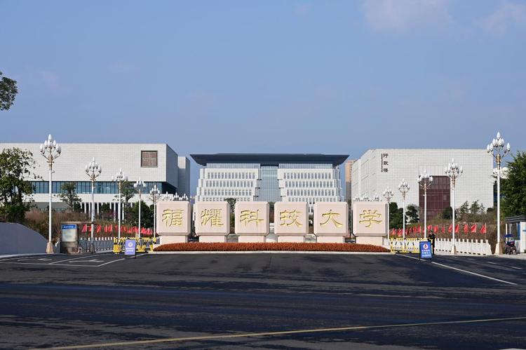

# 福耀科技大学新增 5 个专业：50 个学生、8 亿预算，曹德旺在下一盘什么棋？

> 2026 年 5 月，教育部公布本科专业备案结果，福耀科技大学一口气拿下未来机器人、人工智能、智能车辆工程、生物科学、数字经济 5 个新专业。算上去年的 4 个，这所刚满一岁的大学已经攒了 9 个本科专业。
>
> 但更值得关注的不是专业数量，而是这所学校一整套反常识的操作——首年只招 50 人、8 亿预算、6 个老师服务 1 个学生、完全自由选专业、本硕博贯通 8 年毕业。曹德旺说对标斯坦福，王树国说不想培养乖孩子。这些话听起来像口号，但数据不会骗人。

---

## 这 5 个专业，每个都打在产业痛点上

先看新增的 5 个专业是什么：

| 专业名称 | 专业代码 | 门类归属 | 一句话定位 |
|---------|---------|---------|-----------|
| 未来机器人 | 140001TK | 交叉学科 | 首批列入"交叉学科"门类的专业之一，融合机械工程、计算机科学 |
| 人工智能 | 080717T | 工学 | 聚焦大模型、计算机视觉、智能控制 |
| 智能车辆工程 | 080214T | 工学 | 融合车辆工程 + AI + 控制科学 |
| 生物科学 | 071001 | 理学 | 结合 AI + 合成生物学前沿 |
| 数字经济 | 020109T | 经济学 | 经济学 + 数据科学 + AI |

这 5 个专业不是随便选的。

**未来机器人**——这是 2026 年首批被列入本科专业目录"交叉学科"门类的专业之一。课程体系覆盖从多模态感知、大模型认知到高效执行的全链路知识架构，直接教大模型与 Agent 实体交互。院士团队授课，国家级重点实验室做实训平台。这个专业的定位很清楚：培养能打通 AI 和物理世界的人。

**人工智能**——不只是在教机器学习基础。课程围绕大模型训推、多模态信息处理、人机协同智能控制来设计，校企联合培养。

**智能车辆工程**——融合车辆工程、人工智能、控制科学，面向新能源汽车和自动驾驶。

**生物科学**——这个比较有意思。福耀科大没有医学院，但它的生命健康学院直接做 AI 药物设计、合成生物学——方向很窄，但很前沿。

**数字经济**——经济学 + 数据科学 + AI 挖掘，培养能看懂数据、能调模型、能做商业决策的人。

每个专业都有一个共同点：**不是纯学术方向，而是盯着一到两个产业痛点来设计的**。这不是传统大学从学科目录里挑专业的逻辑，这是企业家的逻辑——"我要什么样的人，我就开什么专业"。

## 首年 50 人、8 亿预算，不是在搞噱头

2025 年福耀科大首届本科生只招了 50 人。50 个学生，首年预算 8 亿。

算一下：每个学生每年 1600 万的资源投入。

王树国的解释很直接——"我要为每一个孩子都制定个性化的培养方案，设计好搞科研的整个通道。"师生比控制在 1:5 到 1:6，也就意味着 6 个老师服务 1 个学生。

更反常识的还在后面：

**完全自由选专业**。进校不分专业，大一、大二全在文理学院上通识课。大二下学期，自己在 9 个专业里随便选。选了觉得不合适，随时换。王树国的说法是："福耀科大没有转专业一说——所有课程对全体学生开放，修满某个专业的 36 学分核心课，就能拿这个专业的学位。有精力修两个 36 学分，就拿双学位。"

**本硕博贯通 8 年制（3+2+3）**。目标是让学生 25-26 岁博士毕业。中途想退出也有对应路径。

**大三专业训练，大四去海外名校**。与剑桥、牛津、斯坦福、MIT 合作，本科阶段就拿双学位。

**学费每年 5460 元**。加上海外学习一年的费用——曹德旺说亏本在办。

这套模式不是渐进式改良，是推倒重来。

## 对 AI 开发者来说，这所学校在释放什么信号？

站在做 AI 产品和独立开发的角度看，福耀科大最值得关注的有三点：

**第一，产教融合不是挂个牌子。**

福耀科大与华为、宁德时代、赛力斯、一汽、海信等 25 家企业签了校企合作，组建联合实验室。不是走走过场的实习，是真金白银的设备投入和项目合作。学生在校期间直接参与产业项目，大二进实验室。

对比一下：很多大学四年下来，学生连企业需求长什么样都没见过。福耀科大的逻辑是——你在大二就该知道产业要什么，然后用剩下六年去解决它。

**第二，"未来机器人"专业直接面向 Agent 时代。**

这个专业的课程设计——"大模型与 Agent 实体交互、人形机器人控制、多模态感知"——几乎是为 AI Agent 时代量身定制。做 AI 的人都知道，目前最缺的不是能做 Chatbot 的人，而是能让 AI 和物理世界交互的人。这个专业瞄准的就是这个缺口。

**第三，15 个院士、56 个全球前 2% 顶尖科学家、80 个国家级高层次人才——师资不是摆设。**

71.2% 的教师有海外教育或科研经历。这些人的课不是给研究生上的，是给本科生上的。

## 曹德旺 + 王树国：这对组合为什么值得关注？

一个捐了 100 亿做玻璃的企业家，一个带过两所 985 的校长——这两个人凑在一起做一件事，本身就说明需求真实且迫切。

曹德旺的原话是："做实业这么多年，最让我头疼的始终是人才问题。"

王树国的原话是："我希望培养的学生是拓荒者，而不是跟着别人跑的跟随者。"

这所学校的逻辑链条很简单：

**产业缺人 → 现有大学培养不出来 → 那我自己办一个 → 从根子上改培养模式 → 先小规模验证再扩大。**

和西湖大学不同，福耀科大从本科做起。和传统民办高校不同，它不是以量取胜，而是走"高起点、小而精、研究型、国际化"路线。

首年招 50 人只是一个开始。全日制在校生规模暂定 8000 人。这条路需要 10 年甚至 20 年才能看到完整结果，但方向至少是清晰的。

## 写在最后

福耀科大这 5 个新专业有一个隐藏信号：

**"未来机器人"被列入交叉学科门类，意味着教育部也开始意识到——未来的核心技术人才不能靠单一学科培养。AI、机器人、自动驾驶、生命科学这些领域，边界正在消失。**

对做 AI 产品和独立开发的人来说，这件事值得持续关注。不是因为要去报考——学校只有 50 个名额。而是因为它验证了一个趋势：**产业对 AI 人才的需求已经不是"加个计算机系"能满足的了。新的方向需要新的培养方式，无论是课堂上的还是自学上的。**

曹德旺说他要为中国制造业解决人才问题。王树国说他要为每个学生定制一条路。50 个学生能不能走出几个改变行业的人，现在谁也不知道。但至少，有人在试了。
