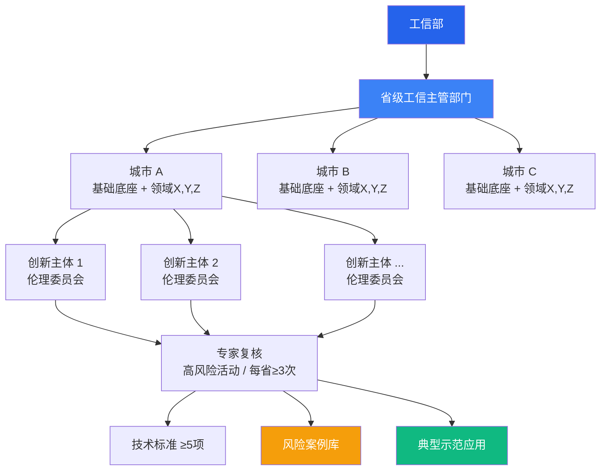

# 工信部 AI 伦理审查先导计划启动：做 AI 产品的人，该关心什么

> 2026 年 5 月 9 日，工信部正式印发通知，启动人工智能科技伦理审查与服务先导计划。10 个省份、覆盖制造到医疗 9 个垂直领域、6 个月落地窗口——这是中国 AI 监管从「纸面」到「地面」的关键一步。对正在用 AI 做产品的独立开发者和小团队来说，这既不是末日，也不是无关痛痒的通知——它是你应该现在就花半小时搞清楚的信号。

---

## 发生了什么

一句话版本：工信部联合十部门在今年 4 月发布了《人工智能科技伦理审查与服务办法（试行）》，5 月 9 日就启动了先导计划——不是征求意见稿，是动真格的。

**几个关键数字**：

- **10 个省份**：北京、上海、广东、山东、天津、四川、江苏、湖北、湖南、浙江——国家 AI 先导区所在省份全部在内
- **9 个垂直领域**：制造、教育、科技、文化、医疗、金融、农业、旅游、消费——每城至少选 3 个
- **20 家以上**：每城在每个选定领域找 5 家左右创新主体，总数不低于 20 家
- **5 项以上标准**：计划在实施周期内制定和验证
- **6 个月**：2026 年 6 月 1 日到 11 月 30 日

先导区所在省份的省级工信主管部门组织各城市参与，每个城市必须做「AI 基础底座」+ 至少 3 个垂直领域。覆盖范围比想象的大。

---

## 四项重点任务，拆开看

通知明确了四项重点任务，我用大白话翻译一下：

### 1. 细化制度规范
省级层面出配套办法，城市级搞部门协同机制。说白了——各省自己定细则，但方向是统一的。

### 2. 建设伦理委员会与服务中心
指导企业建立独立运作的 AI 伦理委员会，并在国家平台登记。省级依托高校、科研机构建立服务中心。

关键是这个：「独立运作」。不是让公司法务兼着做，是得有专门的伦理审查职能。

### 3. 验证审查程序与标准
开展伦理审查实践，高风险活动必须组织专家复核——**每省至少 3 次**。审查经验要沉淀为技术标准。

### 4. 构建三级联动敏捷治理网络
**部 - 省 - 市**三级。审查情况通报、风险信息报送、风险预警与推送一个不落。设立全国人工智能科技伦理风险监测服务网络，常态化开设「伦理课堂」。

用一个图来看更清楚：

---

## 做 AI 产品的人，需要关心什么

这是最核心的部分。先导计划的通知正文里有一句话值得逐字读：

> **「优先龙头企业，兼顾中小企业。」**

不是只查大厂，是所有人都跑不掉——只是时间顺序问题。

### 谁最容易被「兼顾」到

如果你是以下几种情况，今年下半年就会感受到变化：

1. **你的 AI 产品面向医疗、金融、教育等强监管领域**——这 9 个领域不是随意选的，是高伦理风险的领域
2. **你的产品涉及算法推荐或用户画像**——「算法歧视」是通知里点名提到的风险
3. **你的产品有情感互动功能**——AI 伴侣、情感陪伴、心理咨询类——「情感依赖」是另一个被点名的高风险场景
4. **你在先导区所在省份注册**——意味着你是第一批被纳入试点范围的对象

### 需要做什么准备

**第一步：搞清楚你的 AI 产品属于哪个风险等级。**

不是所有 AI 产品都需要伦理审查。通知的重点在高风险科技活动。你的产品是做文案生成还是做医疗诊断？前者基本不受影响，后者需要认真对待。

**第二步：建立基础伦理审查流程。**

不需要马上搞一个正式的伦理委员会——独立开发者先做到这几条就够了：

- 记录训练数据的来源和筛选标准
- 评估输出内容是否存在歧视或偏见
- 对高风险场景（特别是涉及人身安全、重大决策的）设置人工复核机制
- 有用户反馈和投诉处理通道

**第三步：关注各省级细则。**

10 个省份的细则会陆续出台。先导计划 5 月 20 日前要交实施方案，6 月 1 日正式启动。细则出台后花半小时看一遍，对照自己的产品改一下。

---

## 真实的信号

**第一，监管节奏在加速。** 4 月出办法，5 月启动先导，6 月开始实施——这个节奏远超大多数人的预期。AI 监管从「研究研究」进入了「执行执行」。

**第二，「引导」多于「惩罚」。** 这次先导计划的核心关键词是「服务」——伦理审查与**服务**先导计划。重点在帮企业建机制、给培训、出标准，不是先抓典型。窗口期大概有 6-12 个月，之后才是常态化监管。

**第三，对独立开发者来说，合规成本其实没那么高。** 合规不是写几百页报告。你的产品如果只是常规的文本生成、图像生成、代码辅助——做到数据来源透明 + 输出内容基本审查 + 用户反馈通道，就覆盖了大部分要求。真正成本高的是医疗诊断、金融决策、大规模用户画像这类高风险场景——但你也不会一个人做这种产品对吧。

**第四，风险案例库是个被低估的产物。** 通知明确提出了要「建成人工智能科技伦理风险案例库」。这个案例库一旦建成，会成为所有 AI 产品开发者的免费参考——什么不能做、什么需要注意、之前踩过什么坑。对缺少法务资源的小团队来说，这反而是利好。

**第五，但有一个问题值得关注。** 现在的伦理审查框架对新技术的覆盖速度是个问号。先导计划从启动到结束只有 6 个月——这么短的时间要验证 5 项以上标准，可能更多是「已有共识的标准」的确认，而非「前沿场景的标准」的探索。如果你的产品涉及非常新的场景（比如 AI Agent 自主决策、AI 自主操作软件），可能需要自己先做风险控制，别等标准出来。

---

## 时间线

| 时间 | 节点 |
|------|------|
| 2026 年 4 月 | 十部门发布《人工智能科技伦理审查与服务办法（试行）》 |
| 2026 年 5 月 9 日 | 工信部启动先导计划 |
| 2026 年 5 月 20 日前 | 各省报送实施方案 |
| 2026 年 6 月 1 日 - 11 月 30 日 | 先导计划实施 |
| 2026 年底 | 成果验收、标准发布、案例库建成 |

---

## 试试看

- 翻开工信部通知原文，找到涉及你所在领域和地区的条款
- 对照自己的 AI 产品，列出可能涉及伦理风险的功能
- 如果已经在先导区所在省份，关注省级细则出台
- 建立基础的伦理审查 checklist：数据来源、偏见评估、安全复核、用户反馈

---

*监管从来不是 AI 发展的敌人，无序才是。先导计划的节奏比预想快，但方向是对的——它要解决的是算法歧视和情感依赖这些真实存在的问题，不是给所有 AI 产品套上枷锁。对做产品的人来说，现在花半小时搞清楚规则，比等细则出来了再手忙脚乱要便宜得多。*
