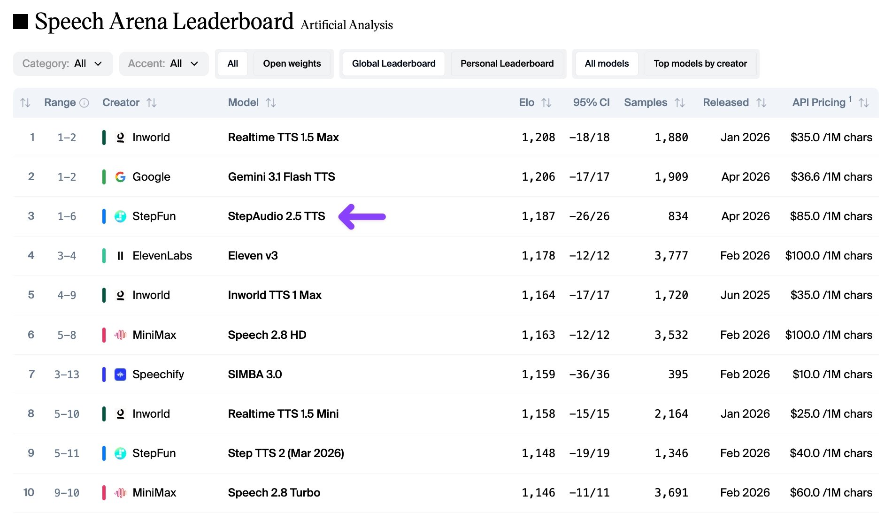
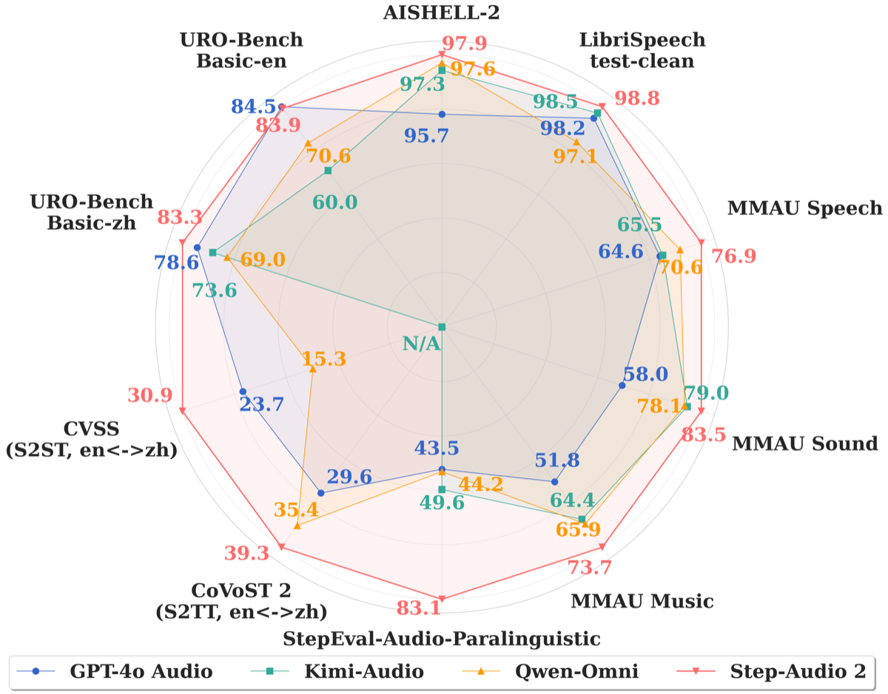

# StepAudio 2.5 TTS：盲测全球前三，中国语音模型第一次站上这个位置

> 2026 年 5 月 9 日，阶跃星辰（StepFun）的 StepAudio 2.5 TTS 在 Artificial Analysis 语音竞技场盲测中拿到 Elo 1187 分，全球第三，排在中国所有 TTS 模型之前。第一名是 Inworld Realtime TTS 1.5 Max（1208），第二名是 Google Gemini 3.1 Flash TTS（1206）。ElevenLabs Eleven v3 被挤到了第四。这件事的意义不在排名本身——而在于它指向了 TTS 竞争的核心变量正在从「谁的声音最多」转向「谁能控制语音的语境」。

---

## 先说结论：盲测，真人耳朵，第三名

Artificial Analysis Speech Arena 的机制很简单：

1. 给你同一段文字，两个匿名模型各生成一段语音
2. 你听了之后选哪个更自然
3. 至少听 3 秒才能投票
4. 胜者加分，败者减分——和国际象棋的 Elo 评级一样

截至 2026 年 5 月，这个竞技场收了 **75 个模型**，跑了数千轮对比。覆盖四个场景：客户服务、知识分享、数字助手、娱乐。覆盖两种口音：美式英语、英式英语。

**StepAudio 2.5 TTS 的成绩单**：

| 排名 | 模型 | 创建者 | Elo 分 |
|------|------|--------|--------|
| 1 | Realtime TTS 1.5 Max | Inworld | 1208 |
| 2 | Gemini 3.1 Flash TTS | Google | 1206 |
| **3** | **StepAudio 2.5 TTS** | **StepFun** | **1187** |
| 4 | Eleven v3 | ElevenLabs | 1178 |
| 5 | Inworld TTS 1 Max | Inworld | 1164 |

一个中国团队的 TTS 模型，在英文为主的盲测里拿到全球第三——这件事放在一年前几乎不可想象。

---

## StepAudio 2.5 到底做了什么不一样的事

StepAudio 2.5 的定位是 **Contextual TTS**——语境感知语音合成。2026 年 4 月 16 日发布。

传统的 TTS 是「念文本」：你给文字，它出声音。情感靠标签控制——开心、悲伤、愤怒，就这几个选项。听起来像播音员念稿子，不像人在说话。

StepAudio 2.5 做了一件不同的事：**用自然语言描述语境，替代传统标签体系。**



它有三种核心控制能力：

### 1. 全局语境控制（Global Context）

给整段语音定基调，用自然语言写就行。不是选标签，是写描述。

举个例子——同样是「悲伤」：

```
传统标签：  emotion = "sad"

StepAudio 2.5：  "克制的悲伤、没有哭腔、轻轻发颤"
```

这完全不是同一个粒度的控制。

### 2. 文中语境控制（Inline Context）

在文本里用圆括号 `()` 插入句内指令，逐句精控情绪、语气、节奏、停顿、呼吸感、重音。

```
"你好(温柔地)，我等了很久(轻微叹气，声音低沉)，你终于来了(带着一丝笑意)。"
```

每一句话的情绪走向，都能单独控制。

### 3. 零样本音色复刻

3 秒参考音频，就能克隆任意音色。复刻后的音色完整继承上述所有语境控制能力。

价格：**9.9 元/音色**。

---

## 技术架构：三个值得注意的设计

### 双档语境编码器

把「全局语境」和「文中语境」分开编码，通过注意力机制融合到语音生成模块里。

```
┌────────────────────────────────────────────────────┐
│                                                     │
│  "克制的悲伤、没有哭腔"     "(轻轻发颤)"              │
│         │                        │                  │
│    ┌────▼────┐             ┌────▼────┐              │
│    │全局语境  │             │文中语境  │              │
│    │编码器   │             │编码器    │              │
│    └────┬────┘             └────┬────┘              │
│         │                        │                  │
│         └────────┬───────────────┘                  │
│                  │                                  │
│           ┌──────▼──────┐                           │
│           │  注意力融合  │                           │
│           └──────┬──────┘                           │
│                  │                                  │
│           ┌──────▼──────┐                           │
│           │  语音生成    │                           │
│           └─────────────┘                           │
│                                                     │
└────────────────────────────────────────────────────┘
```

全局和文中分开处理这件事很重要。这意味着模型不会因为一句「轻声」就把整段都变得轻飘飘——语境控制是分层的，不会互相污染。

### 自回归 + MoE 稀疏激活

基于自回归多模态架构，结合稀疏激活的混合专家设计。只激活必要的参数，不浪费算力。

这跟 ERNIE 5.1 的弹性训练思路异曲同工——不是参数越多越好，是用更少的参数做更精准的事。

### 零样本适配器

用变分自编码器（VAE）提取音色特征，结合风格迁移技术，把情感和风格解耦。克隆的是音色，不绑定情绪——所以复刻出来的声音还能用自然语言调控情绪。

---

## 对比表：StepAudio 2.5 站在什么位置

| 维度 | StepAudio 2.5 TTS | Eleven v3 | Gemini 3.1 Flash TTS | OpenAI TTS-1 |
|------|-------------------|-----------|---------------------|-------------|
| Arena Elo | 1187（#3） | 1178（#4） | 1206（#2） | ~1101 |
| 情感控制 | 全局 + 文中双维度自然语言 | 预设情感 + 轻度调节 | - | 固定风格，调节有限 |
| 音色复刻 | 3 秒音频，9.9 元/音色 | 需较长样本，付费 | 不支持 | 不支持 |
| 预设音色 | 300+ | 丰富生态 | 有限 | 有限 |
| 流式延迟 | <200ms | ~300ms | - | ~250ms |
| 价格 | ¥5.8/万字符 | $100/百万字符 | $36.61/百万字符 | 按量计费 |
| 私有化部署 | 支持 | 不支持 | 不支持 | 不支持 |

几个关键差异：



- **价格**：StepAudio 2.5 的单字符成本大约是 ElevenLabs 的 1/20。对独立开发者和小团队来说，这是一个硬指标。
- **语境控制粒度**：Eleven v3 有情感调节，但是预设的。StepAudio 2.5 用自然语言描述，粒度完全不在一个级别。
- **私有化部署**：ElevenLabs 和 Google 都是纯云服务。StepAudio 2.5 支持本地部署——对企业客户来说，数据不出机房这件事很重要。

---

## 阶跃星辰是谁

值得花一分钟了解这家公司，因为它不太一样。

| 项目 | 详情 |
|------|------|
| 全称 | 上海阶跃星辰智能科技有限公司 |
| 成立 | 2023 年 4 月 |
| CEO | 姜大昕（微软前全球副总裁、首席科学家） |
| 首席科学家 | 张祥雨（ResNet 核心作者之一） |
| 董事长 | 印奇（旷视科技联合创始人） |
| 融资 | B+ 轮超 50 亿人民币，总融资约 17 亿美元 |
| 估值 | 投后约 200-300 亿人民币 |
| 模型装机 | 手机端超 4200 万台，日均服务近 2000 万人次 |
| IPO | 据报正在筹备香港上市 |

阶跃的策略是「多模态最强卷王」——不做单一模态，LLM、文生视频、语音交互全线铺开。Step Audio R1.1 已经连续 4 个月霸榜 Artificial Analysis Speech Reasoning 全球第一。

**StepAudio 2.5 TTS 是他们语音产品线的旗舰，不是试水产品。**

---

## 几个判断

**第一，「语境控制」是 TTS 的下一个主战场。** 传统 TTS 的竞争维度是「声音像不像人」。这个维度已经被打得差不多了——排名前五的模型，单听哪段都像真人。下一个差异化变量是「能不能像人一样有情绪变化」。StepAudio 2.5 的全局语境 + 文中语境双维度控制，是目前看到的最大胆的尝试。这不是优化，是范式变化。

**第二，盲测排名比 benchmark 排名更值得关注。** Benchmark 测的是模型在标准数据集上的表现——但谁日常用的文字是标准数据集？盲测让真人听、真人选，测的是「真实场景下听起来怎么样」。StepAudio 2.5 在盲测里排第三，比在任何 benchmark 上的排名都更有说服力。

**第三，价格战已经开始了。** StepAudio 2.5 的单字符成本大约是 ElevenLabs 的 1/20。ElevenLabs 在 TTS 领域一直是价格标杆——现在中国团队用 1/20 的价格做到了同级别的音质。对做产品的独立开发者来说，TTS 成本从「需要考虑的支出」变成了「几乎可以忽略的支出」。语音功能不再是预算问题，变成了产品决策问题。

**第四，3 秒克隆 + 9.9 元/音色，把音色复刻的门槛踩到了地板。** 之前做个性化语音，要么用平台预设音色，要么花几百块做声音克隆。现在 3 秒音频、不到 10 块钱。这意味着什么？**每个用户的语音助手都可以有独特的声音——不是选一个接近的，是直接用用户想要的声音。**

**第五，但有一个问题值得关注。** Artificial Analysis 的盲测主要覆盖英语场景（美式 + 英式口音）。StepAudio 2.5 作为一个以中文为核心优化的模型，在英语盲测里拿到第三确实厉害。但中文场景下的实际表现，需要更多中文用户的真实反馈来验证。**英语场景的好成绩 ≠ 所有场景的好成绩。**

---

## 试试看

StepAudio 2.5 TTS 已经全量上线：

- **阶跃开放平台**：[platform.stepfun.com](https://platform.stepfun.com)
- **API 接口**：非流式 `POST /v1/audio/speech`，流式 `WebSocket /v1/realtime/audio`
- **Step Plan 应用**：直接体验

开源方面，StepAudio 2.5 TTS 本身尚未完全开源，但阶跃在语音领域已有多个开源模型：

- **Step-Audio 2 mini**（Apache 2.0）：端到端语音对话模型，7B 参数
- **Step Audio EditX**：情绪风格语音编辑模型，开源榜 #2
- **Step Audio R1.1**：推理语音模型，连续 4 个月全球 #1

GitHub：[github.com/stepfun-ai/Step-Audio2](https://github.com/stepfun-ai/Step-Audio2)

---

*TTS 的竞争正在从「听起来像不像人」变成「能不能像人一样说话」。StepAudio 2.5 用自然语言替代标签体系，用 3 秒音频替代复杂克隆流程，用 1/20 的价格提供同级别的音质。排名第三不是终点——它指向的是语音交互的下一个阶段：从念稿子到表演。对做产品的人来说，这意味着语音功能不再是「锦上添花」，而是「可以做为核心体验」了。成本不再是门槛，想象力才是。*
