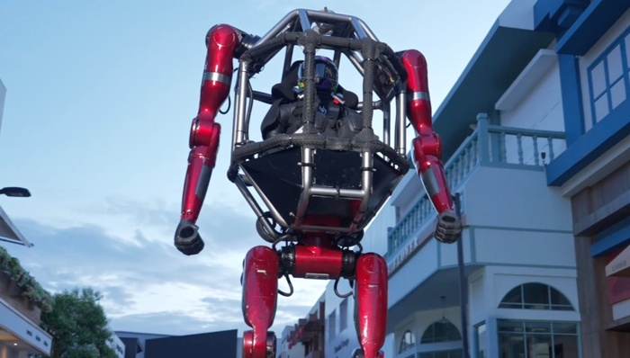
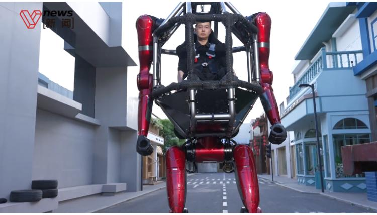

# 宇树 GD01：390 万的载人变形机甲，不是科幻预告片，是发货通知

> 当波士顿动力还在让机器人翻跟头录视频，中国公司已经把「开高达上班」做成了可以下单的产品。

## 390 万买一台「高达」，这事怎么想的？

5 月 12 日，宇树科技发布了 GD01 载人变形机甲——全球首款量产版载人机甲，定价 390 万元起。

390 万。这个数字第一眼看着离谱，但仔细想想，也就一台保时捷 911 GT3 的钱。区别在于，保时捷只能在地上跑，这台东西能站起来走。

先说参数：
- **载人后重量约 500kg**——差不多是一台大型摩托的体重
- **直立身高是成年人的 1.6 倍**——创始人王兴兴站在旁边只到机甲腰部
- **双模变形**：几秒内从双足直立切换到四足行走，不需要任何外力辅助
- **力量输出**：一拳锤倒实体砖墙，发力时机身纹丝不动

演示视频里，王兴兴亲自爬进机甲中部的载人操控舱，钢铁巨躯和人形成鲜明反差。机甲先是以人形姿态稳步行走，然后下压、折叠、重心调整——整套变形动作行云流水，没有任何卡顿。切换到四足模式后，照样带着人稳稳地走。

说实话，我第一次看到这个视频的反应不是「酷」，而是「他们居然真的做出来了」。

## 关键不是「能变形」，而是「能量产」

全球做机器人的公司不少，但大部分停留在两种状态：要么在实验室里做炫技演示（说的就是你，波士顿动力），要么做工业产线上的固定工位机械臂。

宇树不一样的地方在于：他们在认真地做「产品」。

看几个时间节点：

| 时间 | 事件 | 定价 |
|------|------|------|
| 2025 春晚 | 《秧BOT》机器人集群跳舞 | — |
| 2026 春晚 | 《武BOT》机器人表演武术 | — |
| 2026.04 | H1 机器人百米速度 10m/s | — |
| 2026.04 底 | 双臂人形机器人发布 | 2.69 万起 |
| 2026.05 | 开设北京王府井全国首家直营店 | — |
| 2026.05.08 | 开放全球首个机器人 App Store（UniStore） | — |
| 2026.05.12 | GD01 载人变形机甲发布 | 390 万起 |

注意这个产品线的价格分布——从 2.69 万的双臂机器人到 390 万的载人机甲，跨度超过 140 倍。这不是一个产品线，这是一个完整的「机器人矩阵」。

更低层的产品负责教育和普及市场，最高层的 GD01 负责「定义品类」。就像特斯拉的 Roadster 并不是走量车型，但它告诉所有人：电动车可以很酷。

## 背后的商业逻辑

宇树正在冲刺科创板 IPO，招股书里有些数字值得看：

- **2025 年营收 17.08 亿元**，同比增长 335%
- **扣非净利润 6 亿元**，同比增长 674%
- **自 2020 年以来每年都盈利**——在机器人行业，这几乎是奇迹
- **全球市场份额第二**：2025 年出货 4200 台，仅次于智元机器人的 5168 台

一个做机器人的公司，毛利率保持在 60% 左右，连续六年盈利，营收三年翻了十几倍。这不是一个烧钱换市场的互联网故事，这是一个制造业公司用技术壁垒吃利润的硬核叙事。

创始人王兴兴之前说过一句话：「降成本的关键不是规模经济，是产品设计。」当时很多人觉得他在吹牛。但看看宇树的产品线——G1 入门款 1.6 万美元，能塞进背包；双臂机器人 2.69 万人民币，末端夹爪精度 ±0.1mm。硬件成本控制到了让同行焦虑的程度。

## 为什么 GD01 是个信号，不是个噱头

你可能会说：390 万，谁买啊？

这个问题本身就暴露了一个思维惯性：我们在用「消费品」的逻辑看一台「平台级产品」。

GD01 的买家不会是个人消费者，至少短期内不会。第一批买家大概率是：
1. **主题乐园和文旅项目**——想象一下，迪士尼门口站着两台载人机甲迎宾
2. **影视制作公司**——实景拍摄不再需要 CG 后期
3. **应急救援和特种作业**——四足模式可以进入复杂地形
4. **科研机构**——作为具身智能的研究平台

更重要的是，GD01 解决了一个认知问题：**载人机器人不再只是概念**。

当波士顿动力的 Atlas 在后空翻的时候，所有人都在鼓掌，但没人觉得这东西会出现在自己生活里。宇树的策略完全不同——先让你在春晚看到机器人跳舞，再让机器人在王府井的实体店里等你来摸，然后告诉你「你可以坐进去」。

从看到、摸到、坐进去，用户心智的阶梯一步一步往上搭。

## 从独立开发者的视角看

作为一个用 AI 做产品的人，我从宇树身上看到的东西跟大多数人不一样。

大多数人看到的是硬件突破——载人机甲、变形机构、力量输出。我看到的是**产品节奏**。

宇树的产品发布节奏极其克制又极其精准：
- 不堆功能，每次只打透一个认知点
- 不追求单品的完美，追求产品线的覆盖率
- 不做亏钱的「战略产品」，每个价位段都是自洽的商业模式

这种产品哲学翻译到软件领域就是：先做 20 个 MVP 出来，让市场帮你筛选哪个值得深耕。不要在一开始就追求完美，先做出来，发出去，创造就有概率。

宇树的 GD01 可能卖不了多少台。但 390 万这个价格标签本身就在做一件事：**定义品类**。就像第一代 iPhone 发布时，乔布斯说「苹果重新发明了手机」——当时也没有多少人真的相信触屏手机会取代实体键盘。

## 一个值得想的问题

宇树把「开高达」做成了现实。但真正有意思的问题不是「能不能做出来」，而是：**当机器人可以载人行走、自主变形、锤倒砖墙的时候，我们用它来干什么？**

技术突破只是第一步。就像 ChatGPT 发布时所有人都在玩「让 AI 写诗」，但真正改变世界的是后来用它做产品、写代码、跑工作流的那批人。

硬件已经就位，软件生态刚刚起步（UniStore 的开放就是一个信号）。接下来的一年，看谁能在 GD01 上做出第一个「杀手级应用」。

那才是真正的游戏开始。

---

**参考来源**：
- [宇树科技发布载人变形机甲，390万元起 — 36氪](https://www.36kr.com/p/3805932505358082)
- [Unitree unveils world's first mass-produced manned mecha GD01 — CnTechPost](https://cntechpost.com/2026/05/12/unitree-unveils-worlds-first-mass-produced-manned-mecha-gd01/)
- [宇树发布GD01载人变形机甲，定价390万元起 — 观察者网](https://www.guancha.cn/industry-science/2026_05_12_816701.shtml)
