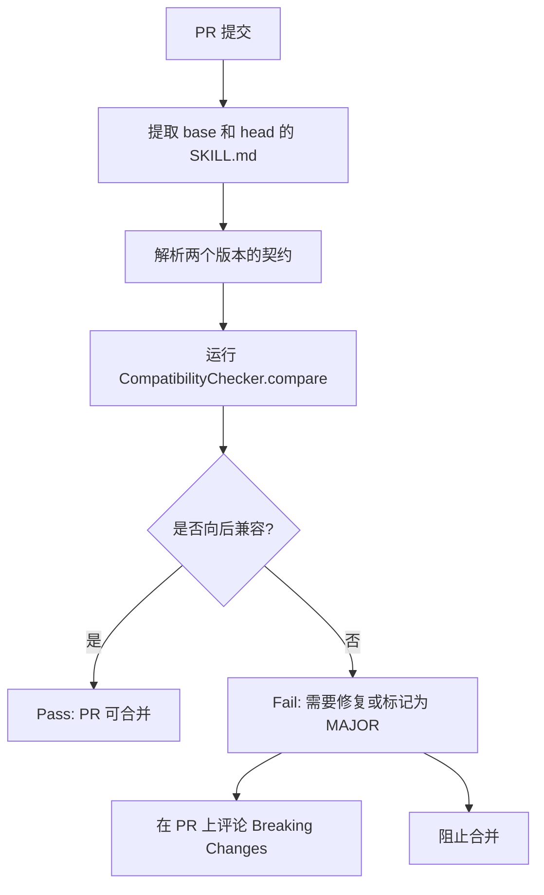

# Skill 依赖管理与版本治理

> 从"语义化版本"的基础概念延伸到 Skill 场景特有的三重依赖模型、多版本共存策略、循环检测算法与向后兼容的契约测试 | 预计阅读时间：35 分钟

---

## 一、引言

基础模块中我们介绍了 Skill 的版本号遵循 SemVer 规范、dependencies 字段支持版本范围声明。但在生产级的 Skill 治理中，版本和依赖管理远比"给版本号加个范围"要复杂：

- 软件包的版本语义和 Skill 的版本语义相同吗？一个"输出格式变更"应该升 MAJOR 还是 MINOR？
- 除了工具依赖，Skill 还依赖什么？运行时的 LLM 版本变化要不要体现在依赖中？
- 多个 Skill 依赖了同一个 Skill 的不同版本，如何共存？
- 如果 Skill A 依赖 Skill B，Skill B 又依赖 Skill A，怎么检测和处理？

本章建立完整的 Skill 依赖管理理论体系，涵盖 SemVer 的 Skill 适配、三重依赖解析、多版本共存、循环检测和契约测试。

---

## 二、SemVer 在 Skill 场景的特殊性

### 2.1 普通软件包 vs Skill 的版本语义差异

| 维度 | 软件包版本 | Skill 版本 |
|------|-----------|-----------|
| **版本载体** | 编译产物或分发包 | 一份 Markdown 文档 |
| **消费者** | 其他代码（import/require） | LLM Agent（阅读理解并执行） |
| **重大变更的根本来源** | API 签名或行为变化 | 策略行为或输出格式变化 |
| **兼容性的判断方式** | 编译检查或类型检查 | 契约测试 + 人工审核 |
| **依赖影响** | 可能导致下游编译失败 | 可能导致下游 Agent 行为偏差 |

软件包的版本兼容性最终归结为"能不能编译通过"，而 Skill 的版本兼容性归结为"Agent 的行为是否符合预期"。后者更加模糊，也更依赖自动化契约测试来界定。

### 2.2 策略变更 vs 接口变更

在 Skill 领域，需要区分两种不同类型的变更：

**接口变更（Interface Change）**：影响 Skill 与其他组件（Agent 框架、工具、消费者）交互方式的变更。
**策略变更（Policy Change）**：影响 Skill 内部执行逻辑但对外接口保持不变的变更。

```
接口变更的例子：
  - output 格式结构变化（如新增 required section）
  - tools 字段增减（移除必需工具）
  - scope 约束收紧（如限制语言范围）

策略变更的例子：
  - 审查步骤的优先级调整
  - 新增一种安全模式的检查
  - 优化错误处理流程的描述
```

### 2.3 什么情况下升 MAJOR/MINOR/PATCH

```
MAJOR: 破坏向后兼容的接口变更
  ├── output 格式变化（必需字段增删、结构重组）
  ├── 移除某个必需工具
  ├── 收紧输出约束（如降低 max_length）
  └── scope 约束条件增强（减少适用的场景）

MINOR: 向后兼容的功能增强
  ├── 新增可选输出段落
  ├── 新增语言支持（scope.languages 增加）
  ├── 新增可选工具依赖
  └── 放宽输出约束（如提升 max_length）

PATCH: 不影响功能的修正
  ├── 修复策略描述中的歧义
  ├── 降低误报率（优化模式匹配）
  ├── 修正拼写错误或格式问题
  └── 更新文档中的示例
```

### 2.4 示例场景

**场景一：输出格式变更**

```yaml
# v1.0 的输出
output:
  sections:
    - name: findings
      required: true   # 所有问题合并在一起

# v2.0 的输出（拆分为严重/警告/建议）
output:
  sections:
    - name: critical
      required: true   # 严重问题独立
    - name: warnings
      required: true   # 警告独立
    - name: suggestions
      required: false

# 影响：依赖 v1.0 输出的消费者需要修改解析逻辑
# 版本升级：1.0.0 → 2.0.0 (MAJOR)
```

**场景二：新增语言支持**

```yaml
# v1.0
scope:
  languages:
    - python

# v1.1
scope:
  languages:
    - python
    - typescript  # 新增

# 影响：已有使用者不受影响
# 版本升级：1.0.0 → 1.1.0 (MINOR)
```

**场景三：修复误报**

```yaml
# v1.1.0 的描述
instructions: |
  将 try-catch 中空的 catch 块标记为"警告"

# v1.1.1 的修正
instructions: |
  将 try-catch 中空的 catch 块标记为"建议"
  （空 catch 块可能是预留的错误处理位置，不应该标记为警告）

# 影响：降低了误报率，不影响功能
# 版本升级：1.1.0 → 1.1.1 (PATCH)
```

::: tip SemVer 的 Skill 适配建议
在 Skill 的 CHANGELOG 中，除了记录变更内容，还应该标注"这是接口变更还是策略变更"，帮助消费者判断升级的影响范围。
:::

---

## 三、三重依赖模型与解析算法

### 3.1 三重依赖的定义

Skill 的依赖关系比软件包更复杂，因为它不仅依赖"代码"，还依赖"能力"和"策略"。我们将其建模为**三重依赖模型**：

| 依赖类型 | 定义 | 示例 | 表示方式 |
|---------|------|------|---------|
| **工具依赖** | Skill 执行需要的 MCP/Function/API 工具 | `git_diff`, `search_code` | `tools` 字段 |
| **运行时依赖** | Skill 对执行环境的要求 | Python 3.10+, Claude model | `dependencies` 中 `type: runtime` |
| **策略依赖** | Skill 对其他 Skill 的依赖 | 前置 Skill、后置 Skill | `dependencies` 中 `type: skill` |

**工具依赖**是最直接的依赖——Skill 需要某些工具才能完成任务。如果缺少必需工具，Skill 无法执行。

**运行时依赖**决定了 Skill 在什么环境中可以运行。一个需要 Python 3.10+ AST 解析的 Skill，在只有 Python 3.8 的环境中无法正常工作。

**策略依赖**是 Skill 最独特的依赖类型。它表示"要完成这个任务，我需要先执行另一个 Skill（或在其结果基础上工作）"：

```
前置依赖（pre_skill）：执行当前 Skill 之前必须先执行
   例如：code_review 依赖 dependency_check（先检查依赖安全问题，再审查代码）

后置依赖（post_skill）：执行当前 Skill 之后应该接着执行的
   例如：code_review 之后执行 report_aggregator（汇总多个审查结果）
```

### 3.2 三重依赖在 SKILL.md 中的表示

```yaml
# 工具依赖
tools:
  - name: git_diff
    required: true
  - name: search_code
    required: true

# 运行时依赖
dependencies:
  - name: python-runtime
    version: ">=3.10"
    type: runtime
  - name: claude-model
    version: ">=claude-3-5-sonnet-20241022"
    type: runtime

# 策略依赖
  - name: dependency_check
    version: ">=1.2.0 <2.0.0"
    type: skill
    relationship: pre    # 前置依赖

  - name: report_aggregator
    version: ">=2.0.0"
    type: skill
    relationship: post   # 后置依赖
```

### 3.3 最小版本选择（MVS）算法

在软件包管理中，依赖解析的经典算法有 npm 的"嵌套依赖"和 Go 的"最小版本选择"（MVS）。Skill 场景更适合 MVS，原因如下：

1. Skill 的依赖树深度通常较浅（一般不超过 2-3 层）
2. Skill 的"破坏性"不如软件包严重（不会导致编译失败）
3. MVS 算法更简单，确定性强，不会出现"依赖地狱"

```python
from typing import Dict, List, Tuple, Optional
from collections import defaultdict

class MVSResolver:
    """最小版本选择（MVS）依赖解析器"""

    def __init__(self):
        # 注册表：name -> {version -> metadata}
        self.registry: Dict[str, Dict[str, dict]] = defaultdict(dict)

    def register_skill(self, name: str, version: str, deps: List[dict]):
        """注册一个 Skill 到注册表"""
        self.registry[name][version] = {
            "dependencies": deps,
            "processed": False,
        }

    def meets_constraint(self, version: str, constraint: str) -> bool:
        """
        检查 version 是否满足 constraint。
        简化实现，支持: >=, ~, ^, 固定版本
        """
        if constraint.startswith(">="):
            return self._compare_versions(version, constraint[2:]) >= 0
        elif constraint.startswith("~"):
            # ~2.1.0 表示 >=2.1.0 <2.2.0
            base = constraint[1:]
            parts = base.split(".")
            upper = f"{parts[0]}.{int(parts[1]) + 1}.0"
            return (self._compare_versions(version, base) >= 0 and
                    self._compare_versions(version, upper) < 0)
        elif constraint.startswith("^"):
            # ^1.2.0 表示 >=1.2.0 <2.0.0
            base = constraint[1:]
            parts = base.split(".")
            upper = f"{int(parts[0]) + 1}.0.0"
            return (self._compare_versions(version, base) >= 0 and
                    self._compare_versions(version, upper) < 0)
        else:
            return version == constraint

    def _compare_versions(self, v1: str, v2: str) -> int:
        """比较两个版本号"""
        parts1 = [int(x) for x in v1.split(".")]
        parts2 = [int(x) for x in v2.split(".")]
        for a, b in zip(parts1, parts2):
            if a < b:
                return -1
            elif a > b:
                return 1
        return 0

    def resolve(self, root_name: str, root_version: str) -> Dict[str, str]:
        """
        MVS 主算法：从根 Skill 开始，选择满足所有约束的最小版本。

        Returns:
            { skill_name: selected_version }
        """
        # 已选择版本映射
        selected: Dict[str, str] = {}
        # 待处理队列 [(name, version_constraint)]
        queue: List[Tuple[str, str]] = [
            (root_name, f">={root_version}")
        ]

        while queue:
            name, constraint = queue.pop(0)

            # 查找满足约束的版本
            available = sorted(
                self.registry[name].keys(),
                key=lambda v: [int(x) for x in v.split(".")]
            )
            candidate = None
            for v in available:
                if self.meets_constraint(v, constraint):
                    candidate = v
                    break  # MVS：选最小的满足版本

            if candidate is None:
                raise ValueError(
                    f"No version of '{name}' satisfies {constraint}"
                )

            # 如果已经选择了一个版本，保留更大的那个
            if name in selected:
                if self._compare_versions(candidate, selected[name]) < 0:
                    continue  # 新候选版本更小，忽略
                elif self._compare_versions(candidate, selected[name]) == 0:
                    continue  # 版本相同，无需处理
                # 新候选版本更大：需要升级
                # 但需要检查是否破坏已解析的依赖
                selected[name] = candidate
            else:
                selected[name] = candidate

            # 遍历该版本的依赖，加入队列
            skill_meta = self.registry[name][candidate]
            for dep in skill_meta["dependencies"]:
                dep_name = dep["name"]
                dep_constraint = dep.get("version", ">=0.0.0")
                queue.append((dep_name, dep_constraint))

        return selected
```

### 3.4 MVS 与 npm / Go 依赖管理的对比

| 特性 | npm | Go Modules | Skill MVS |
|------|-----|-----------|-----------|
| **默认策略** | 嵌套最小化 | 最小版本选择 | 最小版本选择 |
| **多版本共存** | 是（嵌套 node_modules） | 否（单版本） | 是（命名空间隔离） |
| **处理冲突** | 安装多个版本 | 选择满足所有人的最大版本 | 选择最小满足版本 |
| **lock 文件** | package-lock.json | go.sum | skill-lock.json |
| **算法复杂度** | 高（NP-hard 近似） | 低（线性扫描） | 低（BFS + MVS） |
| **确定性** | 不是（依赖安装顺序） | 是 | 是 |

---

## 四、多版本共存策略

### 4.1 为什么需要多版本共存

在大型组织中，不同团队可能依赖同一个 Skill 的不同大版本：

```
团队 A：使用 code_review@1.x（输出 old format）
团队 B：使用 code_review@2.x（输出 new format）

问题：如果系统中只能有一个版本的 code_review，
     要么团队 A 被迫升级（可能来不及适配），
     要么团队 B 无法使用新功能。
```

### 4.2 命名空间隔离

通过命名空间实现版本隔离，这是最直接的多版本共存方案：

```yaml
# 命名空间格式：org/team/skill@version
# 或简写：skill@version

# 团队 A 的依赖
dependencies:
  - name: security-team/code_review@v1
    version: ">=1.0.0 <2.0.0"

# 团队 B 的依赖
dependencies:
  - name: security-team/code_review@v2
    version: ">=2.0.0 <3.0.0"
```

**命名空间的解析规则**：
- 解析时 `skill@version` 被映射为实际的 Skill 路径
- 不同 namespace 下的同名 Skill 被视为不同的标识符
- 运行时隔离存储各自的元信息、工具注册和输出格式

### 4.3 版本别名与重定向

为了简化日常使用，引入版本别名机制：

```yaml
# 预定义的版本别名
aliases:
  latest: "security-team/code_review@v2"   # 指向最新推荐版本
  stable: "security-team/code_review@v1"   # 指向稳定版本
  beta: "security-team/code_review@v3"     # 指向预览版本
```

别名的作用：

```
用户在 SKILL.md 中引用：
  dependencies:
    - name: code_review
      version: "~2.1.0"

实际解析为：
  security-team/code_review@v2 (版本 2.1.5)

当官方发布 v3.0.0 时：
  - "latest" 别名更新为 v3
  - "stable" 别名保留在 v2
  - 用户可以主动切换
```

### 4.4 Skill 版本锁定文件（skill-lock.json）

与 npm 的 `package-lock.json` 类似，Skill 系统需要一个锁定文件来记录实际解析的依赖树：

```json
{
  "name": "my-project",
  "lockfileVersion": 1,
  "skills": {
    "code_review": {
      "version": "2.1.5",
      "resolved": "https://skills-registry.example.com/security-team/code_review/2.1.5/SKILL.md",
      "integrity": "sha256-abc123...",
      "dependencies": {
        "search_context": "1.3.0"
      }
    },
    "test_generation": {
      "version": "1.0.2",
      "resolved": "https://skills-registry.example.com/qa-team/test_generation/1.0.2/SKILL.md",
      "integrity": "sha256-def456...",
      "dependencies": {}
    }
  }
}
```

**锁定文件的作用**：

1. **构建可复现性**：所有开发者使用相同的依赖版本
2. **完整性验证**：通过 `integrity` 哈希验证 SKILL.md 内容未被篡改
3. **离线安装**：文件内容已被缓存，无需网络请求即可加载
4. **审计追踪**：记录每个依赖的来源和版本，满足合规要求

---

## 五、循环依赖检测

### 5.1 静态检测：DFS 环检测算法

循环依赖（A 依赖 B，B 又依赖 A）是依赖管理中需要最先解决的问题。在 Skill 注册阶段就应该进行静态环检测。

```python
from typing import Dict, List, Set, Tuple, Optional

class CircularDependencyDetector:
    """
    使用 DFS 三色标记法检测 Skill 依赖图中的循环依赖。
    
    颜色标记：
      WHITE: 未访问
      GRAY:  正在访问（在当前递归栈中）
      BLACK: 访问完成（所有子节点都已处理）
    """

    def __init__(self):
        self.graph: Dict[str, List[str]] = {}

    def add_dependency(self, skill_name: str, depends_on: str):
        """添加一条依赖边：skill_name -> depends_on"""
        if skill_name not in self.graph:
            self.graph[skill_name] = []
        self.graph[skill_name].append(depends_on)

    def detect(self) -> List[List[str]]:
        """
        检测所有循环依赖。

        Returns:
            循环路径列表，每个循环是一个 Skill name 列表。
            如果无循环，返回空列表。
        """
        WHITE, GRAY, BLACK = 0, 1, 2
        color: Dict[str, int] = {node: WHITE for node in self.graph}
        cycles: List[List[str]] = []
        path: List[str] = []

        def dfs(node: str):
            color[node] = GRAY
            path.append(node)

            for neighbor in self.graph.get(node, []):
                if neighbor not in color:
                    # 邻居未在图中注册——可能是外部依赖，跳过
                    continue

                if color[neighbor] == GRAY:
                    # 发现循环：从 neighbor 到 node 的路径
                    cycle_start = path.index(neighbor)
                    cycle = path[cycle_start:]
                    cycles.append(cycle)
                elif color[neighbor] == WHITE:
                    dfs(neighbor)

            color[node] = BLACK
            path.pop()

        for node in self.graph:
            if color[node] == WHITE:
                dfs(node)

        return cycles

    def suggest_fix(self, cycle: List[str]) -> str:
        """
        对检测到的循环依赖给出修复建议。
        """
        n = len(cycle)
        suggestions = []

        for i in range(n):
            current = cycle[i]
            next_skill = cycle[(i + 1) % n]
            suggestions.append(
                f"选项 {i+1}: 移除 '{current}' 对 '{next_skill}' 的依赖，"
                f"或将此依赖改为可选（非必需）"
            )

        suggestions.append(
            f"选项 {n+1}: 将循环中的 Skills "
            f"({', '.join(cycle)}) 合并为一个原子 Skill"
        )

        return "\n".join(suggestions)


# 使用示例
detector = CircularDependencyDetector()

# 构建依赖图
detector.add_dependency("code_review", "search_context")
detector.add_dependency("search_context", "index_codebase")
detector.add_dependency("index_codebase", "code_review")  # 循环！

cycles = detector.detect()
if cycles:
    print(f"检测到 {len(cycles)} 个循环依赖:")
    for cycle in cycles:
        print(f"  循环: {' -> '.join(cycle)}")
        print(f"  修复建议:\n{detector.suggest_fix(cycle)}")
else:
    print("无循环依赖")
```

### 5.2 动态处理：运行时循环引用解决

即使通过了静态检测，某些场景下仍可能在运行时产生循环引用——例如动态加载的 Skill 或插件。此时需要运行时解决方案：

```python
from typing import Dict, Any, Optional
from functools import lru_cache

class RuntimeCircularResolver:
    """
    运行时循环引用解决：使用代理 + 延迟解析。
    
    原理：
      当检测到循环引用时，不立即解析依赖，而是创建一个代理对象。
      代理对象会在实际被调用时再进行解析。
    """

    def __init__(self):
        self._skill_registry: Dict[str, Any] = {}
        self._resolution_depth: Dict[str, int] = {}
        self._max_depth = 10

    def register_skill(self, name: str, skill_instance: Any):
        """注册 Skill 实例"""
        self._skill_registry[name] = skill_instance
        self._resolution_depth[name] = 0

    def resolve_dependency(self, name: str, caller: str) -> Any:
        """
        解析 Skill 依赖，带有循环检测和深度保护。
        """
        if name not in self._skill_registry:
            raise ValueError(f"Skill '{name}' not found")

        # 检查是否已经在这个调用链中
        if self._resolution_depth.get(name, 0) > self._max_depth:
            raise RecursionError(
                f"检测到可能的循环依赖: {name} "
                f"(解析深度超过 {self._max_depth})"
            )

        # 增加调用深度
        self._resolution_depth[name] = (
            self._resolution_depth.get(name, 0) + 1
        )

        try:
            skill = self._skill_registry[name]

            # 如果 Skill 有延迟加载的标志，触发加载
            if hasattr(skill, 'lazy') and skill.lazy:
                self._load_lazy_skill(name)

            return skill
        finally:
            # 减少调用深度
            self._resolution_depth[name] -= 1

    def _load_lazy_skill(self, name: str):
        """延迟加载 Skill"""
        # 实际实现中，这里会读取 SKILL.md 文件并解析
        pass


# 更轻量级的方案：代理类
class SkillProxy:
    """
    Skill 的代理对象，用于延迟解析。
    直到属性被访问时才真正加载 Skill。
    """

    def __init__(self, skill_name: str, resolver: RuntimeCircularResolver):
        self._skill_name = skill_name
        self._resolver = resolver
        self._real_skill = None

    def _ensure_loaded(self):
        if self._real_skill is None:
            self._real_skill = self._resolver.resolve_dependency(
                self._skill_name, "proxy"
            )
        return self._real_skill

    def __getattr__(self, name):
        return getattr(self._ensure_loaded(), name)

    def __call__(self, *args, **kwargs):
        return self._ensure_loaded()(*args, **kwargs)
```

::: warning 运行时循环的代价
运行时循环检测是"最后的防线"。它无法替代静态检测——运行时才发现循环依赖意味着 Skill 加载到一半可能失败，造成 Token 浪费和用户体验下降。**正确的实践是：在 CI/CD 中运行静态环检测，确保任何循环依赖在合并前就被发现。**
:::

---

## 六、向后兼容的契约测试

### 6.1 What Counts as a Breaking Change in Skill 领域

在 Skill 领域，破坏性变更的定义比软件包更宽泛。以下变更都被视为 Breaking Change：

**Schema 级别（明确可检测）**：
1. 移除或重命名必需的工具
2. 输出格式中删除必需 section
3. 收紧输出约束（如 `max_length: 500` 改为 `max_length: 200`）
4. scope 约束增强（如减少支持的语言）

**行为级别（需要人工审核）**：
1. 执行步骤的优先级变化导致输出结果不同
2. 对同一输入给出不同的判定标准
3. 错误处理策略的改变（如从"跳过文件"改为"终止执行"）
4. 默认参数值的变化

### 6.2 兼容性验证套件设计

契约测试的核心是比较两个版本的输入/输出 Schema：

```python
from typing import Dict, Any, List, Optional
from dataclasses import dataclass, field

@dataclass
class SkillContract:
    """Skill 的输入输出契约定义"""
    name: str
    version: str

    # 输入规范
    required_tools: List[str] = field(default_factory=list)
    optional_tools: List[str] = field(default_factory=list)

    # 输出规范
    required_sections: List[str] = field(default_factory=list)
    optional_sections: List[str] = field(default_factory=list)
    output_constraints: Dict[str, Dict[str, Any]] = field(
        default_factory=dict
    )

    # 运行时约束
    scope_languages: List[str] = field(default_factory=list)
    max_file_lines: Optional[int] = None
    timeout: Optional[int] = None


class CompatibilityChecker:
    """兼容性验证套件"""

    def __init__(self):
        self.breaking_changes: List[str] = []
        self.warnings: List[str] = []

    def compare(self, old: SkillContract, new: SkillContract) -> bool:
        """
        比较新旧版本契约，判断是否向后兼容。

        Returns:
            True 如果向后兼容，False 如果包含破坏性变更
        """
        self.breaking_changes = []
        self.warnings = []

        # 1. 检查必需工具
        for tool in old.required_tools:
            if tool not in new.required_tools:
                self.breaking_changes.append(
                    f"必需工具 '{tool}' 被移除或降级为可选"
                )

        # 2. 检查输出 section
        for section in old.required_sections:
            if section not in new.required_sections:
                self.breaking_changes.append(
                    f"必需输出段落 '{section}' 被移除或降级为可选"
                )
            elif section in new.optional_sections:
                self.breaking_changes.append(
                    f"必需输出段落 '{section}' 降级为可选"
                )

        for section in old.optional_sections:
            if section in new.required_sections:
                self.warnings.append(
                    f"可选段落 '{section}' 升级为必需（可行但不推荐）"
                )

        # 3. 检查输出约束收紧
        for section, constraints in old.output_constraints.items():
            new_constraints = new.output_constraints.get(section, {})

            old_max = constraints.get("max_length")
            new_max = new_constraints.get("max_length")
            if old_max and new_max and new_max < old_max:
                self.breaking_changes.append(
                    f"段落 '{section}' 的 max_length 从 {old_max} "
                    f"收紧至 {new_max}"
                )

            old_min = constraints.get("min_items")
            new_min = new_constraints.get("min_items")
            if old_min and new_min and new_min > old_min:
                self.breaking_changes.append(
                    f"段落 '{section}' 的 min_items 从 {old_min} "
                    f"提升至 {new_min}"
                )

        # 4. 检查 scope 约束收紧
        if old.scope_languages and new.scope_languages:
            removed_langs = set(old.scope_languages) - set(
                new.scope_languages
            )
            if removed_langs:
                self.breaking_changes.append(
                    f"移除语言支持: {removed_langs}"
                )

        if old.max_file_lines and new.max_file_lines:
            if new.max_file_lines < old.max_file_lines:
                self.breaking_changes.append(
                    f"max_file_lines 从 {old.max_file_lines} "
                    f"收紧至 {new.max_file_lines}"
                )

        return len(self.breaking_changes) == 0

    def report(self) -> str:
        """生成兼容性报告"""
        lines = []
        if self.breaking_changes:
            lines.append("## Breaking Changes")
            for i, change in enumerate(self.breaking_changes, 1):
                lines.append(f"{i}. {change}")

        if self.warnings:
            lines.append("\n## Warnings")
            for i, warning in enumerate(self.warnings, 1):
                lines.append(f"{i}. {warning}")

        if not self.breaking_changes and not self.warnings:
            lines.append("完全向后兼容，无破坏性变更或警告。")

        return "\n".join(lines)
```

### 6.3 自动化兼容性 CI 检查

将兼容性检查集成到 CI 流水线中，确保每次 Skill 变更都能自动验证向后兼容性：

```yaml
# .github/workflows/skill-compatibility.yml
name: Skill Compatibility Check

on:
  pull_request:
    paths:
      - 'skills/**/SKILL.md'

jobs:
  check-compatibility:
    runs-on: ubuntu-latest
    steps:
      - uses: actions/checkout@v4
        with:
          fetch-depth: 0  # 需要获取 base 分支用于比较

      - name: Extract Skill contracts
        run: |
          # 提取当前分支和 base 分支的 SKILL.md 契约
          git show HEAD:skills/code_review/SKILL.md > current_skill.md
          git show origin/main:skills/code_review/SKILL.md > base_skill.md

      - name: Run compatibility check
        run: |
          python -m skill_ci.compatibility_check \
            --old base_skill.md \
            --new current_skill.md \
            --report compatibility-report.md

      - name: Comment PR
        if: always()
        uses: actions/github-script@v7
        with:
          script: |
            const fs = require('fs');
            const report = fs.readFileSync(
              'compatibility-report.md', 'utf8'
            );
            github.rest.issues.createComment({
              issue_number: context.issue.number,
              owner: context.repo.owner,
              repo: context.repo.repo,
              body: report
            });
```

**完整的 CI 检查流程**：



---

## 思考题

::: info 检验你的理解

1. 一个安全审计 Skill 的 v1.0 输出包含 `critical_findings`（必需）和 `advisory_findings`（可选）。v2.0 中新增了 `compliance_findings`（必需）。这个变更需要升 MAJOR 还是 MINOR？如果 `compliance_findings` 是可选的呢？

2. 假设三个 Skill 的依赖关系如下：`A` 依赖 `B@>=1.0.0 <2.0.0` 和 `C@>=2.0.0`，`B` 依赖 `C@>=1.0.0 <3.0.0`。注册表中 `C` 有版本 1.0.0、1.5.0、2.0.0、2.5.0、3.0.0。请用 MVS 算法计算最终选择的 `C` 版本，并解释为什么。

3. 循环依赖检测中发现了一个 3 节点环：`A -> B -> C -> A`。分析这个环的可能成因：是设计错误（两个 Skill 职责划分不清），还是合理的相互引用（A 提供数据，B 分析数据，C 汇总结果并以某种形式回传给 A）？如何区分这两种情况？

4. 契约测试中发现，v2.0 的 `max_file_lines` 从 1000 收紧到了 500。但 Skill 作者认为这是一次"修复"而不是"破坏性变更"，因为之前的 1000 行限制"太宽松了，实际上 Skill 无法处理 1000 行的文件"。你如何仲裁这个分歧？在 Skill 的契约中，应该如何定义"声明即承诺"的原则？

:::

---

## 本章小结

- ✅ Skill 的版本语义与软件包不同：关注的是行为/输出格式，而非 API 签名
- ✅ 输出格式变更提升 MAJOR，新增语言支持提升 MINOR，修复误报提升 PATCH
- ✅ 三重依赖模型包括工具依赖、运行时依赖和策略依赖，每种依赖的解析策略不同
- ✅ MVS（最小版本选择）算法适用于 Skill 场景，确定性强，实现简单
- ✅ 多版本共存通过命名空间隔离实现，版本别名和 skill-lock.json 提供补充
- ✅ 循环依赖检测使用 DFS 三色标记法，运行时通过代理 + 延迟解析处理
- ✅ 向后兼容的契约测试覆盖 Schema 级别（工具、输出、约束）和行为级别（策略变化）
- ✅ 自动化 CI 检查确保每次 Skill 变更都能通过兼容性验证

---

## 参考资料

- [SemVer.org - Semantic Versioning 2.0.0](https://semver.org/) - 语义化版本规范
- [Go Modules: Minimal Version Selection (MVS)](https://research.swtch.com/vgo-mvs) - Go 团队关于 MVS 的深入讲解
- [npm Blog: package-lock.json](https://docs.npmjs.com/cli/v11/configuring-npm/package-lock-json) - npm 锁定文件规范
- [Cormen, T. H. et al. (2009). Introduction to Algorithms (3rd ed.). MIT Press.](https://mitpress.mit.edu/books/introduction-algorithms-third-edition) - 图论与 DFS 环检测算法
- [Anthropic. (2025). Agent Skills Open Standard - Dependency Management.](https://agentskills.io) - Skills 标准中的依赖管理章节
- [Fowler, M. (2004). Inversion of Control Containers and the Dependency Injection Pattern.](https://martinfowler.com/articles/injection.html) - 依赖解析的通用模式参考
