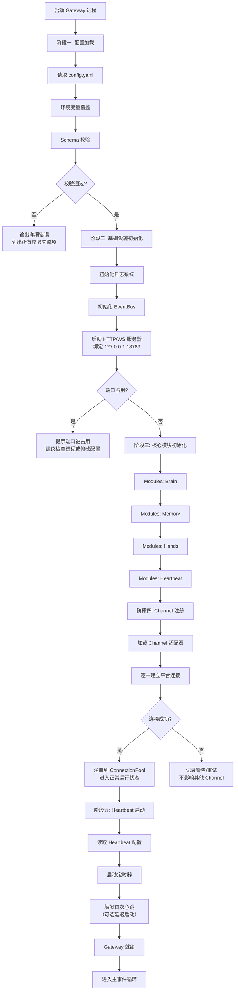
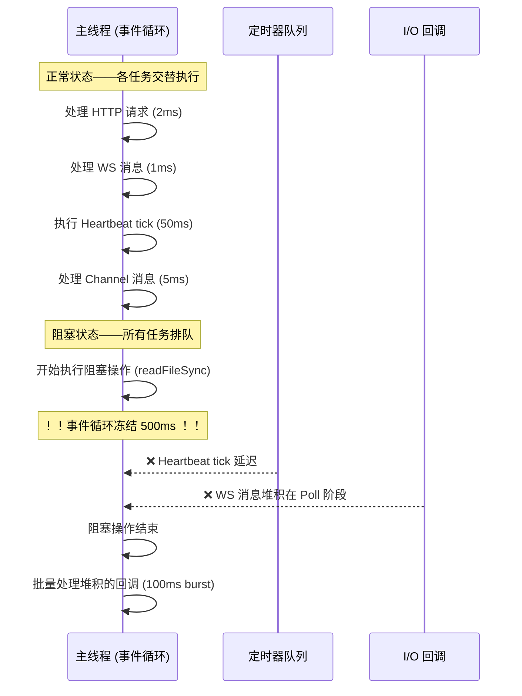
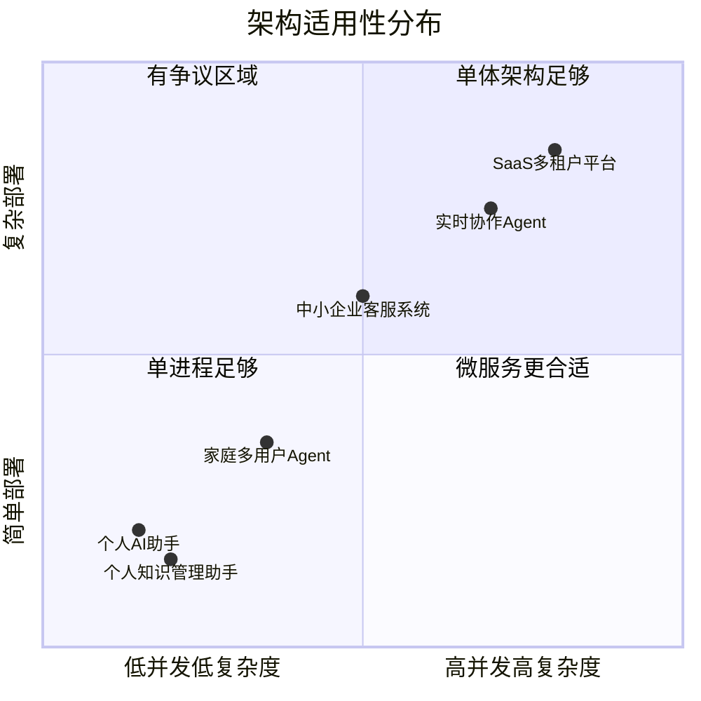
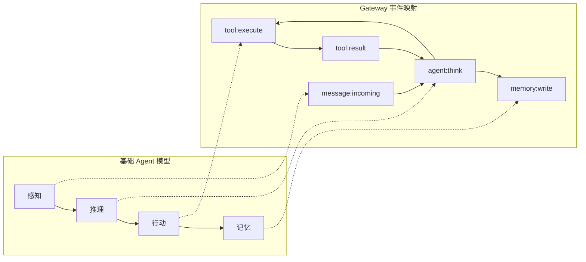

# Gateway 架构深度剖析

> **本章导读**: 基础模块中我们了解了 OpenClaw "是什么"——一个 Gateway 中心架构的单进程 AI 助手运行时。本章将从源码实现层面深入回答"为什么"和"怎么做"：Gateway 的单进程事件循环如何运转？模块之间如何发现和通信？端口 18789 背后发生了什么？为什么单进程对于个人助手是正确的选择，它的性能边界在哪里？
>
> **前置知识**: 基础模块 10-02 架构概览、Node.js 事件循环基础
>
> **难度等级**: ⭐⭐⭐⭐☆

---

## 一、Gateway 的进程模型与事件循环机制

### 1.1 不是一个普通的 Node.js 进程

OpenClaw Gateway 是一个常驻后台的守护进程（daemon）。它区别于普通 Node.js Web 服务的关键在于：**它同时维护了多条长期存活的数据通路**。

```
┌─────────────────────────────────────────────────────────────────┐
│                    OpenClaw Gateway Process                       │
│                                                                   │
│  ┌───────────────────────────────────────────────────────────┐   │
│  │                  Node.js Event Loop                         │   │
│  │                                                             │   │
│  │  ┌──────────┐  ┌──────────┐  ┌──────────┐  ┌──────────┐   │   │
│  │  │  Timer   │  │   I/O    │  │  Idle    │  │   Poll   │   │   │
│  │  │  Phase   │  │  Callback │  │  Prepare │  │   Phase  │   │   │
│  │  └──────────┘  └──────────┘  └──────────┘  └──────────┘   │   │
│  │                                                             │   │
│  │  ┌──────────┐  ┌──────────────────────────────────────┐    │   │
│  │  │  Check   │  │        Close Callbacks               │    │   │
│  │  │ (setImmd)│  │                                       │    │   │
│  │  └──────────┘  └──────────────────────────────────────┘    │   │
│  └───────────────────────────────────────────────────────────┘   │
│                                                                   │
│  ┌──────────────┐  ┌──────────────┐  ┌──────────────────────┐    │
│  │  WS Server   │  │  HTTP Server │  │  EventBus (内存)     │    │
│  │  (18789)     │  │  (18789)     │  │  内部消息路由        │    │
│  └──────┬───────┘  └──────┬───────┘  └──────────┬───────────┘    │
│         │                 │                      │               │
│         ▼                 ▼                      ▼               │
│  ┌───────────────────────────────────────────────────────────┐   │
│  │                   Module Registry                          │   │
│  │  ┌──────────┐ ┌──────────┐ ┌──────────┐ ┌──────────────┐ │   │
│  │  │  Brain   │ │  Hands   │ │  Memory  │ │  Heartbeat   │ │   │
│  │  │ (LLM层)  │ │ (工具执行)│ │ (记忆层) │ │ (调度引擎)   │ │   │
│  │  └──────────┘ └──────────┘ └──────────┘ └──────────────┘ │   │
│  │  ┌──────────────────────────────────────────────────────┐ │   │
│  │  │              Channels Manager                        │ │   │
│  │  │     Telegram │ WhatsApp │ Discord │ Slack │ ...     │ │   │
│  │  └──────────────────────────────────────────────────────┘ │   │
│  └───────────────────────────────────────────────────────────┘   │
└─────────────────────────────────────────────────────────────────┘
```

关键区别在于：传统 Web 服务在请求-响应周期结束后就可以释放上下文，而 Gateway 必须**持续持有多个长连接的生命周期**——每个 WebSocket 连接、每个消息平台的会话、每个 Heartbeat 定时器都是长期的资源占用者。这意味着 Gateway 的事件循环不是"处理完一批请求就空闲"，而是在绝大多数时间内都有待处理的异步操作在队列中。

### 1.2 事件总线：模块间的通信骨架

Gateway 内部使用**事件总线（EventBus）模式**实现模块间通信。这不是一个独立的外部消息队列，而是在进程内存中实现的一个发布-订阅系统。

```typescript
// 简化的 EventBus 核心接口
interface EventBus {
  // 订阅事件
  subscribe(event: string, handler: EventHandler, options?: {
    priority?: number;      // 优先级，数字越小越先执行
    once?: boolean;         // 是否只执行一次
  }): Subscription;

  // 发布事件（同步或异步）
  emit(event: string, payload: any): void;

  // 请求-响应模式（等待某个模块的返回）
  request<T>(event: string, payload: any): Promise<T>;

  // 取消订阅
  unsubscribe(subscription: Subscription): void;
}
```

Gateway 中定义的核心事件类型如下：

| 事件名称 | 方向 | 触发时机 | 载荷示例 |
|---------|------|---------|---------|
| `message:incoming` | Channel → Gateway | 收到用户消息 | `{ channel: "telegram", text: "...", userId: "..." }` |
| `agent:think` | Gateway → Brain | 需要 Agent 推理 | `{ messages: [...], context: {...} }` |
| `tool:execute` | Brain → Hands | 需要执行工具 | `{ tool: "web_search", args: { query: "..." } }` |
| `tool:result` | Hands → Brain | 工具执行完成 | `{ tool: "web_search", result: {...} }` |
| `memory:read` | Gateway → Memory | 读取记忆 | `{ keys: ["recent", "preferences"] }` |
| `memory:write` | Gateway → Memory | 写入记忆 | `{ key: "conversation", value: {...} }` |
| `heartbeat:tick` | Heartbeat → Gateway | 定时心跳触发 | `{ timestamp: 1714800000 }` |
| `channel:register` | Channel → Gateway | 通道连接成功 | `{ channel: "discord", status: "connected" }` |
| `system:error` | 任意 → Gateway | 模块内错误 | `{ module: "brain", error: "LLM timeout" }` |
| `presence:update` | 节点 → Gateway | 连接状态变化 | `{ node: "ios-phone", status: "online" }` |

事件总线的关键实现细节：

**优先级调度**：Brain 模块在监听 `message:incoming` 时可能会注册较高优先级，确保在 Memory 预加载上下文之后立即开始推理。Memory 的 `memory:read` 处理器可能有一个中间优先级——它需要在 Brain 开始工作前准备好上下文。

**同步 vs 异步发射**：`emit` 是同步的，在同一个事件循环 tick 中执行所有处理器。`request` 是异步的，返回一个 Promise，允许跨模块的请求-响应模式。这对 Brain → Hands 的调用特别重要——Brain 发出 `tool:execute` 后 await `tool:result`，而 Hands 可能需要在多个事件循环 tick 中完成工具调用。

**背压处理**：当某个模块的处理速度跟不上事件生产速度时，事件总线可以提供简单的背压机制。例如，Heartbeat 产生的 `heartbeat:tick` 如果前一个 tick 的 Agent 推理尚未完成，Heartbeat 模块会跳过本次 tick（而不是在总线上堆积事件）。

```typescript
// 背压机制的简化示意
class HeartbeatModule {
  private processing = false;

  onTick() {
    if (this.processing) {
      logger.warn('Previous heartbeat still processing, skipping tick');
      return;
    }
    this.processing = true;
    eventBus.emit('heartbeat:tick', { timestamp: Date.now() });
    // Agent 处理完成后由完成回调重置 processing 状态
  }
}
```

### 1.3 模块注册与发现

模块在 Gateway 启动时通过 `ModuleRegistry` 注册。注册不是一个运行时服务发现过程（不需要 DNS、Consul 等外部组件），而是一个在启动阶段完成的静态注册过程。

```typescript
// ModuleRegistry 的简化的注册流程
interface Module {
  name: string;
  version: string;
  dependencies: string[];       // 依赖的其他模块
  initialize(): Promise<void>;
  destroy(): Promise<void>;
}

class ModuleRegistry {
  private modules: Map<string, Module> = new Map();

  register(module: Module): void {
    this.modules.set(module.name, module);
  }

  async initializeAll(): Promise<void> {
    // 按依赖拓扑排序初始化
    const sorted = this.topologicalSort();
    for (const module of sorted) {
      await module.initialize();
      eventBus.emit(`module:ready`, { name: module.name });
    }
  }

  resolve(name: string): Module | undefined {
    return this.modules.get(name);
  }
}
```

这个机制的核心优势：**模块之间没有硬编码的 import 依赖**。Brain 不需要 "require" Hands 模块，它们通过事件总线松耦合。这使得每个模块可以独立开发、独立测试，只要遵循事件契约即可。

---

## 二、端口 18789：服务发现与连接管理

### 2.1 为什么是同一个端口

Gateway 的 HTTP 服务器和 WebSocket 服务器共享同一个 TCP 端口 18789。这是通过 `http.Server` 的 `upgrade` 事件实现的：到达的 HTTP 请求正常处理，而带有 `Upgrade: websocket` 头的请求会被升级为 WebSocket 连接。

```typescript
// 共享端口的核心机制（概念示意）
import http from 'http';
import { WebSocketServer } from 'ws';

const server = http.createServer((req, res) => {
  // 普通 HTTP 请求处理
  // - /__openclaw__/canvas/  → Canvas 托管
  // - /__openclaw__/a2ui/    → A2UI 接口
  // - /health                → 健康检查
  // - 其他                   → 管理 API
});

const wss = new WebSocketServer({ server });

wss.on('connection', (ws, req) => {
  // WebSocket 连接处理
  // - clients: 控制面客户端（macOS CLI、Web UI）
  // - nodes: 设备节点（iOS/Android/headless）
  // - channels: 消息平台适配器（某些实现）
});

server.listen(18789, '127.0.0.1');
```

::: tip 为什么默认绑定 127.0.0.1？
Gateway 默认只监听本地回环地址，这意味着只有本机进程可以连接。这是安全设计——你的 AI 助手不应该暴露在公网上。如果需要远程访问，可以通过 SSH 隧道或配置 VPN，而不是直接修改监听地址。
:::

### 2.2 WebSocket 长连接 vs HTTP 短连接

Gateway 混合使用两种连接方式，服务于不同的目的：

| 特性 | WebSocket 长连接 | HTTP 短连接 |
|------|-----------------|------------|
| 连接生命周期 | 长期（小时/天） | 单次请求-响应 |
| 适用对象 | 消息平台 Channel、客户端控制面、节点设备 | Health Check、Canvas 页面、A2UI 请求 |
| 消息模式 | 全双工，支持双向推送 | 请求-响应模式 |
| 连接数上限 | 单进程数十个（取决于内存） | 数百 QPS（取决于业务逻辑） |
| 连接管理 | 心跳保活、断线重连、状态同步 | 无状态，用完即弃 |
| 资源消耗 | 每个连接 ~20-50KB 内存 | 几乎为零（请求处理完释放） |

**WebSocket 连接的生命周期管理**：

每次一个新的 WebSocket 连接到 Gateway，连接管理器执行以下步骤：

1. **握手验证**：检查 `Sec-WebSocket-Protocol` 头，解析客户端声称的角色（`client`、`node`、`channel`）
2. **身份认证**：对于 node 角色，检查设备配对存储中是否存在该设备的身份标识；对于 client 角色，检查 API token
3. **注册连接**：将连接对象存入 `ConnectionPool`，分配唯一连接 ID
4. **注册事件监听**：为该连接注册 `message`、`close`、`error` 事件处理器
5. **广播上线**：通过事件总线发布 `presence:update` 事件
6. **开始保活**：启动 WebSocket 层的 ping/pong 心跳（通常 30 秒间隔）

```typescript
// 连接管理器的简化示意
interface ConnectionInfo {
  id: string;
  role: 'client' | 'node' | 'channel';
  ws: WebSocket;
  connectedAt: number;
  lastPong: number;
  metadata: Record<string, any>;
}

class ConnectionPool {
  private connections: Map<string, ConnectionInfo> = new Map();
  private readonly PING_INTERVAL = 30000; // 30 秒
  private readonly CONNECTION_TIMEOUT = 120000; // 120 秒无响应视为断开

  addConnection(ws: WebSocket, role: string, metadata: any): string {
    const id = crypto.randomUUID();
    const info: ConnectionInfo = {
      id, role: role as any, ws,
      connectedAt: Date.now(),
      lastPong: Date.now(),
      metadata,
    };
    this.connections.set(id, info);

    // 启动连接级心跳
    this.startPing(info);

    // 广播上线
    eventBus.emit('presence:update', {
      id, role, status: 'online', metadata
    });

    return id;
  }

  private startPing(info: ConnectionInfo): void {
    const interval = setInterval(() => {
      if (Date.now() - info.lastPong > this.CONNECTION_TIMEOUT) {
        // 超时断开
        info.ws.terminate();
        this.removeConnection(info.id, 'timeout');
        clearInterval(interval);
        return;
      }
      info.ws.ping();
    }, this.PING_INTERVAL);
  }
}
```

**断线重连策略**：Channel 模块的断线重连不是一个简单的"断了就重连"逻辑，而是一个有退避策略的工程决策。例如，Telegram Channel 断线后：第一次等待 1 秒，第二次 5 秒，第三次 30 秒，后续最多每 5 分钟尝试一次（指数退避 + 随机抖动），直到连接恢复或超过最大重试次数。

### 2.3 WebSocket 协议帧格式

Gateway 的 WebSocket 协议使用 JSON 作为序列化格式，每个消息帧遵循统一的模式：

```typescript
// 请求帧
interface RequestFrame {
  type: 'request';
  id: string;           // 请求 ID，用于关联响应
  method: string;       // 方法名，如 'agent.send', 'system.health'
  params?: any;         // 参数
}

// 响应帧
interface ResponseFrame {
  type: 'response' | 'error';
  id: string;           // 对应请求 ID
  result?: any;         // 成功时返回数据
  error?: {             // 失败时返回错误
    code: string;
    message: string;
  };
}

// 推送帧（服务器主动发送）
interface EventFrame {
  type: 'event';
  event: string;        // 事件名，如 'agent', 'presence', 'heartbeat'
  data: any;
}
```

这种设计类似 JSON-RPC 2.0，提供了清晰的请求-响应关联机制。连接的两端（Gateway 和客户端/节点）都可以发起请求，也都可以推送事件。

---

## 三、启动流程详解

Gateway 的启动不是一个简单的 `npm start`，而是一个**多阶段的有序初始化过程**。每个阶段都有明确的验证和错误处理。

### 3.1 启动流程图



### 3.2 阶段一：配置加载与验证

Gateway 在启动时读取多个层级的配置来源，按优先级从低到高合并：

1. **默认配置**：硬编码在代码中的默认值
2. **配置文件**：`~/.openclaw/config.yaml` 或通过 `--config` 指定的路径
3. **环境变量**：`OPENCLAW_*` 系列环境变量
4. **命令行参数**：`--port`、`--host` 等运行时参数

配置合并后执行严格的 JSON Schema 校验：

```yaml
# 配置校验失败时的输出示例
Configuration validation failed (3 errors):
  1. brain.llm.provider: must be one of [anthropic, openai, google, ollama]
     → 当前值: "deepseek" (在 config.yaml:24)
  2. channels.telegram.token: required field is missing
     → 启用了 Telegram Channel 但未配置 API Token
  3. heartbeat.interval: must be between 60 and 3600
     → 当前值: 10 (在 config.yaml:42)
```

::: warning 配置校验失败不意味着进程退出
对于严重错误（如 LLM 提供商不合法），Gateway 会拒绝启动。但对于非关键错误（如某个 Channel Token 缺失），Gateway 会记录警告并跳过该 Channel，**保证进程依然能启动**。这种"部分失败不阻塞整体"的设计是生产级应用的常见模式。
:::

### 3.3 阶段二：基础设施初始化

HTTP/WebSocket 服务器启动时有一个常见的陷阱：**端口占用**。Gateway 的处理方式是先尝试绑定，如果失败则给出明确的诊断信息：

```bash
Error: listen EADDRINUSE :::18789
  Port 18789 is already in use.
  Possible causes:
    - Another Gateway instance is running
    - Another application is using this port
  Suggestions:
    - Check: lsof -i :18789
    - Change port in config.yaml: gateway.port = 18790
    - Kill existing process: kill $(lsof -t -i :18789)
```

这种清晰的错误提示在个人开发者自托管场景中非常重要——你不能假设用户知道如何排查端口冲突。

### 3.4 阶段三：核心模块初始化

模块初始化遵循**依赖拓扑排序**。例如，Memory 必须在 Brain 之前初始化，因为 Brain 需要在启动时读取系统提示词和记忆上下文。Hands 需要在 Brain 之前初始化，以便 Brain 在推理时能枚举可用工具列表。

每个模块的 `initialize()` 方法执行各自的内部初始化逻辑：

- **Memory 初始化**：检查 `~/.openclaw/memory/` 目录是否存在，不存在则创建；加载索引文件；检查记忆文件的完整性
- **Brain 初始化**：读取 LLM 配置，创建 LLM 客户端实例；加载系统提示词；构建可用工具列表（从 Hands 枚举）
- **Hands 初始化**：扫描内置工具和已安装的 Skills 注册的工具
- **Heartbeat 初始化**：读取定时任务配置，但**不在此时启动定时器**（定时器在阶段五启动）

### 3.5 阶段四：Channel 注册

Channel 注册是一个独特的阶段。每个 Channel 适配器向 Gateway 注册时，需要声明：

1. **平台标识**：如 `telegram`、`discord`
2. **连接信息**：API Token、Webhook URL 等
3. **能力声明**：支持的消息类型（文本、图片、文件）、是否支持富文本等
4. **生命周期钩子**：`onMessage`、`onError`、`onDisconnect`

Channel 注册的内部过程：

```typescript
// Channel 注册的简化示意
interface ChannelRegistration {
  platform: string;
  capabilities: {
    messageTypes: ('text' | 'image' | 'file' | 'voice')[];
    richText: boolean;
    maxMessageLength: number;
  };
  handlers: {
    onMessage: (msg: NormalizedMessage) => Promise<void>;
    onError: (error: Error) => void;
  };
  connect(): Promise<void>;
  disconnect(): Promise<void>;
  send(message: OutgoingMessage): Promise<void>;
}

class ChannelsManager {
  private channels: Map<string, ChannelRegistration> = new Map();

  async register(channel: ChannelRegistration): Promise<void> {
    try {
      await channel.connect();
      this.channels.set(channel.platform, channel);

      // 注册消息处理器到事件总线
      eventBus.subscribe(`channel:send:${channel.platform}`, async (msg) => {
        await channel.send(msg);
      });

      // 广播 Channel 上线事件
      eventBus.emit('channel:register', {
        platform: channel.platform,
        status: 'connected',
        capabilities: channel.capabilities,
      });

      logger.info(`Channel "${channel.platform}" registered successfully`);
    } catch (error) {
      logger.error(
        `Channel "${channel.platform}" registration failed:`, error
      );
      // 不重新抛出——单个 Channel 失败不阻塞整体启动
    }
  }
}
```

::: info Channel 注册失败的影响
想象一下：你配好了 Telegram、Discord、WhatsApp 三个 Channel，但 WhatsApp 的 Token 过期了。在这种情况下，Gateway 不会拒绝启动——Telegram 和 Discord 正常工作，WhatsApp 进入"断开-重试"循环。这是一个典型的"优雅降级"设计。
:::

### 3.6 阶段五：Heartbeat 启动

Heartbeat 是最后一个启动的模块，因为它的工作依赖于所有其他组件都已就绪。启动逻辑并不复杂：

```typescript
class HeartbeatModule {
  private timer?: NodeJS.Timeout;

  async initialize(): Promise<void> {
    // 只在阶段五启动定时器，initialize 阶段只读取配置
    this.config = configLoader.get('heartbeat');
  }

  start(): void {
    if (!this.config.enabled) return;

    const interval = this.config.interval * 1000;

    // 首次心跳延迟一段时间，给其他模块稳定的时间
    const firstDelay = this.config.initialDelay ?? 5000;

    setTimeout(() => {
      this.tick();
      this.timer = setInterval(() => this.tick(), interval);
    }, firstDelay);

    logger.info(`Heartbeat started: interval=${interval}ms`);
  }

  private async tick(): Promise<void> {
    try {
      eventBus.emit('heartbeat:tick', { timestamp: Date.now() });
    } catch (error) {
      logger.error('Heartbeat tick failed:', error);
      // 单次心跳失败不影响后续心跳
    }
  }
}
```

::: tip 为什么首次心跳要延迟？
如果在 Gateway 刚启动、Channel 连接尚未稳定时就触发心跳，Agent 可能会做出"频道不可用"的判断，甚至产生误报的主动性行为。默认 5 秒延迟给了各个 Channel 足够的连接建立时间。
:::

### 3.7 完整的健康检查

Gateway 暴露了一个 HTTP 端点 `/health`，返回各个组件的健康状态，便于外部监控系统（如 Docker 的 HEALTHCHECK）使用：

```json
{
  "status": "ok",
  "uptime": 3600,
  "modules": {
    "brain": { "status": "ok", "llm": "anthropic" },
    "hands": { "status": "ok", "tools": 24 },
    "memory": { "status": "ok", "store_size_mb": 12.5 },
    "heartbeat": { "status": "ok", "last_tick_ago": 30 }
  },
  "channels": {
    "telegram": { "status": "connected" },
    "discord": { "status": "connected" },
    "whatsapp": { "status": "reconnecting", "retry_in": 45 }
  },
  "connections": {
    "clients": 2,
    "nodes": 1
  },
  "memory_usage_mb": 85.3
}
```

---

## 四、单进程架构的优势边界与性能瓶颈

### 4.1 为什么单进程对个人助手是正确的选择

OpenClaw 选择单进程架构不是一种"偷懒"——它是在深入理解个人 AI 助手场景的特殊性后做出的有意识决策。

**个人助手场景的关键特征**：

| 特征 | 描述 | 对架构的影响 |
|------|------|------------|
| 用户基数 n=1 | 通常服务于单个用户 | 不需要水平扩展 |
| 交互频率低 | 每天数十次交互，非连续高负载 | 不需要负载均衡 |
| 延迟敏感度中等 | 1-3 秒响应已够好，不需要毫秒级 | 单进程延迟足够低 |
| 部署环境多样 | 笔记本、NAS、云服务器 | 部署简单是关键 |
| 数据总量可控 | 记忆、日志等数据量在 GB 级以下 | 不需要分布式存储 |

在以上约束下，微服务架构带来的好处无法抵消它引入的复杂度：

```
单进程架构的运算资源消耗（相对值，以单进程为基准 1x）：
  内存:          1x      ← 一个 Node.js 进程 ~80-150MB
  CPU 空闲:      <1%     ← 事件循环在没有任务时空闲
  启动时间:      <500ms  ← 无需启动多个容器
  
微服务架构（假设拆解为 5 个服务）的运算资源消耗（相对值）：
  内存:          5-8x    ← 每个服务至少 50MB（Node.js 运行时）+ 冗余
  CPU 空闲:      5-10%   ← 每个进程的运行时开销 + 心跳
  启动时间:      30-60s  ← 容器编排 + 服务发现 + 依赖检查
```

### 4.2 量化分析：单进程在什么情况下会遇到瓶颈

尽管单进程对于个人助手场景足够，但理解它的性能边界是必要的。这不是理论问题——当你同时运行多个 Agent 任务、处理大文件、或者在低配设备上运行时，这些边界会变得可触及。

#### 事件循环阻塞

Gateway 的工作都发生在 Node.js 的主线程上。如果某个操作阻塞了事件循环，**所有模块都会受影响**——Brain 的 LLM 调用等待响应、Heartbeat 的定时器延迟、Channel 的消息无法处理。

```typescript
// 不好的示例：同步阻塞操作
function processLargeFile(filePath: string): void {
  const data = fs.readFileSync(filePath); // 阻塞事件循环！
  // 处理 data...
}

// 正确的做法：异步操作
async function processLargeFile(filePath: string): Promise<void> {
  const data = await fs.promises.readFile(filePath); // 不阻塞
  // 处理 data...
}
```

**事件循环阻塞的连锁反应**：



实际数据：在一个 2 vCPU、4GB 内存的虚拟机上，Gateway 单进程可以稳定处理约 **50-80 个并发 WebSocket 连接**、**100-200 QPS 的 HTTP 请求**。超过这个量级时，事件循环延迟开始显著增加。

#### 内存泄漏风险

Node.js 的内存泄漏并不罕见，原因通常包括：

1. **闭包引用**：事件处理函数中引用了外部作用域的大对象，GC 无法回收
2. **事件监听器泄漏**：`eventBus.subscribe()` 被多次调用但从未 `unsubscribe`，导致处理器堆积
3. **大对象持久化**：LLM 调用的上下文窗口（特别是使用长上下文时）可能在内存中驻留过久

**监控指标**：在生产环境中应当监控 Gateway 进程的 RSS（ Resident Set Size，常驻内存集大小）。正常运行时，Gateway 的 RSS 应在 **80-150MB** 之间。如果在无新交互的情况下 RSS 持续增长（例如每小时增长 10MB+），则很可能是内存泄漏。

```bash
# 通过 Node.js 内置工具检查内存使用
node -e "setInterval(() => {
  const mem = process.memoryUsage();
  console.log({
    rss: `${Math.round(mem.rss / 1024 / 1024)} MB`,
    heapTotal: `${Math.round(mem.heapTotal / 1024 / 1024)} MB`,
    heapUsed: `${Math.round(mem.heapUsed / 1024 / 1024)} MB`,
    external: `${Math.round(mem.external / 1024 / 1024)} MB`,
  });
}, 10000)"
```

#### CPU 负载模式

Gateway 的 CPU 消耗不是均匀分布的。在空闲状态下（无用户交互、无 Heartbeat 处理），CPU 占用率趋近于 0。但在以下场景中会有短期 CPU 尖峰：

| 场景 | CPU 使用率 | 持续时间 | 说明 |
|------|-----------|---------|------|
| 空闲状态 | <1% | 持续 | 事件循环空转等待 |
| 处理 Heartbeat tick | 20-40% | 1-3 秒 | LLM 调用是 I/O 密集型而不是计算密集型 |
| 工具执行（如网页抓取） | 30-50% | 2-10 秒 | 取决于工具类型 |
| 同时处理多条消息 | 50-80% | 3-5 秒 | 多条消息在事件循环中排队处理 |
| Memory 索引重建 | 80-100% | 几百毫秒 | 罕见的维护操作 |

### 4.3 单进程与微服务的适用边界对比

以下是两个极端场景的对比，帮助你判断单进程架构是否适合你的用例：



#### 各维度量化对比

| 维度 | 单进程 (OpenClaw) | 微服务 (假设拆解) |
|------|------------------|-----------------|
| 空闲内存占用 | ~85-100 MB | ~400-800 MB (5-8个服务) |
| 请求延迟 (P99) | 与 LLM 响应时间相同 | 增加 5-15ms 服务间网络开销 |
| 模块间通信延迟 | 纳秒级（进程内函数调用） | 毫秒级（网络 RPC） |
| 部署步骤 | 1 步：npm start | 5+ 步：构建镜像、编排服务、配置发现 |
| 故障隔离 | 无——一个模块 OOM 整个进程挂掉 | 好——一个服务挂了不影响其他 |
| 水平扩展 | 不可能（单进程局限） | 容易（按需增加副本数） |
| 调试体验 | 直接打断点、单步调试 | 需要分布式追踪、链路分析 |
| 启动时间 | ~300-500ms | ~30-60s (含容器拉取和编排) |
| 运行时升级 | 需要重启进程 | 可在不中断的情况下逐个升级服务 |

::: warning 认清边界
单进程架构不是"万能药"。当你的场景出现以下特征时，需要考虑拆分：
1. **多租户**：多个用户的隔离需求迫使你拆分
2. **高可用要求**：单进程宕机意味着服务完全不可用，需要 99.9%+ SLA
3. **异构组件**：不同组件有不同的资源需求（如一个组件需要 GPU，另一个不需要）
4. **团队规模大**：多人团队在同一个代码库工作，独立部署的诉求强烈

但以上特征**几乎不可能出现在个人 AI 助手场景中**。
:::

### 4.4 内存泄漏的实战排查案例

这里给一个真实场景。假设你的 Gateway 运行了几天后，发现 RSS 已从 90MB 增长到 350MB。排查思路：

**步骤一：确认泄漏是否真实**

```bash
# 先确认不是缓存膨胀（Memory 模块的缓存策略可能导致正常增长）
# 重启 Gateway，记录起始 RSS
# 模拟正常使用场景，观察 1 小时内的增长曲线

# 如果 RSS 持续线性增长，且重启后从基线重新开始增长 → 很可能有泄漏
```

**步骤二：使用 heapdump 抓取堆快照**

```bash
# 安装 heapdump
npm install heapdump

# 在代码中注入
const heapdump = require('heapdump');
setInterval(() => {
  heapdump.writeSnapshot(`/tmp/heap-${Date.now()}.heapsnapshot`);
}, 3600000); // 每小时抓一次
```

**步骤三：对比快照**

在两个时间点的快照中搜索：
- `EventListener` / `Handler` 的数量是否持续增长 → 事件监听器泄漏
- `WebSocket` 对象数量是否持续增长 → WebSocket 连接未正确关闭
- `Message` / `Conversation` 等业务对象是否持续增长 → Memory 模块的缓存泄漏

**个人助手场景中的常见泄漏源**：

```typescript
// 泄漏模式 1：事件监听器未清理
class ChatHandler {
  private conversations = new Map<string, any>();

  handleMessage(msg: NormalizedMessage): void {
    // 每次收到消息都注册一个新监听器
    eventBus.subscribe('memory:updated', () => {
      // 处理记忆更新...
      // ❌ 从未 unsubscribe！每次消息都堆积一个处理器
    });
  }
}

// 正确做法
class ChatHandler {
  private conversations = new Map<string, any>();
  private subscription: Subscription;

  constructor() {
    // 在构造函数中一次性注册
    this.subscription = eventBus.subscribe('memory:updated', () => {
      // 处理记忆更新...
    });
  }

  destroy(): void {
    // 清理时取消订阅
    eventBus.unsubscribe(this.subscription);
  }
}
```

---

## 五、从源码看 Gateway 的设计哲学

### 5.1 配置即契约

Gateway 对配置的严格 JSON Schema 校验反映了一个重要设计哲学：**配置不是"随便写写"，而是一种契约**。配置文件的 Schema 定义了 Gateway 的行为边界，任何不符合 Schema 的值都会被提前拒绝，而不是在运行时意外出错。

```typescript
// Gateway 配置校验的核心原则：尽早失败（Fail Fast）
// 坏的设计：启动时忽略错误配置，运行时爆炸
function getLLMProvider(): string {
  return config.brain?.llm?.provider ?? 'anthropic';
  // 如果用户写了 provider: "deepseek"，
  // 直到第一次 LLM 调用时才会报错
}

// 好的设计：启动时严格校验
const schema = {
  type: 'object',
  properties: {
    brain: {
      type: 'object',
      properties: {
        llm: {
          type: 'object',
          properties: {
            provider: {
              type: 'string',
              enum: ['anthropic', 'openai', 'google', 'ollama'],
            }
          },
          required: ['provider'],
        }
      },
      required: ['llm'],
    }
  }
};
// 配置加载阶段就校验，不通过则打印详细的错误信息并退出
```

### 5.2 优雅降级优于全面崩溃

这是 Gateway 架构中最值得学习的设计模式之一：**单个组件的失败不应该拖垮整个系统**。

这个原则体现在很多地方：
- Channel 注册失败 → 其他 Channel 继续工作
- Memory 读取超时 → 用"空上下文"而不是拒绝用户消息
- Heartbeat tick 抛出异常 → 记录错误，等待下一次 tick
- 某个工具调用失败 → 将错误信息返回给 LLM 由 LLM 决定下一步

```typescript
// 优雅降级：Memory 读取失败时
async function loadContext(userId: string): Promise<Context> {
  try {
    return await memory.read(userId, { timeout: 2000 });
  } catch (error) {
    logger.error('Memory read failed, using empty context:', error);
    // ❌ 不在这里崩溃
    // ✅ 返回空上下文，让 Agent 在缺少记忆的情况下继续
    return {
      recentMessages: [],
      preferences: {},
      lastSeen: null,
    };
  }
}
```

### 5.3 透明可调试

配置校验错误信息不仅仅告诉你"哪里错了"，还告诉你"为什么错了"和"怎么修"。这是优秀开发者体验的关键。同样，健康检查端点 `/health` 提供了运行时状态的全面快照，即使在没有外部监控系统的情况下，打开浏览器访问即可。

---

## 六、与基础模块的呼应

回顾基础模块 04（Agent 架构）中的 Agent 基本结构：

```
Agent = 感知 → 推理 → 行动 → 记忆
```

以及基础模块 02（LLM 基础）中的 LLM 调用模式：

```
用户输入 → 组装 Prompt → LLM 推理 → 解析输出 → 执行工具 → 反馈给 LLM
```

Gateway 的事件总线机制在这两个模型之间建立了桥梁：



基础模块教给你的是**概念模型**——Agent 的工作步骤。本章揭示的是**实现模型**——这些步骤在 OpenClaw 中如何通过事件总线编排成一个可运行的系统。概念模型告诉你"做什么"，事件总线告诉你"怎么做"。

---

## 思考题

::: info 检验你的深入理解
1. Gateway 的事件总线为什么选择"同步 emit + 异步 request"的双模式设计？分别适用于哪些场景？
2. 如果你要扩展 Gateway 支持一个自定义的消息平台，你需要做哪几件事？事件总线、ConnectionPool、Channel 注册分别扮演什么角色？
3. 假设你的 Gateway 在处理一个耗时任务时，第二个 Heartbeat tick 到达了。事件总线的背压机制是如何防止系统过载的？这种机制有什么局限性？
4. 单进程架构中，如果一个 Channels 适配器因为第三方 API 超时而阻塞了整个事件循环，其他模块会受到什么影响？你能想到哪些缓解措施？
5. 对比基础模块中的 Agent 架构模型（感知→推理→行动→记忆），Gateway 的事件总线实现与此有哪些不同和扩展？
:::

---

## 本章小结

- **Gateway 不是普通的 Node.js 进程**——它同时维护数十个长连接，事件循环在多数时间内都有待处理的异步操作
- **事件总线是模块间通信的骨架**——同步 `emit` 适合广播通知，异步 `request` 适合跨模块请求-响应；优先级调度保证了关键路径的处理顺序
- **端口 18789 共享 HTTP 和 WebSocket**——通过 HTTP Upgrade 机制实现，默认绑定 127.0.0.1 是安全设计
- **启动过程分为五阶段**——配置加载、基础设施初始化、核心模块初始化、Channel 注册、Heartbeat 启动；每个阶段的错误都有明确的处理策略（致命错误拒绝启动，非致命错误优雅降级）
- **单进程的优势在于场景匹配**——个人助手场景的低并发、单用户、中等延迟敏感度让单进程架构成为最优解；性能瓶颈包括事件循环阻塞、内存泄漏和 CPU 尖峰
- **与微服务的权衡是场景驱动的**——在个人助手场景中，微服务引入的复杂度远大于其带来的好处

**下一步**: 理解了 Gateway 如何协调各个模块之后，下一章深入 Brain 组件——LLM 编排引擎如何管理上下文窗口、组合系统提示词、解析和路由工具调用。

---

[← 返回深度指南主页](/deep-dive/openclaw/) | [继续学习:Brain 组件深度剖析 →](/deep-dive/openclaw/02-brain-architecture)
