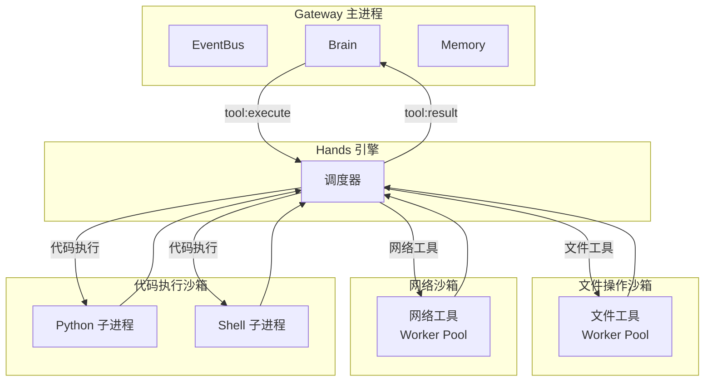
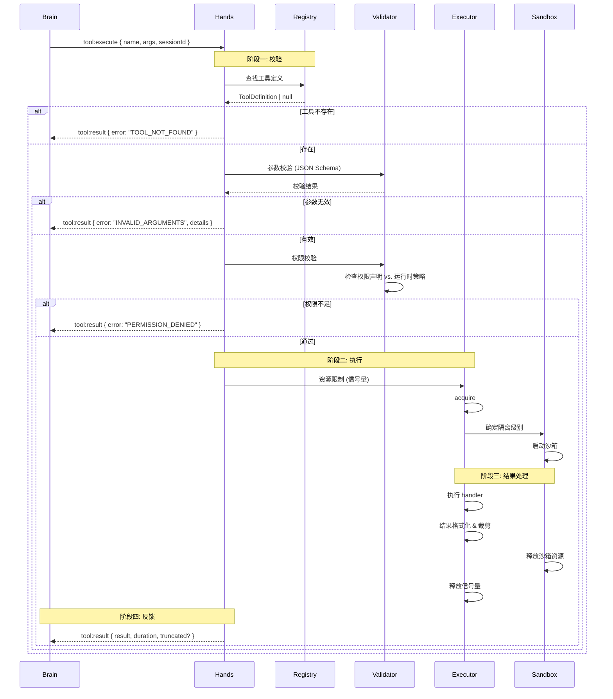
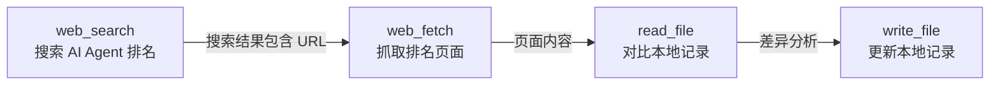
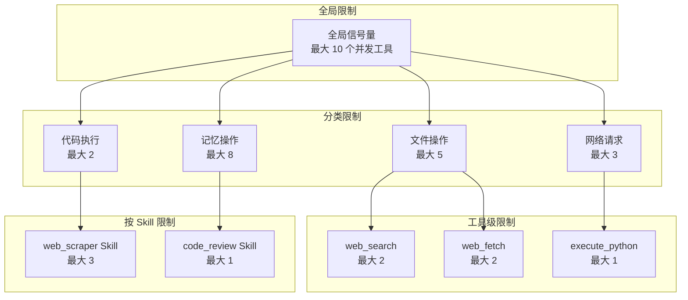
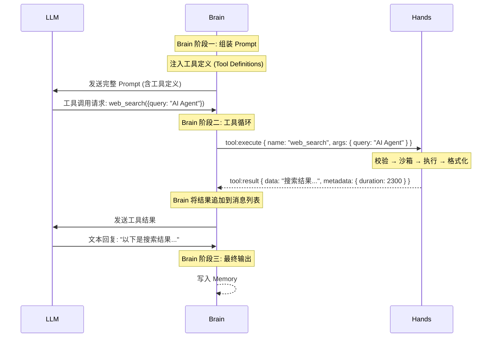

# Hands 组件：工具执行引擎详解

> **本章导读**: 前两章我们分别剖析了 Gateway 的事件总线机制和 Brain 的 LLM 编排策略。Brain 通过 Tool Calling 循环向 Hands 发出工具调用请求，然后等待结果返回。本章将深入 Hands 内部，回答一个核心问题：**当 LLM 决定"行动"时，这个"行动"如何被安全、可靠、高效地执行**？我们将从工具注册、沙箱隔离、生命周期管理、错误处理、组合调度和性能优化六个维度，全面解析 Hands 工具执行引擎的设计与实现。
>
> **前置知识**: 本章 01 Gateway 的事件总线机制、本章 02 Brain 的 Tool Calling 循环、Node.js 子进程/Worker 线程基础
>
> **难度等级**: ⭐⭐⭐⭐☆

---

## 一、工具注册机制

### 1.1 注册的核心数据结构

在 OpenClaw 中，每个工具都是一个拥有完整元数据的可执行单元。Hands 维护一个全局的工具注册表（Tool Registry），所有工具在注册时必须提供统一的数据结构：

```typescript
// 工具注册的核心数据结构
interface ToolDefinition {
  // 工具标识
  name: string;                // 工具名，如 "web_search"
  description: string;         // 描述，LLM 通过此字段理解工具用途

  // 参数 Schema (JSON Schema 格式)
  parameters: {
    type: 'object';
    properties: Record<string, ParameterSchema>;
    required: string[];
  };

  // 执行函数
  handler: (args: any, context: ExecutionContext) => Promise<ToolResult>;

  // 权限声明
  permissions: PermissionDeclaration;

  // 元数据
  metadata: {
    category: ToolCategory;    // 工具分类
    timeout: number;           // 默认超时 (ms)
    maxConcurrency?: number;   // 最大并发数
    retryPolicy?: RetryPolicy; // 重试策略
  };
}

interface ParameterSchema {
  type: 'string' | 'number' | 'boolean' | 'array' | 'object';
  description: string;
  enum?: string[];
  default?: any;
  minimum?: number;
  maximum?: number;
}

interface PermissionDeclaration {
  filesystem?: {
    read?: string[];    // 可读取的路径模式
    write?: string[];   // 可写入的路径模式
  };
  network?: {
    allowedDomains?: string[];  // 可访问的域名
    allowedPorts?: number[];    // 可使用的端口
  };
  execution?: {
    allowedCommands?: string[]; // 可执行的命令
  };
}
```

这个数据结构不仅仅是一个"函数注册表"。每个字段都有明确的工程目的：

- **name / description**: 供给 LLM，帮助它理解在什么场景下调用哪个工具
- **parameters**: 通过 JSON Schema 约束参数，LLM 的 Function Calling 机制原生支持这种格式
- **handler**: 实际执行逻辑，在隔离的上下文中运行
- **permissions**: 安全声明，不是事后检查，而是**注册时的承诺**——工具声明自己需要哪些权限

### 1.2 内置工具的注册

OpenClaw 内置了多个基础工具，它们在 Hands 初始化时自动注册。以下是典型的内置工具清单及其分类：

| 工具名 | 分类 | 描述 | 默认超时 | 权限声明 |
|--------|------|------|---------|---------|
| `read_file` | 文件操作 | 读取文件内容 | 5000ms | `filesystem.read: ["**"]` |
| `write_file` | 文件操作 | 写入文件内容 | 5000ms | `filesystem.write: ["**"]` |
| `list_directory` | 文件操作 | 列出目录文件 | 3000ms | `filesystem.read: ["**"]` |
| `web_search` | 网络请求 | 搜索互联网信息 | 15000ms | `network.allowedDomains: ["*"]` |
| `web_fetch` | 网络请求 | 获取网页内容 | 20000ms | `network.allowedDomains: ["*"]` |
| `execute_python` | 代码执行 | 运行 Python 代码片段 | 30000ms | `execution.allowedCommands: ["python3"]` |
| `execute_shell` | 代码执行 | 执行 Shell 命令 | 30000ms | `execution.allowedCommands: ["sh", "bash"]` |
| `memory_read` | 记忆操作 | 读取 Agent 记忆 | 3000ms | — |
| `memory_write` | 记忆操作 | 写入 Agent 记忆 | 3000ms | — |

```typescript
// Hands 初始化时注册内置工具 (简化示意)
class Hands {
  private registry = new ToolRegistry();

  async initialize(): Promise<void> {
    // 注册内置工具
    this.registry.register({
      name: 'read_file',
      description: '读取指定路径的文件内容，返回文本',
      parameters: {
        type: 'object',
        properties: {
          path: {
            type: 'string',
            description: '文件绝对路径',
          },
          encoding: {
            type: 'string',
            description: '文件编码，默认 utf-8',
            default: 'utf-8',
          },
        },
        required: ['path'],
      },
      handler: async (args, ctx) => {
        return await this.fileSystem.read(args.path, args.encoding);
      },
      permissions: { filesystem: { read: ['**'] } },
      metadata: {
        category: 'file_operation',
        timeout: 5000,
      },
    });

    // 注册其他内置工具...

    // 扫描 Skills 目录，注册自定义工具
    await this.loadSkillTools();
  }
}
```

### 1.3 SKILL.md 注册工具

与内置工具不同，通过 Skills 注册的工具是**声明式的**。用户在 SKILL.md 中以 YAML frontmatter 格式定义工具，Hands 在初始化时解析并注册。这是 OpenClaw 可扩展性的核心机制。

一个典型的 SKILL.md 工具注册示例：

```yaml
---
name: web_scraper
description: 抓取网页内容并提取结构化信息
parameters:
  url:
    type: string
    description: 目标网页 URL
    required: true
  extract_type:
    type: string
    description: 提取方式 (markdown / text / structured)
    enum: [markdown, text, structured]
    default: markdown
permissions:
  network:
    allowed_domains:
      - "docs.openclaw.ai"
      - "*.example.com"
timeout: 30000
max_concurrency: 3
---

# Web Scraper Skill

当你需要从特定网页提取结构化信息时使用此工具。

## 使用步骤
1. 确认 URL 在允许的域名范围内
2. 调用工具获取内容
3. 如果内容过长，提取关键部分

## 注意事项
- 不要用于抓取需要登录的页面
- 遵守 robots.txt 规则
```

Hands 对 SKILL.md 的解析流程：

```yaml
启动扫描
  ↓
扫描 config/skills/ 下的所有子目录
  ↓
在每个子目录中查找 SKILL.md
  ↓
解析 YAML frontmatter
  ↓
验证参数 Schema（类型、必填项、枚举值）
  ↓
加载 handler 脚本（如 skills/web_scraper/handler.js）
  ↓
注册到 ToolRegistry
  ↓
将工具列表返回给 Brain
```

```typescript
// SKILL.md 解析注册的核心逻辑
class SkillLoader {
  async loadSkills(skillsDir: string): Promise<ToolDefinition[]> {
    const entries = await fs.promises.readdir(skillsDir, { withFileTypes: true });
    const tools: ToolDefinition[] = [];

    for (const entry of entries) {
      if (!entry.isDirectory()) continue;

      const skillPath = path.join(skillsDir, entry.name);
      const skillMdPath = path.join(skillPath, 'SKILL.md');
      const handlerPath = path.join(skillPath, 'handler.js');

      if (!fs.existsSync(skillMdPath)) continue;

      // 解析 YAML frontmatter
      const frontmatter = parseFrontmatter(
        await fs.promises.readFile(skillMdPath, 'utf-8')
      );

      // 加载工具定义
      const toolDef: ToolDefinition = {
        name: frontmatter.name,
        description: frontmatter.description,
        parameters: {
          type: 'object',
          properties: frontmatter.parameters,
          required: Object.entries(frontmatter.parameters)
            .filter(([_, p]: [string, any]) => p.required)
            .map(([name]) => name),
        },
        handler: await this.loadHandler(handlerPath),
        permissions: frontmatter.permissions,
        metadata: {
          category: 'skill',
          timeout: frontmatter.timeout ?? 10000,
          maxConcurrency: frontmatter.max_concurrency,
        },
      };

      tools.push(toolDef);
    }

    return tools;
  }
}
```

::: info Skill 工具与内置工具的区别
内置工具直接嵌入在 Hands 模块的代码中，随 OpenClaw 发布。Skill 工具通过 SKILL.md 声明，存放在 `config/skills/` 目录下，用户可以自由增删。两者在执行层面没有本质区别——都经过同一个注册流程，遵循相同的沙箱规则。这保证了**扩展不会引入安全风险**。
:::

### 1.4 注册表的运行时视图

注册完成后，ToolRegistry 内部维护了一张高效的查询表：

```typescript
class ToolRegistry {
  // 主存储：名称 → 工具定义
  private tools = new Map<string, ToolDefinition>();

  // 索引：分类 → 工具名称列表（便于按分类枚举）
  private categoryIndex = new Map<string, Set<string>>();

  // 工具列表缓存（供 Brain 枚举）
  private toolListCache: ToolDefinition[] | null = null;

  register(tool: ToolDefinition): void {
    this.tools.set(tool.name, tool);

    // 更新分类索引
    const category = tool.metadata.category;
    if (!this.categoryIndex.has(category)) {
      this.categoryIndex.set(category, new Set());
    }
    this.categoryIndex.get(category)!.add(tool.name);

    // 使缓存失效
    this.toolListCache = null;
  }

  get(name: string): ToolDefinition | undefined {
    return this.tools.get(name);
  }

  getAll(): ToolDefinition[] {
    if (!this.toolListCache) {
      this.toolListCache = Array.from(this.tools.values());
    }
    return this.toolListCache;
  }

  getByCategory(category: string): ToolDefinition[] {
    const names = this.categoryIndex.get(category);
    if (!names) return [];
    return Array.from(names).map(n => this.tools.get(n)!).filter(Boolean);
  }

  getToolListForBrain(): ToolDefinition[] {
    // 返回给 Brain 时，移除 handler 和 permissions——LLM 不需要这些
    return this.getAll().map(t => ({
      name: t.name,
      description: t.description,
      parameters: t.parameters,
      metadata: t.metadata,
    } as ToolDefinition));
  }
}
```

::: tip 为什么缓存工具列表？
Brain 在每个推理周期都会调用 `hands.listTools()` 来枚举可用工具。如果每次枚举都重新遍历注册表并复制对象，在工具数量较多时会产生显著的 GC 压力。缓存机制在工具注册或注销时才失效，运行时枚举近乎零成本。
:::

---

## 二、工具执行的沙箱化

### 2.1 为什么需要沙箱

LLM 调用的工具可能执行任何操作——读写文件、访问网络、运行代码。如果不对这些操作做沙箱隔离，一个 Bug（或者一个恶意 Skill）可能：

1. **读走敏感文件**：`read_file({ path: '~/.ssh/id_rsa' })`
2. **写坏系统文件**：`write_file({ path: '/etc/passwd', content: '...' })`
3. **对外发起攻击**：`web_fetch({ url: 'http://internal.company.com/admin' })`
4. **无限循环耗尽资源**：`execute_python({ code: 'while True: pass' })`

沙箱的目标不是"绝对安全"（那需要虚拟机级隔离），而是在工程实践中提供**足够好的保护**。

### 2.2 超时控制

每个工具都有独立的超时配置。这是沙箱最简单也最有效的手段——**防止任何工具无限制地占用资源**。

```typescript
// 工具执行时的超时控制
interface TimeoutConfig {
  // 各分类的默认超时
  default: number;           // 默认超时 (ms)
  byCategory: Partial<Record<ToolCategory, number>>;
  // 允许的极端值
  min: number;               // 最小超时 (避免设得太小)
  max: number;               // 最大超时 (安全上限)
}

class SandboxedExecutor {
  private timeoutConfig: TimeoutConfig = {
    default: 10000,
    byCategory: {
      file_operation: 5000,
      network_request: 20000,
      code_execution: 30000,
      memory_operation: 3000,
    },
    min: 1000,
    max: 120000,
  };

  async execute(
    tool: ToolDefinition,
    args: any,
    ctx: ExecutionContext
  ): Promise<ToolResult> {
    // 确定超时时间（工具声明优先，但不能超过全局上限）
    const timeout = Math.min(
      Math.max(
        tool.metadata.timeout ?? this.timeoutConfig.default,
        this.timeoutConfig.min
      ),
      this.timeoutConfig.max
    );

    // 使用 AbortController 实现超时
    const abortController = new AbortController();

    const timeoutId = setTimeout(() => {
      abortController.abort();
    }, timeout);

    try {
      const result = await this.runWithSignal(
        () => tool.handler(args, { ...ctx, signal: abortController.signal }),
        abortController.signal
      );

      return {
        success: true,
        data: result,
        duration: result._duration,
      };
    } catch (error: any) {
      if (error.name === 'AbortError') {
        return {
          success: false,
          error: {
            code: 'TIMEOUT',
            message: `工具 "${tool.name}" 执行超时 (${timeout}ms)`,
            recoverable: false,
          },
          duration: timeout,
        };
      }
      throw error;
    } finally {
      clearTimeout(timeoutId);
    }
  }
}
```

不同工具分类的超时策略差异：

| 工具分类 | 默认超时 | 原因 |
|---------|---------|------|
| 文件操作 | 5s | 本地文件系统延迟极低，5s 足以处理绝大多数文件 |
| 网络请求 | 15-30s | 网络不确定性高，需要给足够的等待时间 |
| 代码执行 | 30s | 代码可能包含循环和计算，需要较长时间 |
| 记忆操作 | 3s | 内存操作，延迟必须低 |

::: warning 超时不是万能的
超时只能防止"执行时间过长"，无法防止"执行后的副作用"。一个写文件工具如果在 5s 内完成写入然后被中止，被修改的文件不会自动恢复。超时之后还需要考虑**清理和回滚**，但这不是所有工具都能做到的——这也是设计工具时需要考虑的重要因素。
:::

### 2.3 资源限制

除了时间，Hands 还对工具的**并发度**和**资源消耗**做了限制：

```typescript
class ResourceLimiter {
  // 全局并发控制
  private globalSemaphore = new Semaphore(10);  // 全局最多 10 个并发工具

  // 按分类的并发控制
  private categorySemaphores = new Map<ToolCategory, Semaphore>([
    ['file_operation', new Semaphore(5)],
    ['network_request', new Semaphore(3)],   // 网络请求最昂贵，限制最严
    ['code_execution', new Semaphore(2)],   // 代码执行隔离开销最大
    ['memory_operation', new Semaphore(8)],
  ]);

  // 按工具名的并发控制（来自 SKILL.md 的 maxConcurrency）
  private toolSemaphores = new Map<string, Semaphore>();

  // 内存监控
  private memoryMonitor = new MemoryMonitor({
    maxHeapUsage: 0.8,  // 堆使用率超过 80% 时拒绝新任务
    checkInterval: 500,
  });

  async acquire(tool: ToolDefinition): Promise<ReleaseFn> {
    // 1. 检查内存水位
    if (this.memoryMonitor.isOverloaded()) {
      throw new ResourceError('系统内存不足，拒绝新的工具执行');
    }

    // 2. 获取分类级许可
    const semaphore = this.categorySemaphores.get(tool.metadata.category);
    if (semaphore) {
      await semaphore.acquire();
    }

    // 3. 获取工具级许可
    if (tool.metadata.maxConcurrency) {
      let toolSem = this.toolSemaphores.get(tool.name);
      if (!toolSem) {
        toolSem = new Semaphore(tool.metadata.maxConcurrency);
        this.toolSemaphores.set(tool.name, toolSem);
      }
      await toolSem.acquire();
    }

    // 4. 全局许可
    await this.globalSemaphore.acquire();

    // 返回一个释放函数，在工具执行结束后按逆序释放所有许可
    return async () => {
      this.globalSemaphore.release();
      if (tool.metadata.maxConcurrency) {
        this.toolSemaphores.get(tool.name)?.release();
      }
      semaphore?.release();
    };
  }
}
```

::: info 并发限制的合理性
并发限制看似降低了吞吐量，但实际效果是**提高了系统稳定性**。一个失控的 Skill 如果在短时间内启动 50 个 HTTP 请求，不仅会耗尽 Gateway 的文件描述符，还可能触发目标网站的反爬机制。通过分层信号量控制，Hands 保证了资源使用的可预测性。
:::

### 2.4 错误隔离

沙箱的第三个维度是错误隔离——一个工具的崩溃不应影响其他工具，更不应拖垮整个 Gateway。



OpenClaw 采用**进程级隔离**策略，而非线程级：

- **文件操作工具**：在主进程的 Worker 线程中执行（安全级别最低，但延迟最低）
- **网络请求工具**：在独立的 Worker 线程中执行，限制 DNS 解析范围
- **代码执行工具**：在**独立子进程**中执行，使用受限的 `seccomp` 或 `pledge` 沙箱（安全级别最高）

```typescript
// 不同类型的工具使用不同的隔离策略
class ToolExecutionStrategy {
  getIsolationLevel(tool: ToolDefinition): IsolationLevel {
    switch (tool.metadata.category) {
      case 'file_operation':
        // Worker 线程——进程内隔离，共享内存
        return {
          type: 'worker_thread',
          env: ['PATH'],
          maxMemory: 256 * MB,
        };

      case 'network_request':
        // Worker 线程 + DNS 过滤
        return {
          type: 'worker_thread',
          dnsFilter: tool.permissions?.network?.allowedDomains,
          maxMemory: 128 * MB,
        };

      case 'code_execution':
        // 独立子进程——进程级隔离
        return {
          type: 'child_process',
          seccompFilter: {
            allowedSyscalls: ['read', 'write', 'open', 'close', ...],
          },
          maxMemory: 512 * MB,
          timeout: tool.metadata.timeout,
        };

      default:
        return { type: 'worker_thread' };
    }
  }
}
```

**进程崩溃恢复**：当某个代码执行的子进程崩溃时，Supervisor 组件自动重启：

```typescript
class ProcessSupervisor {
  private processes = new Map<string, ChildProcess>();

  async spawn(toolName: string, isolation: IsolationLevel): Promise<ChildProcess> {
    const child = fork(path.join(__dirname, 'sandbox-runner.js'), [], {
      execArgv: ['--max-old-space-size=' + (isolation.maxMemory / MB)],
      stdio: ['pipe', 'pipe', 'pipe', 'ipc'],
    });

    // 监控子进程状态
    child.on('exit', (code, signal) => {
      if (code !== 0) {
        logger.error(
          `工具 "${toolName}" 的子进程异常退出 (code=${code}, signal=${signal})`
        );
        // 如果仍有待处理的任务，重新启动子进程
        if (this.pendingTasks.get(toolName)?.length > 0) {
          logger.info(`重新启动 "${toolName}" 的子进程...`);
          this.spawn(toolName, isolation);
        }
      }
    });

    this.processes.set(toolName, child);
    return child;
  }
}
```

---

## 三、工具调用的生命周期

一个工具调用从发出到返回，经历四个明确的阶段。每个阶段都有独立的逻辑和错误处理。

### 3.1 全生命周期流程图



### 3.2 阶段一：校验

校验阶段包含三个子步骤，任何一个失败都会直接返回错误，不进入执行阶段。

**步骤 1：工具查找**

```typescript
const toolDef = this.registry.get(name);
if (!toolDef) {
  return {
    success: false,
    error: {
      code: 'TOOL_NOT_FOUND',
      message: `工具 "${name}" 不存在。可用工具: ${this.registry.getAll().map(t => t.name).join(', ')}`,
      recoverable: false,
    },
  };
}
```

**步骤 2：参数校验**

```typescript
class ParameterValidator {
  // 使用 JSON Schema 校验工具参数
  validate(
    parameters: ToolDefinition['parameters'],
    args: any
  ): ValidationResult {
    const errors: ValidationError[] = [];

    // 检查必填参数
    for (const requiredParam of parameters.required) {
      if (args[requiredParam] === undefined || args[requiredParam] === null) {
        errors.push({
          path: requiredParam,
          message: `缺少必填参数 "${requiredParam}"`,
        });
      }
    }

    // 检查参数类型
    for (const [name, value] of Object.entries(args)) {
      const schema = parameters.properties[name];
      if (!schema) {
        errors.push({
          path: name,
          message: `未知参数 "${name}"`,
        });
        continue;
      }

      const typeError = this.checkType(value, schema);
      if (typeError) {
        errors.push({ path: name, message: typeError });
      }
    }

    return {
      valid: errors.length === 0,
      errors,
    };
  }

  private checkType(value: any, schema: ParameterSchema): string | null {
    if (schema.type === 'string' && typeof value !== 'string') {
      return `参数应为 string，实际为 ${typeof value}`;
    }
    if (schema.type === 'number' && typeof value !== 'number') {
      return `参数应为 number，实际为 ${typeof value}`;
    }
    if (schema.enum && !schema.enum.includes(value)) {
      return `值 "${value}" 不在允许范围 [${schema.enum.join(', ')}]`;
    }
    if (schema.minimum !== undefined && value < schema.minimum) {
      return `值 ${value} 小于最小值 ${schema.minimum}`;
    }
    if (schema.maximum !== undefined && value > schema.maximum) {
      return `值 ${value} 大于最大值 ${schema.maximum}`;
    }
    return null;
  }
}
```

**步骤 3：权限校验**

```typescript
class PermissionValidator {
  // 检查工具声明的权限是否在全局策略允许范围内
  validate(
    toolName: string,
    permissions: PermissionDeclaration,
    globalPolicy: SecurityPolicy
  ): PermissionCheckResult {
    const denied: string[] = [];

    // 检查文件系统权限
    if (permissions.filesystem) {
      const fsPolicy = globalPolicy.filesystem;
      if (permissions.filesystem.read) {
        for (const pattern of permissions.filesystem.read) {
          if (!isPatternAllowed(pattern, fsPolicy.allowedPatterns)) {
            denied.push(`filesystem.read: "${pattern}" 未被全局策略允许`);
          }
        }
      }
    }

    // 检查网络权限
    if (permissions.network) {
      const netPolicy = globalPolicy.network;
      if (permissions.network.allowedDomains) {
        for (const domain of permissions.network.allowedDomains) {
          if (!isDomainAllowed(domain, netPolicy.allowedDomains)) {
            denied.push(`network.allowedDomains: "${domain}" 未被全局策略允许`);
          }
        }
      }
    }

    return {
      granted: denied.length === 0,
      denied,
    };
  }
}
```

### 3.3 阶段二：执行

执行阶段将工具 handler 放入适当的沙箱中运行。不同类型的工具在此阶段的处理方式不同（详见第四章），但核心流程一致：

```typescript
async function executeInSandbox(
  tool: ToolDefinition,
  args: any,
  ctx: ExecutionContext
): Promise<any> {
  const isolation = getIsolationLevel(tool);
  const release = await resourceLimiter.acquire(tool);

  try {
    switch (isolation.type) {
      case 'worker_thread':
        return await executeInWorker(tool, args, ctx, isolation);
      case 'child_process':
        return await executeInChildProcess(tool, args, ctx, isolation);
      case 'in_process':
        return await tool.handler(args, ctx);
    }
  } finally {
    await release();
  }
}
```

### 3.4 阶段三：结果处理

工具执行完成后，结果必须经过处理才能返回给 Brain。核心处理流程包括格式化、裁剪和元数据注入：

```typescript
function processToolResult(
  toolName: string,
  rawResult: any,
  executionDuration: number
): ProcessedResult {
  const MAX_RESULT_LENGTH = 50 * 1024; // 50KB 上限

  let serialized: string;
  let truncated = false;

  // 格式化结果
  if (typeof rawResult === 'string') {
    serialized = rawResult;
  } else {
    serialized = JSON.stringify(rawResult, null, 2);
  }

  // 裁剪超长结果
  if (serialized.length > MAX_RESULT_LENGTH) {
    serialized = serialized.slice(0, MAX_RESULT_LENGTH) +
      `\n\n... (结果过长，已截断至 ${Math.round(MAX_RESULT_LENGTH / 1024)}KB)`;
    truncated = true;
  }

  return {
    success: true,
    data: serialized,
    metadata: {
      toolName,
      duration: executionDuration,
      truncated,
      timestamp: Date.now(),
    },
  };
}
```

### 3.5 阶段四：反馈 LLM

处理后的结果通过 EventBus 返回给 Brain。反馈的数据结构设计为**信息完备且对 LLM 友好**：

```typescript
interface ToolResult {
  success: boolean;

  // 成功时的数据
  data?: string;

  // 失败时的错误
  error?: {
    code: string;       // 错误码，如 TIMEOUT, PERMISSION_DENIED
    message: string;    // 人类可读的错误描述
    recoverable: boolean; // LLM 是否可以通过重试解决
  };

  // 元数据
  metadata: {
    toolName: string;
    duration: number;    // 执行耗时 (ms)
    truncated: boolean;  // 结果是否被裁剪
    timestamp: number;
  };
}
```

::: tip recoverable 字段的作用
`error.recoverable` 字段告诉 Brain 这个错误是否值得重试。Brain 的 Tool Calling 循环会根据这个标志决定是否需要再次尝试调用同一个工具——这是 Brain 和 Hands 之间一个简单但有效的协作契约。
:::

---

## 四、不同类型工具的执行差异

所有工具都经过上述四个阶段，但**不同分类的工具在隔离策略、资源消耗和错误处理上有显著差异**。

### 4.1 文件操作工具

文件操作是 Hands 中最常用的工具类别。它们的特点是**延迟低、无网络、直接操作本地资源**。

| 特性 | 说明 |
|------|------|
| 隔离级别 | Worker 线程（进程内） |
| 典型超时 | 5000ms |
| 最大并发 | 5 |
| 内存限制 | 256MB |
| 核心风险 | 路径遍历、大文件读取导致 OOM |

路径遍历防护是文件操作工具特有的安全检查：

```typescript
class FileSystemSandbox {
  private allowedBase: string;

  constructor(baseDir: string) {
    this.allowedBase = path.resolve(baseDir);
  }

  async readFile(filePath: string): Promise<string> {
    // 解析绝对路径并防止路径遍历攻击
    const resolvedPath = path.resolve(filePath);

    // 关键检查：路径必须在允许的基目录下
    if (!resolvedPath.startsWith(this.allowedBase)) {
      throw new PermissionError(
        `不允许访问 ${resolvedPath}（不在 ${this.allowedBase} 范围内）`
      );
    }

    // 文件大小限制
    const stat = await fs.promises.stat(resolvedPath);
    const MAX_FILE_SIZE = 10 * 1024 * 1024; // 10MB
    if (stat.size > MAX_FILE_SIZE) {
      throw new ResourceError(
        `文件过大 (${Math.round(stat.size / 1024 / 1024)}MB)，超过 10MB 限制`
      );
    }

    return await fs.promises.readFile(resolvedPath, 'utf-8');
  }
}
```

### 4.2 网络请求工具

网络请求工具的安全性挑战在于：**你无法控制外部服务的响应行为**。

| 特性 | 说明 |
|------|------|
| 隔离级别 | Worker 线程 + DNS 过滤 |
| 典型超时 | 15-30s |
| 最大并发 | 3 |
| 内存限制 | 128MB |
| 核心风险 | SSRF（服务端请求伪造）、响应体过大、DNS 外带 |

网络工具特有的安全措施：

```typescript
class NetworkSandbox {
  private dnsResolver: DnsResolver;

  async fetch(url: string, allowedDomains?: string[]): Promise<FetchResult> {
    const parsedUrl = new URL(url);

    // 1. SSRF 防护：禁止内网地址
    if (await this.isPrivateAddress(parsedUrl.hostname)) {
      throw new PermissionError(
        `不允许访问内网地址: ${parsedUrl.hostname}`
      );
    }

    // 2. 域名白名单检查
    if (allowedDomains && !allowedDomains.includes('*')) {
      const domainMatch = allowedDomains.some(d =>
        parsedUrl.hostname === d ||
        parsedUrl.hostname.endsWith('.' + d)
      );
      if (!domainMatch) {
        throw new PermissionError(
          `域名 ${parsedUrl.hostname} 不在允许列表中`
        );
      }
    }

    // 3. 禁止 file:// 和内部协议
    if (!['http:', 'https:'].includes(parsedUrl.protocol)) {
      throw new PermissionError(
        `不允许的协议: ${parsedUrl.protocol}`
      );
    }

    // 4. 响应大小限制（防止内存 OOM）
    const response = await fetch(url, {
      signal: AbortSignal.timeout(20000),
      size: 10 * 1024 * 1024, // 最大 10MB 响应体
    });

    return {
      status: response.status,
      headers: this.sanitizeHeaders(response.headers),
      body: await response.text(),
    };
  }
}
```

### 4.3 代码执行工具

代码执行是**安全要求最严格**的工具类别，因为它的本质是允许 LLM 在用户的机器上运行任意代码。

| 特性 | 说明 |
|------|------|
| 隔离级别 | 独立子进程 + 系统调用过滤 |
| 典型超时 | 30s |
| 最大并发 | 2 |
| 内存限制 | 512MB |
| 核心风险 | 任意代码执行、资源耗尽、文件系统破坏 |

代码执行的沙箱策略最为严格：

```typescript
class CodeExecutionSandbox {
  async executePython(code: string, ctx: ExecutionContext): Promise<string> {
    // 1. 在独立子进程中运行
    const child = fork(path.join(__dirname, 'sandbox-runner.js'), [], {
      stdio: ['pipe', 'pipe', 'pipe', 'ipc'],
      env: {
        // 只传递最小环境变量
        PATH: '/usr/local/bin:/usr/bin:/bin',
        HOME: '/tmp/sandbox',
      },
      // Windows 下使用 --security-revert 等标志
      // Linux 下子进程中通过 seccomp 限制系统调用
    });

    // 2. 将代码发送给子进程执行
    child.send({ type: 'execute', code, timeout: 30000 });

    return new Promise((resolve, reject) => {
      const timer = setTimeout(() => {
        child.kill('SIGKILL');
        reject(new Error('代码执行超时'));
      }, 30000);

      child.on('message', (msg: any) => {
        clearTimeout(timer);
        if (msg.type === 'result') {
          resolve(msg.data);
        } else if (msg.type === 'error') {
          reject(new Error(msg.message));
        }
      });

      child.on('exit', (code) => {
        clearTimeout(timer);
        if (code !== 0) {
          reject(new Error(`子进程异常退出, code=${code}`));
        }
      });
    });
  }
}
```

```typescript
// sandbox-runner.js——在受限子进程中运行的代码
process.on('message', async (msg) => {
  if (msg.type !== 'execute') return;

  try {
    // 设置超时中断（在子进程内部）
    const timer = setTimeout(() => {
      process.exit(1); // 超时直接退出子进程
    }, msg.timeout);

    // 执行代码
    const result = await evalCode(msg.code);

    clearTimeout(timer);
    process.send!({ type: 'result', data: result });
  } catch (error: any) {
    process.send!({ type: 'error', message: error.message });
  }
});

// 在受限上下文中执行代码
async function evalCode(code: string): Promise<string> {
  // 移除危险的内置模块访问
  const context = {
    // 只暴露安全的内置函数
    print: (...args: any[]) => args.join(' '),
    // 暴露部分安全的 math 功能
    Math: Math,
    JSON: JSON,
    Array: Array,
    Object: Object,
    String: String,
    Number: Number,
    Boolean: Boolean,
    Date: Date,
    // 不暴露: require, fs, process, child_process, etc.
  };

  const fn = new Function('ctx', `with(ctx) { ${code} }`);
  return String(fn(context));
}
```

### 4.4 三类工具的沙箱策略对比

| 维度 | 文件操作 | 网络请求 | 代码执行 |
|------|---------|---------|---------|
| 进程模型 | Worker 线程 | Worker 线程 | 独立子进程 |
| 系统调用过滤 | 无 | 网络相关 | seccomp/pledge |
| 路径限制 | 路径白名单 | N/A | 临时目录 |
| 网络限制 | N/A | 域名白名单 + SSRF 防护 | 默认禁止网络 |
| 内存限制 | 256MB | 128MB | 512MB |
| 并发上限 | 5 | 3 | 2 |
| 超时上限 | 5s | 30s | 30s |
| 崩溃影响范围 | 当前 Worker | 当前 Worker | 仅当前子进程 |
| 日志可见性 | 主进程日志 | 主进程日志 | 独立日志流 |

---

## 五、错误分类与处理策略

### 5.1 错误分类体系

Hands 将所有工具执行错误分为三大类，每类的处理策略不同：

```typescript
// Hands 的错误分类
enum ErrorCategory {
  // 可重试错误——网络问题、服务暂时不可用
  RETRYABLE = 'retryable',

  // 不可重试错误——参数错误、权限拒绝
  NON_RETRYABLE = 'non_retryable',

  // 部分成功——批量操作中部分失败
  PARTIAL_SUCCESS = 'partial_success',
}
```

具体错误码映射：

| 错误码 | 分类 | 典型场景 | LLM 应如何处理 |
|--------|------|---------|--------------|
| `TIMEOUT` | RETRYABLE | 网页抓取超时 | 增加超时时间后重试 |
| `NETWORK_ERROR` | RETRYABLE | DNS 解析失败、TCP 断开 | 稍后重试 |
| `RATE_LIMITED` | RETRYABLE | API 频率限制 | 等待后重试 |
| `SERVICE_UNAVAILABLE` | RETRYABLE | 上游服务返回 503 | 稍后重试 |
| `INVALID_ARGUMENTS` | NON_RETRYABLE | 参数类型错误 | 修正参数重新调用 |
| `PERMISSION_DENIED` | NON_RETRYABLE | 无权访问某个文件 | 换用其他工具或告知用户 |
| `TOOL_NOT_FOUND` | NON_RETRYABLE | 工具名拼写错误 | 修正工具名称 |
| `FILE_NOT_FOUND` | NON_RETRYABLE | 文件路径不存在 | 检查路径，告知用户 |
| `PARTIAL_SUCCESS` | PARTIAL_SUCCESS | 批量读取文件，部分失败 | 分析成功和失败的部分 |

### 5.2 可重试错误的自动重试

对于可重试错误，Hands 内置了自动重试机制，不需要 LLM 介入：

```typescript
class RetryHandler {
  async executeWithRetry(
    tool: ToolDefinition,
    args: any,
    ctx: ExecutionContext
  ): Promise<ToolResult> {
    const retryPolicy = tool.metadata.retryPolicy ?? {
      maxRetries: 2,
      baseDelay: 1000,
      maxDelay: 10000,
    };

    let lastError: ToolResult | null = null;

    for (let attempt = 0; attempt <= retryPolicy.maxRetries; attempt++) {
      if (attempt > 0) {
        // 指数退避 + 随机抖动
        const delay = Math.min(
          retryPolicy.baseDelay * Math.pow(2, attempt - 1),
          retryPolicy.maxDelay
        ) * (0.5 + Math.random() * 0.5);

        await sleep(delay);
      }

      const result = await this.executeTool(tool, args, ctx);

      if (result.success) {
        return result;
      }

      if (!this.isRetryableError(result)) {
        return result; // 不可重试的错误，直接返回
      }

      lastError = result;
    }

    // 所有重试都失败
    return {
      success: false,
      error: {
        code: 'RETRY_EXHAUSTED',
        message: `工具 "${tool.name}" 在 ${retryPolicy.maxRetries + 1} 次尝试后仍然失败: ${lastError?.error?.message}`,
        recoverable: false, // Hands 已经尽力了
      },
      metadata: lastError!.metadata,
    };
  }

  private isRetryableError(result: ToolResult): boolean {
    const retryableCodes = ['TIMEOUT', 'NETWORK_ERROR', 'RATE_LIMITED', 'SERVICE_UNAVAILABLE'];
    return result.error ? retryableCodes.includes(result.error.code) : false;
  }
}
```

### 5.3 不可重试错误的处理

不可重试错误不需要 Hands 自动处理——它们直接返回给 Brain，由 Brain 决定下一步。但 Hands 仍然需要提供足够的信息，让 Brain（和 LLM）能够做出正确的决策：

```typescript
// 权限拒绝时提供足够的信息
function handlePermissionDenied(
  toolName: string,
  deniedPaths: string[]
): ToolResult {
  return {
    success: false,
    error: {
      code: 'PERMISSION_DENIED',
      message: `工具 "${toolName}" 无权访问以下路径: ${deniedPaths.join(', ')}`,
      recoverable: false,
      // 额外信息：帮助 LLM 决定替代方案
      suggestions: [
        `尝试读取 ${this.suggestAlternativePath(deniedPaths[0])}`,
        '使用 list_directory 查看可访问的目录',
      ],
    },
    metadata: {
      toolName,
      duration: 0,
      truncated: false,
      timestamp: Date.now(),
    },
  };
}
```

### 5.4 部分成功的处理

部分成功（Partial Success）是最容易被忽视的错误类型。考虑一个真实场景：LLM 调用 `read_file` 批量读取 5 个日志文件，其中 3 个成功、2 个因为权限问题失败。此时 Hands 不返回全成功也不返回全失败，而是返回部分成功：

```typescript
// 部分成功的处理
function handlePartialSuccess(
  results: IndividualResult[]
): ToolResult {
  const successes = results.filter(r => r.success);
  const failures = results.filter(r => !r.success);

  if (failures.length === 0) {
    // 全部成功
    return { success: true, data: results.map(r => r.data).join('\n'), ... };
  }

  if (successes.length === 0) {
    // 全部失败——降级为不可重试错误
    return {
      success: false,
      error: {
        code: 'ALL_FAILED',
        message: `所有 ${results.length} 个操作均失败`,
        recoverable: false,
      },
      ...
    };
  }

  // 部分成功
  return {
    success: true,
    data: [
      `## 操作成功 (${successes.length}/${results.length})`,
      '',
      ...successes.map(r => r.data),
      '',
      `## 操作失败 (${failures.length}/${results.length})`,
      '',
      ...failures.map(r => `- ${r.name}: ${r.error?.message}`),
    ].join('\n'),
    partialFailure: failures.map(f => ({
      name: f.name,
      error: f.error?.message,
    })),
    metadata: {
      toolName,
      duration: totalDuration,
      truncated: false,
      timestamp: Date.now(),
    },
  };
}
```

---

## 六、工具组合的执行顺序与依赖管理

Brain 在一次推理中可能多次调用工具，这些调用之间可能存在依赖关系。Hands 虽然不负责编排工具的调用顺序（那属于 Brain 的职责），但它提供底层支持来处理组合调用。

### 6.1 顺序执行与并行执行

当一个 LLM 在一次响应中返回多个工具调用时，Brain 可以选择顺序或并行执行：

```typescript
// Hands 支持的两种执行模式
type ExecutionMode = 'sequential' | 'parallel';

interface BatchExecuteOptions {
  calls: ToolCall[];
  mode: ExecutionMode;
  context: ExecutionContext;
}

class BatchExecutor {
  async execute(options: BatchExecuteOptions): Promise<ToolResult[]> {
    if (options.mode === 'sequential') {
      return this.executeSequential(options.calls, options.context);
    } else {
      return this.executeParallel(options.calls, options.context);
    }
  }

  // 顺序执行：前一个工具的输出可能被后一个工具使用
  private async executeSequential(
    calls: ToolCall[],
    ctx: ExecutionContext
  ): Promise<ToolResult[]> {
    const results: ToolResult[] = [];

    for (const call of calls) {
      // 将前一个工具的结果注入上下文
      const enrichedCtx = {
        ...ctx,
        previousResults: results,
      };

      const result = await this.executeSingle(call, enrichedCtx);
      results.push(result);
    }

    return results;
  }

  // 并行执行：工具之间无数据依赖
  private async executeParallel(
    calls: ToolCall[],
    ctx: ExecutionContext
  ): Promise<ToolResult[]> {
    // 并行执行，但受全局并发限制约束
    const tasks = calls.map(call => this.executeSingle(call, ctx));
    return await Promise.all(tasks.map(p => p.catch(e => ({
      success: false,
      error: { code: 'UNHANDLED', message: e.message, recoverable: false },
      metadata: { toolName: '', duration: 0, truncated: false, timestamp: Date.now() },
    }))));
  }
}
```

### 6.2 工具 A 的输出是工具 B 的输入

最典型的组合依赖场景：`web_search` 的结果作为 `web_fetch` 的 URL 输入。



Hands 通过 `previousResults` 上下文支持这种依赖模式：

```typescript
// Brain 的判断逻辑：工具之间是否有数据依赖
function determineExecutionMode(toolCalls: ToolCall[]): ExecutionMode {
  // 如果 LLM 的一次响应中同时包含 web_search 和 web_fetch，
  // 通常 web_fetch 依赖 web_search 的结果 → 顺序执行
  const toolNames = toolCalls.map(t => t.name);

  // 启发式判断：如果同时存在搜索和抓取，大概率有依赖关系
  if (toolNames.includes('web_search') && toolNames.includes('web_fetch')) {
    return 'sequential';
  }

  // 没有明显的依赖关系 → 并行执行（更高效）
  return 'parallel';
}
```

### 6.3 循环依赖检测

虽然工具调用的依赖是 Brain 在 LLM 输出中动态发现的（而非静态声明），但 Hands 仍然提供了循环依赖的运行时检测——防止同一组工具调用被无限反复触发：

```typescript
class DependencyTracker {
  // 依赖图：工具调用 ID → 依赖的调用 ID
  private dependencyGraph = new Map<string, Set<string>>();
  private inProgress = new Set<string>();

  // 在开始执行工具链之前注册依赖
  registerDependency(callA: ToolCall, callB: ToolCall): void {
    // callA 的结果是 callB 的输入依赖
    if (!this.dependencyGraph.has(callB.id)) {
      this.dependencyGraph.set(callB.id, new Set());
    }
    this.dependencyGraph.get(callB.id)!.add(callA.id);
  }

  // 检查是否有循环依赖
  detectCycle(): string | null {
    const visited = new Set<string>();
    const inStack = new Set<string>();

    const dfs = (nodeId: string): boolean => {
      visited.add(nodeId);
      inStack.add(nodeId);

      const deps = this.dependencyGraph.get(nodeId);
      if (deps) {
        for (const dep of deps) {
          if (!visited.has(dep)) {
            if (dfs(dep)) return true;
          } else if (inStack.has(dep)) {
            return true; // 发现环！
          }
        }
      }

      inStack.delete(nodeId);
      return false;
    };

    for (const nodeId of this.dependencyGraph.keys()) {
      if (!visited.has(nodeId)) {
        if (dfs(nodeId)) {
          return `检测到循环依赖: 工具调用 ${nodeId} 参与了循环`;
        }
      }
    }

    return null; // 无循环依赖
  }
}
```

---

## 七、性能考量

### 7.1 并发执行限制

Hands 的并发控制分四个层级，形成一个金字塔结构：



各层级的配置示例：

```yaml
hands:
  concurrency:
    global: 10           # 全局最大并发工具执行数
    categories:
      file_operation: 5
      network_request: 3
      code_execution: 2
      memory_operation: 8
    tools:
      web_search: 2      # 特定工具并发限制
      web_fetch: 2
      execute_python: 1
```

::: tip 为什么并发限制从全局到具体逐层收紧？
每个层级都有不同的约束目标。全局限制防止 Hands 整体占用过多资源。按分类的限制防止某一类工具（如代码执行）消耗完所有资源。按工具的限制针对单个高消耗工具。当 LLM 同时发起 5 个 `execute_python` 调用时，实际只有 1-2 个能同时执行，其余排队等待。这保证了 LLM 的"激进"不会压垮系统。
:::

### 7.2 超时队列管理

当并发数达到上限时，新的工具调用不会直接失败——它们进入等待队列：

```typescript
class TimeoutQueue {
  private queue: QueuedTask[] = [];
  private readonly MAX_QUEUE_DEPTH = 50;
  private readonly MAX_QUEUE_WAIT = 30000; // 最长等待 30s

  async enqueue(
    tool: ToolDefinition,
    args: any,
    ctx: ExecutionContext
  ): Promise<ToolResult> {
    // 队列满了直接拒绝
    if (this.queue.length >= this.MAX_QUEUE_DEPTH) {
      return {
        success: false,
        error: {
          code: 'QUEUE_FULL',
          message: `工具执行队列已满 (${this.MAX_QUEUE_DEPTH})，请稍后重试`,
          recoverable: false,
        },
        metadata: { toolName: tool.name, duration: 0, truncated: false, timestamp: Date.now() },
      };
    }

    return new Promise((resolve) => {
      const task: QueuedTask = {
        tool,
        args,
        ctx,
        resolve,
        enqueuedAt: Date.now(),
      };

      this.queue.push(task);

      // 设置队列等待超时
      setTimeout(() => {
        const index = this.queue.indexOf(task);
        if (index >= 0) {
          this.queue.splice(index, 1);
          resolve({
            success: false,
            error: {
              code: 'QUEUE_TIMEOUT',
              message: `工具 "${tool.name}" 在队列中等待超过 ${this.MAX_QUEUE_WAIT}ms`,
              recoverable: true,
            },
            metadata: { toolName: tool.name, duration: 0, truncated: false, timestamp: Date.now() },
          });
        }
      }, this.MAX_QUEUE_WAIT);
    });
  }

  // 当有工具执行完毕释放许可时，从队列中取出等待最久的任务执行
  dequeue(): QueuedTask | null {
    if (this.queue.length === 0) return null;
    return this.queue.shift()!; // FIFO
  }
}
```

### 7.3 工具执行对 LLM 响应延迟的影响

工具执行是 LLM 响应时间中最不可控的因素。以下是一个真实场景的延迟分解：

```
一次完整的 Agent 推理 (假设需要一次工具调用):
┌──────────────────────────────────────────────────────────┐
│ 1. Brain 组装 Prompt                    ~100ms            │
│ 2. LLM 首 Token 时间 (TTFT)            ~800ms            │
│ 3. LLM 生成工具调用响应                 ~500ms            │
│ 4. Hands 执行工具 (如 web_search)       ~2000-15000ms    │ ← 瓶颈
│ 5. LLM 根据工具结果生成最终回复         ~1000ms          │
│ 6. 流式传输到客户端                     ~200ms           │
├──────────────────────────────────────────────────────────┤
│ 总计: ~4.6s - 17.6s                                      │
└──────────────────────────────────────────────────────────┘
```

从 LLM 的角度看，第 4 步是它感知到的"等待时间"。这就是为什么 Brain 在 Tool Calling 循环中 `await` Hands 的结果时，LLM 调用是"暂停"的。

不同工具对延迟的影响：

| 工具类型 | 典型执行时间 | 对用户感知的影响 | 优化策略 |
|---------|------------|----------------|---------|
| 文件读取 | 1-5ms | 几乎无感 | 缓存频繁读取的文件 |
| 本地搜索 | 10-100ms | 几乎无感 | 索引优化 |
| 网页抓取 | 1-3s | 略有等待感 | 设置合理的超时，提供进度提示 |
| 代码执行 | 100ms-30s | 可能显著 | 默认超时 30s，复杂计算告知用户 |
| API 调用 | 500ms-5s | 中等 | 重试策略，注意背压 |

关键优化方向：

```typescript
// 优化: 在不影响结果的前提下，尽早返回中间结果给 Brain
// 让 Brain 可以先做部分推理，而不是等待全部完成
class StreamingExecutor {
  async executeWithProgress(
    tool: ToolDefinition,
    args: any,
    ctx: ExecutionContext
  ): Promise<ToolResult> {
    // 对于长时间执行的工具，通过回调报告进度
    if (tool.metadata.category === 'code_execution' ||
        tool.metadata.category === 'network_request') {

      // 5 秒后如果还没完成，先发送一条中间状态给 Brain
      const progressTimer = setTimeout(() => {
        ctx.onProgress?.({
          status: 'running',
          message: `工具 "${tool.name}" 正在执行中（已运行 5 秒）...`,
        });
      }, 5000);

      // 让 Brain 可以先向用户展示 "正在处理中..."
      ctx.onProgress?.({
        status: 'started',
        message: `正在调用工具 "${tool.name}"...`,
      });

      try {
        return await tool.handler(args, ctx);
      } finally {
        clearTimeout(progressTimer);
      }
    }

    // 快速工具直接执行
    return await tool.handler(args, ctx);
  }
}
```

---

## 八、与 Brain 的协作回顾

### 8.1 完整的工具调用回路

理解 Hands 和 Brain 如何协作，是理解整个 OpenClaw Agent 运行机制的关键：



### 8.2 事件总线上 Hands 的契约

回顾第 01 章的事件总线设计，Hands 在总线上履行以下契约：

| 事件 | 方向 | 触发条件 | 载荷 |
|------|------|---------|------|
| `tool:execute` | Brain → Hands | Brain 需要执行工具 | `{ tool: string, args: object, sessionId: string }` |
| `tool:result` | Hands → Brain | 工具执行完成 | `{ success: boolean, data?: string, error?: {...} }` |
| `tools:list` | Brain → Hands | Brain 需要枚举工具 | `{}` |
| `tools:available` | Hands → Brain | 返回工具列表 | `{ tools: ToolDefinition[] }` |

### 8.3 映射到 Agent 基础模型

在基础模块的 Agent 模型中，Hands 是"行动"层的实现。但通过本章的学习，我们可以看到"行动"远不止"调用函数"这么简单：

| 基础模型 | Brain + Hands 协作 | 关键职责 |
|---------|-------------------|---------|
| 感知 | Brain 组装 Prompt | — |
| 推理 | Brain 调用 LLM | — |
| **行动** | **Brain 发出调用 → Hands 沙箱执行** | **工具注册、沙箱隔离、生命周期管理、错误处理** |
| 记忆 | Brain 读写 Memory | — |

**行动层并不简单**——它需要处理 LLM 从未预期的各种异常：网络超时、权限拒绝、文件不存在、进程崩溃。好的工具执行引擎不是"能执行工具"，而是"在一切可能出错的情况下，仍然能够正确地告知 LLM 发生了什么，以便 LLM 做出合理的下一步决策"。

---

## 思考题

::: info 检验你的深入理解

1. Hands 的工具注册表中，`permissions` 字段是在注册时声明的"承诺"，而不是运行时检查。假设一个恶意的 SKILL.md 声明了不合理的权限（如 `filesystem.write: ["/**"]`），Hands 如何在注册阶段阻止它？如果用户在安装一个 Skill 后修改了全局安全策略，Hands 如何处理已有工具的权限状态？

2. 文件操作工具在 Worker 线程中执行，代码执行工具在独立子进程中执行。这种差异的根本原因是什么？如果把文件操作也放到独立子进程中，会带来什么新的问题？

3. 在部分成功场景下，Hands 将部分成功的数据和失败的错误信息一并返回给 Brain。LLM 接收到这样的结果后，通常会如何推理？这可能导致哪些不可预测的行为？你如何设计工具结果格式来引导 LLM 做出更合理的决策？

4. 假设一个 Skill 工具调用了第三方 API，该 API 在响应中返回了恶意内容（如 XSS payload、嵌入的 iframe）。Hands 在将结果返回给 Brain 之前，是否需要做输出清洗？为什么？

5. 回顾第 02 章 Brain 的 Tool Calling 循环（默认 25 次迭代上限）。如果 25 次中大部分消耗在 Hands 执行上，实际的端到端延迟可能达到几分钟。在工程实践中，是应该降低 `maxToolCalls`、还是让 Hands 在执行长时间工具时反馈进度、还是让 Brain 主动中断长链工具调用？各自的优缺点是什么？

:::

---

## 本章小结

- **统一的工具注册机制**：内置工具和 SKILL.md 声明式工具都通过 `ToolRegistry` 注册，核心数据结构包括名称、描述、参数 Schema、执行函数、权限声明和元数据，Brain 获取的是移除了 handler 和 permissions 的安全子集

- **分层沙箱策略**：文件操作使用 Worker 线程（进程内隔离），网络请求使用 Worker 线程加 DNS 和 SSRF 防护，代码执行使用独立子进程加系统调用过滤；每个工具都有独立的超时控制（1s-120s）和资源限制（内存、并发数）

- **四阶段调用生命周期**：校验（工具查找 → 参数校验 → 权限校验）→ 沙箱执行（资源获取 → 隔离执行）→ 结果处理（格式化 → 裁剪）→ 反馈 LLM；每个阶段都有明确的错误处理

- **三类错误处理策略**：可重试错误（超时、网络错误）由 Hands 自动指数退避重试；不可重试错误（参数错误、权限拒绝）直接返回给 Brain 并由 LLM 决定；部分成功在批量操作中组合成功数据和失败信息一并返回

- **组合执行依赖管理**：顺序执行适合有数据依赖的工具链（搜索→抓取→分析），并行执行适合无依赖的独立工具；Hands 提供循环依赖检测防止无限触发

- **四层并发控制**：全局 → 分类 → 工具级 → Skill 级，从粗到细逐层收紧；超过上限的调用进入 FIFO 等待队列（最长 30s），队列满时直接拒绝

- **工具执行是 LLM 响应延迟的主要瓶颈**：网络请求和代码执行可能导致数秒的等待；优化方向包括中间进度反馈、结果缓存和合理的超时策略

**下一步**: 理解 Hands 如何安全高效地执行工具之后，下一章深入 Memory——持久化记忆层如何在文件系统和向量数据库之间平衡，以及 Agent 的长期记忆如何构建和管理。

---

[← 返回深度指南主页](/deep-dive/openclaw/) | [继续学习:Memory 记忆管理 →](/deep-dive/openclaw/04-memory-management)
