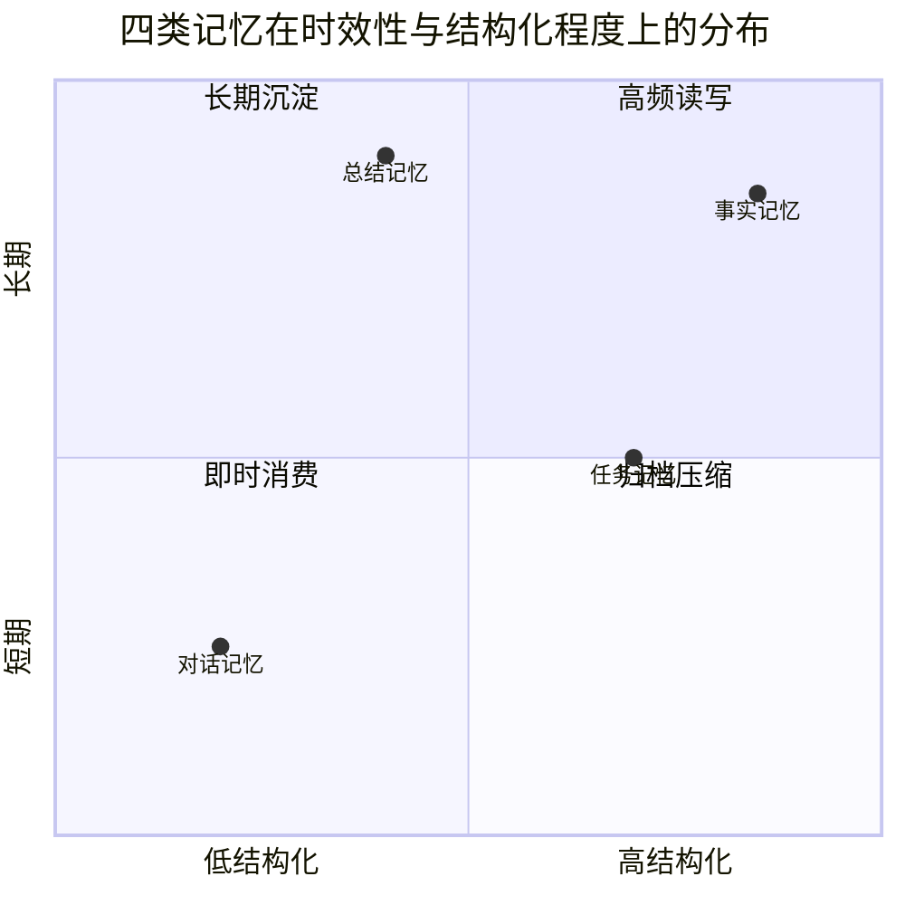
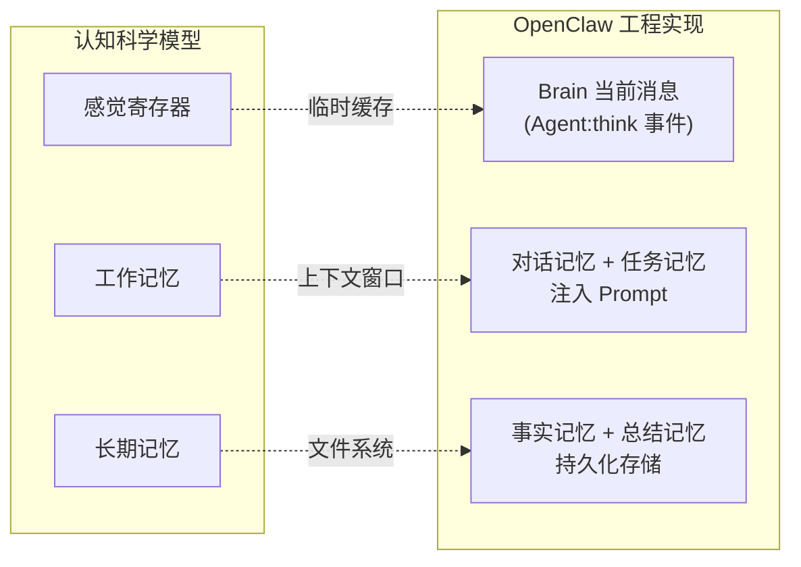
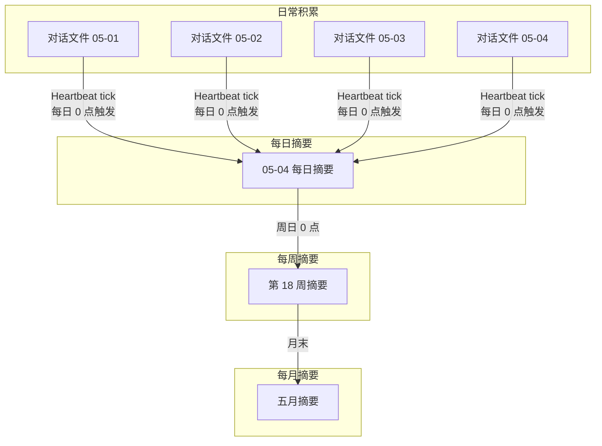
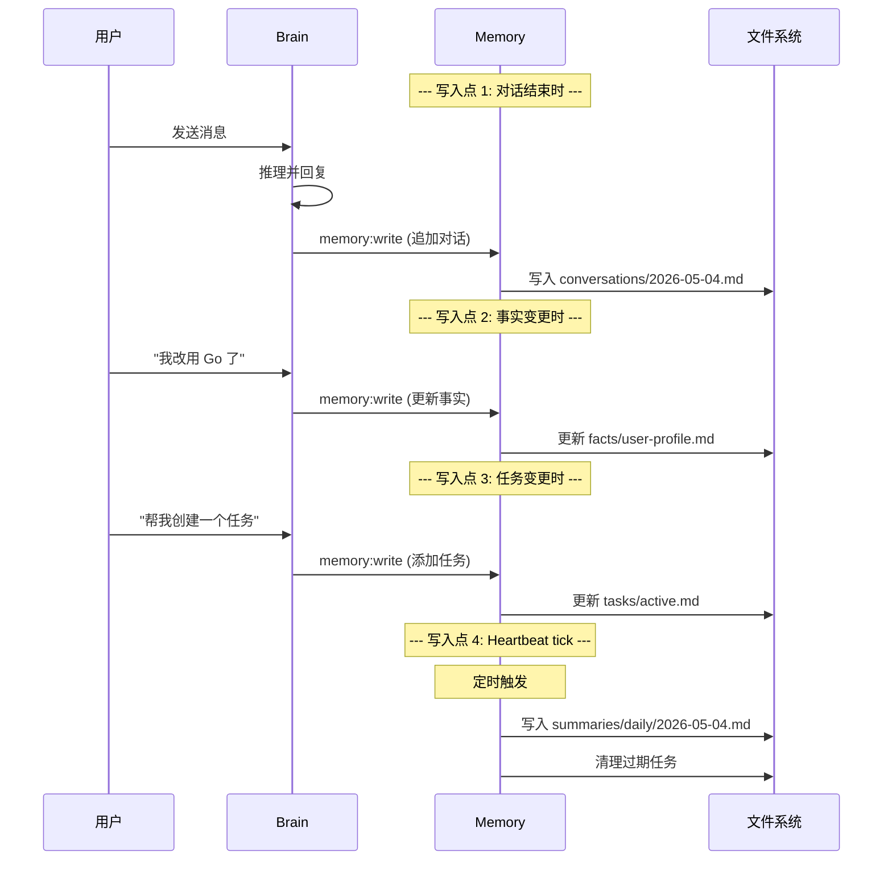
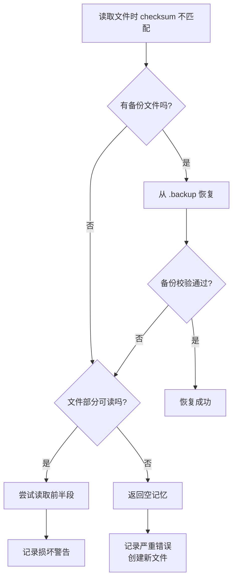
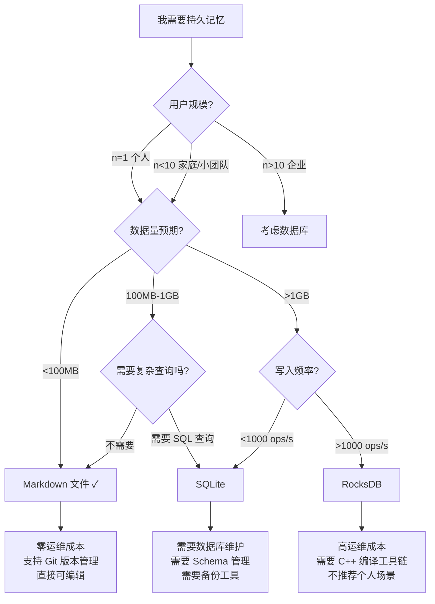
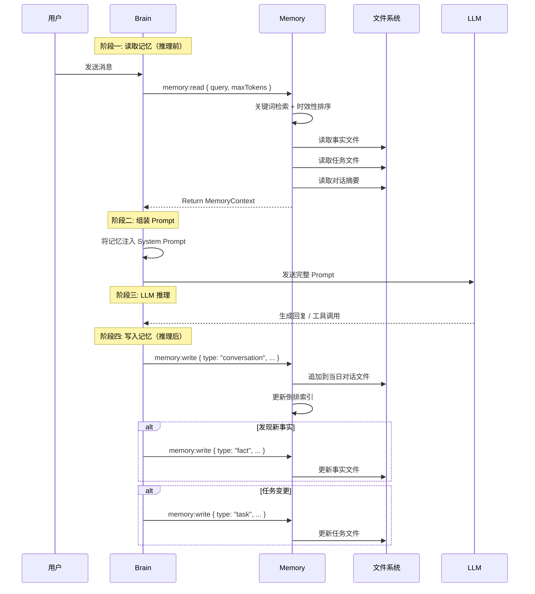

# Memory 系统：四层记忆体系深度剖析

> **本章导读**: 基础模块中我们把 Memory 描述为 "Agent 的记忆系统"，包含四类记忆（对话、事实、任务、总结）。这个分类虽然直观，但掩盖了 Memory 模块在实际工程中需要解决的复杂问题：如何在有限的上下文窗口中选择最相关的记忆？如何确保持久化在文件崩溃后可以恢复？为什么 Markdown 文件比数据库更适合个人助手场景？本章将从源码实现层面，深入剖析 OpenClaw Memory 模块的四层记忆体系。
>
> **前置知识**: 基础模块 04-03 记忆系统概念、基础模块 10-04 Skills 与记忆系统、本章 01 Gateway 的事件总线机制
>
> **难度等级**: ⭐⭐⭐⭐☆

---

## 一、四层记忆体系的设计原理

### 1.1 为什么需要四层区分

在基础模块中，我们了解了 OpenClaw 将记忆分为四类：对话记忆、事实记忆、任务记忆和总结记忆。这个分类不是随意划分的——它源于对 Agent 记忆需求的三个核心维度的分析：**时效性**、**读写频率**和**结构化程度**。



从上图可以清晰地看到四类记忆的定位差异：

| 记忆类型 | 时效性 | 读写频率 | 结构化程度 | 典型数据量 | 核心用途 |
|---------|-------|---------|-----------|-----------|---------|
| 对话记忆 | 短期（天级） | 极高（每轮读写） | 低（原始文本） | 大（每日数万 tokens） | 保持当前对话连续性 |
| 事实记忆 | 长期（月/年级） | 中（按需查询） | 高（结构化 YAML/列表） | 小（KB 级） | 记住用户偏好和关键信息 |
| 任务记忆 | 中短期（周级） | 高（每轮检查） | 中（状态 + 截止日期） | 中（百 KB 级） | 跟踪待办和进行中任务 |
| 总结记忆 | 长期（周/月/年级） | 低（需要时检索） | 中（压缩文本） | 小（KB 级） | 跨会话的压缩历史 |

为什么不能统一用一种方式存储？原因在于 **读写模式完全不同**：

- **对话记忆**需要**高频追加**（每次对话都写入），但很少被**完整读取**（只需要最近几条作为上下文）
- **事实记忆**需要**精确查询**（"用户的编程语言是什么"），但写入频率很低（只有用户明确告诉新信息时才更新）
- **任务记忆**需要**状态变更**（从进行中→已完成），且需要在上下文窗口中**始终可见**
- **总结记忆**需要**周期性生成**（每天/每周），阅读频率低但信息密度高

如果将四类记忆混在一起：
- 要么检索效率低下（从海量对话中找事实）
- 要么上下文窗口被大量无关信息占据
- 要么任务状态无法快速跟踪

### 1.2 与基础模块记忆概念的对应

在基础模块 04-03 中，我们学习了认知科学视角的 Agent 记忆三分类：**感觉寄存器**、**工作记忆**、**长期记忆**。OpenClaw 的四层记忆体系是对这三分类的工程化映射：



具体的对应关系：

| 认知科学概念 | OpenClaw 实现 | 存储介质 | 生命周期 |
|------------|--------------|---------|---------|
| 感觉寄存器 | LLM 上下文窗口中的当前输入 | 内存 | 单次推理 |
| 工作记忆 | 对话记忆（最近 N 条）+ 活跃任务 | 内存 + 文件 | 对话到数天 |
| 长期记忆 | 事实记忆 + 总结记忆 + 归档对话 | 文件系统 | 跨会话持久 |

基础模块 10-04 中给出了四类记忆的存储目录结构：

```
~/.openclaw/memory/
├── conversations/          # 对话历史
│   ├── 2026-03-15.md
│   └── 2026-03-16.md
├── facts/                  # 记住的事实
│   ├── user-profile.md
│   └── preferences.md
├── tasks/                  # 任务管理
│   ├── active.md
│   └── completed.md
└── summaries/              # 总结和摘要
    └── weekly-2026-03-3.md
```

本章接下来的内容将深入每一层的内部实现机制。

---

## 二、每层记忆的读写策略详细分析

### 2.1 对话记忆（Conversations）

对话记忆是四层中**读写频率最高**、**数据量最大**、**结构化程度最低**的一层。

**按日期分文件的存储策略**：

每当用户发送一条消息，Gateway 通过 `message:incoming` 事件触发 Brain 的推理流程。在推理完成后，Brain 发出 `memory:write` 事件，Memory 模块将本轮对话追加到当天的对话文件中。

```typescript
// 对话写入的简化逻辑
class ConversationMemory {
  private baseDir: string;

  async appendMessage(
    sessionId: string,
    message: NormalizedMessage
  ): Promise<void> {
    // 1. 获取当前日期作为文件名
    const today = this.getDateStr(); // "2026-05-04"

    // 2. 构建文件路径
    // ~/.openclaw/memory/conversations/2026-05-04.md
    const filePath = path.join(
      this.baseDir, 'conversations',
      `${today}.md`
    );

    // 3. 格式化消息
    const formatted = this.formatMessage(message);

    // 4. 追加写入
    await this.appendToFile(filePath, formatted);
  }

  private formatMessage(msg: NormalizedMessage): string {
    const timestamp = new Date(msg.timestamp).toISOString();
    const role = msg.role === 'assistant' ? 'Agent' : '用户';
    return [
      '',
      `### ${timestamp}`,
      `**${role}**:`,
      '',
      msg.content,
      '',
    ].join('\n');
  }
}
```

**对话上下文选择策略**：

当需要读取对话历史时，Memory 模块不能简单地"返回整个文件"。因为一次对话可能产生数百条消息，全部注入 Prompt 会迅速耗尽上下文窗口。Memory 实现了一个**多优先级选择算法**：

```typescript
// 对话上下文的选择优先级
function selectConversationHistory(
  messages: FormattedMessage[],
  maxTokens: number
): FormattedMessage[] {
  // 优先级 1: 当前对话中的最近消息（必有）
  const recent = takeLast(messages, 10);

  // 优先级 2: 标记为 "important" 的消息
  const important = messages.filter(m => m.metadata?.important);

  // 优先级 3: 与当前消息语义相似的历史（需要 TF-IDF 匹配）
  const relevant = findRelevantByKeywords(
    messages,
    currentMessage.content,
    3 // 最多 3 条
  );

  // 优先级 4: 跨天的最近对话摘要（从 summaries 层获取）
  const summaries = loadRecentSummaries(3); // 最近 3 天

  // 按优先级合并，裁剪到 Token 预算
  return trimToTokenBudget(
    mergeByPriority(recent, important, relevant, summaries),
    maxTokens
  );
}
```

选择策略的核心原则是：**当前对话的连续性优于历史对话的完整性**。丢失一条最近的上下文可能导致 LLM 出现 "代词指代不清" 的问题，而丢失一条三天前的对话则影响小得多。

### 2.2 事实记忆（Facts）

事实记忆是四层中**结构化程度最高**的一层。它以接近 YAML 的 Markdown 格式存储，每个事实文件就是一个精心组织的知识文档。

**结构化 Markdown 存储格式**：

事实文件不是随意写的 Markdown，而是遵循一个约定的结构：

```markdown
# 用户档案

> 最后更新: 2026-05-03T14:30:00+08:00

## 基本信息

- 姓名: 张三
- 职业: 前端工程师
- 语言: 中文（母语）、英语（工作）
- 时区: Asia/Shanghai

## 技术栈

- 主要语言: TypeScript, Go
- 前端框架: React 18, Next.js
- 状态管理: Zustand
- 打包工具: Vite, Turbopack

## 偏好

- 回答风格: 简洁直接，带代码示例
- 命名习惯: PascalCase（组件）, camelCase（函数）
- 测试策略: 单元测试 + 集成测试
```

这种结构的优势：

1. **人类可读**：打开文件就能理解 Agent 记住了什么
2. **块级更新**：可以只更新 "技术栈" 部分而不影响其他内容
3. **关键词匹配**：Brain 可以根据关键词搜索特定段落

**事实的更新方式**：

事实更新是一个 **"读-改-写"** 的原子操作，而非简单的追加。当一个事实需要更新时（例如用户说 "我改用 Go 了"），Memory 模块执行以下步骤：

```typescript
class FactMemory {
  async updateFact(
    filePath: string,
    section: string,
    key: string,
    newValue: string
  ): Promise<void> {
    // 1. 读取当前文件
    const content = await fs.promises.readFile(filePath, 'utf-8');

    // 2. 解析 Markdown 结构，找到对应 section 和 key
    const parsed = this.parseMarkdownSections(content);
    const sectionContent = parsed.sections[section];
    const updatedSection = this.updateKeyValue(
      sectionContent, key, newValue
    );

    // 3. 替换文件内容
    const updatedContent = content.replace(
      sectionContent,
      updatedSection
    );

    // 4. 更新最后修改时间
    const withMeta = this.updateMetadata(
      updatedContent,
      { lastUpdated: new Date().toISOString() }
    );

    // 5. 原子写入
    await this.atomicWrite(filePath, withMeta);
  }
}
```

### 2.3 任务记忆（Tasks）

任务记忆的核心挑战是**状态跟踪**。一个任务从创建到完成可能经历多个状态：`pending` → `in_progress` → `completed`，每个状态变化都需要精确追踪。

**任务状态的数据结构**：

每个任务在文件中以结构化的方式记录：

```markdown
# 活跃任务

> 最后更新: 2026-05-04T09:00:00+08:00

## 任务列表

### [OPEN-001] 迁移状态管理到 Zustand
- 状态: 进行中
- 创建: 2026-05-03 14:30
- 优先级: 高
- 描述: 将项目中的 Redux 替换为 Zustand
- 步骤:
  - [x] 安装 Zustand 依赖
  - [ ] 创建 Store 定义文件
  - [ ] 替换组件中的 Redux 调用
  - [ ] 删除 Redux 相关代码
  - [ ] 测试确认功能正常

### [OPEN-002] 添加用户认证模块
- 状态: 待处理
- 创建: 2026-05-04 09:00
- 优先级: 中
- 描述: 实现 JWT 登录和权限校验
```

**任务状态变更流程**：

```mermaid
flowchart TD
    A[用户说: "帮我做个XXX"] --> B[Brain 识别为任务创建意图]
    B --> C[memory:write<br/>写入 active.md]
    C --> D[用户检查进度]
    D --> E[Brain 读取 active.md]
    E --> F{任务完成?}
    F -->|是| G[memory:write<br/>标记完成]
    F -->|否| H[继续任务]
    H --> D
    G --> I[移动到 completed.md]
    I --> J[如果过期>30天<br/>归档到 summaries]
```

**过期清理策略**：

任务记忆需要定期清理，否则 `active.md` 会不断膨胀。Memory 模块使用以下规则：

| 清理条件 | 处理方式 | 触发时机 |
|---------|---------|---------|
| 已完成超过 7 天 | 从 `active.md` 移至 `completed.md` | 每次任务状态变更时 |
| 已完成超过 30 天 | 从 `completed.md` 移至 `summaries` 压缩归档 | 每日 Heartbeat tick |
| 待处理超过 14 天 | 标记为 "已过期"，降低优先级 | 每日 Heartbeat tick |
| 待处理超过 30 天 | 移至 `archived` 子目录 | 每周清理 |

### 2.4 总结记忆（Summaries）

总结记忆是四层中**信息密度最高**的一层。它的核心机制是将大量原始对话压缩为精炼的摘要，减少上下文窗口的占用。

**周期性摘要生成策略**：

摘要生成不是在每次对话结束后立即进行——那会产生大量的写操作和 LLM 调用成本。Memory 模块采用**分层压缩策略**：



**压缩率对比**：

| 摘要层级 | 数据源 | 压缩前 | 压缩后 | 压缩率 |
|---------|-------|-------|-------|-------|
| 每日摘要 | 当天所有对话文件 | ~15,000 tokens | ~500 tokens | 30:1 |
| 每周摘要 | 7 天每日摘要 | ~3,500 tokens | ~800 tokens | 4:1 |
| 每月摘要 | 4 周每周摘要 | ~3,200 tokens | ~1,000 tokens | 3:1 |

**摘要文件的实际存储格式**：

```markdown
# 每日摘要 - 2026-05-04

> 生成时间: 2026-05-05T00:05:00+08:00
> 源文件: conversations/2026-05-04.md (共 47 条消息)

## 关键对话

1. 讨论如何将项目的状态管理从 Redux 迁移到 Zustand
   - 用户想逐步迁移，先迁移用户模块
   - 确定了迁移步骤清单

2. 修复了登录页面的 TypeScript 类型错误
   - 错误原因: useAuth 类型定义不完整
   - 修复方法: 补全了 User 接口的字段

## 重要信息

- 用户的 Node.js 版本是 v22.11.0
- 用户之前用过 zustand，对 API 熟悉

## 待办事项

- [ ] 创建 Zustand store 定义模板
```

---

## 三、上下文窗口管理

### 3.1 记忆注入 Prompt 的位置与顺序

在 02-Brain 章节中，我们了解了 Brain 如何组装 System Prompt。Memory 模块返回的记忆片段需要被注入到 Prompt 中的适当位置。以下是各层记忆的注入位置和顺序：

```
┌──────────────────────────────────────────────────────┐
│               System Prompt (固定部分)                 │
│  SOUL.md 身份定义 ~500 tokens                          │
│  Skills 指令 ~1000-3000 tokens                        │
│  安全约束 ~200 tokens                                  │
├──────────────────────────────────────────────────────┤
│               System Prompt (动态部分)                 │
│  [1] 事实记忆 (用户偏好 + 关键事实) ~800-1500 tokens │ ← 最优先
│  [2] 任务记忆 (活跃任务列表) ~500-1000 tokens        │ ← 次优先
├──────────────────────────────────────────────────────┤
│               对话消息列表                             │
│  [3] 总结记忆 (作为 system 消息注入) ~500-800 tokens │ ← 压缩历史
│  [4] 对话历史 (最近 N 条) ~剩余 Token 的 60%         │ ← 保持连贯
│  [5] 当前用户消息                                     │
├──────────────────────────────────────────────────────┤
│               工具定义列表                             │
│  已注册工具 Schema ~1000-5000 tokens                   │
└──────────────────────────────────────────────────────┘
```

注入顺序的设计原则是：

1. **事实记忆最优先**：因为事实一旦错误，后续所有推理都会建立在错误前提上。事实记忆应该在最接近 System Prompt 的位置注入，使其具有最高的"指令权威性"。
2. **任务记忆次优先**：活跃任务需要始终在 Agent 的"工作台"上可见。将其注入在对话历史之前，确保 Agent 不会"忘记"正在进行的任务。
3. **总结记忆作为 context**：压缩后的历史摘要以 `system` 角色的消息注入，告诉 LLM "这是之前发生过的事情的摘要"。
4. **对话历史最后**：最近的对话历史保持 LLM 对当前上下文的连贯理解。

### 3.2 Token 预算分配策略

Memory 模块需要与 Brain 协作，在有限的上下文窗口内合理分配 Token 预算。以下是实际的预算分配算法：

```typescript
// Token 预算分配的简化实现
interface TokenBudget {
  systemPrompt: number;    // System Prompt 固定部分的预算
  facts: number;           // 事实记忆预算
  tasks: number;           // 任务记忆预算
  summaries: number;       // 总结记忆预算
  history: number;         // 对话历史预算
  currentMessage: number;  // 当前消息预算（保留）
  toolDefs: number;        // 工具定义预算
}

function allocateTokenBudget(
  maxContextWindow: number,   // 如 200000 (Claude)
  reservedTokens: number,     // 保留给工具结果等动态内容
  toolDefCount: number        // 工具定义数量
): TokenBudget {
  const available = maxContextWindow - reservedTokens;

  // 固定部分：System Prompt + 工具定义
  const systemPrompt = 2000;
  const toolDefs = Math.min(toolDefCount * 200, 5000);

  const remaining = available - systemPrompt - toolDefs;

  // 剩余 Token 按比例分配
  return {
    systemPrompt,
    facts: Math.floor(remaining * 0.10),      // 10% 给事实
    tasks: Math.floor(remaining * 0.05),       // 5% 给任务
    summaries: Math.floor(remaining * 0.05),   // 5% 给摘要
    history: Math.floor(remaining * 0.60),     // 60% 给对话历史
    currentMessage: Math.floor(remaining * 0.10), // 10% 保留给当前输入
    toolDefs,
  };
}
```

典型预算分配比例（以 200K 上下文为例）：

```
预留（工具结果等）:     ~10,000 tokens (5%)
System Prompt:          ~3,000 tokens (1.5%)
工具定义 (20个):        ~4,000 tokens (2%)
事实记忆:                ~18,000 tokens (9%)
任务记忆:                ~9,000 tokens (4.5%)
总结记忆:                ~9,000 tokens (4.5%)
对话历史:                ~108,000 tokens (54%)
当前消息:                ~18,000 tokens (9%)
                        ─────────
合计:                   ~179,000 tokens (89.5%)
剩余缓冲:               ~21,000 tokens (10.5%)
```

### 3.3 上下文窗口溢出时的截断策略

当对话历史过长、Token 预算耗尽时，必须进行截断。Memory 模块采用**分层截断策略**，从"价值最低"的记忆开始抛弃：

```typescript
// 上下文截断策略（从低价值到高价值）
function truncateWhenOverflow(
  context: AssembledContext,
  budget: TokenBudget
): AssembledContext {
  while (countTokens(context) > totalBudget) {
    // 层级 0: 总是保留事实记忆和任务记忆（不变）
    // 这些是最高价值的信息

    // 层级 1: 丢弃最旧的每日摘要
    if (context.summaries.length > 1) {
      context.summaries.shift(); // 丢弃最早的摘要
      continue;
    }

    // 层级 2: 减少对话历史（丢弃最旧的消息对）
    if (context.history.length > 4) {
      // 保留前 2 条 + 最近 N-2 条
      const keepFront = 2; // 对话起始消息
      context.history = [
        ...context.history.slice(0, keepFront),
        ...context.history.slice(-(context.history.length - keepFront - 2)),
      ];
      continue;
    }

    // 层级 3: 最后手段——丢弃当前会话以外的记忆
    if (context.memories.externalFacts.length > 0) {
      context.memories.externalFacts = [];
      continue;
    }

    // 层级 4: 无论如何保留事实记忆，压缩对话历史到最小
    context.history = context.history.slice(-2);
    break;
  }

  return context;
}
```

截断的核心原则是：
- **事实记忆绝不丢弃**：错误的事实记忆比没有更糟糕
- **任务记忆绝不丢弃**：丢失任务状态导致重复创建或遗漏
- **对话历史可以丢弃**：但至少保留最近一轮消息（维持基本对话连贯性）
- **总结记忆可以压缩**：早期摘要先被丢弃，最近的摘要保留

---

## 四、Markdown 文件存储格式的详细设计

### 4.1 目录结构组织

Memory 模块的完整目录结构不仅包含四类记忆文件，还包括元数据索引和临时文件：

```
~/.openclaw/memory/
├── conversations/                 # 对话历史（按日期分文件）
│   ├── 2026-04-28.md
│   ├── 2026-04-29.md
│   ├── 2026-04-30.md
│   ├── 2026-05-01.md
│   ├── 2026-05-02.md
│   ├── 2026-05-03.md
│   └── 2026-05-04.md
├── facts/                        # 事实记忆（按主题分文件）
│   ├── user-profile.md           # 用户基本信息
│   ├── preferences.md            # 用户偏好设置
│   ├── project-context.md        # 项目上下文
│   └── technical-stack.md        # 技术栈信息
├── tasks/                        # 任务管理
│   ├── active.md                 # 进行中任务
│   ├── completed.md              # 已完成任务
│   └── archived/                 # 已归档的过期任务
│       └── 2026-04-tasks.md
├── summaries/                    # 总结和摘要
│   ├── daily/                    # 每日摘要
│   │   ├── 2026-04-28.md
│   │   └── 2026-04-29.md
│   ├── weekly/                   # 每周摘要
│   │   └── 2026-w18.md
│   └── monthly/                  # 每月摘要
│       └── 2026-04.md
├── index.json                    # 记忆索引（快速检索）
└── .lock                         # 文件锁（并发控制）
```

### 4.2 文件命名规范

文件命名遵循统一的规范，确保排序、检索和自动化处理的便利性：

| 记忆类型 | 命名模式 | 示例 | 排序规则 |
|---------|---------|------|---------|
| 对话记忆 | `YYYY-MM-DD.md` | `2026-05-04.md` | 按日期升序 |
| 事实记忆 | `{topic-slug}.md` | `user-profile.md` | 按字母升序 |
| 任务记忆 | `{status}.md` | `active.md` | 固定名称 |
| 日总结 | `daily/YYYY-MM-DD.md` | `daily/2026-05-04.md` | 按日期升序 |
| 周总结 | `weekly/YYYY-wNN.md` | `weekly/2026-w18.md` | 按周编号升序 |
| 月总结 | `monthly/YYYY-MM.md` | `monthly/2026-04.md` | 按月升序 |
| 任务归档 | `archived/YYYY-MM-tasks.md` | `archived/2026-04-tasks.md` | 按月升序 |

### 4.3 文件头部元数据

每个记忆文件头部包含 YAML frontmatter 元数据，用于记录版本、时间戳和标签信息：

```markdown
---
created: 2026-05-04T08:00:00+08:00
updated: 2026-05-04T18:30:00+08:00
type: conversation
tags:
  - daily
  - technical-discussion
message_count: 47
token_estimate: 15200
checksum: a1b2c3d4e5f6...
---
```

元数据字段说明：

| 字段 | 类型 | 说明 | 必填 |
|------|------|------|------|
| `created` | ISO 8601 | 文件创建时间 | 是 |
| `updated` | ISO 8601 | 文件最后修改时间 | 是 |
| `type` | string | 记忆类型 (conversation/fact/task/summary) | 是 |
| `tags` | string[] | 标签，用于分类检索 | 否 |
| `message_count` | number | 对话消息数量（仅对话记忆） | 否 |
| `token_estimate` | number | 估算 Token 数量 | 否 |
| `checksum` | string | 内容校验和（用于完整性检测） | 是 |

### 4.4 为什么 Markdown 比数据库更适合这个场景

这是 OpenClaw 的一个关键设计决策。在个人助手场景下，Markdown 文件相比数据库有明显的优势：

| 维度 | Markdown 文件 | SQLite / RocksDB |
|------|-------------|-----------------|
| **可读性** | 用任何文本编辑器打开即可读写 | 需要数据库客户端工具 |
| **可调试** | 出问题时 cat 文件就能看到 Agent 记住了什么 | 需要导出和转换才能查看 |
| **可修改** | 直接 vim 编辑即可 | 需要执行 SQL 语句 |
| **可移植** | 通用格式，换个工具也能读取 | 需要迁移脚本 |
| **可版本控制** | 用 Git 管理，追踪每次变化 | 需要专门的工具 |
| **无依赖** | 只需要文件系统 | 需要数据库运行时或库文件 |
| **复杂度** | 零配置，`mkdir` 即可 | 需要初始化、Schema 定义、连接管理 |

但 Markdown 文件方案也有明显的局限性：

| 局限性 | 影响 | 适合数据库的场景 |
|--------|------|----------------|
| 无事务支持 | 并发写入可能冲突 | 高并发写入场景 |
| 无查询语言 | 只能全文搜索或逐文件扫描 | 复杂查询场景 |
| 文件数增多 | 目录浏览可能变慢 | 海量数据场景 |
| 无索引 | 检索需要扫描所有文件 | 毫秒级检索场景 |

关键判断：**在个人助手场景（n=1 用户，数十 MB 数据量，QPS < 10）下，Markdown 的易用性优势远超数据库的性能优势**。数据库方案带来的复杂度在 n=1 的场景下是纯粹的"过度工程"。

---

## 五、记忆的持久化策略

### 5.1 写入时机

记忆的写入分散在 Agent 生命周期的多个时间点，而非仅仅"对话结束时"：



具体来说，Memory 模块在以下时机执行写入：

| 写入时机 | 触发者 | 写入内容 | 频率 |
|---------|-------|---------|------|
| 对话完成后 | Brain | 追加本轮对话消息 | 每次用户交互 |
| 事实变化时 | Brain | 更新事实文件中的特定段落 | 按需 |
| 任务状态变化时 | Brain | 更新任务状态、移动任务 | 按需 |
| Heartbeat tick | Heartbeat 模块 | 生成每日摘要、清理过期任务 | 定时 |
| Agent 启动时 | Memory 自检 | 创建缺失的目录和索引 | 每次启动 |

### 5.2 批量写入与缓存机制

高频写入（特别是对话记忆的追加）会对文件系统产生压力。Memory 模块实现了一个**写缓存**来合并写入操作：

```typescript
class WriteBuffer {
  private buffer: Map<string, string[]> = new Map();
  private flushTimer: NodeJS.Timeout;
  private readonly FLUSH_INTERVAL = 2000; // 2 秒
  private readonly MAX_BUFFER_SIZE = 50;   // 每文件最多缓存 50 条

  constructor() {
    // 定时刷盘
    this.flushTimer = setInterval(
      () => this.flush(),
      this.FLUSH_INTERVAL
    );
  }

  append(filePath: string, content: string): void {
    if (!this.buffer.has(filePath)) {
      this.buffer.set(filePath, []);
    }

    const entries = this.buffer.get(filePath)!;
    entries.push(content);

    // 如果缓存已满，立即刷盘
    if (entries.length >= this.MAX_BUFFER_SIZE) {
      this.flushFile(filePath);
    }
  }

  async flush(): Promise<void> {
    for (const [filePath] of this.buffer) {
      await this.flushFile(filePath);
    }
  }

  private async flushFile(filePath: string): Promise<void> {
    const entries = this.buffer.get(filePath);
    if (!entries || entries.length === 0) return;

    const batchContent = entries.join('');
    entries.length = 0; // 清空缓存

    // 批量追加写入
    await fs.promises.appendFile(filePath, batchContent, 'utf-8');
  }
}
```

缓存机制的关键参数：

| 参数 | 默认值 | 说明 |
|------|-------|------|
| `FLUSH_INTERVAL` | 2000ms | 定时刷盘间隔，平衡数据安全和写入频率 |
| `MAX_BUFFER_SIZE` | 50 条 | 每文件最大缓存条目数，防止内存无限增长 |
| `MAX_BUFFER_TOTAL` | 500 条 | 全局最大缓存条目数，超过后强制刷盘 |

### 5.3 文件轮转（日志过大时分割）

单日的对话文件可能变得非常大（例如和 Agent 密集对话一整天后超过数万行）。当文件达到一定大小时，Memory 模块自动触发文件轮转：

```typescript
class FileRotationManager {
  private readonly MAX_FILE_SIZE = 5 * 1024 * 1024; // 5MB
  private readonly MAX_MESSAGES_PER_FILE = 500;       // 500 条消息

  async checkAndRotate(
    filePath: string,
    messageCount: number
  ): Promise<string> {
    const stat = await fs.promises.stat(filePath);

    // 检查是否达到轮转阈值
    if (
      stat.size < this.MAX_FILE_SIZE &&
      messageCount < this.MAX_MESSAGES_PER_FILE
    ) {
      return filePath; // 不需要轮转
    }

    // 生成轮转文件名：2026-05-04.md → 2026-05-04-001.md
    const baseName = path.basename(filePath, '.md');
    const dir = path.dirname(filePath);

    let partNumber = 1;
    let newPath: string;
    do {
      newPath = path.join(
        dir,
        `${baseName}-${String(partNumber).padStart(3, '0')}.md`
      );
      partNumber++;
    } while (fs.existsSync(newPath));

    // 将当前文件重命名为轮转文件
    await fs.promises.rename(filePath, newPath);

    // 创建新的当天文件
    await fs.promises.writeFile(
      filePath,
      this.generateFileHeader(),
      'utf-8'
    );

    return newPath;
  }
}
```

---

## 六、记忆检索

Memory 模块需要提供**高效的记忆检索**能力，以便 Brain 在推理前加载最相关的上下文。OpenClaw 不依赖向量数据库，而是用轻量级的关键词匹配和时效性排序实现检索。

### 6.1 关键词匹配实现

Memory 模块维护一个内存中的**倒排索引**，在启动时构建，在记忆文件变化时增量更新：

```typescript
class InvertedIndex {
  // 关键词 → [文件路径, 行号, 权重]
  private index: Map<string, Array<{
    file: string;
    section: string;
    weight: number;
  }>> = new Map();

  // 常见的中文停用词，不建立索引
  private stopWords = new Set([
    '的', '了', '是', '在', '和', '就', '都', '而',
    '及', '与', '着', '或', '一个', '没有', '我们',
    '你们', '他们', '这个', '那个', '什么', '怎么',
  ]);

  // 从记忆文件中提取关键词
  indexFile(filePath: string, content: string): void {
    const lines = content.split('\n');

    for (let i = 0; i < lines.length; i++) {
      const line = lines[i].toLowerCase();
      // 分词（简单实现：按非字母数字字符分割）
      const tokens = line.split(/[^\p{L}\p{N}]+/u);

      for (const token of tokens) {
        if (token.length < 2) continue;           // 太短忽略
        if (this.stopWords.has(token)) continue;  // 停用词忽略

        if (!this.index.has(token)) {
          this.index.set(token, []);
        }

        this.index.get(token)!.push({
          file: filePath,
          section: this.detectSection(lines, i),
          weight: this.calculateWeight(token, line),
        });
      }
    }
  }

  // 检索：根据关键词查找相关记忆片段
  search(query: string, topK: number = 5): SearchResult[] {
    const queryTokens = query.toLowerCase()
      .split(/[^\p{L}\p{N}]+/u)
      .filter(t => t.length >= 2 && !this.stopWords.has(t));

    // 计算每个文件-段落的匹配分数
    const scores = new Map<string, {
      file: string;
      section: string;
      score: number;
    }>();

    for (const token of queryTokens) {
      const entries = this.index.get(token) || [];
      for (const entry of entries) {
        const key = `${entry.file}:${entry.section}`;
        if (!scores.has(key)) {
          scores.set(key, {
            file: entry.file,
            section: entry.section,
            score: 0,
          });
        }
        scores.get(key)!.score += entry.weight;
      }
    }

    // 按分数排序，返回 Top K
    return Array.from(scores.values())
      .sort((a, b) => b.score - a.score)
      .slice(0, topK);
  }
}
```

### 6.2 时效性排序

关键词匹配只解决了"相关性"问题，但记忆还有一个关键维度：**时效性**。今天提到的项目细节比上周提到的更重要。

Memory 模块在检索时对结果做**时效性加权**：

```typescript
function applyRecencyBoost(
  results: SearchResult[],
  currentTime: number = Date.now()
): SearchResult[] {
  const ONE_HOUR = 3600000;
  const ONE_DAY = 86400000;

  return results.map(result => {
    const fileAge = currentTime - result.fileTimestamp;
    let recencyBoost = 1.0;

    if (fileAge < ONE_HOUR) {
      recencyBoost = 2.0;       // 1 小时内：2 倍权重
    } else if (fileAge < ONE_DAY) {
      recencyBoost = 1.5;       // 1 天内：1.5 倍权重
    } else if (fileAge < ONE_DAY * 3) {
      recencyBoost = 1.2;       // 3 天内：1.2 倍权重
    } else if (fileAge < ONE_DAY * 7) {
      recencyBoost = 1.0;       // 1 周内：持平
    } else {
      recencyBoost = 0.5;       // 超过 1 周：衰减
    }

    return {
      ...result,
      score: result.score * recencyBoost,
    };
  }).sort((a, b) => b.score - a.score);
}
```

### 6.3 当前语境下的相关记忆召回

Memory 模块的最终检索流程集成了关键词匹配和时效性排序，并能在 Brain 调用时提供**当前语境相关的记忆召回**：

```typescript
class MemoryRetriever {
  async retrieveRelevant(
    query: string,
    context: {
      currentSession: SessionInfo;
      maxTokens: number;
    }
  ): Promise<RetrievedMemory> {
    // 1. 关键词检索（从倒排索引）
    const keywordResults = this.index.search(query, 10);

    // 2. 时效性加权
    const rankedResults = applyRecencyBoost(keywordResults);

    // 3. 加载匹配的文件内容
    let usedTokens = 0;
    const memorySnippets: string[] = [];

    for (const result of rankedResults) {
      const snippet = this.loadSnippet(result.file, result.section);
      const snippetTokens = estimateTokens(snippet);

      if (usedTokens + snippetTokens > context.maxTokens) {
        break; // Token 预算耗尽
      }

      memorySnippets.push(snippet);
      usedTokens += snippetTokens;
    }

    // 4. 加载当前会话的活跃任务（始终加载）
    const tasks = this.loadActiveTasks();

    // 5. 加载当前会话的最近总结（始终加载）
    const summary = this.loadLatestSummary();

    return {
      facts: memorySnippets,
      tasks: tasks,
      summaries: summary ? [summary] : [],
    };
  }
}
```

---

## 七、记忆故障处理

记忆系统是 Agent 的"持久化层"——如果记忆损坏或丢失，Agent 的行为可能变得不可预测。Memory 模块实现了一系列故障检测和恢复机制。

### 7.1 文件损坏检测与恢复

每个记忆文件在写入时会计算 **checksum**（内容校验和），在读取时会验证 checksum 是否匹配：

```typescript
class IntegrityChecker {
  private readonly CHECKSUM_ALGORITHM = 'sha256';

  // 写入时：计算并嵌入 checksum
  async writeWithChecksum(filePath: string, content: string): Promise<void> {
    const checksum = crypto
      .createHash(this.CHECKSUM_ALGORITHM)
      .update(content)
      .digest('hex');

    // 检查 frontmatter 是否存在，更新或添加 checksum
    const withChecksum = this.upsertFrontmatterField(
      content,
      'checksum',
      checksum
    );

    await this.atomicWrite(filePath, withChecksum);
  }

  // 读取时：验证 checksum
  async verifyIntegrity(filePath: string): Promise<IntegrityResult> {
    const content = await fs.promises.readFile(filePath, 'utf-8');
    const storedChecksum = this.extractFrontmatterField(content, 'checksum');

    if (!storedChecksum) {
      return { valid: false, reason: 'MISSING_CHECKSUM' };
    }

    const actualChecksum = crypto
      .createHash(this.CHECKSUM_ALGORITHM)
      .update(this.stripFrontmatter(content))
      .digest('hex');

    if (storedChecksum !== actualChecksum) {
      return { valid: false, reason: 'CHECKSUM_MISMATCH' };
    }

    return { valid: true };
  }

  // 从最近的未损坏备份恢复
  async recoverFromBackup(
    filePath: string
  ): Promise<boolean> {
    // 检查 .backup 文件
    const backupPath = filePath + '.backup';
    if (!fs.existsSync(backupPath)) return false;

    const backupResult = await this.verifyIntegrity(backupPath);
    if (backupResult.valid) {
      await fs.promises.copyFile(backupPath, filePath);
      return true;
    }

    return false;
  }
}
```

**损坏恢复的降级阶梯**：



### 7.2 并发读写冲突解决

Memory 模块是一个**单进程模块**（在 Gateway 的设计下），但仍然存在并发问题——Brain 的 Tool Calling 循环可能同时触发 `memory:read` 和 `memory:write`。

OpenClaw 使用**文件锁 + 原子写入**来解决：

```typescript
class ConcurrentWriteGuard {
  private fileLocks = new Map<string, Promise<void>>();

  // 原子写入：先写临时文件，再重命名
  async atomicWrite(
    filePath: string,
    content: string
  ): Promise<void> {
    // 获取文件级锁
    await this.acquireLock(filePath);

    try {
      // 写入临时文件
      const tmpPath = filePath + '.tmp';
      await fs.promises.writeFile(tmpPath, content, 'utf-8');

      // fsync 确保数据落盘
      const fd = await fs.promises.open(tmpPath, 'r');
      await fd.sync();
      await fd.close();

      // 原子重命名
      await fs.promises.rename(tmpPath, filePath);
    } finally {
      this.releaseLock(filePath);
    }
  }

  // 追加写入（对话记忆）：使用文件级互斥
  async atomicAppend(
    filePath: string,
    content: string
  ): Promise<void> {
    await this.acquireLock(filePath);

    try {
      await fs.promises.appendFile(filePath, content, 'utf-8');
    } finally {
      this.releaseLock(filePath);
    }
  }

  // 使用 Promise 链实现文件级互斥
  private async acquireLock(filePath: string): Promise<void> {
    while (this.fileLocks.has(filePath)) {
      await this.fileLocks.get(filePath);
    }

    let release: () => void;
    const lock = new Promise<void>(resolve => {
      release = resolve;
    });
    this.fileLocks.set(filePath, lock);

    // 立即返回，实际锁在 finally 中释放
    return;

    // TypeScript 中实际的实现需要 release 函数
    // 这里用闭包实现
  }

  private releaseLock(filePath: string): void {
    // 在真正的实现中，这里会 resolve 锁 Promise
    this.fileLocks.delete(filePath);
  }
}
```

**关键设计**：原子写入使用 "写入临时文件 → fsync → rename" 的三步模式。`rename` 在 POSIX 系统上是原子操作——要么完整看到新文件，要么看到旧文件，**绝不会看到半截写入的文件**。

### 7.3 记忆丢失的降级行为

当记忆文件损坏且无法恢复时，Memory 模块绝不能崩溃——它必须优雅地降级：

```typescript
class MemoryModule {
  async read(userId: string, context: ReadContext): Promise<MemoryContext> {
    try {
      // 尝试正常读取
      return await this.retriever.retrieveRelevant(
        context.query,
        context
      );
    } catch (error) {
      logger.error('Memory read failed:', error);

      // 降级：返回最小可用上下文
      return {
        facts: ['[记忆系统不可用，使用最小上下文]'],
        tasks: [],
        summaries: [],
        degraded: true, // 标记本次返回是降级的
      };
    }
  }

  async write(
    userId: string,
    entry: MemoryEntry
  ): Promise<WriteResult> {
    try {
      return await this.doWrite(userId, entry);
    } catch (error) {
      logger.error('Memory write failed:', error);

      // 降级：写入失败不阻塞用户交互
      return {
        success: false,
        degraded: true,
        message: '记忆写入失败，但用户交互不受影响',
      };
    }
  }
}
```

降级行为的关键原则是：**记忆系统的故障不能阻塞用户与 Agent 的交互**。用户可能在记忆完全不可用的情况下继续对话——Agent 虽然失去了跨会话记忆能力，但当前会话的推理仍然可以正常工作。

---

## 八、与数据库方案的对比

### 8.1 SQLite、RocksDB 等嵌入式方案

个人助手场景中，如果选择数据库方案，通常考虑以下嵌入式选项：

| 方案 | 存储模型 | 优点 | 缺点 |
|------|---------|------|------|
| **SQLite** | 关系型 | 支持 SQL 查询、事务 ACID、单文件部署 | Schema 变更麻烦、不适合全文检索 |
| **RocksDB** | LSM-Tree 键值存储 | 高写入性能、压缩好 | 不支持 SQL、无 Schema、工具链少 |
| **LokiJS** | 内存数据库 | 速度快、JavaScript 原生 | 数据存内存、持久化弱 |
| **better-sqlite3** | 同步 SQLite | Node.js 原生、API 简洁 | 同步 API 阻塞事件循环 |

### 8.2 Markdown 文件方案 vs 数据库方案

以下是一个全面的对比，覆盖了个人助手场景的所有关键维度：

| 维度 | Markdown 文件 | SQLite | RocksDB |
|------|-------------|-------|---------|
| **启动依赖** | 无——只需要 Node.js fs 模块 | 需要 `better-sqlite3` 或相似原生模块 | 需要 `rocksdb` 原生模块 |
| **安装体积** | 0 KB（纯 API 调用） | ~5-10 MB（原生模块编译） | ~10-20 MB（C++ 库） |
| **数据可读性** | 打开即读，任何编辑器 | 需要 `sqlite3` CLI 或 GUI | 需要 `ldb` 工具 |
| **数据可修改性** | vim 直接编辑 | 需要 `UPDATE` SQL | 无直接修改方式 |
| **查询能力** | grep + 倒排索引 | 完整 SQL | 需要自定义扫描 |
| **写入性能** | ~1000 ops/s（SSD） | ~5000 ops/s | ~100,000 ops/s |
| **读取性能** | ~5000 ops/s（缓存热） | ~10,000 ops/s | ~50,000 ops/s |
| **事务支持** | 原子写入（单文件） | 完整 ACID | 完整 ACID |
| **并发写入** | 单进程内串行化 | 支持 WAL 模式并行 | 支持多线程 |
| **备份恢复** | cp/mv/git | .dump / .backup | 需要快照工具 |
| **版本控制** | Git 原生支持 | 需要特殊配置 | 几乎不可能 |
| **磁盘占用** | 接近原始文本 | 加索引约 1.2x-1.5x | 压缩到 0.5x-0.8x |
| **数据损坏恢复** | 文本文件可部分恢复 | 可能需要专业工具 | 恢复困难 |

### 8.3 场景化决策指南



在 OpenClaw 的典型场景中——个人用户、自然语言交互、数据量远低于 100MB——Markdown 文件方案提供了 **90% 的数据库能力，但只有 10% 的运维复杂度**。这是一个清晰的"够用就好"的设计决策。

### 8.4 混合策略的可能性

对于希望同时拥有"数据库的查询能力"和"Markdown 的可读性"的用户，OpenClaw 预留了混合策略的扩展点：

```yaml
# 配置中的混合存储策略（可选）
memory:
  primary: file          # 主存储：文件系统
  primary_path: ~/.openclaw/memory/

  # 可选：辅助索引（用于增强检索）
  index:
    enabled: true
    type: sqlite         # 使用 SQLite 增强关键词检索
    db_path: ~/.openclaw/memory_index.db

  # 可选：向量索引（用于语义检索）
  vector_index:
    enabled: false       # 默认关闭，需要配置 embedding 模型
    provider: openai
    model: text-embedding-3-small
```

在这个配置下，记忆数据的主体仍然存储在 Markdown 文件中，而 SQLite 或向量索引作为**辅助检索层**加速查询。数据的主体还是可读可编辑的文本文件。

---

## 九、与 Brain 的协作回顾

### 9.1 完整的记忆读写回路

回顾 Brain 模块中的核心生命周期，Memory 在其中扮演着承上启下的关键角色：



### 9.2 事件总线上 Memory 的契约

回顾 01 章的事件总线设计，Memory 在总线上履行的契约如下：

| 事件 | 方向 | 触发条件 | 载荷 |
|------|------|---------|------|
| `memory:read` | Brain → Memory | Brain 需要加载上下文 | `{ query: string, sessionId: string, maxTokens: number }` |
| `memory:context` | Memory → Brain | 记忆检索完成 | `{ facts: string[], tasks: Task[], summaries: string[], degraded: boolean }` |
| `memory:write` | Brain → Memory | 需要持久化新内容 | `{ type: string, content: any, sessionId: string }` |
| `memory:written` | Memory → Gateway | 写入完成确认 | `{ key: string, success: boolean, degraded: boolean }` |
| `memory:update_fact` | Brain → Memory | 用户提供了新事实 | `{ section: string, key: string, value: string }` |
| `memory:task_state_change` | Brain → Memory | 任务状态需要更新 | `{ taskId: string, newState: string }` |

### 9.3 回顾基础模块 04 的 Agent 模型

在基础模块 04-03 中我们了解到：

```
Agent = 感知 → 推理 → 行动 → 记忆
```

通过本章的学习，现在我们可以将"记忆"这个步骤映射到 Memory 模块的具体实现：

| Agent 步骤 | Memory 模块职责 | 技术实现 |
|-----------|---------------|---------|
| 读取记忆（推理前） | 提供最相关的上下文 | 关键词检索 + 时效性排序 + Token 预算裁剪 |
| 更新记忆（推理后） | 持久化新信息 | 原子写入 + 写缓存 + 倒排索引更新 |
| 长期积累 | 跨会话知识沉淀 | 事实更新、摘要压缩、任务生命周期管理 |
| 故障恢复 | 确保数据完整性 | checksum 验证、备份恢复、优雅降级 |

基础模块告诉你 Agent "为什么需要记忆"，本章告诉你 Memory 模块"如何实现记忆"——这个"如何"的核心就是：**在文件系统的简单可靠和数据库的高效检索之间，找到最适合个人助手场景的平衡点**。

---

## 思考题

::: info 检验你的深入理解
1. 事实记忆使用"读-改-写"模式更新具体事实，而对话记忆使用"追加"模式写入。这种差异背后的根本原因是什么？如果事实记忆也用追加模式会有什么问题？

2. Memory 模块的写缓存（Write Buffer）在 Gateway 进程突然崩溃时可能会丢失最多 2 秒的对话数据。你能设计一种机制，在不显著降低写入性能的前提下减少数据丢失的风险吗？

3. 本章提到"事实记忆绝不丢弃"是上下文截断的核心原则。但这个原则在什么特殊场景下可能会被打破？例如，当对话中用户明确要求"忘记关于项目 X 的一切"时，Memory 模块应该如何响应？

4. Markdown 文件方案的一个显著弱点是"无事务性"——多文件写入（例如同时更新事实文件和任务文件）不能保证原子性。如果 Brain 同时发出了一个事实更新和一个任务状态变更，其中一个成功一个失败，会出现什么不一致的状态？如何缓解？

5. 假设你要给 OpenClaw 加上向量检索能力，使得语义相似度检索成为可能。你会选择在哪个层面做增强：替换文件索引、在文件之上加向量层、还是完全替换为向量数据库？各自的代价和收益是什么？
:::

---

## 本章小结

- **四层记忆体系源于三个维度的分析**：时效性（短期/长期）、读写频率（高/低）、结构化程度（低/高）。对话记忆高频追加、事实记忆精确更新、任务记忆状态跟踪、总结记忆周期压缩，各层有不同的读写模式和数据特征

- **对话上下文选择采用多优先级策略**：当前对话最近消息优先级最高，重要标记消息次之，语义相关历史再次之，跨天摘要最后。核心原则是"当前对话连续性优于历史完整性"

- **Token 预算分配遵循固定比例**：事实记忆 10%、任务记忆 5%、总结记忆 5%、对话历史 60%、当前消息 10%。截断时从低价值记忆开始抛弃，事实记忆和任务记忆绝不丢弃

- **Markdown 文件存储格式具备完整规范**：按日期/主题/状态分文件命名，YAML frontmatter 包含创建时间、更新时间、类型、标签和 checksum。原子写入（tmp → fsync → rename）保证单文件操作的事务性

- **持久化策略平衡性能与安全**：2 秒写缓存合并高频写入，5MB 或 500 条消息触发文件轮转，checksum 验证检测文件损坏，备份文件提供恢复能力

- **记忆检索使用轻量级倒排索引**：在启动时构建、运行时增量更新，结合关键词匹配和时效性加权排序，不依赖第三方搜索引擎

- **故障处理采用三级降级策略**：有备份时从备份恢复，文件部分可读时读取前半段，完全损坏时返回空记忆——但无论如何不阻塞用户交互

- **Markdown 文件在个人场景下优于数据库**：零安装依赖、直接可读可编辑、Git 原生支持版本管理、运维成本趋近于零。个人场景（n=1，数据量 < 100MB）下数据库方案是纯粹的"过度工程"

**下一步**: 理解了 Memory 模块如何管理四层记忆体系之后，下一章深入 Heartbeat——心跳调度引擎如何在定时任务、主动行为和被动响应之间找到平衡。

---

[← 返回深度指南主页](/deep-dive/openclaw/) | [继续学习:Heartbeat 心跳调度引擎 →](/deep-dive/openclaw/05-heartbeat-scheduler)
