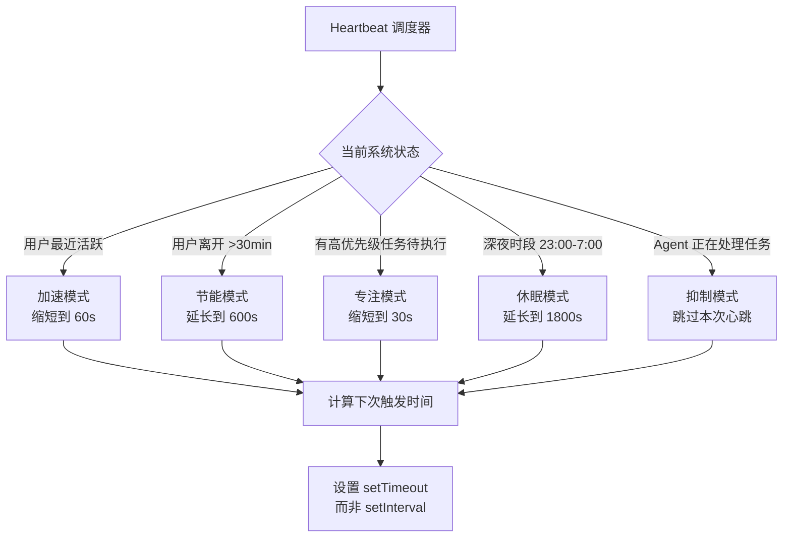
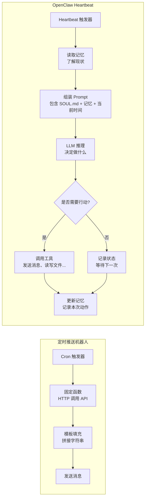
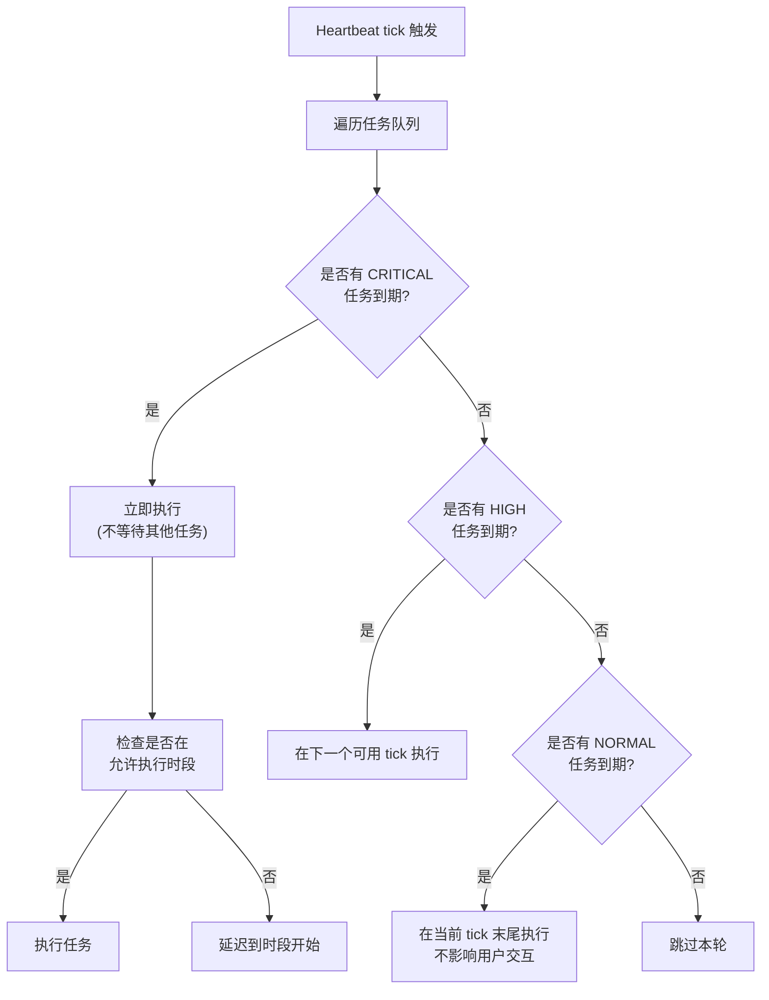
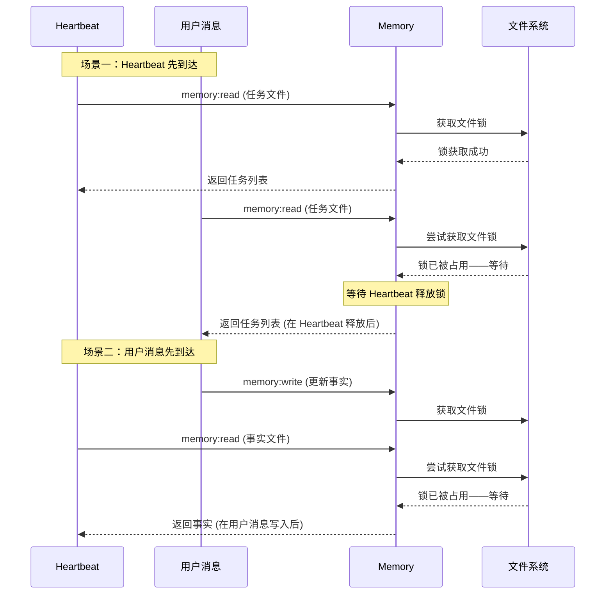
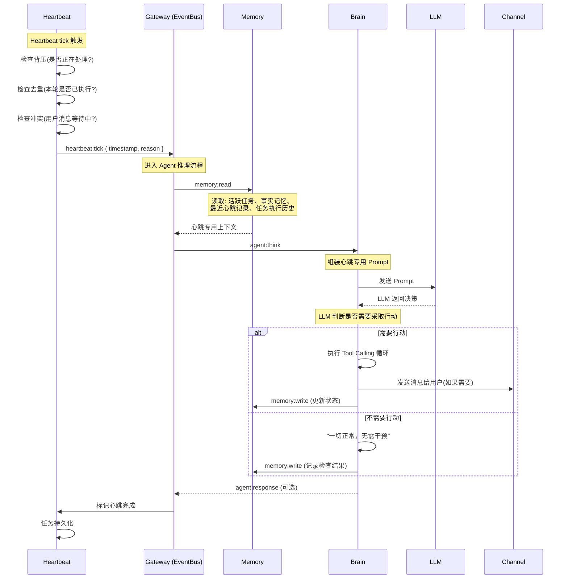
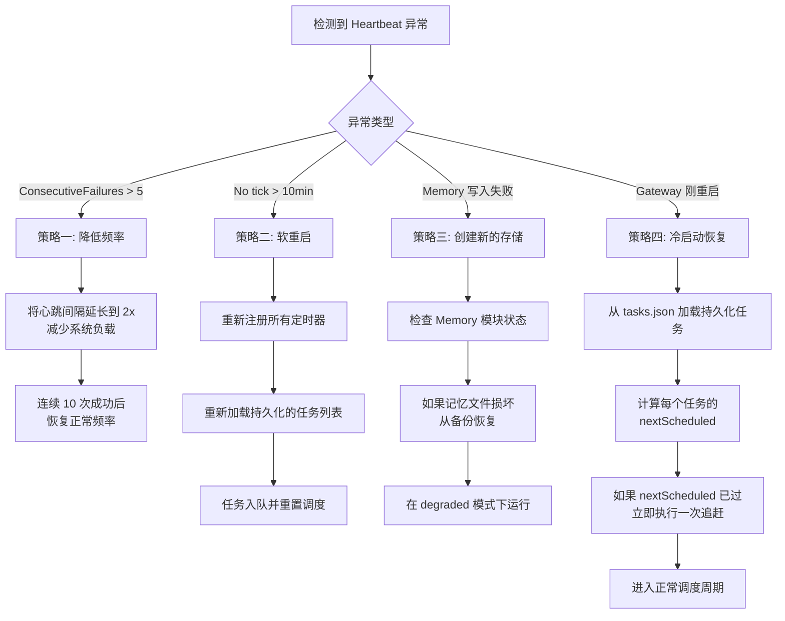
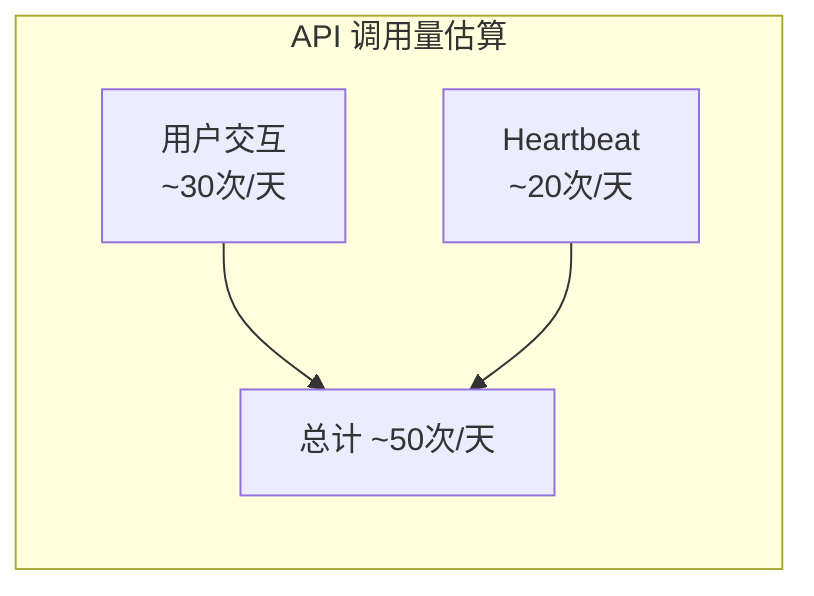

# Heartbeat 心跳调度引擎

> **本章导读**: 基础模块中我们把 Heartbeat 简单描述为"定时触发 Agent 执行任务"的组件。这个描述虽然没错，但掩盖了 Heartbeat 在整个 Agent 系统中扮演的关键角色——它是让 AI 助手从"被动应答"进化为"主动服务"的核心引擎。本章将从源码实现层面深入 Heartbeat 的内部机制：它如何调度定时任务？如何与用户消息并发执行而不冲突？心跳产生的额外成本如何量化？如何保证任务在进程重启后不丢失？
>
> **前置知识**: 基础模块 10-02 架构概览、本章 01 Gateway 的事件总线机制、本章 04 Memory 系统的并发访问机制
>
> **难度等级**: ⭐⭐⭐⭐☆

---

## 一、Heartbeat 调度算法

Heartbeat 的核心是一个**定时调度引擎**，但它远不止"每隔 N 秒执行一次"那么简单。调度算法的设计直接影响 Agent 的主动性、响应及时性和资源消耗。

### 1.1 固定间隔调度 vs 动态调整调度

**固定间隔调度** 是最直接的实现方式：使用 `setInterval` 或 `setTimeout` 以固定时间间隔触发心跳。

```typescript
// 固定间隔调度的基础实现
class FixedIntervalScheduler {
  private interval: number; // 毫秒
  private timer: NodeJS.Timeout | null = null;
  private lastTick: number = 0;
  private tickCount: number = 0;

  start(intervalMs: number): void {
    this.interval = intervalMs;
    // 首次心跳延迟一小段时间
    setTimeout(() => {
      this.tick();
      this.timer = setInterval(() => this.tick(), intervalMs);
    }, 5000);
  }

  private async tick(): Promise<void> {
    const now = Date.now();
    this.lastTick = now;
    this.tickCount++;
    // 触发 Agent 推理
    await this.triggerAgentThink();
  }
}
```

然而固定间隔存在明显缺陷：**如果一次心跳的 Agent 推理时间超过间隔时长，下一次心跳会被推迟**。更严重的是，在用户活跃的时间段，固定的心跳可能干扰用户交互，而在用户睡眠时段，心跳又在做无用功。

**动态调整调度** 则根据系统的状态智能调整心跳频率：



```typescript
// 动态调整调度的核心逻辑
class AdaptiveScheduler {
  private readonly BASE_MIN = 60_000;    // 60 秒
  private readonly BASE_MAX = 600_000;   // 600 秒
  private readonly SLEEP_MIN = 1_800_000; // 30 分钟

  private userLastActive: number = Date.now();
  private nextTickTime: number = 0;
  private isProcessing: boolean = false;

  // 计算下一次心跳的等待时间
  calculateNextInterval(): number {
    const now = Date.now();
    const idleDuration = now - this.userLastActive;
    const hour = new Date().getHours();

    // 深夜时段
    if (hour >= 23 || hour < 7) {
      return this.SLEEP_MIN;
    }

    // Agent 正在处理上一次心跳——跳过
    if (this.isProcessing) {
      return Math.max(5000, this.BASE_MIN / 12); // 5 秒后重新检查
    }

    // 用户刚发过消息——加速
    if (idleDuration < 5 * 60_000) {
      return this.BASE_MIN; // 1 分钟
    }

    // 用户离开较久——减速
    if (idleDuration > 30 * 60_000) {
      return this.BASE_MAX; // 10 分钟
    }

    // 默认中等频率
    return 300_000; // 5 分钟
  }

  onUserMessage(): void {
    this.userLastActive = Date.now();
  }

  onProcessingStart(): void {
    this.isProcessing = true;
  }

  onProcessingEnd(): void {
    this.isProcessing = false;
  }
}
```

| 调度模式 | 触发条件 | 间隔 | 适用场景 |
|---------|---------|------|---------|
| 加速模式 | 用户刚发送消息 | 60s | 用户正在对话，Agent 需要快速响应 |
| 标准模式 | 用户离开 5-30 分钟 | 300s | 日常后台检查 |
| 节能模式 | 用户离开超过 30 分钟 | 600s | 用户不在电脑前 |
| 休眠模式 | 深夜 (23:00-7:00) | 1800s | 用户休息时间 |
| 专注模式 | 有高优先级任务 | 30s | 重要提醒即将触发 |
| 抑制模式 | Agent 正在处理 | 跳过 | 避免叠加执行 |

### 1.2 错过任务补偿策略

心跳调度中最容易被忽视的问题是：**如果上一次心跳错过了怎么办？**

错过心跳的原因可能是：Agent 正在处理长耗时任务、系统资源紧张、或者 Gateway 刚恢复运行。OpenClaw 的补偿策略分为三级：

```typescript
// 错过任务的三级补偿策略
class MissedTaskCompensator {
  private lastSuccessfulTick: number = 0;
  private readonly MAX_CATCHUP_DELAY = 3600; // 最多追赶 1 小时

  async onHeartbeatTrigger(): Promise<void> {
    const now = Date.now();
    const missedDuration = now - this.lastSuccessfulTick;

    if (missedDuration < 300_000) {
      // 级别 1: 错过不到 5 分钟——直接跳过，等待下一次
      logger.info('Missed duration < 5min, skipping catchup');
      return;
    }

    if (missedDuration < 3_600_000) {
      // 级别 2: 错过 5 分钟到 1 小时——加速追赶
      logger.info(
        `Missed ${Math.round(missedDuration / 1000)}s, ` +
        `performing accelerated catchup.`
      );
      // 执行一次完整的 Heartbeat，但使用更短的上下文窗口
      await this.executeHeartbeat({ mode: 'catchup_short' });
    } else {
      // 级别 3: 错过超过 1 小时——选择性追赶
      logger.info(
        `Missed ${Math.round(missedDuration / 1000)}s, ` +
        `performing selective catchup.`
      );
      // 只执行高优先级任务，跳过日常检查
      await this.executeHeartbeat({ mode: 'catchup_priority_only' });
    }
  }
}
```

**补偿的边界条件**：

| 错过时长 | 补偿行为 | 理由 |
|---------|---------|------|
| < 5 分钟 | 不补偿 | 短时间内跳过一次影响极小 |
| 5 分钟 - 1 小时 | 执行单次加速心跳 | 快速检查关键状态 |
| 1 小时 - 4 小时 | 选择性执行（只高优先级） | 避免大量积压任务造成突发负载 |
| > 4 小时 | 跳过追赶，进入正常周期 | 长时间离线说明用户不在，追赶无意义 |

### 1.3 与普通聊天机器人"定时推送"的本质区别

这是理解 Heartbeat 价值的关键。普通的定时推送机器人（如天气 Bot、新闻 Bot）的逻辑是：

```
定时触发器 → 执行固定代码 → 发送固定内容
```

这是一个**确定的、非智能的**执行路径。程序员预先写好了"每早 8 点发送天气"，Bot 不需要思考，只需要执行。

而 OpenClaw 的 Heartbeat 本质区别在于：



核心差异可以归纳为三个维度：

| 维度 | 定时推送机器人 | OpenClaw Heartbeat |
|------|--------------|-------------------|
| **决策者** | 程序员硬编码的逻辑 | LLM 根据上下文自主判断 |
| **输出确定性** | 每次输出一致（模板化） | 每次输出可能不同（取决于语境） |
| **上下文感知** | 无——不知道用户在做什么 | 读取记忆，知道当前状态和任务 |
| **工具调用** | 通常不需要 | 可能调用多个工具完成复杂任务 |
| **失败处理** | 代码异常处理 | LLM 自主判断重试或跳过 |

举例说明：如果用户昨天让 Agent "每天早上提醒我测试新功能"，Heartbeat 触发时，Agent 会：

1. 读取记忆 → 看到用户昨天新部署了代码
2. 阅读对话历史 → 看到用户昨天遇到了 Bug
3. 决定行动 → 发送提醒时附加"测试时注意昨天修复的 Bug"
4. 更新记忆 → 记录提醒已发送

而定时推送机器人只能发送一条预设的："别忘测试。"——完全无法利用上下文做出更智能的响应。

---

## 二、任务队列的设计

Heartbeat 需要管理多个定时任务，这些任务可能有不同的优先级、触发条件和生命周期。一个健壮的任务队列是 Heartbeat 的基础设施。

### 2.1 任务优先级

任务优先级的核心目的是：**在资源有限的情况下，确保最重要的任务优先执行**。

```typescript
// 任务优先级的定义
enum TaskPriority {
  CRITICAL = 0,   // 紧急提醒——必须准时执行
  HIGH = 1,       // 重要检查——用户关注的核心功能
  NORMAL = 2,     // 例行任务——日常检查和维护
  LOW = 3,        // 背景任务——不紧急的摘要、整理
  IDLE = 4,       // 空闲任务——只在系统空闲时执行
}

interface HeartbeatTask {
  id: string;
  name: string;
  priority: TaskPriority;
  interval: number;      // 执行间隔（毫秒）
  lastExecuted: number;
  handler: () => Promise<void>;

  // 优先级调度相关
  maxRetries: number;    // 失败重试次数
  timeout: number;       // 单次执行超时
  allowedWindows?: {     // 允许执行的时段
    start: number;       // 小时 (0-23)
    end: number;         // 小时 (0-23)
  };
}
```

**优先级调度的工作流程**：



**不同优先级任务的行为差异**：

| 优先级 | 执行时机 | 错过后的行为 | 典型场景 |
|--------|---------|-------------|---------|
| CRITICAL | 到期立即执行 | 每次 tick 重试直到成功 | 闹钟、截止日期提醒 |
| HIGH | 下一个可用 tick | 在追赶模式中自动补偿 | 天气提醒、新闻简报 |
| NORMAL | 当前 tick 末尾 | 跳过——等待下一次 | 日志轮转、记忆整理 |
| LOW | 系统空闲时 | 跳过——不主动补偿 | 摘要生成、旧数据归档 |
| IDLE | CPU 使用率 < 30% | 永远不补偿 | 索引重建、缓存预热 |

### 2.2 任务去重

从 Gateway 架构的角度看，任务去重是保证"同一任务不重复触发"的关键机制。在单进程中，重复触发可能发生在以下场景：

1. **Heartbeat 模块的重启恢复**：Gateway 重启后，定时器被重新设置，任务可能被重复执行
2. **追赶补偿导致的重复**：错过任务补偿时，如果补偿逻辑不精确，可能产生重复
3. **多 tick 堆积**：事件循环卡顿后，多个 tick 回调同时触发

```typescript
// 任务去重的关键实现
class TaskDeduplicator {
  // 执行记录：taskId → 上次执行的时间戳
  private executionLog = new Map<string, number>();
  // 去重窗口（同一任务在窗口期内不重复触发）
  private readonly DEDUP_WINDOW = 5000; // 5 秒

  // 检查任务是否可以执行
  canExecute(taskId: string, scheduledTime: number): boolean {
    const lastExecuted = this.executionLog.get(taskId) ?? 0;

    // 如果上次执行在去重窗口内——拒绝
    if (Date.now() - lastExecuted < this.DEDUP_WINDOW) {
      logger.warn(
        `Task "${taskId}" was executed ${Date.now() - lastExecuted}ms ago, ` +
        `deduplication triggered.`
      );
      return false;
    }

    // 如果任务已经在执行中——拒绝（防止重入）
    if (this.inProgress.has(taskId)) {
      logger.warn(
        `Task "${taskId}" is already in progress, ` +
        `re-entrance prevention triggered.`
      );
      return false;
    }

    return true;
  }

  // 标记任务开始执行
  markStarted(taskId: string): void {
    this.inProgress.add(taskId);
  }

  // 标记任务执行完成
  markCompleted(taskId: string): void {
    this.executionLog.set(taskId, Date.now());
    this.inProgress.delete(taskId);
  }
}
```

### 2.3 任务超时

在单进程架构下，一个卡住的任务会阻塞整个事件循环。任务超时机制确保"一个任务卡住不影响其他任务"。

```typescript
// 带超时的任务执行器
class TimeoutExecutor {
  async executeWithTimeout<T>(
    task: HeartbeatTask,
    handler: () => Promise<T>
  ): Promise<T | null> {
    const timeout = task.timeout || 30_000; // 默认 30 秒

    return new Promise((resolve) => {
      const timer = setTimeout(() => {
        logger.error(
          `Task "${task.name}" timed out after ${timeout}ms. ` +
          `Priority: ${task.priority}. ` +
          `Continuing with other tasks...`
        );
        resolve(null);
      }, timeout);

      handler()
        .then(result => {
          clearTimeout(timer);
          resolve(result);
        })
        .catch(error => {
          clearTimeout(timer);
          logger.error(
            `Task "${task.name}" failed: ${error.message}`
          );
          resolve(null); // 不抛出，不影响其他任务
        });
    });
  }
}
```

关键设计点：

- **每个任务有独立的超时**：CRITICAL 任务超时 60s，NORMAL 任务超时 30s，背景任务 120s
- **超时后不中断正在执行的操作**：只放弃等待结果，不强制终止（终止可能导致脏数据）
- **失败不传播**：每个任务用独立的 try/catch 包裹，失败只记录日志

### 2.4 任务持久化

Gateway 重启后，内存中的定时器全部丢失。任务持久化确保"重启后任务不丢失"。

```typescript
// 任务持久化管理器
class TaskPersistence {
  private readonly STORE_PATH =
    '~/.openclaw/heartbeat/tasks.json';

  // 持久化的任务数据结构
  interface PersistedTask {
    id: string;
    name: string;
    priority: TaskPriority;
    cronExpression: string;
    lastExecuted: number;
    nextScheduled: number;
    metadata: Record<string, any>;
    createdAt: number;
    updatedAt: number;
  }

  // 保存所有活跃任务
  async persist(tasks: HeartbeatTask[]): Promise<void> {
    const data: PersistedTask[] = tasks.map(t => ({
      id: t.id,
      name: t.name,
      priority: t.priority,
      cronExpression: t.cronExpression,
      lastExecuted: t.lastExecuted,
      nextScheduled: this.calculateNextSchedule(t),
      metadata: t.metadata,
      createdAt: t.createdAt,
      updatedAt: Date.now(),
    }));

    await fs.promises.writeFile(
      this.STORE_PATH,
      JSON.stringify(data, null, 2),
      'utf-8'
    );
  }

  // 启动时加载任务
  async load(): Promise<HeartbeatTask[]> {
    try {
      const content = await fs.promises.readFile(
        this.STORE_PATH, 'utf-8'
      );
      const persisted: PersistedTask[] = JSON.parse(content);

      return persisted.map(p => ({
        ...p,
        handler: this.resolveHandler(p.name),
        // 如果下次调度时间已过，立即执行
        immediate: p.nextScheduled <= Date.now(),
      }));
    } catch {
      // 文件不存在或格式错误——空任务列表
      return [];
    }
  }
}
```

**写入时机**：

| 触发事件 | 写入频率 | 说明 |
|---------|---------|------|
| 任务创建/修改 | 立即写入 | 确保新任务不丢失 |
| 任务执行完成 | 批量化，每 5 次或 30 秒刷盘 | 平衡性能和安全性 |
| Heartbeat tick | 每次 tick 结束时 | 记录 `lastExecuted` |
| Gateway 正常关闭 | 最后一条操作 | graceful shutdown 保障 |
| Gateway 崩溃 | 依赖定时刷盘 | 最多丢失 30 秒的执行状态 |

---

## 三、心跳与用户消息的冲突处理

Heartbeat 运行在 Gateway 的单进程事件循环中。当心跳触发和用户消息同时到达时，需要一个明确的冲突处理策略。

### 3.1 并发访问 Memory 的锁机制

第 04 章 Memory 系统设计了文件级锁来解决并发写入冲突。Heartbeat 和用户消息都可能触发 Memory 的读写，需要共享同一套锁机制。



锁机制的实现细节：

```typescript
// 共享的文件级锁（与 Memory 模块共用）
class SharedFileLock {
  private locks = new Map<string, {
    owner: 'heartbeat' | 'user' | 'system';
    acquiredAt: number;
    release: () => void;
  }>();

  private readonly LOCK_TIMEOUT = 10_000; // 10 秒锁超时

  async acquire(
    filePath: string,
    owner: 'heartbeat' | 'user' | 'system',
    timeout: number = 5000
  ): Promise<boolean> {
    const startTime = Date.now();

    while (Date.now() - startTime < timeout) {
      const existingLock = this.locks.get(filePath);

      // 无锁或锁已超时——获取
      if (!existingLock ||
          Date.now() - existingLock.acquiredAt > this.LOCK_TIMEOUT) {
        // 超时锁——强制释放
        if (existingLock) {
          logger.warn(
            `Force releasing stale lock on ${filePath} ` +
            `(held by ${existingLock.owner} for ` +
            `${Date.now() - existingLock.acquiredAt}ms)`
          );
        }

        return this.createLock(filePath, owner);
      }

      // 等待 100ms 后重试
      await new Promise(r => setTimeout(r, 100));
    }

    // 获取锁超时
    logger.warn(
      `Lock acquisition timeout for ${filePath} (owner: ${owner})`
    );
    return false;
  }

  release(filePath: string): void {
    this.locks.delete(filePath);
  }

  private createLock(
    filePath: string,
    owner: 'heartbeat' | 'user' | 'system'
  ): boolean {
    let released = false;
    this.locks.set(filePath, {
      owner,
      acquiredAt: Date.now(),
      release: () => { released = true; },
    });
    return true;
  }
}
```

### 3.2 同时接收到用户消息和心跳触发时的优先级处理

当 Heartbeat 触发和用户消息同时到达时，Heartbeat 模块的职责与 Brain 的职责需要协同决策。以下是 Gateway 的处理规则：

```typescript
// 冲突处理的核心决策逻辑
class HeartbeatConflictResolver {
  // 当前的冲突处理模式
  private mode: 'user_first' | 'background' | 'adaptive';

  constructor() {
    this.mode = 'user_first'; // 默认用户优先
  }

  // 判断是否应该执行心跳
  async shouldProceedWithHeartbeat(
    heartbeatPriority: TaskPriority,
    pendingUserMessages: number
  ): Promise<boolean> {
    if (pendingUserMessages > 0 && this.mode !== 'background') {
      // 有未处理的用户消息

      if (heartbeatPriority === TaskPriority.CRITICAL) {
        // CRITICAL 任务——即使有用户消息也执行
        // 但标记为"静默模式"：不主动推送通知给用户
        await this.executeHeartbeat({ silent: true });
        return true;
      }

      // 非紧急任务——跳过本轮
      logger.info(
        `Skipping heartbeat (priority=${heartbeatPriority}): ` +
        `${pendingUserMessages} pending user messages`
      );
      return false;
    }

    // 无待处理用户消息——正常执行心跳
    return true;
  }
}
```

**冲突处理优先级矩阵**：

| 心跳优先级 | 有用户消息 | 无用户消息 | 行为 |
|-----------|-----------|-----------|------|
| CRITICAL | 执行（静默模式） | 正常执行 | 闹钟、截止日从不推迟 |
| HIGH | 跳过本轮 | 正常执行 | 推迟到用户交互间隙 |
| NORMAL | 跳过本轮 | 正常执行 | 例行任务可推迟 |
| LOW | 跳过本轮 | 系统空闲才执行 | 背景任务不争抢资源 |

Heartbeat 模块在处理冲突时还遵循**请求-响应模式的背压原则**（在 01 章 1.2 节中已有介绍）：

```typescript
// Heartbeat 模块的背压控制（继承自事件总线设计）
class HeartbeatModule {
  private processing: boolean = false;
  private readonly BACKPRESSURE_CHECK_INTERVAL = 5000; // 5s

  async onTick(): Promise<void> {
    if (this.processing) {
      // 如果上一次心跳的 Agent 推理尚未完成
      // 不是在总线上堆积事件，而是记录并跳过
      logger.warn(
        'Previous heartbeat still processing, ' +
        'backpressure: skipping this tick.'
      );

      // 5 秒后重试
      setTimeout(() => this.onTick(), this.BACKPRESSURE_CHECK_INTERVAL);
      return;
    }

    this.processing = true;
    try {
      await this.triggerAgentThink();
    } finally {
      this.processing = false;
    }
  }
}
```

---

## 四、心跳触发后的完整执行流程

Heartbeat 的 Agent 推理流程在架构上与用户消息处理类似，但在多个关键环节存在差异。

### 4.1 执行流程全景



### 4.2 与用户消息处理流程的差异分析

将 Heartbeat 推理与用户消息推理放在一起对比，差异一目了然：

| 维度 | 用户消息处理 | Heartbeat 处理 |
|------|------------|---------------|
| **触发源** | 外部用户通过 Channel 发送 | 内部定时器触发 |
| **System Prompt** | SOUL.md + 当前对话上下文 | SOUL.md + 心跳专用指令 |
| **记忆注入** | 完整记忆（事实+任务+历史+摘要） | 精简记忆（任务+最近心跳记录） |
| **Role 设定** | "你正在与用户对话" | "你正在执行定时检查任务" |
| **输出目标** | 回复消息给用户 | 可能不输出，或发送通知 |
| **工具调用** | 按需（取决于用户请求） | 按需（取决于 Agent 自主判断） |
| **写入记忆** | 写入对话历史 | 写入心跳日志 + 任务状态 |
| **取消条件** | 用户不再回复 | 没有可执行的任务时跳过 |

**Heartbeat 专用的 Prompt 模板**：

```
[Heartbeat 模式]
你正在执行一次定时检查。当前时间: {timestamp}。

你的职责：
1. 检查活跃任务列表，判断是否有需要执行的任务
2. 检查待办提醒，判断是否需要发送通知
3. 检查系统状态，判断是否有异常需要报告

指导原则：
- 如果没有需要执行的任务，回复 "NO_ACTION_NEEDED"
- 如果需要通知用户，通过 Channel 发送消息
- 如果需要更新记忆，调用 memory:write
- 不要执行不必要的操作——如果没有事情要做，保持安静
```

### 4.3 心跳中是否需要调用工具的决策逻辑

一个常见的设计问题是：心跳触发后，Agent 是否应该调用工具（如联网搜索、文件读写）？答案取决于心跳的**类型**和**优先级**。

```typescript
// 心跳类型决定工具调用策略
enum HeartbeatType {
  CHECK_ONLY,       // 仅检查状态——不调用工具
  MAINTAIN,         // 系统维护——可能调用内部工具
  FULL_AGENT,       // 完整 Agent 模式——可调用任何工具
}

class HeartbeatToolPolicy {
  determineToolUsage(
    priority: TaskPriority,
    taskTypes: string[]
  ): HeartbeatType {
    if (priority === TaskPriority.CRITICAL) {
      // 紧急任务——完整 Agent 模式
      // 例如：截止日期提醒（可能需联网确认）
      return HeartbeatType.FULL_AGENT;
    }

    if (taskTypes.some(t => ['memory', 'task'].includes(t))) {
      // 内部维护任务——只调用内部工具
      return HeartbeatType.MAINTAIN;
    }

    // 常规检查——不调用工具
    return HeartbeatType.CHECK_ONLY;
  }
}
```

**不同心跳类型的工具调用限制**：

| 心跳类型 | 允许的工具 | 禁止的工具 | 典型 Token 消耗 |
|---------|-----------|-----------|----------------|
| CHECK_ONLY | 无 | 所有 | ~300 tokens（仅 LLM 检查） |
| MAINTAIN | memory_read, memory_write | 网络、文件、代码 | ~1000 tokens |
| FULL_AGENT | 所有注册工具 | 无（受权限限制） | ~3000+ tokens |

这个分层设计的关键目的是：**避免每次心跳都消耗大量 Token 调用 LLM 进行完整推理**。大多数心跳只需要快速检查任务状态（使用简单的关键词匹配或规则判断），只有紧急任务才需要完整的 LLM 推理。

---

## 五、复杂定时场景

Heartbeat 需要支持超越简单固定间隔的定时场景，包括 Cron 表达式、时区和节假日处理。

### 5.1 Cron 表达式支持

Cron 表达式是 Unix 系统中最广为接受的定时格式。Heartbeat 支持标准的 5 字段 Cron 表达式：

```typescript
// Cron 表达式解析器（基于第三方库的封装）
import { parseExpression } from 'cron-parser';

interface CronTask {
  id: string;
  name: string;
  cron: string;          // 如 "0 9 * * 1-5"（工作日早 9 点）
  timezone: string;      // 时区
  enabled: boolean;
  handler: () => Promise<void>;
}

class CronScheduler {
  private tasks: CronTask[] = [];
  private nextCheckTimer: NodeJS.Timeout | null = null;

  // 注册一个 Cron 任务
  register(task: CronTask): void {
    this.tasks.push(task);
    this.recalculateNextTick();
  }

  // 计算最近的下一次触发时间
  private recalculateNextTick(): void {
    const now = Date.now();
    let nextTick = Infinity;

    for (const task of this.tasks) {
      const interval = parseExpression(task.cron, {
        currentDate: new Date(now),
        tz: task.timezone,
      });
      const next = interval.next().getTime();
      if (next < nextTick) {
        nextTick = next;
      }
    }

    // 设置定时器到下一个任务触发
    if (nextTick < Infinity && nextTick > now) {
      const delay = nextTick - now;
      if (this.nextCheckTimer) {
        clearTimeout(this.nextCheckTimer);
      }
      this.nextCheckTimer = setTimeout(
        () => this.onTick(),
        delay
      );
    }
  }

  private async onTick(): Promise<void> {
    const now = Date.now();

    for (const task of this.tasks) {
      const interval = parseExpression(task.cron, {
        currentDate: new Date(now),
        tz: task.timezone,
      });
      const prev = interval.prev().getTime();

      // 如果上一次触发时间在最近 1 秒内——触发
      if (now - prev < 1000) {
        await task.handler();
      }
    }

    // 重新计算下一次
    this.recalculateNextTick();
  }
}
```

**常用 Cron 表达式示例**：

| 描述 | Cron 表达式 | 说明 |
|------|------------|------|
| 每天早上 9 点 | `0 9 * * *` | 日常提醒 |
| 工作日早 9 点 | `0 9 * * 1-5` | 工作日提醒 |
| 每小时 | `0 * * * *` | 定时检查 |
| 每 30 分钟 | `*/30 * * * *` | 高频检查 |
| 每月 1 号 | `0 0 1 * *` | 月度任务 |
| 每周末上午 | `0 10 * * 6,7` | 周末提醒 |
| 自定义间隔 | `0 */2 * * *` | 每 2 小时 |

### 5.2 时区处理

时区处理是 Heartbeat 中"看起来简单但实际很容易出错"的部分。用户可能在东八区，而 Gateway 运行在 UTC 服务器上。

```typescript
// 时区感知的调度器
class TimezoneAwareScheduler {
  private readonly DEFAULT_TZ = 'Asia/Shanghai';

  // 将本地时间转换为 Cron 执行的绝对时间
  scheduleAtLocalTime(
    localHour: number,
    localMinute: number,
    timezone: string = this.DEFAULT_TZ
  ): { cron: string; timezone: string } {
    // 在指定时区生成 Cron 表达式
    return {
      cron: `${localMinute} ${localHour} * * *`,
      timezone: timezone,
    };
  }

  // 检查当前时间是否在指定时区的指定时段内
  isInTimeWindow(
    windowStart: number, // 小时 (0-23)
    windowEnd: number,   // 小时 (0-23)
    timezone: string = this.DEFAULT_TZ
  ): boolean {
    const now = new Date();
    const localHour = new Intl.DateTimeFormat('en-US', {
      hour: 'numeric',
      hour12: false,
      timeZone: timezone,
    }).format(now);

    const hour = parseInt(localHour, 10);
    if (windowStart <= windowEnd) {
      return hour >= windowStart && hour < windowEnd;
    } else {
      // 跨天窗口，如 22:00 - 06:00
      return hour >= windowStart || hour < windowEnd;
    }
  }
}
```

**时区处理的常见陷阱**：

1. **夏令时**：某些时区（如 `America/New_York`）有夏令时变更，Cron 解析库需要支持自动调整
2. **跨天窗口**：深夜任务（23:00-01:00）属于跨天窗口，需要正确处理边界条件
3. **时区变化**：用户可能在不同时区使用 Agent（出差场景），任务调度需要感知用户的当前位置

### 5.3 节假日跳过

对于企业场景，工作日执行的提醒任务需要在节假日自动跳过。Heartbeat 支持灵活的节假日配置：

```yaml
# 节假日配置示例
heartbeat:
  holiday_skip:
    enabled: true
    # 模式: 'china'（中国法定节假日）或 'custom'（自定义）
    mode: china
    # 自定义节假日列表（mode: custom 时使用）
    custom_holidays:
      - "2026-01-01"   # 元旦
      - "2026-10-01"   # 国庆
    # 调休工作日（中国特有：某些周末需要上班）
    workweekend_days:
      - "2026-01-04"   # 调休上班
```

```typescript
// 节假日检测器
class HolidayDetector {
  private holidays: Set<string>;
  private workWeekends: Set<string>;

  // 初始化节假日库
  async initialize(mode: 'china' | 'custom'): Promise<void> {
    this.holidays = new Set();
    this.workWeekends = new Set();

    if (mode === 'china') {
      // 加载内置的中国法定节假日数据
      // 数据来源：国务院每年发布的节假日安排
      await this.loadChinaHolidays(2026);
    }
  }

  // 判断某天是否应该跳过任务
  shouldSkip(date: Date, taskTimezone: string): boolean {
    const dateStr = this.formatDate(date, taskTimezone);

    // 节假日跳过
    if (this.holidays.has(dateStr)) {
      return true;
    }

    // 工作日才执行的任务，在调休周末不跳过
    if (this.workWeekends.has(dateStr)) {
      return false;
    }

    // 判断是否是周末
    const dayOfWeek = new Intl.DateTimeFormat('en-US', {
      weekday: 'short',
      timeZone: taskTimezone,
    }).format(date);

    return dayOfWeek === 'Sat' || dayOfWeek === 'Sun';
  }
}
```

---

## 六、心跳状态的监控与恢复

Heartbeat 是 Gateway 的"自检"机制，它自身也需要被监控——如果心跳停了，整个 Agent 的主动性就瘫痪了。

### 6.1 心跳健康检查

Heartbeat 模块通过 `process.uptime()` 和自检记录提供健康状态：

```typescript
class HeartbeatHealthCheck {
  private readonly WARNING_INTERVAL = 600;  // 600 秒无心跳时告警
  private readonly CRITICAL_INTERVAL = 1800; // 1800 秒无心跳时认定不可用

  private lastTick: number = Date.now();
  private successCount: number = 0;
  private failCount: number = 0;
  private consecutiveFailures: number = 0;

  // 记录一次成功的心跳
  recordSuccess(): void {
    this.lastTick = Date.now();
    this.successCount++;
    this.consecutiveFailures = 0;
  }

  // 记录一次失败的心跳
  recordFailure(error: Error): void {
    this.failCount++;
    this.consecutiveFailures++;
  }

  // 获取健康状态（被 /health 端点调用）
  getStatus(): HeartbeatStatus {
    const now = Date.now();
    const elapsed = (now - this.lastTick) / 1000;

    let status: 'healthy' | 'warning' | 'critical';

    if (elapsed < this.WARNING_INTERVAL) {
      status = 'healthy';
    } else if (elapsed < this.CRITICAL_INTERVAL) {
      status = 'warning';
    } else {
      status = 'critical';
    }

    return {
      status,
      lastTickAgo: Math.round(elapsed),
      successRate: this.successCount + this.failCount > 0
        ? Math.round(
            this.successCount /
            (this.successCount + this.failCount) * 100
          )
        : 100,
      consecutiveFailures: this.consecutiveFailures,
      uptime: process.uptime(),
    };
  }
}
```

### 6.2 心跳丢失检测

除了自检，Heartbeat 还有一种"被动监控"机制——通过检查相邻两轮心跳之间的时间差来检测丢失：

```typescript
// 心跳丢失检测器
class MissedBeatDetector {
  private tickHistory: number[] = [];   // 最近 100 次心跳的时间戳
  private readonly HISTORY_SIZE = 100;
  private readonly EXPECTED_INTERVAL: number;

  constructor(expectedInterval: number) {
    this.EXPECTED_INTERVAL = expectedInterval;
  }

  recordTick(): void {
    const now = Date.now();

    if (this.tickHistory.length > 0) {
      const lastTick = this.tickHistory[this.tickHistory.length - 1];
      const actualGap = now - lastTick;
      const expectedGap = this.EXPECTED_INTERVAL;

      // 如果实际间隔超过预期间隔的 2 倍——认定丢失
      if (actualGap > expectedGap * 2) {
        const missedCount = Math.floor(
          (actualGap - expectedGap) / expectedGap
        );
        logger.warn(
          `Detected approximately ${missedCount} missed heartbeat(s). ` +
          `Actual gap: ${actualGap}ms, expected: ${expectedGap}ms`
        );
      }
    }

    this.tickHistory.push(now);
    if (this.tickHistory.length > this.HISTORY_SIZE) {
      this.tickHistory.shift();
    }
  }
}
```

### 6.3 自动恢复机制

Heartbeat 的恢复不是"重启 Heartbeat 模块"这么简单——需要根据不同的故障类型采取不同的恢复策略：



```typescript
// 自动恢复的执行器
class HeartbeatRecovery {
  private readonly RECOVERY_ATTEMPTS = 3;

  async attemptRecovery(
    failureType: 'high_failures' | 'long_silence' | 'memory_error' | 'gateway_restart'
  ): Promise<boolean> {
    logger.info(`Starting Heartbeat recovery (type: ${failureType})...`);

    switch (failureType) {
      case 'high_failures':
        // 降低频率，减少系统负载
        await this.reduceFrequency();
        break;

      case 'long_silence':
        // 软重启——重新注册所有定时器
        await this.restartScheduler();
        break;

      case 'memory_error':
        // 以 degraded 模式恢复
        await this.startInDegradedMode();
        break;

      case 'gateway_restart':
        // 从持久化存储加载任务
        const tasks = await this.loadTasksFromPersistence();
        for (const task of tasks) {
          this.scheduler.register(task);
        }
        break;
    }

    // 验证恢复是否成功
    return await this.verifyHeartbeat();
  }

  private async verifyHeartbeat(): Promise<boolean> {
    // 等待一次成功的心跳
    for (let i = 0; i < this.RECOVERY_ATTEMPTS; i++) {
      await new Promise(r => setTimeout(r, this.EXPECTED_INTERVAL));
      if (this.isHeartbeating()) {
        return true;
      }
    }
    return false;
  }
}
```

---

## 七、性能影响分析

Heartbeat 是"会呼吸的"引擎——每一次呼吸都有成本。理解这些成本对于合理配置 Heartbeat 至关重要。

### 7.1 心跳对 API 调用量的影响

每一次心跳触发一次 Agent 推理，意味着一次 LLM API 调用。不同频率的 Heartbeat 对 API 调用量的影响：



| 心跳间隔 | 每天心跳次数 | 每月 LLM 调用量 | 相对于用户交互的增幅 |
|---------|------------|----------------|-------------------|
| 60 秒 | 1440 次 | 43,200 次 | **48 倍**——不推荐 |
| 300 秒 | 288 次 | 8,640 次 | **9.6 倍**——较激进 |
| 600 秒 | 144 次 | 4,320 次 | **4.8 倍**——适中 |
| 1800 秒 | 48 次 | 1,440 次 | **1.6 倍**——保守 |
| 3600 秒 | 24 次 | 720 次 | **0.8 倍**——低频 |

以上假设用户每天产生约 30 次交互。可以看到，**心跳间隔从 60s 改为 300s，API 调用量降低 5 倍**。这是 Heartbeat 配置中最关键的权衡。

### 7.2 Token 消耗估算

除了 API 调用次数，每次心跳的 Token 消耗也需要精确估算。Heartbeat 的 Token 消耗结构与用户消息不同：

```
用户消息的 Token 消耗:
┌─────────────────────────────────────────┐
│ System Prompt (身份+技能+约束) ~2500     │
│ 对话历史（可选注入） ~5000-15000          │
│ 事实记忆 ~1500                           │
│ 任务记忆 ~800                            │
│ 当前用户消息 ~200                        │
│ 工具定义 ~2000                           │
│ LLM 输出 ~500                           │
├─────────────────────────────────────────┤
│ 单次交互: ~12500-22500 tokens            │
└─────────────────────────────────────────┘

Heartbeat 的 Token 消耗:
┌─────────────────────────────────────────┐
│ System Prompt (身份+心跳指令) ~2000       │
│ 任务记忆 ~800                            │
│ 最近心跳记录 ~500                        │
│ 工具定义（受限的） ~500                   │
│ LLM 输出 ~200 ("NO_ACTION_NEEDED")       │
│          ~2000 (需要行动时的输出)         │
├─────────────────────────────────────────┤
│ 单次心跳 (无操作): ~4000 tokens          │
│ 单次心跳 (有操作): ~5800-12800 tokens    │
└─────────────────────────────────────────┘
```

**每日 Token 消耗估算**（以 300s 间隔、每天 288 次心跳为例）：

```typescript
// 每日 Token 消耗的计算
class HeartbeatTokenEstimator {
  private readonly NO_ACTION_COST = 4000;  // 无操作的心跳
  private readonly ACTION_COST = 8000;     // 有操作的心跳
  private readonly ACTION_RATIO = 0.15;    // 约 15% 的心跳需要行动

  estimateDailyCost(intervalSeconds: number): {
    beatsPerDay: number;
    tokensPerDay: number;
    estimatedCost: string;
  } {
    const beatsPerDay = Math.round(86400 / intervalSeconds);
    const actionBeats = Math.round(beatsPerDay * this.ACTION_RATIO);
    const noActionBeats = beatsPerDay - actionBeats;

    const tokensPerDay =
      noActionBeats * this.NO_ACTION_COST +
      actionBeats * this.ACTION_COST;

    // 以 Claude Sonnet $3/M input tokens 计算
    const costPerMillionTokens = 3;
    const dailyCostUSD =
      (tokensPerDay / 1_000_000) * costPerMillionTokens;

    return {
      beatsPerDay,
      tokensPerDay,
      estimatedCost: `$${dailyCostUSD.toFixed(4)}/天 ` +
        `(~$${(dailyCostUSD * 30).toFixed(2)}/月)`,
    };
  }
}
```

**不同频率下的成本对比**（以 Claude Sonnet、$3/M input tokens 为基准）：

| 心跳间隔 | 每日心跳 | 每日 Token | 每日成本 | 月成本 |
|---------|---------|-----------|---------|-------|
| 60s | 1,440 | 5,760,000 | $17.28 | $518.40 |
| 300s | 288 | 1,152,000 | $3.46 | $103.68 |
| 600s | 144 | 576,000 | $1.73 | $51.84 |
| 1800s | 48 | 192,000 | $0.58 | $17.28 |
| 3600s | 24 | 96,000 | $0.29 | $8.64 |

> **数据揭示了什么？**
>
> 一个 60s 间隔的 Heartbeat 每月会产生 **$518** 的 API 成本，这比大多数 SaaS 服务的费用还高。而 600s 间隔将成本降到 **$52/月**，这是一个合理的范围。300s 间隔的 **$104/月** 在大多数可接受范围内。
>
> 关键洞察是：**90% 以上的 Heartbeat 是无操作检查**（LLM 回复 "NO_ACTION_NEEDED"）。这些"空转"心跳消耗了 Token，但没有产生任何对用户可见的价值。

### 7.3 如何平衡心跳频率和 API 成本

基于以上数据，以下是平衡策略的工程建议：

**策略一：动态调度代替固定间隔**

固定间隔导致用户在睡眠时也产生 Heartbeat 成本。动态调度在夜间（23:00-07:00）自动降低频率，可节省约 **33%** 的 Token 消耗。在用户活跃时段保持较高频率，在不活跃时段降低频率。

**策略二：空转检测与跳过**

在连续多次 "NO_ACTION_NEEDED" 后，Heartbeat 可以自动延长间隔：

```typescript
class AdaptiveIntervalAdjuster {
  private readonly BASE_INTERVAL = 300_000; // 5 分钟
  private readonly MAX_INTERVAL = 1_800_000; // 30 分钟
  private consecutiveNoOps: number = 0;

  calculateNextInterval(): number {
    if (this.consecutiveNoOps < 3) {
      return this.BASE_INTERVAL;
    }

    // 连续无操作——延长间隔（最高到 30 分钟）
    const adjustment = Math.min(
      this.consecutiveNoOps / 10, // 每 10 次空转加一倍
      6 // 最高 6 倍
    );

    return Math.min(
      Math.round(this.BASE_INTERVAL * adjustment),
      this.MAX_INTERVAL
    );
  }

  onHeartbeatResult(hadAction: boolean): void {
    if (hadAction) {
      this.consecutiveNoOps = 0; // 有操作——重置计数器
    } else {
      this.consecutiveNoOps++;
    }
  }
}
```

**策略三：静默心跳模式**

对于 CHECK_ONLY 类型的心跳，可以使用**规则引擎替代 LLM 调用**：

```typescript
// 轻量级的规则引擎——替代 LLM 调用
class RuleBasedHeartbeat {
  // 对简单任务使用规则检查，不调用 LLM
  async evaluate(task: HeartbeatTask): Promise<Evaluation> {
    if (task.type !== 'check_tasks' && task.type !== 'check_reminders') {
      // 复杂任务——走 LLM
      return { requiresLLM: true };
    }

    // 规则: 检查是否有到期的待办任务
    const activeTasks = await this.loadActiveTasks();
    const dueTasks = activeTasks.filter(t =>
      t.dueDate && t.dueDate <= Date.now() &&
      t.status !== 'completed'
    );

    if (dueTasks.length > 0) {
      return {
        requiresLLM: true, // 有到期任务——需要 LLM 决定如何提醒
        context: { dueTasks },
      };
    }

    // 没有到期任务——不需要 LLM
    return {
      requiresLLM: false,
      result: 'NO_ACTION_NEEDED',
    };
  }
}
```

采用规则引擎替代 LLM 后，约 **80% 的日常检查心跳** 可以不调用 LLM，从而大幅降低成本。

**策略四：合理设定目标和预期**

最终的平衡取决于你的使用场景：

| 场景 | 建议间隔 | 月成本 | 理由 |
|------|---------|-------|------|
| 个人实验 | 1800s (30 分钟) | ~$17 | 成本优先，容忍一定延迟 |
| 日常使用 | 600s (10 分钟) | ~$52 | 成本与响应速度的平衡 |
| 重度使用 | 300s (5 分钟) | ~$104 | 需要较快的主动响应 |
| 生产部署 | 动态 60-600s | ~$50-150 | 自动在高低峰间切换 |

---

## 八、与周边模块的协作

### 8.1 事件总线上的 Heartbeat 契约

回顾第 01 章的事件总线设计，Heartbeat 在总线上履行以下契约：

| 事件 | 方向 | 触发条件 | 载荷 |
|------|------|---------|------|
| `heartbeat:tick` | Heartbeat → Gateway | 定时器触发 | `{ timestamp: number, reason?: string }` |
| `heartbeat:missed` | Heartbeat → Gateway | 检测到心跳丢失 | `{ expectedTicks: number, missedCount: number, gap: number }` |
| `heartbeat:recovered` | Heartbeat → Gateway | 恢复成功 | `{ downDuration: number, recoveryType: string }` |
| `heartbeat:status` | Heartbeat → Gateway | 健康检查请求 | `{ status: string, lastTickAgo: number }` |

### 8.2 与 Memory 的协作

Heartbeat 是 Memory 模块的**摘要触发器**（第 04 章 2.4 节）。它定期触发摘要生成：

| Heartbeat 类型 | 触发的 Memory 操作 | 频率 |
|---------------|-------------------|------|
| 每日 0 点 | 生成每日对话摘要 | 1 次/天 |
| 每周日 0 点 | 生成每周摘要 | 1 次/周 |
| 每月 1 日 0 点 | 生成每月摘要 | 1 次/月 |
| 每次心跳 | 清理过期任务（已完成 > 30 天） | 每次 tick |
| 每隔 10 次心跳 | 检查记忆文件完整性 | ~288 次/天（300s 间隔） |

### 8.3 回顾基础模块的 Agent 模型

基础模块中，我们把 Agent 模型定义为：

```
Agent = 感知 → 推理 → 行动 → 记忆
```

Heartbeat 在这四个步骤中都扮演了角色：

| Agent 步骤 | Heartbeat 的作用 |
|-----------|----------------|
| 感知 | 通过定时检查"感知"时间流逝和任务到期 |
| 推理 | 触发 LLM 判断"现在需要做什么" |
| 行动 | 决策是否需要提醒用户、更新系统状态 |
| 记忆 | 记录心跳检查结果、触发摘要生成和任务清理 |

Heartbeat 的本质是**让 Agent 从被动响应者变为主动服务者**。没有 Heartbeat，Agent 只能在收到用户消息时工作；有了 Heartbeat，Agent 可以独立于用户输入自主运作。

---

## 思考题

::: info 检验你的深入理解

1. Heartbeat 的"固定间隔调度"与"动态调整调度"相比，各自的优缺点是什么？在什么场景下固定间隔反而更合适？

2. 任务持久化中，如果 `tasks.json` 文件在写入时损坏，Heartbeat 如何恢复？这个恢复机制和 Memory 模块的 checksum 验证有什么异同？

3. Heartbeat 和用户消息同时触发时的冲突处理策略中，"CRITICAL 优先级心跳在用户消息存在时以静默模式执行"这一策略是否合理？在什么场景下这个策略可能产生反直觉的结果？

4. 心跳触发后的 Agent 推理中，如果 LLM 判断"不需要行动"并返回 `NO_ACTION_NEEDED`，这个过程仍然消耗了 ~4000 tokens。你认为将连续的 NO_ACTION_NEEDED 检测改为规则引擎是值得的优化吗？在什么边界条件下它反而会增加系统的复杂度？

5. 本章的成本分析显示，短间隔（60s）的 Heartbeat 每月成本超过 $500。如果一个用户坚持需要使用 60s 间隔，你能给出哪些优化建议来降低成本？

:::

---

## 本章小结

- **动态调度比固定间隔更适合个人助手场景**：根据用户活跃状态、任务优先级和时段自动调整频率，在用户活跃时加速、在睡眠时降频，显著降低不必要的 Token 消耗

- **三级错过补偿策略**：错过 5 分钟内跳过、5 分钟到 1 小时加速追赶、超过 1 小时选择性执行（只处理高优先级）——不同时长的错过有不同的应对方案

- **任务队列支持多级优先级和严格去重**：CRITICAL 任务立即执行不受干扰，LOW 任务只在系统空闲时运行；5 秒去重窗口和重入防护确保同一任务不会重复触发

- **冲突处理采用"用户优先"原则**：Heartbeat 在用户消息存在时仅执行 CRITICAL 任务（静默模式），非紧急心跳跳过本轮；共享文件级锁避免 Memory 并发写入冲突

- **心跳推理流程与用户消息有本质差异**：使用心跳专用 Prompt、只加载精简记忆、按心跳类型（CHECK_ONLY / MAINTAIN / FULL_AGENT）限制工具调用权限

- **支持复杂定时场景**：标准 5 字段 Cron 表达式、时区感知调度（支持夏令时和跨天窗口）、中国法定节假日自动跳过

- **四级自动恢复机制**：高失败率时降低频率、长时间静默时软重启、Memory 错误时降级运行、Gateway 重启时从持久化恢复

- **成本可控的在合理范围内**：600s 间隔每月 ~$52、300s 间隔每月 ~$104；动态调度 + 规则引擎替代空转 LLM 调用可再节省 30-50% 成本

**下一步**: 理解了 Heartbeat 如何驱动 Agent 的主动行为之后，下一章深入 Channels——适配器模式如何抹平不同消息平台的差异，以及 Channel 的注册、消息转换和平台特有的能力映射。

---

[← 返回深度指南主页](/deep-dive/openclaw/) | [继续学习:Channels 适配器模式 →](/deep-dive/openclaw/06-channels-adapters)
