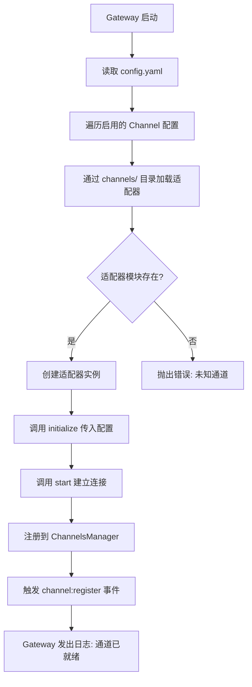
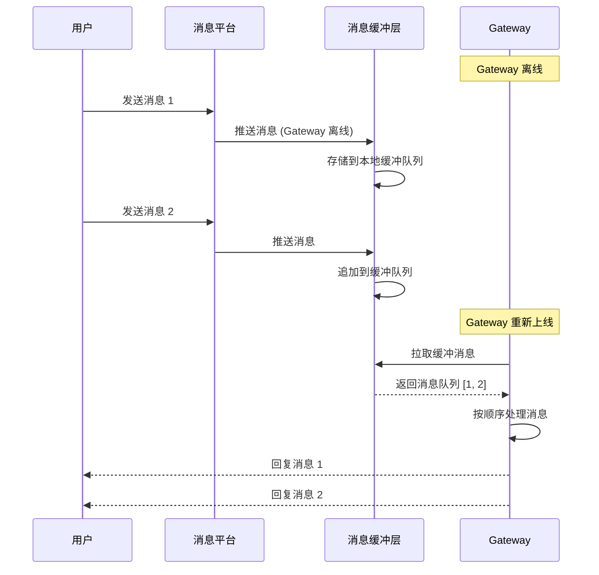
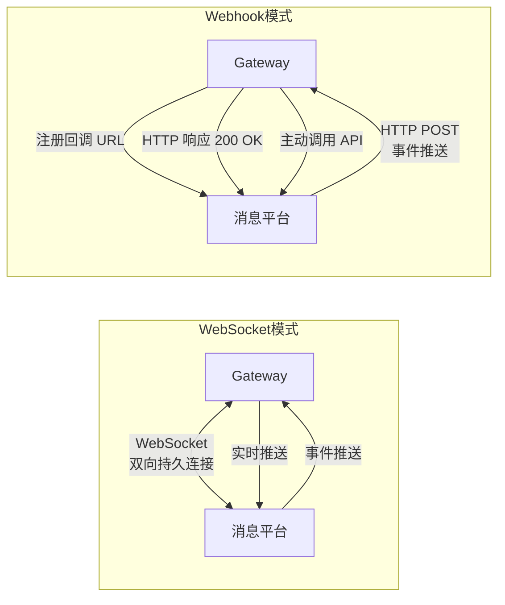

# Channels 适配器模式与平台接入

> **本章导读**: 基础模块中我们把 Channels 描述为"连接各消息平台的适配器"，并用耳朵和嘴的类比解释了它的角色——接收消息、发送回复。但 Channels 远不止是一个简单的消息转发层。它是 OpenClaw 架构中最考验工程设计的模块之一：需要同时处理多种完全不同的消息平台协议，维护多个长连接，应对各种限流策略，还要保证消息的可靠投递。本章将从适配器模式在 OpenClaw 中的实现出发，深入统一消息模型、各平台适配器差异、自定义开发、速率控制、离线处理、连接模式等核心话题。
>
> **前置知识**: 基础模块 10-02 架构概览、基础模块 10-03 Channels 配置、本章 01 Gateway 的事件总线机制
>
> **难度等级**: ⭐⭐⭐⭐☆

---

## 一、适配器模式在 OpenClaw 中的实现

适配器模式（Adapter Pattern）的核心思想是将一个接口转换成客户端期望的另一个接口。在 OpenClaw 中，这个模式被用来解决一个根本性的问题：**如何用统一的接口处理 Telegram、WhatsApp、Discord、Slack 等截然不同的消息平台**。

### 1.1 Channel 接口定义

所有平台适配器都必须实现一个统一的 TypeScript 接口：

```typescript
// 所有 Channel 适配器的统一接口
interface Channel {
  // 通道标识
  readonly name: string;
  readonly type: ChannelType;

  // 生命周期
  initialize(config: ChannelConfig): Promise<void>;
  start(): Promise<void>;
  stop(): Promise<void>;

  // 消息收发
  send(message: OutgoingMessage): Promise<MessageResult>;
  edit(messageId: string, updates: Partial<OutgoingMessage>): Promise<MessageResult>;
  delete(messageId: string): Promise<void>;

  // 事件回调（由 ChannelsManager 注入）
  onMessage: (message: IncomingMessage) => Promise<void>;
  onError: (error: ChannelError) => void;
  onStatusChange: (status: ChannelStatus) => void;

  // 健康检查
  healthCheck(): Promise<HealthStatus>;
}

enum ChannelType {
  Telegram = 'telegram',
  WhatsApp = 'whatsapp',
  Discord = 'discord',
  Slack = 'slack',
  // 可扩展...
}

enum ChannelStatus {
  Disconnected = 'disconnected',
  Connecting = 'connecting',
  Connected = 'connected',
  Reconnecting = 'reconnecting',
  Error = 'error',
}

interface ChannelConfig {
  enabled: boolean;
  // 平台特定的配置，使用 Record 以支持扩展
  options: Record<string, any>;
}
```

这个接口的设计体现了几个关键原则：

- **生命周期管理**：`initialize` → `start` → `stop` 的清晰阶段划分，让 Gateway 在启动和关闭时能够有序管理所有通道
- **统一消息收发**：`send`/`edit`/`delete` 覆盖了消息的完整生命周期
- **事件回调注入**：通过回调函数而非事件总线直接依赖，保持了适配器与 Gateway 的松耦合
- **健康检查**：Gateway 可以定期轮询各通道的健康状态，在连接断开时及时触发重连

### 1.2 适配器的动态加载与注册

OpenClaw 使用 **ChannelsManager** 作为所有适配器的管理者。适配器的加载发生在 Gateway 启动阶段，遵循一个固定的流程：



加载过程的代码示意：

```typescript
class ChannelsManager {
  private channels: Map<string, Channel> = new Map();
  private activeConnections: number = 0;

  async loadChannels(config: GatewayConfig): Promise<void> {
    const channelConfigs = config.channels || {};

    for (const [name, channelCfg] of Object.entries(channelConfigs)) {
      if (!channelCfg.enabled) continue;

      try {
        // 动态导入适配器模块
        // 适配器存放在 openclaw/channels/<name>/ 目录下
        const adapterModule = await import(
          `openclaw/channels/${name}/adapter`
        );
        const adapter: Channel = new adapterModule.default();

        // 初始化并启动
        await adapter.initialize(channelCfg);
        await adapter.start();

        // 注册到管理器
        this.channels.set(name, adapter);
        this.activeConnections++;

        // 通过事件总线通知其他模块
        eventBus.emit('channel:register', {
          channel: name,
          status: ChannelStatus.Connected,
        });

        logger.info(`Channel "${name}" connected successfully`);
      } catch (error) {
        logger.error(`Failed to load channel "${name}":`, error);
        // 单个通道加载失败不影响其他通道
      }
    }
  }

  async sendMessage(
    channel: string,
    message: OutgoingMessage
  ): Promise<MessageResult> {
    const adapter = this.channels.get(channel);
    if (!adapter) {
      throw new Error(`Unknown channel: ${channel}`);
    }
    return adapter.send(message);
  }

  async broadcast(message: OutgoingMessage): Promise<MessageResult[]> {
    const results: MessageResult[] = [];
    for (const adapter of this.channels.values()) {
      try {
        const result = await adapter.send(message);
        results.push(result);
      } catch (error) {
        logger.error(`Broadcast failed on "${adapter.name}":`, error);
      }
    }
    return results;
  }
}
```

动态加载的关键优势在于**插件化**：新的平台适配器可以作为一个 npm 包独立发布和安装，无需修改 Gateway 核心代码。用户只需要 `openclaw channel add <name>`，系统就会从 ClawHub 下载对应的适配器包并注册到通道列表中。

### 1.3 统一的消息收发抽象层

一旦适配器注册完成，上层模块（Brain、Skills）完全不需要关心消息来自哪个平台。它们操作的是统一的 `IncomingMessage` 和 `OutgoingMessage` 对象：

```typescript
// 上层模块只需要操作这两个统一类型
async function handleUserMessage(msg: IncomingMessage): Promise<void> {
  // Brain 处理消息，完全不关心来自哪个平台
  const reply = await brain.process(msg);

  // 回复到原始通道
  await channelsManager.sendMessage(msg.source.channel, reply);
}
```

这种抽象让 Brain 的 Prompt 工程、Hands 的工具调用、Memory 的记忆存储等核心逻辑能够做到真正的**平台无关**。添加一个新平台，不会影响已有的任何功能模块。

---

## 二、统一消息模型的设计

统一消息模型是 Channels 层最核心的数据结构。它需要足够通用以覆盖所有平台的消息特征，同时保留必要的元数据以满足上层处理需求。

### 2.1 消息类型定义

```typescript
// 统一消息类型联合
type MessageType =
  | 'text'       // 纯文本
  | 'image'      // 图片
  | 'audio'      // 语音
  | 'video'      // 视频
  | 'file'       // 文件
  | 'sticker'    // 贴纸/表情
  | 'location'   // 位置
  | 'system'     // 系统事件（用户加入、离开等）
  | 'interaction'// 交互事件（按钮点击、命令等）
  | 'unknown';   // 无法识别的类型
```

### 2.2 消息数据结构

```typescript
// 接入消息（平台 → Agent）
interface IncomingMessage {
  id: string;               // 消息 ID（平台原始 ID）
  type: MessageType;        // 消息类型
  text?: string;            // 文本内容
  attachments?: Attachment[]; // 附件（图片、文件等）

  // 来源信息
  source: {
    channel: string;        // 通道名，如 "telegram"
    platformId: string;     // 平台内部标识
    chatId: string;         // 对话 ID
    chatType: ChatType;     // 对话类型
  };

  // 发送者信息
  sender: {
    id: string;             // 发送者 ID
    name?: string;          // 显示名
    username?: string;      // 用户名
    language?: string;      // 语言偏好
  };

  // 时间与元数据
  timestamp: number;        // 平台时间戳 (ms)
  receivedAt: number;       // Gateway 接收时间 (ms)
  metadata?: Record<string, any>; // 平台原始数据（调试用）
}

// 消息对话类型
enum ChatType {
  Private = 'private',    // 私聊
  Group = 'group',        // 群组
  Channel = 'channel',    // 频道/广播
  Thread = 'thread',      // 子线程
}

// 发出消息（Agent → 平台）
interface OutgoingMessage {
  type: MessageType;
  text?: string;           // 文本内容
  attachments?: Attachment[];

  // 目标路由
  target: {
    channel: string;       // 目标通道
    chatId: string;        // 目标对话
    replyTo?: string;      // 回复的消息 ID
  };

  // 高级选项
  options?: {
    parseMode?: 'markdown' | 'html' | 'none';  // 文本解析模式
    disableNotification?: boolean;              // 静默发送
    // 平台特定选项（仅在必要时使用）
    platformSpecific?: Record<string, any>;
  };
}

// 消息发送结果
interface MessageResult {
  messageId: string;       // 平台返回的消息 ID
  channel: string;
  timestamp: number;
  status: 'sent' | 'pending' | 'failed';
  error?: string;
}
```

### 2.3 附件处理

附件是跨平台消息中最棘手的部分。不同平台对文件大小、格式、有效期有着完全不同的规则：

```typescript
interface Attachment {
  id: string;              // 平台附件 ID
  type: 'image' | 'audio' | 'video' | 'file' | 'voice';
  mimeType: string;        // MIME 类型
  size: number;            // 文件大小（字节）

  // 下载信息
  url?: string;            // 下载 URL（可能有时效性）
  localPath?: string;      // 已缓存的本地路径

  // 缩略图
  thumbnail?: {
    url?: string;
    localPath?: string;
  };

  // 元数据
  metadata?: {
    width?: number;
    height?: number;
    duration?: number;      // 音频/视频时长（秒）
    fileName?: string;      // 原始文件名
  };
}
```

OpenClaw 的附件处理策略遵循**本地优先**原则：

```
用户发送图片
    ↓
适配器收到平台消息，提取 attachment 元数据
    ↓
(可选) 异步下载到本地缓存目录 ~/.openclaw/cache/
    ↓
将 attachment 传递给 Brain
    ↓
Brain 将图片上下文送给 LLM (多模态理解)
    ↓
LLM 回复 → 适配器将回复发送回平台
```

缓存策略的关键实现：

```typescript
class AttachmentCache {
  private cacheDir: string;
  private maxCacheSize: number; // 默认 500MB

  async download(attachment: Attachment): Promise<string> {
    const cacheKey = this.generateCacheKey(attachment);
    const localPath = path.join(this.cacheDir, cacheKey);

    // 检查缓存命中
    if (await fs.pathExists(localPath)) {
      return localPath;
    }

    // 限流下载：控制并发数
    await this.downloadQueue.add(async () => {
      const response = await fetch(attachment.url!, {
        headers: { 'Accept': attachment.mimeType },
      });
      const buffer = Buffer.from(await response.arrayBuffer());
      await fs.writeFile(localPath, buffer);
    });

    // 清理过期缓存
    this.evictIfNeeded();

    return localPath;
  }
}
```

---

## 三、各平台适配器实现差异分析

不同消息平台在设计理念、API 风格和传输协议上存在巨大差异。适配器的工作就是在这些差异之上构建统一的抽象。

### 3.1 适配器实现总览

| 维度 | Telegram | WhatsApp | Discord | Slack |
|------|----------|----------|---------|-------|
| **协议** | HTTP Polling / Webhook | WebSocket (QR Pairing) | Gateway WebSocket | Socket Mode / Event API |
| **认证** | Bot Token | QR 码 + Session | Bot Token | OAuth 2.0 / App Token |
| **消息格式** | JSON (REST) | Protobuf | JSON (Gateway Events) | JSON (Events API) |
| **长连接** | 可选 | 必须 | 必须 | 可选 |
| **限流** | 30 msg/s / chat | 依账号等级 | 50 req/s (全局) | 1 req/s (per method) |
| **媒体处理** | 自带下载 URL | 需要 Base64 | CDN URL (有时效) | 文件 URL + Token |
| **私聊/群组** | 均支持 | 均支持 | 均支持 | 主要群组/频道 |

### 3.2 Telegram 适配器

Telegram 是体验最好的接入方式之一，因为 Bot API 设计成熟、文档完善。

**连接方式**：Telegram 支持两种连接模式——长轮询（Long Polling）和 Webhook。

**Bot Token 认证**：

```typescript
class TelegramAdapter implements Channel {
  private bot: TelegramBot;
  private pollingMode: boolean;

  async initialize(config: ChannelConfig): Promise<void> {
    const token = config.options.bot_token;
    this.pollingMode = config.options.polling ?? true;

    this.bot = new TelegramBot(token, {
      polling: this.pollingMode,
      // 只在 Webhook 模式下设置
      webHook: this.pollingMode ? undefined : {
        port: config.options.webhook_port || 8443,
        host: config.options.webhook_host,
      },
    });

    // 配置消息处理器
    this.bot.on('message', (msg) => this.handleMessage(msg));
    this.bot.on('callback_query', (query) => this.handleCallback(query));
  }

  private async handleMessage(platformMsg: any): Promise<void> {
    // 安全检查：验证 allowed_users
    if (!this.isUserAllowed(platformMsg.from.id)) return;

    // 转换为统一消息模型
    const unified = this.toIncomingMessage(platformMsg);
    // 触发上层处理
    await this.onMessage(unified);
  }

  private toIncomingMessage(platformMsg: any): IncomingMessage {
    return {
      id: platformMsg.message_id.toString(),
      type: this.detectMessageType(platformMsg),
      text: platformMsg.text || platformMsg.caption,
      attachments: this.extractAttachments(platformMsg),
      source: {
        channel: 'telegram',
        platformId: platformMsg.chat.id.toString(),
        chatId: platformMsg.chat.id.toString(),
        chatType: this.mapChatType(platformMsg.chat.type),
      },
      sender: {
        id: platformMsg.from.id.toString(),
        name: [platformMsg.from.first_name, platformMsg.from.last_name]
          .filter(Boolean).join(' '),
        username: platformMsg.from.username,
        language: platformMsg.from.language_code,
      },
      timestamp: platformMsg.date * 1000,
      receivedAt: Date.now(),
      metadata: { raw: platformMsg },
    };
  }
}
```

**关键差异点**：
- Telegram 的消息 ID 是数值型，需要转为字符串以保证统一模型的字段类型一致性
- `platformMsg.date` 是 Unix 秒级时间戳，统一模型使用毫秒级
- 图片消息的文本内容存储在为 `caption`（说明文字），需要同时检查 `text` 和 `caption`

### 3.3 WhatsApp 适配器

WhatsApp 的实现路径与其他平台不同：它不使用官方的 Business API（需要企业资质），而是通过 **WhatsApp Web 协议**的逆向工程实现 QR 码配对。

```typescript
class WhatsAppAdapter implements Channel {
  private socket: any; // WhatsApp Web Socket 连接

  async start(): Promise<void> {
    // WhatsApp Web 使用 Puppeteer 或纯 WebSocket 实现
    // 首次启动需要扫码
    const { qr } = await this.createSession();

    if (qr) {
      // 将 QR 码输出到终端
      QRCode.generate(qr, { small: true });
      logger.info('请使用 WhatsApp 扫描终端显示的 QR 码');
    }

    // 等待配对完成
    await this.waitForAuth();
    logger.info('WhatsApp 配对成功');
  }

  async send(message: OutgoingMessage): Promise<MessageResult> {
    const chatId = message.target.chatId; // 格式: "1234567890@c.us"

    if (message.type === 'text') {
      await this.socket.sendMessage(chatId, { text: message.text });
    } else if (message.attachments?.length) {
      const att = message.attachments[0];
      await this.socket.sendMessage(chatId, {
        image: att.localPath ? fs.readFileSync(att.localPath) : { url: att.url },
        caption: message.text,
      });
    }

    return {
      messageId: generateId(),
      channel: 'whatsapp',
      timestamp: Date.now(),
      status: 'sent',
    };
  }
}
```

**关键差异点**：
- WhatsApp 没有传统意义上的 API Token，而是通过 Session 文件持久化登录状态
- 群聊 ID 格式为 `xxxx-xxxx@g.us`，私聊为 `xxxx@s.whatsapp.net` 或 `xxxx@c.us`
- 消息是端到端加密的，适配器在本地解密后处理
- Session 文件需要定期刷新，否则会过期

### 3.4 Discord 适配器

Discord 使用 Gateway 长连接和 Slash Commands，架构上与其他平台有明显区别。

```typescript
class DiscordAdapter implements Channel {
  private client: DiscordClient;

  async initialize(config: ChannelConfig): Promise<void> {
    this.client = new DiscordClient({
      intents: [
        GatewayIntentBits.Guilds,
        GatewayIntentBits.GuildMessages,
        GatewayIntentBits.MessageContent, // 需要 Privileged Intent
        GatewayIntentBits.DirectMessages,
      ],
    });

    // 注册 Slash Commands
    this.client.on('ready', async () => {
      await this.registerSlashCommands();
    });

    // 消息处理
    this.client.on('messageCreate', (msg) => this.handleMessage(msg));
    // Slash Command 交互
    this.client.on('interactionCreate', (interaction) =>
      this.handleInteraction(interaction)
    );
  }

  private async registerSlashCommands(): Promise<void> {
    const commands = [
      {
        name: 'ask',
        description: '向 AI 助手提问',
        options: [
          {
            name: 'query',
            description: '你的问题',
            type: ApplicationCommandOptionType.String,
            required: true,
          },
        ],
      },
      {
        name: 'clear',
        description: '清除当前对话上下文',
      },
    ];

    await this.client.application?.commands.set(commands);
  }
}
```

**关键差异点**：
- Discord 的 **Intents 系统**需要显式声明需要接收哪些事件类型，`MessageContent` 是 Privileged Intent，需要在 Developer Portal 中申请
- 支持 **Slash Commands** 作为与 Agent 交互的主要入口，体验更接近"使用应用"而非"聊天"
- Gateway 协议使用 **Resume** 机制断线重连，可以恢复丢失的事件，不需要应用层处理重同步
- 速率限制分为全局和每路由两级，429 响应中会包含 `Retry-After` 头部

### 3.5 Slack 适配器

Slack 支持 Socket Mode（开发友好，无需公网）和 Event API（生产推荐）两种模式。

```typescript
class SlackAdapter implements Channel {
  private app: SlackApp;

  async initialize(config: ChannelConfig): Promise<void> {
    this.app = new SlackApp({
      // Socket Mode 不需要配置端口和公网地址
      // Event API 需要配置 Request URL
      socketMode: config.options.socket_mode ?? true,
      token: config.options.bot_token,
      appToken: config.options.app_token, // Socket Mode 需要 App-Level Token
    });

    // 监听消息事件
    this.app.message(async ({ message, say }) => {
      if (this.isBotMessage(message)) return;
      const unified = this.toIncomingMessage(message);
      await this.onMessage(unified);
    });
  }

  async send(message: OutgoingMessage): Promise<MessageResult> {
    // Slack 的消息格式较为特殊，支持 Block Kit
    const blocks = message.options?.platformSpecific?.blocks
      || this.toSlackBlocks(message);

    const result = await this.app.client.chat.postMessage({
      channel: message.target.chatId,
      text: message.text,
      blocks: blocks,          // Block Kit 结构化消息
      thread_ts: message.options?.platformSpecific?.threadTs,
    });

    return {
      messageId: result.ts!,   // Slack 使用 timestamp 作为消息 ID
      channel: 'slack',
      timestamp: Date.now(),
      status: 'sent',
    };
  }
}
```

**关键差异点**：
- Slack 的消息 ID 是一个浮点时间戳字符串（`ts`），这在统一模型中需要保持字符串类型
- Slack 的 **Block Kit** 提供了丰富的消息布局能力（按钮、选择菜单、图片轮播等），这是其他平台不具备的特性
- Socket Mode 通过 WebSocket 接收事件，不需要公网暴露端口，但不如 Event API 可靠
- 需要特别过滤 Bot 自身发送的消息以避免自我对话循环

---

## 四、自定义 Channel 开发指南

当内置适配器不满足需求时（例如需要接入企业微信、飞书、Line 等），开发者可以实现自定义 Channel。

### 4.1 必须实现的接口方法

开发一个自定义 Channel，需要实现以下方法：

```typescript
// 自定义 Channel 必须实现的方法清单
export class MyCustomChannel implements Channel {
  // === 必需方法 ===

  // 1. 初始化：读取配置，创建客户端实例
  async initialize(config: ChannelConfig): Promise<void> {
    // config.options 包含用户在 YAML 中配置的所有参数
    const apiKey = config.options.api_key;
    const baseUrl = config.options.base_url;
    // ...
  }

  // 2. 启动连接：建立与平台的连接
  async start(): Promise<void> {
    // 可以在这里启动 WebSocket 或开始轮询
  }

  // 3. 停止连接：安全关闭所有连接
  async stop(): Promise<void> {
    // 关闭连接、清理资源、保存 Session
  }

  // 4. 发送消息：将 OutgoingMessage 转换为平台消息格式并发送
  async send(message: OutgoingMessage): Promise<MessageResult> {
    // 核心逻辑：格式转换 + API 调用
  }

  // 5. 编辑消息：修改已发送的消息
  async edit(messageId: string, updates: Partial<OutgoingMessage>): Promise<MessageResult> {
    // 某些平台不支持编辑，可抛出 NotSupportedError
  }

  // 6. 删除消息
  async delete(messageId: string): Promise<void> {
    // 某些平台不允许 Bot 删除消息，需处理权限错误
  }

  // 7. 健康检查
  async healthCheck(): Promise<HealthStatus> {
    return {
      status: this.isConnected ? ChannelStatus.Connected : ChannelStatus.Disconnected,
      latency: this.lastPingLatency,
      lastPing: this.lastPingTime,
    };
  }

  // === 回调注入（由 ChannelsManager 赋值） ===
  onMessage: (message: IncomingMessage) => Promise<void>;
  onError: (error: ChannelError) => void;
  onStatusChange: (status: ChannelStatus) => void;
}
```

### 4.2 认证处理

不同的平台使用不同的认证机制。适配器需要在 `initialize` 阶段完成认证：

```typescript
// 认证处理策略
class AuthHandler {
  static create(type: AuthType, config: any): AuthHandler {
    switch (type) {
      case 'api_key':
        return new ApiKeyAuth(config.api_key, {
          headerName: config.auth_header_name || 'Authorization',
          headerPrefix: config.auth_header_prefix || 'Bearer ',
        });

      case 'oauth2':
        return new OAuth2Auth({
          clientId: config.client_id,
          clientSecret: config.client_secret,
          scopes: config.scopes || [],
          tokenUrl: config.token_url,
          refreshThreshold: 300, // 提前 5 分钟刷新
        });

      case 'qr_code':
        return new QrCodeAuth({
          sessionPath: config.session_path,
          sessionName: config.session_name || 'default',
        });

      default:
        throw new Error(`Unsupported auth type: ${type}`);
    }
  }

  abstract authenticate(): Promise<AuthResult>;
  abstract refresh(): Promise<void>;
}
```

### 4.3 消息格式转换

消息格式的双向转换是适配器的核心工作。转换过程中需要注意几个关键点：

```typescript
// 平台消息 → 统一模型（核心转换逻辑）
class MyChannelMessageConverter {
  toIncoming(platformMsg: any): IncomingMessage {
    return {
      // ID 转换：统一使用字符串
      id: String(platformMsg.id),
      // 类型推断
      type: this.detectType(platformMsg),
      // 文本提取
      text: platformMsg.text ?? platformMsg.content ?? '',
      // 附件处理
      attachments: this.extractAttachments(platformMsg),
      // 来源路由
      source: {
        channel: 'my_custom_channel',
        platformId: platformMsg.channel_id,
        chatId: platformMsg.channel_id,
        chatType: platformMsg.is_group ? ChatType.Group : ChatType.Private,
      },
      // 发送者
      sender: {
        id: String(platformMsg.user_id),
        name: platformMsg.user_name ?? platformMsg.nickname,
        username: platformMsg.username,
      },
      // 时间
      timestamp: Number(platformMsg.timestamp) * 1000,
      receivedAt: Date.now(),
    };
  }

  // 统一模型 → 平台消息
  toPlatform(message: OutgoingMessage): PlatformMessage {
    const payload: PlatformMessage = {
      chat_id: message.target.chatId,
      message_type: this.mapOutgoingType(message.type),
    };

    if (message.text) {
      payload.text = message.text;
    }

    if (message.attachments?.length) {
      payload.attachments = message.attachments.map((att) => ({
        type: att.type,
        url: att.url ?? `file://${att.localPath}`,
        name: att.metadata?.fileName,
      }));
    }

    return payload;
  }

  // 类型映射表（平台特有类型 → 统一类型）
  private readonly typeMap: Record<string, MessageType> = {
    'text': 'text',
    'image': 'image',
    'voice': 'audio',
    'video': 'video',
    'file': 'file',
    'location': 'location',
    'sticker': 'sticker',
  };

  private detectType(platformMsg: any): MessageType {
    return this.typeMap[platformMsg.msg_type] ?? 'unknown';
  }
}
```

**最佳实践**：
- 始终用 `String()` 或模板字面量将 ID 字段统一为字符串类型
- 时间戳统一为毫秒级，避免平台差异导致的时间计算错误
- 对于无法映射的消息类型，降级为 `'unknown'` 而不是抛出异常
- 在 `metadata.raw` 中保留平台原始数据，便于调试和排查问题

---

## 五、消息速率限制与排队机制

消息平台的速率限制（Rate Limiting）是 Channels 层必须面对的现实问题。忽略限流会导致消息被静默丢弃、账号被临时封禁，甚至 IP 被加入黑名单。

### 5.1 各平台的限流策略

```typescript
// 各平台的限流定义
interface RateLimitConfig {
  name: string;
  scope: 'global' | 'per_chat' | 'per_method';  // 作用域
  limit: number;          // 允许的请求数
  window: number;         // 时间窗口（秒）
  penalty: PenaltyType;   // 超限惩罚类型
}

const PlatformRateLimits: Record<string, RateLimitConfig> = {
  telegram: {
    name: 'Telegram',
    scope: 'per_chat',
    limit: 30,       // 每个对话 30 条/秒
    window: 1,
    penalty: 'retry_after', // 返回 Retry-After
  },
  whatsapp: {
    name: 'WhatsApp',
    scope: 'global',
    limit: 100,      // 取决于账号等级
    window: 1,
    penalty: 'block', // 超限可能导致临时封禁
  },
  discord: {
    name: 'Discord',
    scope: 'global',
    limit: 50,       // 全局 50 请求/秒
    window: 1,
    penalty: 'retry_after',
  },
  slack: {
    name: 'Slack',
    scope: 'per_method',
    limit: 1,        // 每方法 1 请求/秒
    window: 1,
    penalty: 'retry_after',
  },
};
```

### 5.2 消息排队与公平调度

OpenClaw 使用**令牌桶算法**实现消息排队，确保在限流阈值内公平调度不同来源的消息：

```typescript
class RateLimiter {
  private tokens: number;
  private lastRefill: number;
  private queue: QueuedMessage[] = [];
  private processing = false;

  constructor(
    private readonly maxTokens: number,   // 桶容量
    private readonly refillRate: number,  // 每秒补充速率
    private readonly refillInterval: number = 1000, // 补充间隔 (ms)
  ) {
    this.tokens = maxTokens;
    this.lastRefill = Date.now();
  }

  // 尝试发送消息，如果令牌不足则排队
  async sendWithBackpressure(
    message: OutgoingMessage,
    sendFn: () => Promise<MessageResult>
  ): Promise<MessageResult> {
    // 尝试消耗令牌
    if (this.tokens > 0) {
      this.tokens--;
      return sendFn();
    }

    // 令牌不足，进入排队
    return new Promise((resolve, reject) => {
      this.queue.push({
        message,
        sendFn,
        resolve,
        reject,
        enqueuedAt: Date.now(),
        priority: this.calculatePriority(message),
      });

      // 排序：高优先级在前，同等优先级按入队时间
      this.queue.sort((a, b) =>
        b.priority - a.priority || a.enqueuedAt - b.enqueuedAt
      );

      if (!this.processing) {
        this.processQueue();
      }
    });
  }

  private async processQueue(): Promise<void> {
    this.processing = true;

    while (this.queue.length > 0) {
      await this.refillTokens();

      if (this.tokens <= 0) {
        // 无可用令牌，等待补充
        await this.delay(this.refillInterval);
        continue;
      }

      const item = this.queue.shift()!;
      this.tokens--;

      try {
        const result = await item.sendFn();
        item.resolve(result);
      } catch (error) {
        item.reject(error);
      }
    }

    this.processing = false;
  }

  // 优先级计算：系统消息 > 用户主动消息 > 心跳推送
  private calculatePriority(message: OutgoingMessage): number {
    if (message.options?.platformSpecific?.priority === 'high') return 3;
    if (message.type === 'system') return 2;
    if (message.target.chatId.startsWith('user:')) return 1;
    return 0;
  }

  private async refillTokens(): Promise<void> {
    const now = Date.now();
    const elapsed = now - this.lastRefill;
    const newTokens = Math.floor(elapsed / this.refillInterval) * this.refillRate;
    this.tokens = Math.min(this.maxTokens, this.tokens + newTokens);
    this.lastRefill = now;
  }
}
```

### 5.3 降级处理

当限流发生时，适配器需要从容处理而不是崩溃：

```typescript
class DegradeHandler {
  // 指数退避重试
  async retryWithBackoff(
    fn: () => Promise<any>,
    maxRetries: number = 3
  ): Promise<any> {
    for (let attempt = 1; attempt <= maxRetries; attempt++) {
      try {
        return await fn();
      } catch (error) {
        if (this.isRateLimitError(error)) {
          const retryAfter = this.getRetryAfter(error);
          // 第一次重试等待 5 秒，后续按指数递增
          const waitTime = attempt === 1
            ? Math.max(retryAfter, 5000)
            : Math.min(60000, Math.pow(2, attempt) * 1000);

          logger.warn(
            `Rate limited, retrying in ${waitTime}ms (attempt ${attempt}/${maxRetries})`
          );
          await this.delay(waitTime);
          continue;
        }
        throw error; // 非限流错误直接抛出
      }
    }
    throw new Error('Max retries exceeded due to rate limiting');
  }

  // 分级降级策略
  async sendWithDegradation(message: OutgoingMessage): Promise<void> {
    try {
      await this.channel.send(message);
    } catch (error) {
      if (this.isRateLimitError(error)) {
        // Level 1: 等待重试
        await this.retryWithBackoff(() => this.channel.send(message));
      } else if (this.isAttachmentTooLarge(error)) {
        // Level 2: 去掉附件，只发文本
        await this.channel.send({
          ...message,
          attachments: [],
          text: `${message.text}\n\n[附件因大小限制被省略]`,
        });
      } else if (this.isMessageTooLong(error)) {
        // Level 3: 分片发送长消息
        await this.sendInChunks(message);
      } else {
        // Level 4: 通知用户发送失败
        await this.channel.send({
          ...message,
          text: '抱歉，消息发送失败，请稍后重试。',
        });
      }
    }
  }
}
```

---

## 六、离线消息处理与消息重试

Agent 并非总是在线——Gateway 可能因为网络波动、重启、维护等原因断开连接。离线消息处理是保证消息不丢失的关键机制。

### 6.1 Gateway 离线时的消息缓冲

当 Gateway 离线时，消息平台的推送不会停止。适配器需要设计缓冲策略来兜住这些消息：



对于使用 WebSocket 长连接的平台（Discord、WhatsApp），缓冲逻辑内置于适配器中：

```typescript
class OfflineBuffer {
  private buffer: IncomingMessage[] = [];
  private readonly maxBufferSize: number;
  private readonly storagePath: string;

  constructor(channelName: string) {
    this.maxBufferSize = 1000; // 最多缓冲 1000 条消息
    this.storagePath = path.join(
      process.env.HOME || process.env.USERPROFILE,
      '.openclaw',
      'buffers',
      `${channelName}.json`
    );
    // 启动时加载上次的持久化缓冲
    this.loadFromDisk();
  }

  // 当 Gateway 离线时调用
  async push(message: IncomingMessage): Promise<void> {
    if (this.buffer.length >= this.maxBufferSize) {
      // 超过最大缓冲：丢弃最早的消息
      const dropped = this.buffer.shift()!;
      logger.warn(`Buffer full, dropped message ${dropped.id}`);
    }

    this.buffer.push(message);
    await this.persistToDisk();
  }

  // 当 Gateway 重新上线时调用
  async drain(): Promise<IncomingMessage[]> {
    const messages = [...this.buffer];
    this.buffer = [];
    await this.persistToDisk(); // 清空持久化文件
    return messages;
  }

  private async persistToDisk(): Promise<void> {
    await fs.writeJson(this.storagePath, this.buffer, { spaces: 2 });
  }

  private async loadFromDisk(): Promise<void> {
    try {
      if (await fs.pathExists(this.storagePath)) {
        this.buffer = await fs.readJson(this.storagePath);
        logger.info(
          `Loaded ${this.buffer.length} buffered messages for recovery`
        );
      }
    } catch (error) {
      logger.error('Failed to load offline buffer:', error);
      this.buffer = [];
    }
  }
}
```

### 6.2 重新上线后的消息同步

不同平台在重新连接后的消息同步策略各不相同：

| 平台 | 重连同步机制 | 消息可靠性 | 说明 |
|------|-------------|-----------|------|
| Telegram (Polling) | 通过 `offset` 参数获取未确认消息 | 最多丢失上次轮询间隔内的消息 | 手动确认机制 |
| Telegram (Webhook) | 平台自动重推未确认的消息 | 可靠，但可能有重复 | 响应 200 确认 |
| Discord Gateway | 内置 `Resume` 机制恢复事件流 | 高可靠，自动 Gap 检测 | 支持 `last_sequence` |
| WhatsApp | Session 恢复，重新拉取未读消息 | 中可靠，取决于 Session 有效性 | 会话过期需重新扫码 |
| Slack Socket | 重连后丢失离线期间的事件 | 需要 Event API + 重试队列 | Socket Mode 不可靠 |

对于 Telegram 长轮询模式，适配器维护一个 `offset` 来实现消息确认：

```typescript
class TelegramPollingManager {
  private offset: number = 0;
  private readonly offsetFile: string;

  constructor(channelName: string) {
    this.offsetFile = path.join(
      '.openclaw', 'state', `${channelName}-offset.json`
    );
    this.loadOffset();
  }

  async poll(): Promise<void> {
    // 使用持久化的 offset 获取消息
    const updates = await this.api.getUpdates({
      offset: this.offset,
      timeout: 30, // 长轮询 30 秒
      allowed_updates: ['message', 'callback_query'],
    });

    for (const update of updates) {
      // 处理消息...
      // 更新 offset 为最新消息的 ID + 1
      this.offset = update.update_id + 1;
    }

    // 持久化 offset，防止进程崩溃后丢失进度
    await this.saveOffset();
  }
}
```

### 6.3 消息送达确认机制

对于需要高可靠性的场景（如企业通知），适配器引入消息送达确认机制：

```typescript
interface DeliveryReceipt {
  messageId: string;
  channel: string;
  status: 'sent' | 'delivered' | 'read' | 'failed';
  timestamp: number;
  error?: string;
}

class DeliveryTracker {
  private pending: Map<string, {
    message: OutgoingMessage;
    sentAt: number;
    retries: number;
    nextRetry: number;
  }> = new Map();

  // 发送消息并跟踪送达状态
  async sendWithTracking(message: OutgoingMessage): Promise<string> {
    const messageId = await this.channel.send(message);

    this.pending.set(messageId, {
      message,
      sentAt: Date.now(),
      retries: 0,
      nextRetry: Date.now() + 5000, // 5 秒后检查
    });

    return messageId;
  }

  // 周期性检查未送达消息
  async checkPending(): Promise<void> {
    const now = Date.now();

    for (const [id, record] of this.pending) {
      if (now < record.nextRetry) continue;

      if (record.retries >= 3) {
        // 超过最大重试次数，放弃
        logger.error(`Message ${id} undelivered after 3 retries`);
        this.pending.delete(id);
        continue;
      }

      // 重新发送
      try {
        await this.channel.send(record.message);
        record.retries++;
        record.nextRetry = now + Math.pow(2, record.retries) * 5000;
      } catch (error) {
        logger.error(`Retry ${record.retries + 1} failed for message ${id}`);
        record.nextRetry = now + 10000;
      }
    }
  }
}
```

---

## 七、WebSocket 与 Webhook 两种连接模式对比

消息平台与 Gateway 之间的连接模式主要分为两类：**WebSocket 长连接** 和 **Webhook 回调**。两种模式在架构上有着根本性的差异。

### 7.1 架构差异



**WebSocket 模式**（Discord、WhatsApp、Slack Socket Mode）：
- Gateway 主动向平台发起 WebSocket 连接
- 连接建立后，双方可以双向实时通信
- 平台有新事件时，直接通过 WebSocket 推送给 Gateway

**Webhook 模式**（Telegram、Slack Event API）：
- Gateway 需要有一个公网可达的 HTTPS 端点
- 在平台上注册这个端点作为回调 URL
- 平台有新事件时，通过 HTTP POST 请求推送给 Gateway

### 7.2 两种模式的优缺点对比

| 维度 | WebSocket 模式 | Webhook 模式 |
|------|---------------|-------------|
| **网络要求** | 无需公网 IP，内网可用 | 需要公网 IP 或反向代理 |
| **连接维护** | 需要心跳保活和断线重连 | 无长连接，按需建立 |
| **实时性** | 极高，事件到达即推送 | 取决于平台队列延迟 |
| **可靠性** | 断连期间可能丢失事件 | 平台负责重试推送 |
| **资源消耗** | 常驻内存，维护连接状态 | 无状态，按需触发 |
| **开发复杂度** | 较高，需处理重连、分片、心跳 | 较低，HTTP 处理逻辑简单 |
| **认证安全** | 连接层认证，连接建立后无需重复认证 | 每次请求都需要验证签名 |
| **调试难度** | 较难，需要模拟长连接场景 | 较易，可直接 curl 测试 |
| **扩展性** | 每个 Gateway 实例维护少量连接 | 水平扩展容易，无状态 |
| **适用平台** | Discord、WhatsApp、Slack (Socket) | Telegram、Slack (Event API) |

### 7.3 两种模式的实现复杂度对比

**WebSocket 模式的额外复杂性**：

```typescript
// WebSocket 模式需要处理的问题
abstract class WebSocketChannel implements Channel {
  private ws: WebSocket | null = null;
  private reconnectAttempts: number = 0;
  private readonly MAX_RECONNECT_DELAY = 30000; // 30 秒
  private heartbeatTimer: NodeJS.Timeout | null = null;

  async start(): Promise<void> {
    await this.connect();
  }

  private async connect(): Promise<void> {
    this.ws = new WebSocket(this.endpointUrl);

    this.ws.on('open', () => {
      logger.info(`WebSocket connected to ${this.name}`);
      this.reconnectAttempts = 0;
      this.onStatusChange(ChannelStatus.Connected);
      this.startHeartbeat();
    });

    this.ws.on('message', (data) => {
      this.handlePlatformEvent(JSON.parse(data.toString()));
    });

    this.ws.on('close', (code) => {
      this.stopHeartbeat();
      this.onStatusChange(ChannelStatus.Disconnected);
      // 自动重连
      this.scheduleReconnect(code);
    });

    this.ws.on('error', (error) => {
      logger.error(`WebSocket error on ${this.name}:`, error);
      this.onError({ code: 'WS_ERROR', message: error.message });
    });
  }

  private scheduleReconnect(closeCode: number): void {
    const delay = Math.min(
      1000 * Math.pow(2, this.reconnectAttempts),
      this.MAX_RECONNECT_DELAY
    );
    this.reconnectAttempts++;

    logger.info(
      `Reconnecting ${this.name} in ${delay}ms ` +
      `(attempt ${this.reconnectAttempts})`
    );

    setTimeout(() => this.connect(), delay);
  }

  private startHeartbeat(): void {
    // 每 15 秒发送一次心跳
    this.heartbeatTimer = setInterval(() => {
      this.ws?.send(JSON.stringify({ type: 'ping' }));
    }, 15000);
  }

  private stopHeartbeat(): void {
    if (this.heartbeatTimer) {
      clearInterval(this.heartbeatTimer);
      this.heartbeatTimer = null;
    }
  }
}
```

**Webhook 模式的实现**：

```typescript
// Webhook 模式相对简单，核心是签名验证
abstract class WebhookChannel implements Channel {
  // Webhook 路由在 Gateway 的 HTTP Server 中注册
  // Gateway 将对应路径的 POST 请求路由到 Channel 的 handleWebhook 方法

  async handleWebhook(req: IncomingHttpHeaders, body: any): Promise<WebhookResponse> {
    // 1. 验证签名
    if (!this.verifySignature(req, body)) {
      logger.warn(`Invalid webhook signature from ${this.name}`);
      return { status: 401, body: 'Unauthorized' };
    }

    // 2. 解析平台事件
    const events = this.parseEvents(body);

    // 3. 异步处理事件（不阻塞平台的重试）
    for (const event of events) {
      const message = this.toIncomingMessage(event);
      // 异步处理，先返回 200 确认收到
      setImmediate(() => this.onMessage(message));
    }

    // 4. 立即返回 200，告知平台已收到
    return { status: 200, body: 'OK' };
  }

  // 各平台签名验证方式不同
  abstract verifySignature(
    headers: IncomingHttpHeaders,
    body: any
  ): boolean;
}
```

### 7.4 选择建议

| 你的场景 | 推荐模式 | 原因 |
|---------|---------|------|
| 个人电脑运行，无公网 IP | WebSocket | 不需要暴露端口 |
| 生产环境，有公网服务器 | Webhook | 更可靠，平台负责重试 |
| 只接入 Telegram | Webhook | Telegram Webhook 成熟稳定 |
| 只接入 Discord | WebSocket | Discord 只支持 Gateway |
| 需要极低延迟响应 | WebSocket | 消除 HTTP 往返延迟 |
| 开发调试阶段 | Webhook + 内网穿透 | 方便 curl 测试 |

---

## 八、本章小结

Channels 适配器模式是 OpenClaw 实现多平台接入的工程支柱。通过统一接口定义、动态加载注册和标准化消息模型，Channels 层将 Telegram、WhatsApp、Discord、Slack 等平台的巨大差异封装在适配器内部，让上层组件能够用统一的方式处理所有消息。

关键设计要点回顾：

- **适配器模式**：通过 `Channel` 接口抽象所有消息平台，新平台只需实现六个核心方法即可接入
- **统一消息模型**：`IncomingMessage` 和 `OutgoingMessage` 是上层逻辑与平台之间的契约，涵盖了文本、图片、文件、语音、位置等多种消息类型
- **平台差异**：各平台在认证方式、连接协议、消息格式、限流策略上差异显著，适配器必须逐一处理这些差异而不能简化
- **限流排队**：使用令牌桶算法和优先级调度应对各平台的速率限制，多级降级策略保证极端情况下的系统稳定性
- **离线缓冲**：Gateway 离线期间的消息通过本地文件持久化缓冲，重新上线后按序处理，确保不丢消息
- **WebSocket vs Webhook**：两种连接模式各有优劣，WebSocket 适合内网使用和对实时性要求高的场景，Webhook 适合生产环境的大规模部署

理解 Channels 层不仅有助于你配置和使用 OpenClaw 的各个消息平台，更重要的是为你开发自定义 Channel 提供了完整的技术参考。无论是接入企业微信、飞书、Line，还是自建消息系统，`Channel` 接口就是你与 OpenClaw 内核之间的约定。

---

**下一步**: 了解了消息接入层后，下一章进入 Skills 开发进阶——如何编写高质量的 SKILL.md、开发自定义技能、以及 Skills 的依赖管理和版本控制。

---

[← 上一章: Heartbeat 心跳调度引擎](/deep-dive/openclaw/05-heartbeat-scheduler) | [继续学习: Skills 开发进阶 →](/deep-dive/openclaw/07-skill-advanced)
