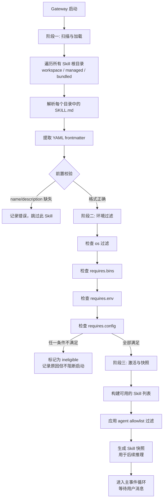
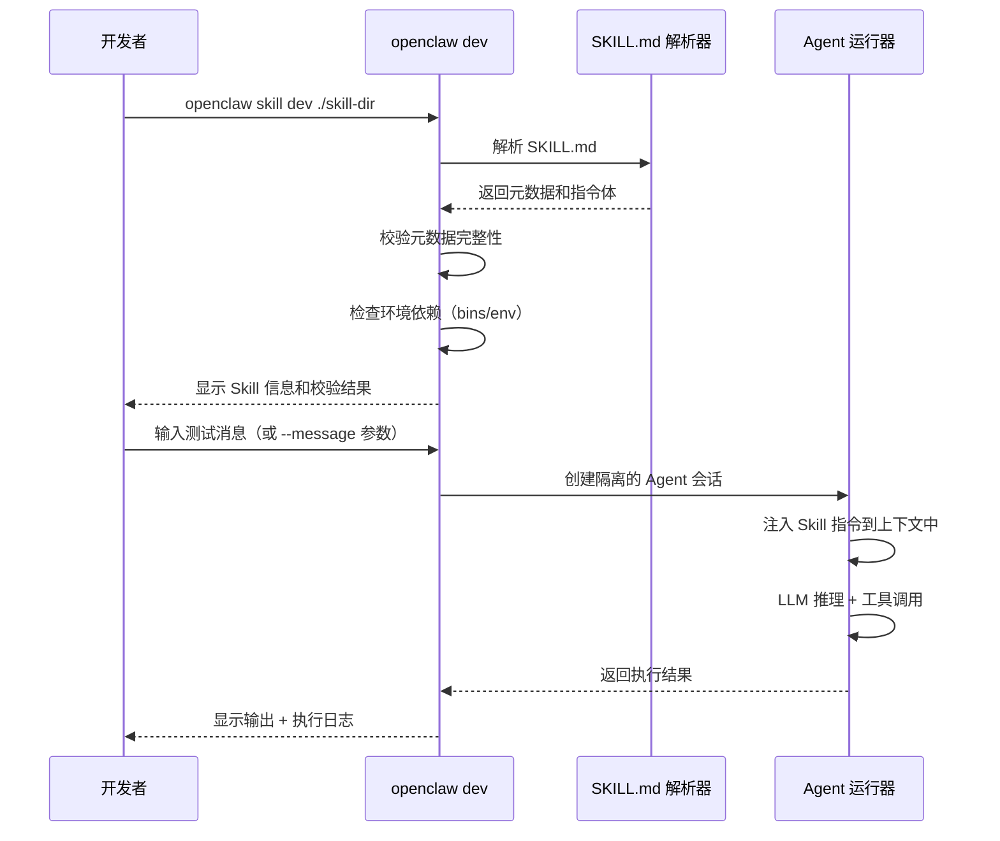
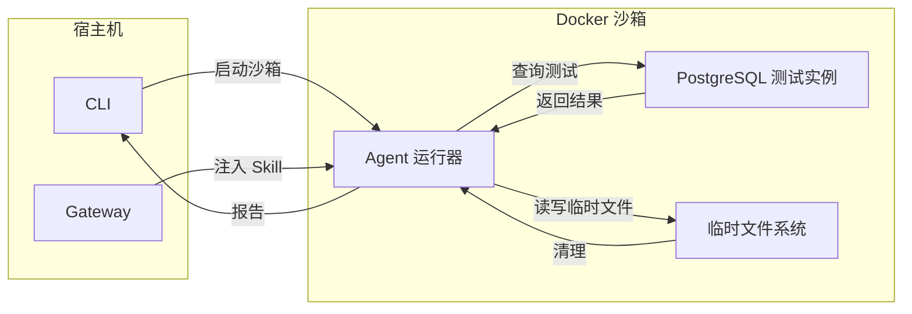
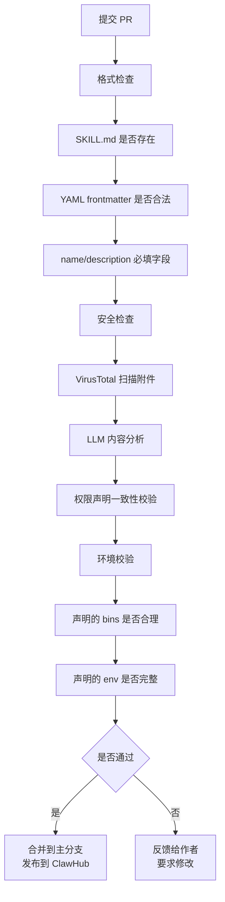
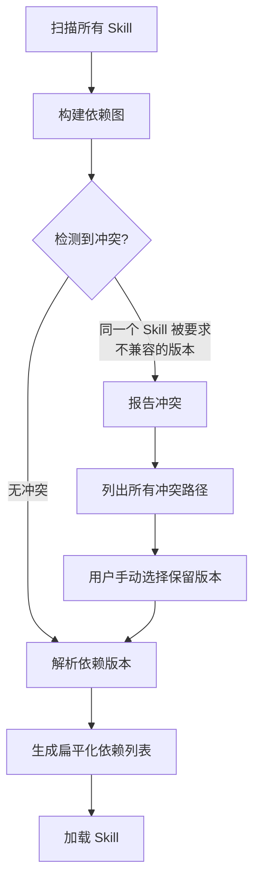

# Skill 开发进阶

> **本章导读**: 基础模块 09 我们学习了 SKILL.md 开放标准——什么是 Skills、它的四元组结构 (C, pi, T, R)、渐进式披露三阶段、以及标准目录结构。基础模块 10-04 则介绍了如何在 OpenClaw 中安装和使用 Skills。本章将从开发者的视角深入 Skill 开发的完整流程：从 SKILL.md 在 OpenClaw 中的实现细节出发，涵盖开发环境搭建、目录结构规范、多层级测试策略、版本管理与 ClawHub 发布、复杂实战案例、依赖声明与冲突解决、以及工具权限声明的最佳实践。
>
> **前置知识**: 基础模块 09-02 Skills 技术架构、基础模块 09-04 Skill 设计与实战、基础模块 10-04 Skills 与记忆系统、本章 03 Hands 工具执行引擎
>
> **难度等级**: ⭐⭐⭐⭐☆

---

## 一、SKILL.md 在 OpenClaw 中的实现细节

### 1.1 从标准到实现

基础模块 09 定义了 SKILL.md 的开放标准：一个由 YAML 前置元数据和 Markdown 指令体构成的文件，描述了一个 Skill 的四个核心要素——上下文 (Context)、策略 (Policy)、工具 (Tools)、输出 (Result)。OpenClaw 是对这一标准最忠实的践行者之一，同时也根据自身运行时环境进行了必要的扩展。

在 OpenClaw 中，SKILL.md 不再仅仅是"给 LLM 看的一组指令"，它还是 Gateway 在加载阶段进行**环境适配、权限校验、工具注册**的结构化元数据。每个 Skill 在加载时会被解析为以下内部数据结构：

```typescript
// OpenClaw 内部对 SKILL.md 的解析结果
interface ParsedSkill {
  // 从 YAML frontmatter 解析
  manifest: {
    name: string;
    description: string;
    version: string;          // SemVer
    metadata?: {
      openclaw?: OpenClawMetadata;
    };
  };

  // 从 Markdown body 解析
  instructions: string;        // 完整的指令体文本

  // 加载时的运行时信息（非 SKILL.md 原文）
  source: {
    path: string;              // 文件系统中 SKILL.md 的路径
    root: SkillRoot;           // 来源：workspace | managed | bundled
    precedence: number;        // 优先级数字（数值越小优先级越高）
  };
}
```

### 1.2 OpenClaw 对 SKILL.md 标准的扩展字段

OpenClaw 在标准 SKILL.md 的 YAML 前置元数据之上增加了 `metadata.openclaw` 字段，用于声明运行时依赖和环境约束。这些字段让 Gateway 可以在 **加载阶段**（而非执行阶段）就判断一个 Skill 是否可用：

| 扩展字段 | 类型 | 说明 | 示例值 |
|---------|------|------|--------|
| `metadata.openclaw.os` | `string[]` | 操作系统过滤 | `["darwin"]`, `["linux", "darwin"]` |
| `metadata.openclaw.requires.bins` | `string[]` | 必需的二进制命令 | `["curl", "jq"]` |
| `metadata.openclaw.requires.anyBins` | `string[]` | 至少其一存在的命令 | `["uv", "pip3"]` |
| `metadata.openclaw.requires.env` | `string[]` | 必需的环境变量 | `["OPENAI_API_KEY"]` |
| `metadata.openclaw.requires.config` | `string[]` | 必需的配置路径 | `["browser.enabled"]` |
| `metadata.openclaw.primaryEnv` | `string` | 主要凭证变量 | `"GEMINI_API_KEY"` |
| `metadata.openclaw.emoji` | `string` | 展示用 emoji | `"✅"` |
| `metadata.openclaw.homepage` | `string` | 项目主页 URL | `"https://github.com/user/skill"` |
| `metadata.openclaw.always` | `boolean` | 是否始终加载 | `false` |
| `metadata.openclaw.install` | `object[]` | 安装器声明 | 见下文 |

一个使用了 OpenClaw 扩展字段的完整示例：

```yaml
---
name: weather-query
description: "查询指定城市的实时天气信息"
version: 1.2.0
metadata:
  openclaw:
    requires:
      bins:
        - curl
      env:
        - WEATHER_API_KEY
    primaryEnv: WEATHER_API_KEY
    os:
      - linux
      - darwin
    emoji: "☁️"
    homepage: https://github.com/example/weather-skill
    install:
      - kind: brew
        formula: curl
        bins: [curl]
---
```

为什么要将这些信息放在 YAML 前置元数据中，而不是写在指令体里？因为前置元数据是**机器可解析**的——Gateway 在加载时可以快速扫描，无需调用 LLM 理解文本。这使得"加载阶段过滤"成为可能，避免了在运行时才发现环境缺失的问题。

### 1.3 Skill 的加载、验证与激活流程

在 OpenClaw 中，一个 Skill 从文件系统到实际被 Agent 使用，经历了三个严格的阶段。



**阶段一：扫描与加载**

Gateway 启动时，按照预定义的优先级顺序扫描所有 Skill 源：

1. `/skills`（当前工作区，最高优先级）
2. `/.agents/skills`（项目 Agent 目录）
3. `~/.agents/skills`（个人 Agent 目录）
4. `~/.openclaw/skills`（本地托管目录）
5. 内置（随安装包发布的 bundle）
6. `skills.load.extraDirs`（自定义额外目录，最低优先级）

同名 Skill 按优先级覆盖。这意味着你可以在工作区中放置一个同名 Skill 来覆盖内置的行为。

扫描过程中，Gateway 对每个发现的 SKILL.md 执行**前置格式校验**：

```typescript
// 前置校验的核心逻辑（概念示意）
function validateSkill(parsed: ParsedSkill): ValidationResult {
  const errors: string[] = [];

  // name 必须存在且符合命名规范
  if (!parsed.manifest.name) {
    errors.push('name is required');
  } else if (!/^[a-z0-9][a-z0-9-]*$/.test(parsed.manifest.name)) {
    errors.push('name must match: ^[a-z0-9][a-z0-9-]*$');
  }

  // description 必须存在
  if (!parsed.manifest.description) {
    errors.push('description is required');
  }

  // version 建议存在（但非强制）
  if (parsed.manifest.version &&
      !/^\d+\.\d+\.\d+$/.test(parsed.manifest.version)) {
    errors.push('version should follow SemVer format');
  }

  // metadata.openclaw 中的字段类型校验
  const meta = parsed.manifest.metadata?.openclaw;
  if (meta?.requires?.bins && !Array.isArray(meta.requires.bins)) {
    errors.push('requires.bins must be an array');
  }
  if (meta?.requires?.env && !Array.isArray(meta.requires.env)) {
    errors.push('requires.env must be an array');
  }

  return {
    valid: errors.length === 0,
    errors,
  };
}
```

**阶段二：环境过滤**

通过前置校验的 Skill 进入环境过滤阶段。这一步的核心是检查 `metadata.openclaw` 中声明的运行时依赖是否满足：

- **os 过滤**：如果当前操作系统不在 `os` 列表中，直接标记为不可用
- **bins 检查**：遍历 `requires.bins`，对每个命令执行 `which <command>`，缺少任一则标记不可用
- **anyBins 检查**：遍历 `requires.anyBins`，如果至少有一个存在则通过
- **env 检查**：遍历 `requires.env`，检查对应的环境变量是否存在
- **config 检查**：遍历 `requires.config`，检查 `openclaw.json` 中的对应路径是否为真值

关键设计决策：**环境过滤不阻断 Gateway 启动**。即使某个 Skill 因为缺少二进制命令被标记为 ineligible，Gateway 会继续启动——只是该 Skill 不会被注入到 Agent 的上下文中。这体现了 OpenClaw 一贯的"优雅降级"设计哲学。

```typescript
// 环境过滤的简化实现
function filterByEnvironment(skill: ParsedSkill, env: RuntimeEnv): FilterResult {
  const meta = skill.manifest.metadata?.openclaw;
  if (!meta) return { eligible: true }; // 无声明 = 始终可用

  // OS 过滤
  if (meta.os && !meta.os.includes(env.platform)) {
    return { eligible: false, reason: `requires OS: ${meta.os.join(', ')}` };
  }

  // Binary 检查
  for (const bin of meta.requires?.bins ?? []) {
    if (!env.binaryExists(bin)) {
      return { eligible: false, reason: `missing binary: ${bin}` };
    }
  }

  // 环境变量检查
  for (const key of meta.requires?.env ?? []) {
    if (!env.hasEnvVar(key)) {
      return { eligible: false, reason: `missing env var: ${key}` };
    }
  }

  return { eligible: true };
}
```

**阶段三：激活与快照**

通过环境过滤的 Skill 进入最终激活阶段。此时 Gateway 会：

1. 应用 Agent 级别的 allowlist 过滤（如果配置了 `agents.defaults.skills` 或 `agents.list[].skills`）
2. 构建最终的 Skill 快照
3. 将快照注入 Agent 的系统提示词

这个快照会在**会话开始**时生成，并在会话持续期间保持不变。这意味着：

- 会话进行中添加新的 SKILL.md 文件，也不会影响当前会话（除非启用了 hot reload）
- 同一会话的连续多轮对话，Skill 列表保持一致

```typescript
// 快照生成的核心逻辑
interface SkillSnapshot {
  skills: EligibleSkill[];
  generatedAt: number;           // 时间戳
  sessionId: string;             // 关联的会话 ID
}

function buildSnapshot(
  allSkills: ParsedSkill[],
  allowlist: string[] | undefined,
  env: RuntimeEnv,
): SkillSnapshot {
  // 1. 环境过滤
  const eligible = allSkills.filter(s =>
    filterByEnvironment(s, env).eligible
  );

  // 2. 应用 allowlist
  const filtered = allowlist
    ? eligible.filter(s => allowlist!.includes(s.manifest.name))
    : eligible;

  // 3. 按优先级排序
  filtered.sort((a, b) => a.source.precedence - b.source.precedence);

  return {
    skills: filtered.map(s => ({
      name: s.manifest.name,
      description: s.manifest.description,
      instructions: s.instructions,
    })),
    generatedAt: Date.now(),
    sessionId: currentSessionId,
  };
}
```

---

## 二、Skill 的开发环境搭建与调试方法

### 2.1 本地开发目录结构

在 OpenClaw 中进行 Skill 开发，推荐的本地目录结构如下：

```bash
my-openclaw-skills/               # 你的 Skill 开发目录
├── skills/                       # 可以链接到 OpenClaw 工作区
│   ├── database-query/           # 一个 Skill 一个目录
│   │   ├── SKILL.md
│   │   ├── tools/                # 工具辅助脚本
│   │   │   ├── query.sql.tpl     # SQL 模板
│   │   │   └── db_config.json    # 数据库连接配置
│   │   ├── tests/                # 测试文件
│   │   │   ├── test_queries.sql  # 测试 SQL
│   │   │   └── test_data.json    # 测试数据
│   │   └── locales/              # 国际化
│   │       ├── zh-CN.json
│   │       └── en.json
│   ├── weather-query/
│   │   └── SKILL.md
│   └── ...
├── package.json                  # 项目管理
├── .gitignore
└── README.md
```

开发期间，你需要将 `skills/` 目录链接到 OpenClaw 的工作区：

```bash
# 方式一：符号链接
ln -s /path/to/my-openclaw-skills/skills /path/to/workspace/skills

# 方式二：配置 extraDirs（推荐，不污染工作区）
# 在 openclaw.json 中添加：
# "skills": { "load": { "extraDirs": ["/path/to/my-openclaw-skills/skills"] } }
```

### 2.2 调试模式

OpenClaw 提供了 `openclaw skill dev` 命令，专门用于 Skill 的迭代开发。它启动一个**单次运行的调试会话**，绕过 Gateway 的完整启动流程，直接让你测试 Skill 的行为：

```bash
# 调试一个 Skill
openclaw skill dev ./skills/database-query

# 带输入参数的调试
openclaw skill dev ./skills/database-query --message "查询用户表的总记录数"

# 启用详细日志
openclaw skill dev ./skills/database-query --verbose
```

`openclaw skill dev` 的工作流程：



### 2.3 日志输出与错误定位

在开发过程中，日志是最重要的调试手段。OpenClaw 为 Skill 执行提供了三层日志体系：

| 日志层级 | 内容 | 查看方式 |
|---------|------|---------|
| **CLI 输出** | 控制台标准输出 | `openclaw skill dev --verbose` |
| **Gateway 日志** | Gateway 全量运行日志 | `~/.openclaw/logs/` 下的日志文件 |
| **执行跟踪** | 每次工具调用的输入输出 | `openclaw skill trace <skill-name>` |

常见的开发错误及定位方法：

```bash
# 错误 1：SKILL.md 格式错误
$ openclaw skill dev ./skills/database-query
Error: Failed to parse SKILL.md frontmatter
  → Line 3: YAML parse error at key "metadata"
  → Suggestion: Check indentation—YAML frontmatter must end with "---"

# 错误 2：环境依赖缺失
$ openclaw skill dev ./skills/database-query
Warning: Environment check failed:
  → Missing binary: psql
  → Missing env var: DB_CONNECTION_STRING
  → The skill will be skipped at runtime.
  → Install missing dependencies and try again.

# 错误 3：指令体中的工具调用错误
$ openclaw skill dev ./skills/database-query --message "查询用户"
Error: Tool call failed:
  → Tool: exec
  → Args: psql -c "SELECT * FROM users"
  → Exit code: 1
  → Stderr: psql: error: connection to server failed
  → Suggestion: Verify DB_CONNECTION_STRING and database server status
```

使用 `openclaw skill trace` 可以查看 Skill 在最近一次执行中的完整调用链：

```bash
$ openclaw skill trace database-query
Session: abc123 | Skill: database-query | Time: 2026-05-04 10:23:15
─────────────────────────────────────────────────────────────────
Step 1: LLM 推理 (0.8s, 342 tokens)
  → 决策：用户需要查询用户表，使用 exec 执行 SQL
Step 2: 工具调用 exec (1.2s)
  → 命令: psql -c "SELECT COUNT(*) FROM users"
  → 输出: [{"count": 1523}]
Step 3: LLM 推理 (0.5s, 156 tokens)
  → 决策：格式化查询结果，生成回复
─────────────────────────────────────────────────────────────────
总计: 2.5s | Token: 498 | 工具调用: 1 次
```

---

## 三、Skill 的完整目录结构规范

### 3.1 标准化组织方式

一个生产级别的 Skill 不应只有一个 SKILL.md 文件。以下是 OpenClaw 社区推荐的标准目录布局：

```
database-query/
├── SKILL.md                       # Skill 主文件（必需）
├── CHANGELOG.md                   # 版本变更记录
├── .clawhubignore                 # ClawHub 发布时的忽略规则
│
├── tools/                         # 工具辅助文件
│   ├── query_templates/           # SQL/查询模板
│   │   ├── user_query.sql.tpl
│   │   └── order_query.sql.tpl
│   └── scripts/                   # 辅助脚本
│       └── sanitize_input.sh
│
├── tests/                         # 测试目录
│   ├── test_data/                 # 测试数据
│   │   ├── sample_users.json
│   │   └── expected_results.json
│   ├── snapshots/                 # 测试快照
│   │   └── basic_query.txt
│   └── prompts/                   # 测试提示词
│       ├── happy_path.txt
│       └── edge_case.txt
│
├── docs/                          # 文档
│   ├── examples/                  # 使用示例
│   │   └── query_examples.md
│   └── architecture.md            # 架构说明
│
└── locales/                       # 国际化
    ├── zh-CN.json                 # 简体中文
    ├── en.json                    # 英文
    └── ja.json                    # 日文
```

### 3.2 资源文件管理

OpenClaw 的 Skill 支持在指令体中使用 `{baseDir}` 占位符引用 Skill 目录中的资源文件：

```markdown
---
name: database-query
description: "使用 SQL 模板执行数据库查询"
---

# 数据库查询 Skill

## 执行步骤

1. 读取 `{baseDir}/tools/query_templates/user_query.sql.tpl` 获取 SQL 模板
2. 根据用户输入参数填充模板
3. 使用 `exec` 工具执行 SQL
4. 将结果与 `{baseDir}/tests/test_data/expected_results.json` 对比验证
```

`{baseDir}` 在运行时会被解析为 Skill 目录在文件系统中的实际路径。这使得 Skill 可以携带自己的数据文件和模板，实现自我包含。

### 3.3 国际化支持

当你的 Skill 面向多语言用户时，可以通过 `locales/` 目录提供国际化支持。命名规范是 BCP 47 语言标签 (`zh-CN`, `en`, `ja`, `ko` 等)。

```json
// locales/zh-CN.json
{
  "skill_name": "数据库查询",
  "description": "执行 SQL 查询并返回结构化结果",
  "errors": {
    "connection_failed": "数据库连接失败，请检查配置",
    "query_timeout": "查询超时，请简化查询条件",
    "no_results": "未找到匹配的记录"
  },
  "prompts": {
    "confirm_query": "确认执行以下 SQL 吗？\n```sql\n{sql}\n```",
    "ask_parameters": "请提供查询参数：{param_list}"
  }
}

// locales/en.json
{
  "skill_name": "Database Query",
  "description": "Execute SQL queries and return structured results",
  "errors": {
    "connection_failed": "Database connection failed. Please check your configuration.",
    "query_timeout": "Query timed out. Please simplify your query conditions.",
    "no_results": "No matching records found."
  },
  "prompts": {
    "confirm_query": "Confirm executing the following SQL?\n```sql\n{sql}\n```",
    "ask_parameters": "Please provide query parameters: {param_list}"
  }
}
```

SKILL.md 中引用国际化资源的方式：

```markdown
## 输出格式

使用 {baseDir}/locales/{lang}.json 中的本地化文本生成回复。
如果用户使用中文，引用 zh-CN.json；如果使用英文，引用 en.json。

## 错误处理

- 数据库连接失败：返回 locales 中对应的 connection_failed 消息
- 查询超时：返回 locales 中对应的 query_timeout 消息
```

---

## 四、Skill 测试

Skills 是自然语言指令，不是传统代码——你不能为它写单元测试再用 `pytest` 执行。但恰恰因为它是自然语言，测试的重要性更高：**没有类型系统帮你捕获错误，没有编译器帮你检查语法**。需要一套专门针对自然语言指令的测试方法论。

### 4.1 单元测试：工具函数测试

虽然 Skill 的指令体无法直接测试，但 Skill 携带的辅助脚本和工具函数完全可以进行传统的单元测试。

```bash
# 测试辅助脚本
./tools/scripts/sanitize_input.sh --test

# 测试 SQL 模板渲染（如果使用模板引擎）
python -m pytest tests/test_templates.py
```

```python
# tests/test_templates.py
"""测试 SQL 模板的正确性"""

import json

def test_user_query_template():
    """验证用户查询 SQL 模板的参数化是否正确"""
    with open("tools/query_templates/user_query.sql.tpl") as f:
        template = f.read()

    # 模板应包含参数占位符而非拼接
    assert "{{table}}" in template, "模板应使用参数化占位符"
    assert "{{condition}}" in template, "模板应包含条件占位符"
    assert "SELECT" in template, "模板应为 SELECT 语句"

    # 不应包含硬编码的敏感操作
    assert "DROP" not in template.upper(), "模板不应包含 DROP 操作"
    assert "DELETE" not in template.upper(), "模板不应包含 DELETE 操作"
    assert "UPDATE" not in template.upper(), "模板不应包含 UPDATE 操作"

def test_locales_completeness():
    """验证多语言资源文件的键值一致性"""
    with open("locales/zh-CN.json") as f:
        zh = json.load(f)
    with open("locales/en.json") as f:
        en = json.load(f)

    def flatten(d, prefix=""):
        items = []
        for k, v in d.items():
            if isinstance(v, dict):
                items.extend(flatten(v, f"{prefix}{k}."))
            else:
                items.append(f"{prefix}{k}")
        return set(items)

    zh_keys = flatten(zh)
    en_keys = flatten(en)

    missing_in_en = zh_keys - en_keys
    missing_in_zh = en_keys - zh_keys

    assert not missing_in_en, f"en.json 缺少键: {missing_in_en}"
    assert not missing_in_zh, f"zh-CN.json 缺少键: {missing_in_zh}"
```

### 4.2 集成测试：在 Hands 中验证执行

集成测试验证的是"当 LLM 加载了这个 Skill 之后，面对特定输入是否能做出预期的工具调用"。这需要模拟 LLM 推理，或用一个**确定性执行器**来验证指令的覆盖度。

OpenClaw 提供了 `openclaw skill test` 命令来进行集成测试：

```bash
# 运行 Skill 的所有集成测试
openclaw skill test ./skills/database-query

# 运行指定场景
openclaw skill test ./skills/database-query --scenario "happy_path"
```

集成测试通过**测试场景文件**来定义输入和期望输出。测试场景是一个 JSON 或 Markdown 文件：

```yaml
# tests/scenarios/happy_path.yaml
scenario: "正常查询流程"
description: "用户请求查询用户总数，期望调用 exec 执行 SQL"
input:
  message: "查询用户表有多少条记录"
expected:
  # 期望 LLM 调用这些工具（按顺序）
  tool_calls:
    - tool: exec
      args_contain:
        - "psql"
        - "SELECT COUNT(*)"
        - "users"
  # 期望输出中包含这些关键词
  output_contains:
    - "用户"
    - "记录"
    - "条"
```

```yaml
# tests/scenarios/edge_case_empty_result.yaml
scenario: "空结果集"
description: "查询条件匹配零条记录，期望不能报错"
input:
  message: "查询名字叫 '不存在的人' 的用户"
expected:
  tool_calls:
    - tool: exec
      args_contain:
        - "SELECT"
  output_contains:
    - "未找到"
    - "记录"
  output_not_contain:
    - "错误"
    - "失败"
```

通过 `openclaw skill test` 运行后，会生成格式化的测试报告：

```bash
$ openclaw skill test ./skills/database-query
Testing skill: database-query (v1.0.0)
──────────────────────────────────────────────
  PASS  happy_path (1.8s)
    → 正确调用了 exec 工具
    → 输出包含 "1523 条记录"

  PASS  edge_case_empty_result (1.2s)
    → 正确调用了 exec 工具
    → 输出包含 "未找到匹配的记录"
    → 输出未包含禁用词

  FAIL  sql_injection_attempt (2.1s)
    → 预期：输出应拒绝恶意 SQL
    → 实际：输出中包含 "DROP TABLE" 的查询结果
    → 建议：在指令体中增加 SQL 安全检查步骤

──────────────────────────────────────────────
Results: 2 passed, 1 failed, 0 skipped (5.1s)
```

### 4.3 沙箱执行测试

沙箱测试是最高级别的测试——在一个**隔离的执行环境**中验证 Skill 的运行时行为。OpenClaw 支持通过 Docker 创建沙箱环境：

```bash
# 在隔离的 Docker 容器中运行 Skill 测试
openclaw skill test ./skills/database-query --sandbox

# 指定沙箱镜像
openclaw skill test ./skills/database-query \
  --sandbox \
  --sandbox-image postgres:16-test
```

沙箱测试确保：
- Skill 不会意外影响宿主机的文件系统
- 网络访问被限制
- 测试环境可重现（每次测试从相同的基线状态开始）
- 恶意指令不会产生实际危害



对于涉及到危险操作（文件删除、命令执行）的 Skill，沙箱测试是**强制性的**。OpenClaw 的安全模型要求所有包含 `exec` 工具调用的 Skill 必须通过沙箱测试才能发布到 ClawHub。

---

## 五、版本管理与 ClawHub 发布流程

### 5.1 版本号规范（SemVer）

OpenClaw Skill 的版本号严格遵循语义化版本规范（SemVer 2.0.0）：

```yaml
# 版本号格式：MAJOR.MINOR.PATCH
version: 1.0.0
```

各版本号的变更规则：

| 版本位 | 变更条件 | 示例 |
|-------|---------|------|
| **MAJOR** | 不兼容的变更 | 输出格式改变、必需工具变更、指令结构重组 |
| **MINOR** | 向后兼容的新增 | 新增功能、新增语言支持、新增可选的配置项 |
| **PATCH** | 向后兼容的修复 | 修复误报、优化措辞、修正文档错误、新增测试场景 |

版本号声明在 SKILL.md 的 YAML 前置元数据中：

```yaml
---
name: database-query
version: 1.3.2
description: "安全的 SQL 数据库查询工具"
---
```

### 5.2 发布到 ClawHub

ClawHub 是 OpenClaw 的官方 Skill 市场。发布一个 Skill 到 ClawHub 的流程如下：

```bash
# 第一步：fork ClawHub 仓库
git clone https://github.com/openclaw/clawhub
cd clawhub

# 第二步：将你的 Skill 目录复制到仓库的 skills/ 目录
cp -r /path/to/database-query skills/

# 第三步：验证 Skill 格式（推荐）
clawhub validate skills/database-query

# 第四步：提交 PR
git add skills/database-query
git commit -m "feat: add database-query skill v1.0.0"
git push origin main
# 然后通过 GitHub 创建 Pull Request
```

提交后，ClawHub 的 CI/CD 流程会自动执行以下检查：



发布后的版本管理：

```bash
# 列出已发布版本
clawhub versions database-query

# 发布新版本（在本地更新 version 后推送）
# 1. 修改 SKILL.md 中的 version 字段
# 2. 更新 CHANGELOG.md
# 3. 提交并推送
git add .
git commit -m "chore: bump database-query to 1.1.0"
git push

# 标记版本标签
clawhub tag database-query v1.1.0
clawhub tag database-query latest v1.1.0  # 更新 latest 标签
```

### 5.3 更新记录和 CHANGELOG

每个 Skill 应该维护 CHANGELOG.md 文件，记录每个版本的变更：

```markdown
# Changelog

## 1.3.0 (2026-04-20)

### Added
- 支持 JOIN 查询
- 新增 locales/ja.json 日语支持
- 新增 tests/scenarios/complex_join.yaml 测试场景

### Changed
- 查询超时时间从 10s 调整为 30s
- 优化错误消息的本地化覆盖

## 1.2.1 (2026-03-15)

### Fixed
- 修复空结果集时返回报错的问题
- 修复参数化查询中特殊字符转义问题

## 1.2.0 (2026-03-01)

### Added
- 支持 ORDER BY 和 GROUP BY
- 新增 --sandbox 沙箱测试模式

## 1.1.0 (2026-02-10)

### Added
- 新增写操作确认机制（DELETE/UPDATE 需要用户二次确认）
- 新增 locales/zh-CN.json 中文支持

## 1.0.0 (2026-01-15)

### Added
- 初始版本，支持安全的 SELECT 查询
- 参数化 SQL，防止注入攻击
```

---

## 六、复杂 Skill 示例：数据库查询 Skill 的完整开发过程

本节通过一个完整的数据库查询 Skill 开发案例，串联之前的所有知识点。

### 6.1 从 SKILL.md 定义开始

```yaml
---
name: database-query
description: "通过参数化 SQL 执行安全的数据库查询"
version: 1.0.0
metadata:
  openclaw:
    requires:
      bins:
        - psql
      env:
        - DB_CONNECTION_STRING
    primaryEnv: DB_CONNECTION_STRING
    os:
      - linux
      - darwin
    emoji: "📑"
    homepage: https://github.com/user/database-query
---

# 数据库查询

你是一个数据库查询助手，使用参数化 SQL 安全地查询数据库。

## 执行步骤

### 第一步：解析查询意图

1. 从用户的自然语言描述中提取查询意图
2. 判断查询类型：单表查询 / 多表查询 / 聚合查询
3. 如果用户意图不明确，询问澄清

### 第二步：生成 SQL

1. 使用 `{baseDir}/tools/query_templates/` 下的 SQL 模板
2. **严禁直接拼接用户输入到 SQL 中**
3. 所有用户输入必须通过参数化查询传递
4. 检查生成的 SQL 是否包含危险操作

危险操作清单（禁止执行）：
- DROP TABLE
- DELETE FROM（必须有 WHERE 子句且需用户确认）
- UPDATE（必须有 WHERE 子句且需用户确认）
- TRUNCATE
- ALTER TABLE

### 第三步：执行查询

1. 使用 `exec` 工具执行：`psql "$DB_CONNECTION_STRING" -c "SQL语句"`
2. 设置查询超时：30 秒
3. 如果超时，返回错误提示，不重试

### 第四步：格式化结果

1. 将 psql 的表格输出转为易读的自然语言描述
2. 如果结果集为空，使用 `{baseDir}/locales/{lang}.json` 中的本地化消息
3. 不暴露内部表结构或字段名（除非用户明确要求）

## 输出格式

```
查询结果：
- 表名：[表名]
- 匹配记录：[数量] 条
- 查询耗时：[时间] 秒

[自然语言描述的结果]
```

## 约束

- 仅执行 SELECT 查询（默认只读模式）
- 写操作（INSERT/UPDATE/DELETE）必须有用户明确确认
- 日志中不记录实际查询参数
- 连接信息通过环境变量传入，不暴露给用户
```

### 6.2 权限声明

在 SKILL.md 的指令体中声明了操作权限：

```markdown
## 权限声明

推荐工具权限：

| 工具 | 权限级别 | 说明 |
|------|---------|------|
| `exec` | 只读执行 | 仅执行 psql 命令，不执行任意 shell 命令 |
| `read_file` | 只读 | 读取模板文件，不写文件 |
| `write_file` | 拒绝 | 不允许写操作 |
```

### 6.3 测试用例

创建测试场景，覆盖正常路径和边界条件：

```yaml
# tests/scenarios/happy_path.yaml
scenario: "正常查询——单表计数"
input:
  message: "查询用户表有多少条记录"
expected:
  tool_calls:
    - tool: exec
      args_contain:
        - "psql"
        - "SELECT COUNT(*) FROM users"
  output_contain:
    - "记录"
    - "条"
```

```yaml
# tests/scenarios/sql_injection.yaml
scenario: "SQL 注入攻击测试"
input:
  message: "查询用户表；DROP TABLE orders；--"
expected:
  # 期望 LLM 拒绝执行，而不是执行 DROP
  output_contain:
    - "安全"
    - "不能"
    - "危险"
  # 不能包含 DROP 操作的结果
  output_not_contain:
    - "DROP"
    - "删除"
```

```yaml
# tests/scenarios/write_operation.yaml
scenario: "写操作确认测试"
input:
  message: "帮我删掉 id=5 的用户"
expected:
  # 期望 LLM 在执行前要求确认
  output_contain:
    - "确认"
    - "确定"
    - "DELETE"
  # 不能直接执行（需要用户确认后重新发起）
  only_confirms: true
```

### 6.4 运行测试

```bash
# 本地测试
$ openclaw skill test ./skills/database-query --verbose

Testing skill: database-query (v1.0.0)
──────────────────────────────────────────────
  PASS  happy_path (2.1s)
  PASS  sql_injection (1.8s)
  PASS  write_operation (2.3s)
──────────────────────────────────────────────
Results: 3 passed, 0 failed, 0 skipped (6.2s)

# 沙箱测试（需要 Docker）
$ openclaw skill test ./skills/database-query --sandbox

Testing skill: database-query (v1.0.0) [sandboxed]
──────────────────────────────────────────────
  PASS  happy_path (3.4s)
  PASS  sql_injection (2.9s)
  PASS  write_operation (3.1s)
──────────────────────────────────────────────
Results: 3 passed, 0 failed, 0 skipped (9.4s)
```

---

## 七、Skill 的依赖声明与冲突解决

### 7.1 依赖其他 Skill 的声明方式

一个 Skill 可能依赖另一个 Skill 提供的基础能力。例如，"数据库查询 Skill"可能依赖"日志记录 Skill"来记录查询审计日志。在 SKILL.md 中通过 YAML 前置元数据声明依赖：

```yaml
---
name: database-query
version: 1.0.0
description: "安全的 SQL 数据库查询"
dependencies:
  - name: audit-logger
    version: ">=1.0.0"
    description: "查询审计日志记录"
    required: true
  - name: rate-limiter
    version: ">=0.5.0 <2.0.0"
    description: "查询频率限制"
    required: false
---
```

依赖声明中的字段含义：

| 字段 | 必需 | 说明 |
|------|------|------|
| `name` | 是 | 被依赖 Skill 的名称 |
| `version` | 否 | 版本约束，使用 SemVer 范围表达式 |
| `description` | 否 | 依赖用途说明 |
| `required` | 否 | 是否必需（默认 true） |

`required: false` 的依赖表示即使缺少该 Skill，当前 Skill 也可以降级运行。

### 7.2 版本冲突检测

当多个 Skill 依赖同一个 Skill 的不同版本时，可能产生版本冲突。OpenClaw 在加载阶段执行依赖解析：



冲突示例：

```
加载以下 Skills 时发现依赖冲突：

database-query v1.0.0
  └─ 依赖 audit-logger: ">=1.0.0" (解析到 v1.2.0)

weather-report v2.0.0
  └─ 依赖 audit-logger: "<1.0.0" (要求 v0.9.x)

解决方案：
  1. 升级 weather-report，使其兼容 audit-logger >=1.0.0
  2. 在 config 中手动指定 audit-logger 的版本
```

版本范围的语法与 npm 的 SemVer 规则一致：

| 表达式 | 含义 |
|--------|------|
| `1.0.0` | 精确匹配 1.0.0 |
| `>=1.0.0` | 大于等于 1.0.0 |
| `<2.0.0` | 小于 2.0.0 |
| `>=1.0.0 <2.0.0` | 1.x 范围内的最新版本 |
| `~1.2.0` | 兼容 1.2.x（允许 PATCH 级别变更） |
| `^1.0.0` | 兼容 1.x.x（允许 MINOR 和 PATCH 变更） |

### 7.3 依赖循环检测

循环依赖是一个需要主动防范的问题。例如，Skill A 依赖 Skill B，Skill B 又依赖 Skill A。OpenClaw 的加载器使用**拓扑排序**检测循环依赖：

```typescript
// 循环依赖检测的核心逻辑
function detectCycle(skills: Skill[]): CycleResult {
  const graph = new Map<string, string[]>();
  const visited = new Set<string>();
  const inStack = new Set<string>();

  // 构建依赖图
  for (const skill of skills) {
    const deps = skill.manifest.dependencies ?? [];
    graph.set(skill.manifest.name,
      deps.map(d => d.name).filter(name => name !== skill.manifest.name));
  }

  // DFS 检测环
  function dfs(node: string, path: string[]): string[] | null {
    if (inStack.has(node)) {
      const cycleStart = path.indexOf(node);
      return path.slice(cycleStart).concat(node);
    }
    if (visited.has(node)) return null;

    visited.add(node);
    inStack.add(node);
    path.push(node);

    const neighbors = graph.get(node) ?? [];
    for (const neighbor of neighbors) {
      const result = dfs(neighbor, path);
      if (result) return result; // 发现环
    }

    path.pop();
    inStack.delete(node);
    return null;
  }

  // 遍历所有节点
  for (const name of graph.keys()) {
    const cycle = dfs(name, []);
    if (cycle) {
      return { hasCycle: true, cycle };
    }
  }

  return { hasCycle: false };
}
```

检测到循环依赖时的输出：

```
依赖循环检测失败：
database-query → audit-logger → database-query

请检查以下 Skills 的 dependencies 声明：
  - database-query (依赖 audit-logger)
  - audit-logger (依赖 database-query)

至少移除其中一个依赖以解除循环。
```

---

## 八、工具权限声明的最佳实践

### 8.1 最小权限原则

OpenClaw 的工具权限模型基于**最小权限原则**：一个 Skill 只应获得完成其任务所需的最小工具集和最受限的权限级别。在 SKILL.md 的指令体中，应该明确告知 Agent 哪些工具可用、哪些不可用、以及每种工具的使用限制：

```markdown
## 工具使用规则

可用的工具：
- `exec`：仅执行 psql 命令，参数必须是参数化 SQL
- `read_file`：仅读取 `{baseDir}/tools/` 目录下的文件

禁止使用的工具：
- `write_file`：不允许写任何文件
- `exec`：不允许执行 psql 之外的任何命令
- `http_request`：不允许外部网络请求
```

### 8.2 权限分级

OpenClaw 推荐的权限分级体系（从最安全到最危险）：

| 级别 | 名称 | 含义 | 示例工具 |
|------|------|------|---------|
| **L0** | 只读 | 可读取数据，不做任何修改 | `read_file`, `search_code`, `web_fetch` |
| **L1** | 受限执行 | 执行预定义的沙箱命令 | `exec`（限定命令白名单） |
| **L2** | 写操作 | 可修改数据，不可删除 | `write_file`, `database_query`（仅 INSERT/UPDATE） |
| **L3** | 危险操作 | 可删除数据或执行任意代码 | `exec`（不限参数）、`shell.execute` |

权限声明的示例：

```yaml
# 只读 Skill——最安全
name: code-reviewer
description: "审查代码，只读不写"
---
## 权限
- 所有工具均为只读
- 不包含 exec 调用
```

```yaml
# 受限执行——需要明确声明白名单
name: database-query
description: "数据库查询"
metadata:
  openclaw:
    requires:
      bins: [psql]
---
## 权限
- exec: 仅执行 psql，且仅允许 SELECT 查询
- read_file: 仅读取模板文件
- 不包含写操作
```

```yaml
# 危险操作——需要用户明确确认
name: system-cleanup
description: "清理临时文件和日志"
---
## 权限
- exec: 允许执行清理命令
- 每次执行前必须向用户确认具体操作
- 操作范围限制在 /tmp/ 和日志目录
```

### 8.3 权限审核清单

在发布 Skill 前，使用以下清单进行权限自检：

```
权限审核清单
━━━━━━━━━━━━━━━━━━━━━━━━━━━━━━━━━

[ ] 1. 是否声明了所有必需的工具？
     → 遗漏声明可能导致运行时不可用

[ ] 2. 是否只声明了最小必需的工具集？
     → 多余的工具就是多余的攻击面

[ ] 3. 是否所有工具都使用了最受限的调用方式？
     → exec 是否限制了命令白名单？
     → read_file 是否限制了读取范围？

[ ] 4. 是否包含写操作？
     → 如果是，是否有用户确认机制？
     → 如果是，是否有操作范围限制？

[ ] 5. 是否包含危险操作（DROP、DELETE、rm -rf）？
     → 如果是，是否需要二次确认？
     → 如果是，是否记录审计日志？

[ ] 6. 是否在指令体中明确告诉了 Agent 不能做什么？
     → "不能"列表和"能"列表同样重要

[ ] 7. 权限声明与实际行为是否一致？
     → 如果指令中说"只读"，但调用了 write_file，这就是 bug
```

OpenClaw 内置了一个安全检查命令，可以自动扫描已安装 Skill 的权限声明：

```bash
# 扫描当前工作区中所有 Skill 的权限
openclaw security audit

# 扫描指定 Skill
openclaw security audit ./skills/database-query

# 输出示例：
$ openclaw security audit ./skills/database-query
Skill: database-query (v1.0.0)
━━━━━━━━━━━━━━━━━━━━━━━━━━━━━━━━━━━━━━━━━━━
  ✓ SKILL.md 格式正确
  ✓ name/description/version 完整
  ✓ 环境依赖声明完整
  ✓ 权限声明清晰

  工具调用分析：
    exec → 调用 1 次（参数化 psql，通过安全检查）
    read_file → 调用 2 次（仅读取模板文件，通过安全检查）

  ⚠ 检测到写操作确认机制：存在（通过）
  ⚠ 检测到 SQL 注入防护：存在（通过）

  评分：96/100（安全合格）
```

---

## 与基础模块的呼应

回顾基础模块 09-02（Skills 技术架构）中定义的 Skill 四元组 S = (C, pi, T, R) 和渐进式披露机制，以及基础模块 09-04（Skill 设计与实战）中的编写原则。本章将这些理论落地到了 OpenClaw 的具体实现中：

基础模块告诉你"SKILL.md 长什么样"，本章告诉你"OpenClaw 如何加载和执行它"。

基础模块告诉你"渐进式披露有三阶段"，本章告诉你"加载过滤和环境校验是如何实现的"。

基础模块告诉你"版本管理和依赖声明"，本章告诉你"版本冲突和循环依赖如何检测"。

基础模块告诉你"设计原则（单一职责、确定性优先、幂等性）"，本章告诉你在 OpenClaw 中这些原则如何通过工具权限声明、安全审计和沙箱测试来保证。

| 基础模块 | 本章深入点 |
|---------|-----------|
| 09-02 SKILL.md 标准 | OpenClaw 的 `metadata.openclaw` 扩展、加载过滤机制 |
| 09-02 渐进式披露 | Gateway 的加载→环境过滤→快照三阶段实现 |
| 09-02 版本管理 | 依赖声明、SemVer 范围解析、版本冲突与循环检测 |
| 09-04 设计原则 | 工具权限模型、沙箱测试、权限审核清单 |
| 10-04 Skills 安装与使用 | 开发模式调试、集成测试、ClawHub 发布流程 |

---

## 思考题

::: info 检验你的深入理解
1. OpenClaw 的 `metadata.openclaw.requires.bins` 和 `requires.env` 在加载阶段就过滤掉了不可用的 Skill。这种"尽早过滤"的设计有什么缺点？如果一个 Skill 的依赖是在运行时动态确定的（例如，用户可能在不同时间安装不同的依赖），这种静态过滤会有什么问题？

2. 依赖声明中的 `required: false` 和 `required: true` 对加载器的行为有什么不同影响？如果被依赖的 Skill 不存在，required=false 的依赖应该如何处理？

3. 权限分级 L0-L3 中，为什么 `exec` 工具既可以是 L1（限定命令白名单）也可以是 L3（不限参数）？在设计自己的 Skill 时，如何判断应该使用哪种级别？

4. 集成测试中，测试场景的 `expected.tool_calls` 检查的是"LLM 调用了哪些工具"而不是"工具执行结果是否正确"。为什么？这种测试和传统的集成测试有什么本质区别？

5. ClawHub 的 MIT-0 许可证意味着什么？如果你的 Skill 包含了商业敏感的 SQL 模板或配置，发布到 ClawHub 是否合适？
:::

---

## 本章小结

- **OpenClaw 对 SKILL.md 标准的扩展**：通过 `metadata.openclaw` 字段声明 os/bins/env/config 运行时依赖，实现加载阶段的自动过滤
- **Skill 加载分三阶段**：扫描验证阶段解析 YAML 格式、环境过滤阶段检查运行时依赖、激活快照阶段构建可用 Skill 列表
- **开发调试**：使用 `openclaw skill dev` 命令进行单次调试会话，通过 `openclaw skill trace` 查看工具调用链
- **标准化目录结构**：SKILL.md + tools/ + tests/ + docs/ + locales/ 的五目录布局，使用 `{baseDir}` 引用资源文件
- **三层测试体系**：工具函数单元测试、模拟执行集成测试、Docker 沙箱安全测试
- **版本管理**：严格遵循 SemVer 规范，通过 ClawHub 的 PR 流程发布，CHANGELOG 记录变更历史
- **依赖管理**：支持 SemVer 范围约束，内建循环依赖检测和版本冲突报告
- **最小权限原则**：L0-L3 四级权限分级，发布前通过权限审核清单和 `openclaw security audit` 自动检查

**下一步**: 掌握了 Skill 的开发进阶技巧后，下一章深入 SOUL.md——Agent 人设工程如何定义 Agent 的人格、沟通风格和全局行为约束。

---

[← 返回深度指南主页](/deep-dive/openclaw/) | [继续学习:SOUL.md 与 Agent 人设工程 →](/deep-dive/openclaw/08-soul-design)

---

[^1]: Anthropic Engineering Blog, "Skills as an Open Standard", December 2025. https://www.anthropic.com/engineering/skills-open-standard
[^2]: OpenClaw 官方文档, "Creating Skills". https://docs.openclaw.ai/tools/creating-skills
[^3]: OpenClaw 官方文档, "Skills Reference". https://docs.openclaw.ai/tools/skills
[^4]: ClawHub GitHub 仓库, "Skill Format Specification". https://github.com/openclaw/clawhub/blob/main/docs/skill-format.md
[^5]: Agentic AI Foundation, "SKILL.md Specification v1.0", 2025. https://agentic-ai.org/specs/skill-md
