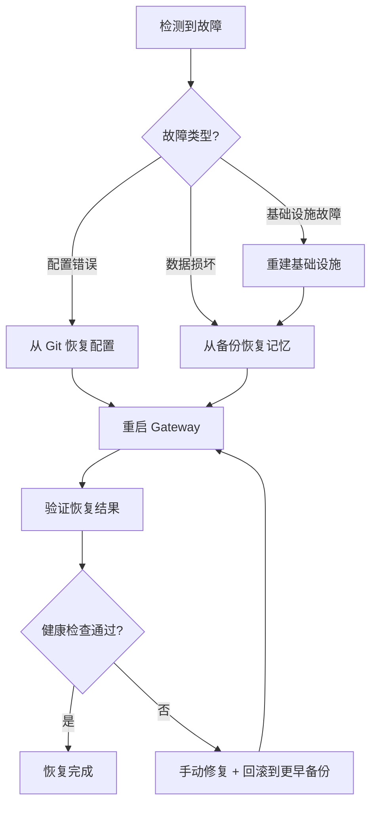
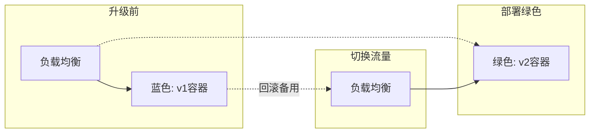

# 高级部署与运维

> **本章导读**: 基础模块 10-03 我们通过 `npx openclaw` 启动了本地开发环境。但对于生产环境，OpenClaw 需要以长期运行的守护进程形态部署——具备容器化封装、健康检查、日志收集、监控告警和灾备恢复能力。本章从 Docker 容器化入手，逐步深入到 Kubernetes 集群部署，覆盖日志体系、监控告警、备份恢复和版本升级策略，帮助你构建一个可运维、可观测、可回滚的生产级 OpenClaw 部署环境。
>
> **前置知识**: 基础模块 10-03 Getting Started 中的安装与配置、本章 01 Gateway 架构（健康端点与进程模型）
>
> **难度等级**: ⭐⭐⭐⭐☆

---

## 一、Docker 容器化部署

### 1.1 官方 Dockerfile 最佳实践

OpenClaw 官方提供基于 `node:22-slim` 的 Docker 镜像。一个生产级的 Dockerfile 需要关注镜像体积、安全上下文和健康检查三个方面：

```dockerfile
# === 多阶段构建 ===
# 阶段一：依赖安装
FROM node:22-slim AS builder

WORKDIR /app

# 优先安装依赖（利用 Docker 层缓存）
COPY package.json pnpm-lock.yaml ./
RUN npm install -g pnpm@10.6.5 && pnpm install --frozen-lockfile --prod

# 阶段二：运行镜像
FROM node:22-slim

# 安全配置：非 root 用户运行
RUN groupadd -r openclaw --gid 1000 && \
    useradd -r -g openclaw --uid 1000 -m -d /home/openclaw openclaw

WORKDIR /app

# 仅复制生产依赖和必要文件
COPY --from=builder /app/node_modules ./node_modules
COPY --from=builder /app/package.json ./
COPY config/ ./config/

# 端口声明
EXPOSE 18789

# 健康检查
HEALTHCHECK --interval=30s --timeout=10s --start-period=15s --retries=3 \
  CMD curl -f http://localhost:18789/healthz || exit 1

# 切换非 root 用户
USER openclaw

CMD ["node", "dist/gateway.js", "--config", "/app/config/openclaw.json"]
```

**构建命令**：

```bash
docker build -t openclaw-agent:latest .
```

**关键设计决策**：

| 决策 | 说明 | 收益 |
|------|------|------|
| 多阶段构建 | builder 阶段安装 dev 依赖，运行时阶段仅复制产物 | 镜像体积减少约 60% |
| `node:22-slim` 基础镜像 | 比 `node:22` 小约 800MB，比 `alpine` 兼容性更好 | 平衡体积与兼容性 |
| 非 root 用户 | `USER openclaw` 运行，UID 1000 | 容器逃逸时权限受限 |
| `HEALTHCHECK` 指令 | 每 30s 探测 `/healthz`，失败 3 次重启 | Docker 自动恢复宕机实例 |
| `--start-period` | 前 15s 不触发健康检查 | 避免启动阶段的误判 |

### 1.2 环境变量与 Docker Secrets

OpenClaw 在启动时从多个来源加载配置，优先级为：**环境变量 > 配置文件 > 默认值**。核心 API Key 应当通过 Docker Secrets 注入，而不是写入环境变量或配置文件：

```yaml
# docker-compose.yml（部分）
services:
  openclaw:
    build: .
    secrets:
      - anthropic_key
      - openai_key
    environment:
      - NODE_ENV=production
    # 注意：不同时通过 environment 设置 API Key

secrets:
  anthropic_key:
    file: ./secrets/anthropic_key.txt
  openai_key:
    file: ./secrets/openai_key.txt
```

**Secrets 注入方式对比**：

| 方式 | 安全性 | 适用场景 | 缺点 |
|------|--------|---------|------|
| 环境变量明文 | 低 | 本地开发 | 容器 `inspect` 可窥视 |
| `.env` 文件 | 中 | 测试环境 | 易误提交到 Git |
| Docker Secrets | 高 | 生产环境 | 仅 Swarm 原生支持，Compose 需手动挂载 |
| 外部 Secrets 管理器 | 最高 | 企业部署 | 额外依赖（Vault / AWS Secrets Manager） |

在生产环境中，推荐通过文件挂载的方式模拟 Docker Secrets（即使不使用 Swarm）：

```yaml
services:
  openclaw:
    volumes:
      - ./secrets/keys.env:/run/secrets/keys.env:ro
    environment:
      - OPENCLAW_SECRETS_FILE=/run/secrets/keys.env
```

OpenClaw Gateway 在启动时读取 `OPENCLAW_SECRETS_FILE` 指向的文件，将其中的键值对注入运行时环境。

### 1.3 数据卷持久化

OpenClaw 是有状态应用——它的记忆文件、配置和工作空间文件都需要持久化。通过 Docker 数据卷挂载实现：

```bash
docker run -d \
  --name openclaw \
  --restart unless-stopped \
  -v openclaw-config:/home/openclaw/.openclaw/config \
  -v openclaw-memory:/home/openclaw/.openclaw/memory \
  -v openclaw-workspace:/home/openclaw/.openclaw/workspace \
  -p 18789:18789 \
  openclaw-agent:latest
```

**数据卷规划**：

| 挂载路径 | 内容 | 建议存储大小 | 备份策略 |
|---------|------|-------------|---------|
| `config/` | `openclaw.json`、`AGENTS.md` | < 10MB | 随 Git 版本管理 |
| `memory/` | 对话记忆、事实记忆、任务记忆 | 1-10GB | 每日增量备份 |
| `workspace/` | Agent 操作产生的文件 | 视使用情况 | 选择性备份 |

**卷存储驱动建议**：对于频繁文件读写的场景（如对话记忆的每轮追加），推荐使用本地卷驱动（`local`）而非 NFS 等网络卷，以避免 I/O 延迟导致的 Agent 响应变慢。

### 1.4 多阶段构建深度优化

除了基础的依赖分离，还可以在 builder 阶段做更多优化：

```dockerfile
# builder 阶段：并行处理
FROM node:22-slim AS builder
WORKDIR /app
COPY package.json pnpm-lock.yaml ./
RUN npm install -g pnpm@10.6.5 && \
    pnpm install --frozen-lockfile --prod

# 如果是 monorepo 结构，只复制 openclaw 包
COPY packages/ packages/

# 编译 TypeScript（如果需要）
RUN pnpm --filter @openclaw/gateway build

# —— 最终镜像尺寸对比 ——
# 未优化: ~1.8GB
# 多阶段: ~450MB
# 多阶段 + alpine: ~320MB（但需要额外的 musl 兼容层）
```

---

## 二、Docker Compose 多服务编排

### 2.1 基础编排：OpenClaw + Ollama

对于需要本地 LLM 的场景，可以使用 Docker Compose 将 OpenClaw 与 Ollama 编排在一起：

```yaml
# docker-compose.yml
version: "3.8"

services:
  openclaw:
    build:
      context: .
      dockerfile: Dockerfile
    container_name: openclaw-agent
    restart: unless-stopped
    ports:
      - "18789:18789"
    volumes:
      - openclaw-config:/home/openclaw/.openclaw/config
      - openclaw-memory:/home/openclaw/.openclaw/memory
      - openclaw-workspace:/home/openclaw/.openclaw/workspace
    secrets:
      - anthropic_key
    environment:
      - NODE_ENV=production
      # Ollama 地址：通过 Docker 网络使用服务名
      - OPENCLAW_OLLAMA_HOST=http://ollama:11434
      - OPENCLAW_LLM_PROVIDER=ollama
    depends_on:
      ollama:
        condition: service_healthy
    healthcheck:
      test: ["CMD", "curl", "-f", "http://localhost:18789/healthz"]
      interval: 30s
      timeout: 10s
      retries: 3
      start_period: 20s
    networks:
      - openclaw-net

  ollama:
    image: ollama/ollama:latest
    container_name: ollama-local
    restart: unless-stopped
    volumes:
      - ollama-models:/root/.ollama
    deploy:
      resources:
        limits:
          memory: 8G
          cpus: "4"
    healthcheck:
      test: ["CMD", "curl", "-f", "http://localhost:11434/api/tags"]
      interval: 30s
      timeout: 5s
      retries: 3
    networks:
      - openclaw-net

volumes:
  openclaw-config:
  openclaw-memory:
  openclaw-workspace:
  ollama-models:

secrets:
  anthropic_key:
    file: ./secrets/anthropic_key.txt

networks:
  openclaw-net:
    driver: bridge
```

### 2.2 服务依赖与启动顺序

`depends_on` 有三种控制模式，需要根据业务场景选择：

```yaml
depends_on:
  ollama:
    # condition: service_started    # 仅确认进程启动
    # condition: service_healthy    # 等待健康检查通过（推荐）
    # condition: service_completed_successfully  # 等待一次性任务完成
```

对于 OpenClaw 场景，**推荐始终使用 `condition: service_healthy`**，因为 Ollama 需要加载模型到内存后才能处理请求——仅仅进程启动是不够的。

如果还需要数据库（如 PostgreSQL 存储对话日志），启动顺序链为：

```
PostgreSQL(healthy) -> Ollama(healthy) -> OpenClaw(healthy)
```

### 2.3 网络配置与服务间通信

Docker Compose 默认创建 `bridge` 网络，服务间通过服务名互相解析。但需要理解几个关键点：

| 配置 | 说明 | 适用场景 |
|------|------|---------|
| 默认 bridge | 无需额外配置，服务名即主机名 | 单机 Compose |
| 自定义 overlay | 跨多台宿主机 | Docker Swarm 集群 |
| `network_mode: host` | 共享宿主机网络栈 | 需要主机网络可发现性的场景 |

在默认 bridge 网络中，OpenClaw 通过 `http://ollama:11434` 访问 Ollama。**注意**：容器内的 `localhost` 指向自身，因此 OpenClaw 不能通过 `localhost:11434` 访问 Ollama。

---

## 三、Kubernetes 部署

### 3.1 Deployment 配置

Kubernetes 是生产级 OpenClaw 部署的主流选择。以下是一个生产级 Deployment：

```yaml
# deployment.yaml
apiVersion: apps/v1
kind: Deployment
metadata:
  name: openclaw
  namespace: openclaw
  labels:
    app: openclaw
spec:
  replicas: 1
  selector:
    matchLabels:
      app: openclaw
  template:
    metadata:
      labels:
        app: openclaw
    spec:
      # 安全上下文
      securityContext:
        runAsNonRoot: true
        runAsUser: 1000
        fsGroup: 1000
      containers:
        - name: agent
          image: openclaw/openclaw:latest
          ports:
            - containerPort: 18789
              protocol: TCP
          # 存活探针：进程是否活着
          livenessProbe:
            httpGet:
              path: /healthz
              port: 18789
            initialDelaySeconds: 15
            periodSeconds: 30
            failureThreshold: 3
          # 就绪探针：是否可以处理请求
          readinessProbe:
            httpGet:
              path: /readyz
              port: 18789
            initialDelaySeconds: 10
            periodSeconds: 15
            failureThreshold: 2
          # 资源限制
          resources:
            requests:
              cpu: "250m"
              memory: "512Mi"
            limits:
              cpu: "1000m"
              memory: "2Gi"
          # 卷挂载
          volumeMounts:
            - name: config
              mountPath: /home/openclaw/.openclaw/config
              readOnly: true
            - name: memory
              mountPath: /home/openclaw/.openclaw/memory
            - name: workspace
              mountPath: /home/openclaw/.openclaw/workspace
            - name: secrets
              mountPath: /etc/secrets
              readOnly: true
      volumes:
        - name: config
          configMap:
            name: openclaw-config
        - name: memory
          persistentVolumeClaim:
            claimName: openclaw-memory
        - name: workspace
          persistentVolumeClaim:
            claimName: openclaw-workspace
        - name: secrets
          secret:
            secretName: openclaw-secrets
```

**副本数与有状态约束**：OpenClaw 实例是**有状态的**——每个 Agent 独享一份记忆文件。多副本时各实例间不共享状态，因此 `replicas` 通常设为 `1`。对于多 Agent 场景，应使用多 Deployment 或 StatefulSet 来管理。

### 3.2 Service 配置

```yaml
# service.yaml
apiVersion: v1
kind: Service
metadata:
  name: openclaw
  namespace: openclaw
spec:
  type: ClusterIP
  ports:
    - port: 18789
      targetPort: 18789
      protocol: TCP
      name: gateway
  selector:
    app: openclaw
```

**服务暴露策略**：

| Service Type | 适用场景 | 说明 |
|-------------|---------|------|
| `ClusterIP` | 仅集群内访问 | 默认，通过 `port-forward` 或 Ingress 暴露 |
| `NodePort` | 开发测试 | 直接在宿主机端口暴露 |
| `LoadBalancer` | 云端部署 | 获取云厂商 LB IP，需配合 `gateway.auth` |
| `Ingress` | 生产环境 | TLS 终结、域名路由、限流 |

**注意**：OpenClaw Gateway 默认绑定到 `loopback`。在 Kubernetes 中需要通过 ConfigMap 将绑定地址改为 `0.0.0.0` 或 Pod IP，否则 Service 无法转发流量：

```json
{
  "gateway": {
    "bind": "0.0.0.0:18789",
    "auth": {
      "mode": "token"
    }
  }
}
```

### 3.3 ConfigMap 与 Secret 管理

**ConfigMap** 存储非敏感配置：

```yaml
# configmap.yaml
apiVersion: v1
kind: ConfigMap
metadata:
  name: openclaw-config
  namespace: openclaw
data:
  openclaw.json: |
    {
      "gateway": {
        "bind": "0.0.0.0:18789",
        "auth": {
          "mode": "token"
        }
      },
      "agents": {
        "defaults": {
          "model": {
            "primary": "anthropic/claude-sonnet-4-20250514"
          }
        }
      }
    }
  AGENTS.md: |
    # My Kubernetes Agent
    You are my personal assistant running in Kubernetes.
```

**Secret** 存储 API Key 等敏感信息：

```bash
# 创建 Secret
kubectl create secret generic openclaw-secrets \
  --namespace openclaw \
  --from-literal=ANTHROPIC_API_KEY=sk-ant-xxxxx \
  --from-literal=GATEWAY_TOKEN=$(openssl rand -hex 32)
```

> **安全提醒**：Secret 在 etcd 中仅 Base64 编码（非加密）。生产环境中应启用 etcd 静态加密（`--encryption-provider-config`），或使用 External Secrets Operator / Sealed Secrets 等工具。

### 3.4 HELM Chart 包管理

社区提供 Helm Chart 用于简化 Kubernetes 部署。安装方式：

```bash
# 添加仓库
helm repo add openclaw https://charts.openclaw.ai
helm repo update

# 安装（带自定义值）
helm upgrade --install my-agent openclaw/openclaw \
  --namespace openclaw \
  --create-namespace \
  --values values.yaml
```

**values.yaml 示例**：

```yaml
# values.yaml
replicaCount: 1

image:
  repository: openclaw/openclaw
  tag: latest
  pullPolicy: Always

config:
  existingConfigMap: openclaw-config

secrets:
  existingSecret: openclaw-secrets

persistence:
  enabled: true
  size: 10Gi
  storageClass: gp3

resources:
  requests:
    cpu: 250m
    memory: 512Mi
  limits:
    cpu: 1000m
    memory: 2Gi

service:
  type: ClusterIP
  port: 18789

ingress:
  enabled: true
  className: nginx
  annotations:
    cert-manager.io/cluster-issuer: letsencrypt-prod
  hosts:
    - host: agent.example.com
      paths:
        - path: /
          pathType: Prefix
  tls:
    - secretName: openclaw-tls
      hosts:
        - agent.example.com
```

对于生产环境还推荐使用 **OpenClaw Kubernetes Operator**（由社区维护），它通过 `OpenClawInstance` 自定义资源（CRD）管理完整的部署堆栈——包括 Deployment、Service、NetworkPolicy、PVC、PDB 和 ServiceMonitor，只需一个 YAML 文件：

```yaml
apiVersion: openclaw.rocks/v1alpha1
kind: OpenClawInstance
metadata:
  name: my-agent
  namespace: openclaw
spec:
  envFrom:
    - secretRef:
        name: openclaw-api-keys
  storage:
    persistence:
      enabled: true
      size: 10Gi
  config:
    raw:
      agents:
        defaults:
          model:
            primary: "anthropic/claude-sonnet-4-20250514"
```

Operator 会自动创建 9 个以上的 Kubernetes 资源：StatefulSet、Service、ServiceAccount、Role、RoleBinding、ConfigMap、PVC、PDB、NetworkPolicy 以及 Gateway Token Secret。

---

## 四、日志收集与分析

### 4.1 结构化日志格式

OpenClaw Gateway 默认输出格式化的文本日志。生产环境中应启用 JSON 结构化日志，便于日志系统解析和查询：

```json
// openclaw.json 配置
{
  "logging": {
    "format": "json",
    "level": "info",
    "output": "stdout"
  }
}
```

启用 JSON 格式后的日志输出示例：

```json
{"timestamp":"2026-05-04T08:15:30.123Z","level":"info","module":"gateway","message":"Agent request received","channel":"telegram","sessionId":"sess_abc123","durationMs":42}
{"timestamp":"2026-05-04T08:15:32.456Z","level":"warn","module":"brain","message":"LLM response exceeded token budget","tokens":8192,"budget":4096,"model":"claude-sonnet-4"}
{"timestamp":"2026-05-04T08:15:35.789Z","level":"error","module":"memory","message":"Memory file write failed","path":"memory/facts/skills.md","error":"ENOSPC"}
```

**日志字段规范**：

| 字段 | 类型 | 说明 | 示例 |
|------|------|------|------|
| `timestamp` | ISO8601 | 事件时间 | `2026-05-04T08:15:30.123Z` |
| `level` | string | 日志级别 | `info`, `warn`, `error`, `debug` |
| `module` | string | 来源模块 | `gateway`, `brain`, `hands`, `memory`, `heartbeat` |
| `message` | string | 人类可读描述 | 见上 |
| `channel` | string | （可选）消息渠道 | `telegram`, `discord`, `terminal` |
| `sessionId` | string | （可选）会话 ID | 用于关联同一会话的多个日志 |
| `durationMs` | number | （可选）操作耗时 | 用于性能分析 |

### 4.2 日志轮转策略

在非容器化部署中，使用系统工具进行日志轮转：

```bash
# /etc/logrotate.d/openclaw
/home/openclaw/.openclaw/logs/*.log {
    daily
    rotate 30
    compress
    delaycompress
    missingok
    notifempty
    copytruncate
    maxsize 100M
}
```

在 Docker 部署中，通过 Docker 的日志驱动配置：

```bash
docker run -d \
  --log-driver json-file \
  --log-opt max-size=10m \
  --log-opt max-file=5 \
  --log-opt labels=agent_id \
  openclaw-agent:latest
```

| 日志配置 | 参数 | 效果 |
|---------|------|------|
| 每天轮转 | `daily` | 每天生成新文件 |
| 保留 30 天 | `rotate 30` | 超过 30 天的日志自动删除 |
| 压缩旧日志 | `compress` | 旋转后的日志 gzip 压缩 |
| 单文件上限 | `max-size=10m` | 超过 10MB 立即轮转 |
| 保留文件数 | `max-file=5` | 仅保留最近 5 个轮转文件 |

### 4.3 ELK / Loki 集成方案

**方案一：Loki + Promtail + Grafana**（轻量级，推荐用于 Kubernetes）

```yaml
# promtail-daemonset.yaml（片段）
apiVersion: apps/v1
kind: DaemonSet
metadata:
  name: promtail
  namespace: observability
spec:
  selector:
    matchLabels:
      app: promtail
  template:
    spec:
      containers:
        - name: promtail
          image: grafana/promtail:2.9.0
          args:
            - -config.file=/etc/promtail/promtail.yaml
          volumeMounts:
            - name: varlog
              mountPath: /var/log
            - name: dockerlogs
              mountPath: /var/lib/docker/containers
              readOnly: true
      volumes:
        - name: varlog
          hostPath:
            path: /var/log
        - name: dockerlogs
          hostPath:
            path: /var/lib/docker/containers
```

在 Grafana 中创建告警规则，当日志中出现 `error` 级别或关键字（如 `"PANIC"`, `"OOM"`, `"API_ERROR"`）时触发通知。

**方案二：ELK Stack**（功能全面，适合企业环境）

```yaml
# docker-compose 中的 ELK 配置片段
services:
  filebeat:
    image: elastic/filebeat:8.12.0
    volumes:
      - openclaw-logs:/var/log/openclaw
      - ./filebeat.yml:/usr/share/filebeat/filebeat.yml:ro
    depends_on:
      elasticsearch:
        condition: service_healthy
    networks:
      - openclaw-net

  elasticsearch:
    image: elastic/elasticsearch:8.12.0
    environment:
      - discovery.type=single-node
      - ES_JAVA_OPTS=-Xms2g -Xmx2g
    volumes:
      - es-data:/usr/share/elasticsearch/data
    networks:
      - openclaw-net

  kibana:
    image: elastic/kibana:8.12.0
    ports:
      - "5601:5601"
    depends_on:
      elasticsearch:
        condition: service_healthy
    networks:
      - openclaw-net
```

---

## 五、监控告警

### 5.1 健康检查端点设计

OpenClaw Gateway 从 v2026.3.1 起内置了四个标准健康端点：

| 端点 | 类型 | 检查范围 | 失败后果 |
|------|------|---------|---------|
| `/health` | 存活探针 | 进程是否响应 HTTP | 容器重启 |
| `/healthz` | 存活探针 | 同上（Kubernetes 习惯命名） | 容器重启 |
| `/ready` | 就绪探针 | 进程 + 模型连接 + 渠道状态 | Service 端点移除 |
| `/readyz` | 就绪探针 | 同上（Kubernetes 习惯命名） | Service 端点移除 |

**`/readyz` 的检查逻辑示例**：

```typescript
// 简化的就绪检查实现
async function readinessCheck(): Promise<HealthStatus> {
  const checks = {
    gateway: await checkProcessHealth(),
    brain: await checkLLMConnectivity(),     // LLM API 是否可达
    memory: await checkMemoryAccess(),       // 记忆文件是否可读写
    channels: await checkChannelStatuses(),  // 消息渠道是否在线
  };

  const allHealthy = Object.values(checks).every(c => c.status === "ok");

  return {
    status: allHealthy ? "ok" : "degraded",
    checks,
    timestamp: new Date().toISOString(),
  };
}
```

### 5.2 Prometheus 指标暴露

在 OpenClaw 配置中启用 Prometheus 指标端点：

```json
{
  "metrics": {
    "enabled": true,
    "path": "/metrics",
    "port": 18793
  }
}
```

**核心 Prometheus 指标清单**：

| 指标名 | 类型 | 说明 | 标签 |
|--------|------|------|------|
| `openclaw_requests_total` | Counter | 总请求数 | `channel`, `status` |
| `openclaw_request_duration_seconds` | Histogram | 请求处理耗时 | `channel` |
| `openclaw_llm_tokens_total` | Counter | 消耗的 Token 总数 | `model`, `direction`(input/output) |
| `openclaw_llm_request_duration_seconds` | Histogram | LLM API 调用耗时 | `model` |
| `openclaw_memory_size_bytes` | Gauge | 记忆文件总大小 | `type`(conversation/fact/task/summary) |
| `openclaw_heartbeat_jobs_total` | Gauge | 当前注册的 Heartbeat 任务数 | - |
| `openclaw_ws_connections_active` | Gauge | 活跃 WebSocket 连接数 | `channel` |
| `openclaw_errors_total` | Counter | 错误总数 | `module`, `error_type` |

**Prometheus 抓取配置**：

```yaml
# prometheus-scrape-config.yaml
scrape_configs:
  - job_name: "openclaw"
    scrape_interval: 15s
    static_configs:
      - targets:
          - "openclaw.openclaw.svc.cluster.local:18793"
    metrics_path: /metrics
```

### 5.3 关键告警规则

```yaml
# prometheus-alert-rules.yaml
groups:
  - name: openclaw
    rules:
      # 服务宕机
      - alert: OpenClawDown
        expr: up{job="openclaw"} == 0
        for: 1m
        labels:
          severity: critical
        annotations:
          summary: "OpenClaw 服务不可达"
          description: "Job {{ $labels.job }} 的实例 {{ $labels.instance }} 已离线超过 1 分钟。"

      # Heartbeat 心跳丢失
      - alert: AgentNotResponding
        expr: time() - openclaw_heartbeat_last_tick > 300
        for: 2m
        labels:
          severity: warning
        annotations:
          summary: "Agent 心跳丢失"
          description: "Agent 超过 5 分钟未响应心跳检测。"

      # API 错误率上升
      - alert: HighApiErrorRate
        expr: |
          rate(openclaw_errors_total{module="brain"}[5m])
          /
          rate(openclaw_requests_total[5m]) > 0.1
        for: 5m
        labels:
          severity: warning
        annotations:
          summary: "LLM API 错误率过高"
          description: "过去 5 分钟 Brain 模块错误率超过 10%，当前值: {{ $value | humanizePercentage }}"

      # Token 消耗异常
      - alert: TokenBudgetExceeded
        expr: openclaw_llm_tokens_total > 1000000
        for: 1h
        labels:
          severity: info
        annotations:
          summary: "Token 消耗接近预算上限"
          description: "当前已消耗 {{ $value }} tokens，请关注成本。"

      # 内存文件写入失败
      - alert: MemoryWriteErrors
        expr: rate(openclaw_errors_total{module="memory"}[5m]) > 0
        for: 2m
        labels:
          severity: critical
        annotations:
          summary: "记忆文件写入异常"
          description: "Memory 模块在过去 5 分钟内出现 {{ $value }} 次/秒的写入错误。可能磁盘已满。"
```

---

## 六、数据备份与恢复策略

### 6.1 记忆文件备份

记忆文件是 OpenClaw 最珍贵的资产——它存储了 Agent 学习的全部上下文。推荐使用 **定时增量备份**：

```bash
#!/bin/bash
# backup-memory.sh
# 使用：crontab -e 添加 0 3 * * * /opt/openclaw/scripts/backup-memory.sh

BACKUP_DIR="/backups/openclaw/memory"
MEMORY_DIR="/home/openclaw/.openclaw/memory"
DATE=$(date +%Y%m%d)

mkdir -p "${BACKUP_DIR}/${DATE}"

# 首次全量备份（每周日）
if [ "$(date +%u)" -eq 7 ]; then
  tar czf "${BACKUP_DIR}/${DATE}/memory-full.tar.gz" \
    -C "${MEMORY_DIR}" .
  echo "Full backup created: ${BACKUP_DIR}/${DATE}/memory-full.tar.gz"
else
  # 增量备份
  LAST_FULL=$(ls -1td "${BACKUP_DIR}"/*/ 2>/dev/null | head -1)
  if [ -n "$LAST_FULL" ]; then
    rsync -a --link-dest="${LAST_FULL}" \
      "${MEMORY_DIR}/" "${BACKUP_DIR}/${DATE}/"
    echo "Incremental backup created: ${BACKUP_DIR}/${DATE}/"
  else
    tar czf "${BACKUP_DIR}/${DATE}/memory-full.tar.gz" \
      -C "${MEMORY_DIR}" .
    echo "First full backup created: ${BACKUP_DIR}/${DATE}/memory-full.tar.gz"
  fi
fi

# 清理 90 天前的备份
find "${BACKUP_DIR}" -type d -mtime +90 -exec rm -rf {} \; 2>/dev/null
```

### 6.2 配置文件备份

配置文件虽然体积小，但包含 Agent 身份定义（SOUL.md）、Skills 注册信息和 Gateway 配置。应将配置文件纳入版本管理：

```bash
# 备份配置目录
tar czf "openclaw-config-$(date +%Y%m%d).tar.gz" \
  /home/openclaw/.openclaw/config/

# 异地同步（示例：AWS S3）
aws s3 cp openclaw-config-$(date +%Y%m%d).tar.gz \
  s3://my-openclaw-backups/config/
```

**建议的备份周期**：

| 备份类型 | 周期 | 保留时间 | 存储位置 |
|---------|------|---------|---------|
| 内存全量备份 | 每周 | 90 天 | 本地 + 异地 |
| 内存增量备份 | 每日 | 90 天 | 本地 |
| 配置文件备份 | 每次变更 | 永久 | Git + 异地 |
| Docker 数据卷快照 | 每周 | 30 天 | 本地 |

### 6.3 灾难恢复流程

当发生数据损坏、配置错误或基础设施故障时，按以下步骤恢复：



**详细恢复步骤**：

```bash
# 1. 停止当前实例
docker compose down

# 2. 恢复配置
git checkout <last-known-good-commit> -- config/

# 3. 恢复记忆文件
tar xzf /backups/openclaw/memory/20260503/memory-full.tar.gz \
  -C /home/openclaw/.openclaw/memory/

# 4. 恢复配置备份（如果 Git 不可用）
tar xzf openclaw-config-20260503.tar.gz \
  -C /home/openclaw/.openclaw/

# 5. 启动服务
docker compose up -d

# 6. 验证恢复
curl -f http://localhost:18789/healthz && \
  curl -f http://localhost:18789/readyz && \
  echo "Recovery verified"
```

---

## 七、版本升级策略

### 7.1 兼容性检查

升级前必须检查的兼容性清单：

1. **配置文件格式变更**：对比新旧版本的 `openclaw.json` schema，检查字段是否被废弃或重命名
2. **记忆文件格式变更**：检查记忆文件的序列化格式是否有变化
3. **SKILL.md 规范版本**：确认 Skills 使用的语法在新版本中仍被支持
4. **插件/通道兼容性**：检查社区开发的自定义通道是否适配新版本
5. **Ollama 或外部模型版本**：确认 LLM API 的请求/响应格式未变化

**升级前置检查脚本**：

```bash
#!/bin/bash
# pre-upgrade-check.sh

NEW_VERSION_TAG=$1
CURRENT_VERSION=$(docker inspect --format '{{.Config.Image}}' openclaw-agent 2>/dev/null | cut -d: -f2 || echo "none")

echo "=== Pre-upgrade Check ==="
echo "Current version: ${CURRENT_VERSION}"
echo "Target version:  ${NEW_VERSION_TAG}"

# 检查 1：配置兼容性
echo "[1/4] Checking config compatibility..."
docker run --rm -v $(pwd)/config:/app/config:ro \
  "openclaw/openclaw:${NEW_VERSION_TAG}" \
  node /app/scripts/validate-config.js /app/config/openclaw.json

# 检查 2：记忆文件兼容性
echo "[2/4] Checking memory format compatibility..."
docker run --rm -v $(pwd)/memory:/app/memory:ro \
  "openclaw/openclaw:${NEW_VERSION_TAG}" \
  node /app/scripts/validate-memory.js /app/memory

# 检查 3：依赖兼容性
echo "[3/4] Checking skill dependencies..."
docker run --rm -v $(pwd)/skills:/app/skills:ro \
  "openclaw/openclaw:${NEW_VERSION_TAG}" \
  node /app/scripts/validate-skills.js /app/skills

# 检查 4：数据迁移模拟
echo "[4/4] Running migration dry-run..."
docker run --rm -v $(pwd)/memory:/app/memory:ro \
  "openclaw/openclaw:${NEW_VERSION_TAG}" \
  node /app/scripts/migrate-memory.js --dry-run
```

### 7.2 滚动升级 vs 蓝绿部署

**方案一：滚动升级**（适合单实例、低风险场景）

> **注意**：OpenClaw 是有状态服务，滚动升级期间会有一个短暂的状态不可用窗口。

```bash
# Docker Compose 滚动升级
docker compose pull openclaw
docker compose up -d --no-deps --scale openclaw=1 openclaw
```

```bash
# Kubernetes 滚动升级
kubectl set image deployment/openclaw agent=openclaw/openclaw:2.0.0 \
  --namespace openclaw
kubectl rollout status deployment/openclaw --namespace openclaw
```

在 Kubernetes 中，可以配置 PodDisruptionBudget 来控制中断窗口：

```yaml
apiVersion: policy/v1
kind: PodDisruptionBudget
metadata:
  name: openclaw-pdb
  namespace: openclaw
spec:
  minAvailable: 0    # 允许中断（单副本时无法满足 1）
  selector:
    matchLabels:
      app: openclaw
```

**方案二：蓝绿部署**（适合零停机需求、高风险升级）



```yaml
# docker-compose.blue-green.yml
services:
  # 蓝色环境（当前版本）
  openclaw-blue:
    image: openclaw/openclaw:1.0.0
    container_name: openclaw-blue
    volumes:
      - openclaw-memory:/home/openclaw/.openclaw/memory
      - openclaw-config-blue:/home/openclaw/.openclaw/config
    networks:
      - openclaw-net

  # 绿色环境（新版本，临时）
  openclaw-green:
    image: openclaw/openclaw:2.0.0
    container_name: openclaw-green
    profiles:
      - green
    volumes:
      - openclaw-memory-green:/home/openclaw/.openclaw/memory
      - openclaw-config-green:/home/openclaw/.openclaw/config
    networks:
      - openclaw-net

  # 反向代理（切换流量）
  nginx:
    image: nginx:alpine
    ports:
      - "18789:18789"
    volumes:
      - ./nginx.conf:/etc/nginx/nginx.conf:ro
    networks:
      - openclaw-net
```

### 7.3 回滚方案

升级失败时，需要快速回滚到上一版本。不同部署方式的回滚命令：

```bash
# === Docker Compose ===
# 回滚到上一个版本
docker compose stop openclaw
docker compose rm openclaw
# 修改 image 标签为上一个版本
docker compose up -d openclaw

# === Kubernetes ===
# 回滚到上一个版本
kubectl rollout undo deployment/openclaw --namespace openclaw
# 回滚到指定版本
kubectl rollout undo deployment/openclaw --namespace openclaw --to-revision=3
# 查看版本历史
kubectl rollout history deployment/openclaw --namespace openclaw
```

**回滚检查清单**：

| 检查项 | 验证方法 | 预期结果 |
|--------|---------|---------|
| 进程启动 | `docker ps` / `kubectl get pods` | Running 状态 |
| 健康检查 | `curl /healthz` | HTTP 200 |
| 模型连通 | `curl /readyz` | HTTP 200 |
| 渠道在线 | 发送测试消息 | 正常响应 |
| 记忆完整 | 查询历史事实 | 数据不丢失 |
| Heartbeat 恢复 | 检查已注册任务 | 定时任务正常运行 |

---

## 本章总结

从个人开发者的 `npx openclaw` 到生产集群的 Kubernetes Deployment，OpenClaw 的部署方式随规模增长而变化。以下是本章的核心要点：

| 部署层级 | 关键组件 | 适用规模 | 运维复杂度 |
|---------|---------|---------|-----------|
| Docker 单容器 | HEALTHCHECK、数据卷、Secrets | 个人、小团队 | 低 |
| Docker Compose | Ollama 编排、网络配置 | 小团队、个人+本地模型 | 中 |
| Kubernetes | Deployment、Service、ConfigMap/Secret | 中型团队、生产环境 | 高 |
| K8s + Operator | CRD、自动安全加固、ServiceMonitor | 大型团队、企业级 | 中（使用 Operator） |

生产环境的底线要求：

- **健康检查**：至少配置存活探针（`/healthz`）和就绪探针（`/readyz`）
- **日志收集**：启用 JSON 结构化日志，接入 Loki 或 ELK
- **监控告警**：暴露 Prometheus 指标，配置关键告警规则
- **数据备份**：记忆文件每日增量备份，每周全量备份，保留 90 天
- **升级前检查**：运行兼容性验证脚本，确认配置、记忆和 Skills 无冲突
- **回滚就绪**：保留前一个容器镜像版本，确保 `rollout undo` 路径可用

---

**下一步**: 完成了生产环境的部署与运维，下一章进入性能调优与 Token 成本优化——如何在高负载下保持响应速度，同时控制 LLM API 的调用成本。

---

[← 上一章: SOUL.md 与 Agent 人设工程](/deep-dive/openclaw/08-soul-engineering) | [继续学习: 性能调优与 Token 成本优化 →](/deep-dive/openclaw/10-performance-optimization)
