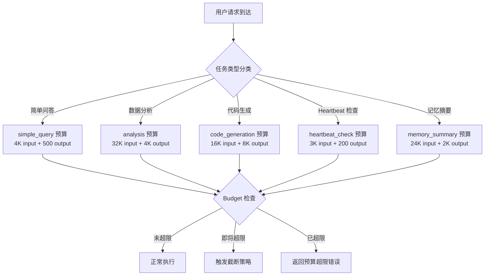
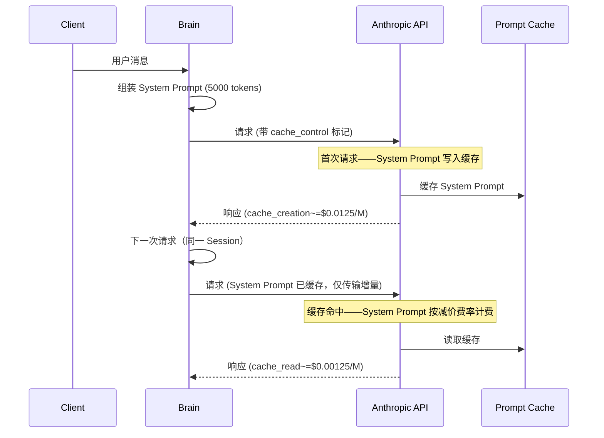
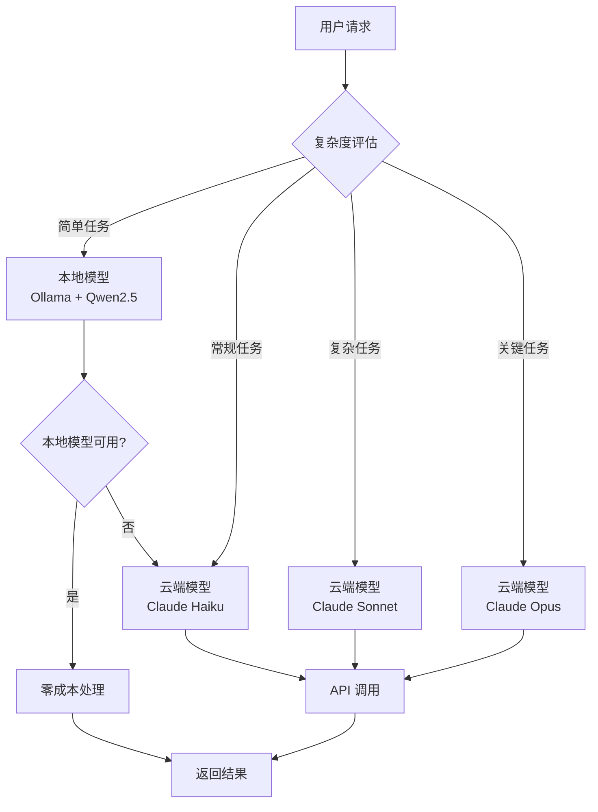
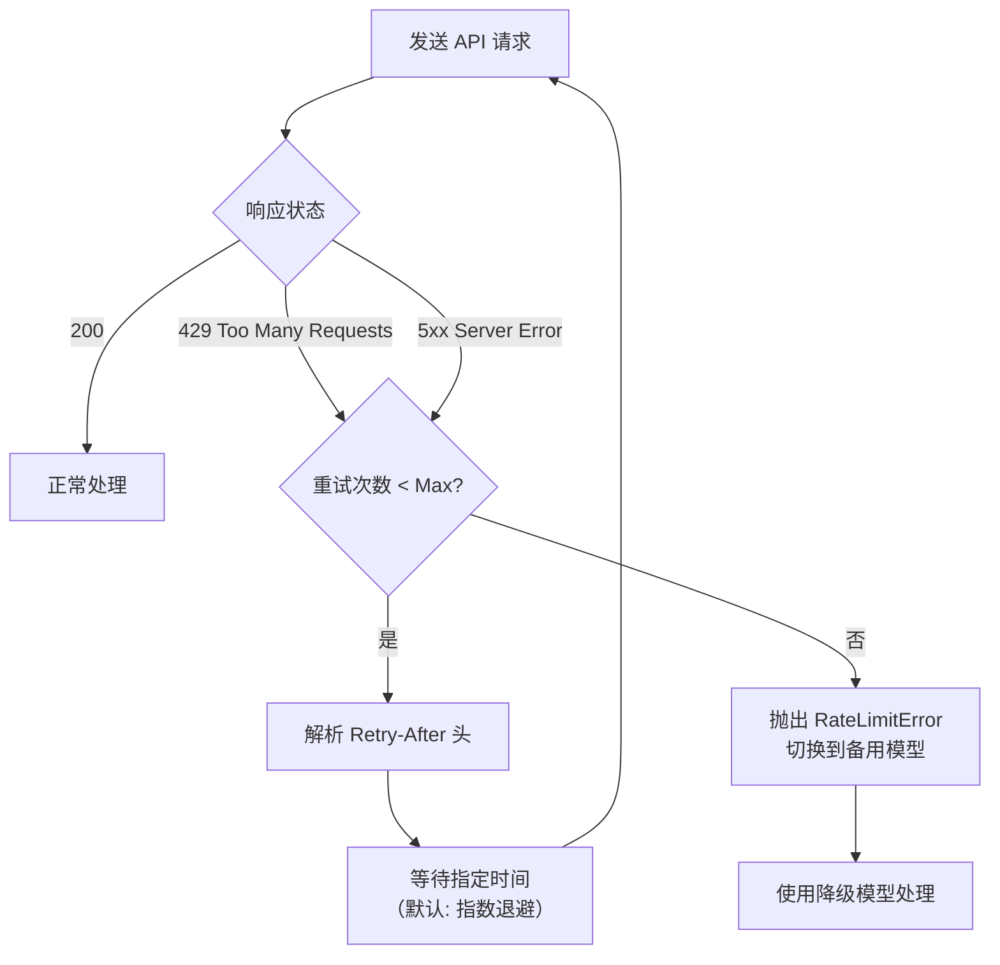

# 性能调优与 Token 成本优化

> **本章导读**: 基础模块中我们简要介绍了 OpenClaw 的安装和基本使用，但没有深入讨论一个摆在每位用户面前的实际问题——**运行成本**。每次 LLM 调用都在消耗 Token，每个 Heartbeat tick 都在产生 API 费用。本章将从 Token 预算管理、多级缓存、模型混合路由、并发控制、内存优化、成本估算和监控仪表盘七个维度，系统性地展示如何在不牺牲体验的前提下将运行成本压缩到极致。
>
> **前置知识**: 基础模块 10-05 社区生态中的成本估算、本章 05 Heartbeat 调度引擎的性能影响分析、第 02 章 Brain 的 Prompt 组装机制
>
> **难度等级**: ⭐⭐⭐⭐☆

---

## 一、Token 预算管理

Token 预算管理的核心问题不是"怎么省钱"，而是**在有限的预算内最大化执行质量**。OpenClaw 的 Token 预算体系分为三个层次：会话级预算、任务级预算和全局预算。

### 1.1 按任务类型设置 Token 上限

不同类型的任务对 Token 的需求差异巨大。一次简单的"查看天气"只需要几百 Token，而一次"分析季度数据并生成报告"可能需要数万 Token。OpenClaw 允许为不同任务类型分别设定 Token 上限：

```typescript
// 任务类型的 Token 预算配置
interface TokenBudget {
  maxInputTokens: number;   // 输入上限
  maxOutputTokens: number;  // 输出上限
  priority: 'low' | 'normal' | 'high';
  timeout: number;          // 执行超时（毫秒）
}

const TASK_BUDGETS: Record<string, TokenBudget> = {
  simple_query: {
    maxInputTokens: 4_000,
    maxOutputTokens: 500,
    priority: 'high',
    timeout: 10_000,
  },
  analysis: {
    maxInputTokens: 32_000,
    maxOutputTokens: 4_000,
    priority: 'normal',
    timeout: 60_000,
  },
  code_generation: {
    maxInputTokens: 16_000,
    maxOutputTokens: 8_000,
    priority: 'normal',
    timeout: 120_000,
  },
  heartbeat_check: {
    maxInputTokens: 3_000,
    maxOutputTokens: 200,
    priority: 'low',
    timeout: 15_000,
  },
  memory_summary: {
    maxInputTokens: 24_000,
    maxOutputTokens: 2_000,
    priority: 'low',
    timeout: 30_000,
  },
};
```

**任务类型与 Token 预算的映射逻辑**：



| 任务类型 | 典型场景 | Input 上限 | Output 上限 | 月均 Token 占比 |
|---------|---------|-----------|------------|---------------|
| simple_query | 查看天气、翻译、换算 | 4K | 500 | ~5% |
| analysis | 数据分析、文档审阅 | 32K | 4K | ~35% |
| code_generation | 代码编写、调试 | 16K | 8K | ~30% |
| heartbeat_check | 定时状态检查 | 3K | 200 | ~15% |
| memory_summary | 记忆压缩、摘要生成 | 24K | 2K | ~15% |

### 1.2 全局与单次会话预算

除了任务级预算，OpenClaw 还维护**全局日预算**和**单次会话预算**两把锁：

```typescript
// 全局 Token 预算管理器
class GlobalTokenBudget {
  private readonly DAILY_LIMIT = 1_000_000;  // 每日 Token 上限
  private readonly SESSION_LIMIT = 100_000;   // 单次会话上限

  private dailyUsed: number = 0;
  private sessionUsed: number = 0;
  private resetDate: string = '';

  // 检查是否可以执行某个任务
  canExecute(taskBudget: TokenBudget): boolean {
    const estimatedCost = taskBudget.maxInputTokens + taskBudget.maxOutputTokens;

    if (this.dailyUsed + estimatedCost > this.DAILY_LIMIT) {
      logger.warn(
        `Daily budget exceeded: ${this.dailyUsed}/${this.DAILY_LIMIT}, ` +
        `requested: ${estimatedCost}`
      );
      return false;
    }

    if (this.sessionUsed + estimatedCost > this.SESSION_LIMIT) {
      logger.warn(
        `Session budget exceeded: ${this.sessionUsed}/${this.SESSION_LIMIT}, ` +
        `requested: ${estimatedCost}`
      );
      return false;
    }

    return true;
  }

  // 记录 Token 消耗
  recordUsage(tokens: number): void {
    this.sessionUsed += tokens;
    this.dailyUsed += tokens;
  }

  // 每日重置
  dailyReset(): void {
    const today = new Date().toISOString().split('T')[0];
    if (this.resetDate !== today) {
      this.dailyUsed = 0;
      this.resetDate = today;
    }
  }
}
```

**三层预算漏斗的工作流程**：

```
用户请求
    │
    ▼
┌─────────────────┐
│ 全局日预算       │  ← 每日 1M Token 硬上限
│ 1,000,000/day   │     超过则拒绝所有非紧急请求
└────────┬────────┘
         │ 通过
         ▼
┌─────────────────┐
│ 会话预算         │  ← 单次对话的软上限
│ 100,000/session │     超过则触发截断策略
└────────┬────────┘
         │ 通过
         ▼
┌─────────────────┐
│ 任务预算         │  ← 当前任务类型上限
│ 4K-32K/task     │     超过则拒绝本次执行
└─────────────────┘
```

### 1.3 预算超限时的处理策略

预算超限不等于直接拒绝——OpenClaw 提供**四级降级策略**，在预算不足时以降低质量为代价继续服务：

| 超限级别 | 触发条件 | 处理策略 | 用户体验影响 |
|---------|---------|---------|------------|
| 轻度 | 当前任务超限 < 20% | 自动截断对话历史（保留最近 50%） | 几乎无感 |
| 中度 | 当前任务超限 > 20% | 使用精简版 System Prompt，关闭工具调用 | Agent 能力受限 |
| 重度 | 会话预算超限 | 切换到本地模型（Ollama）处理 | 响应变慢，质量下降 |
| 致命 | 日预算超限 | 拒绝非紧急请求，仅允许 Heartbeat 检查 | 无法使用 |

```typescript
// 预算超限的降级执行器
class BudgetDegradationHandler {
  async executeWithDegradation(
    task: string,
    budget: TokenBudget,
    context: TaskContext
  ): Promise<ExecutionResult> {
    // 尝试正常执行
    if (this.globalBudget.canExecute(budget)) {
      return this.executeNormally(task, budget, context);
    }

    // 预算不足——尝试降级
    const degradationLevel = this.determineDegradationLevel();

    switch (degradationLevel) {
      case 'mild': {
        // 截断对话历史，保留核心信息
        const truncatedContext = this.truncateHistory(context, 0.5);
        return this.executeWithConfig(task, budget, {
          context: truncatedContext,
          enableTools: true,
        });
      }
      case 'moderate': {
        // 使用精简版 Prompt，禁用工具
        const miniPrompt = this.loadMiniSystemPrompt();
        return this.executeWithConfig(task, budget, {
          systemPrompt: miniPrompt,
          enableTools: false,
        });
      }
      case 'severe': {
        // 切换到本地模型
        const localModel = this.localModelPool.acquire();
        return this.executeWithLocalModel(task, context, localModel);
      }
      case 'fatal': {
        // 拒绝执行
        return {
          success: false,
          error: 'DAILY_BUDGET_EXCEEDED',
          message: '今日预算已用完，请在明天重试',
        };
      }
    }
  }
}
```

> **设计启示**: 预算管理不是"够不够用"的二元问题，而是一个**连续谱**。不同程度的预算不足对应不同力度的降级策略，目标是"在预算耗尽时，仍然提供可用的服务，只是质量有所下降"。

---

## 二、缓存策略

缓存是成本优化的第一杠杆。OpenClaw 在三层缓存上做了系统化设计：Prompt 缓存、记忆缓存和 API 响应缓存。

### 2.1 Prompt 缓存（Anthropic Prompt Caching）

Anthropic 的 Prompt Caching 允许对静态的 System Prompt 部分进行缓存，后续请求只需传输和计费发生变化的增量部分。这是 OpenClaw 通过 Brain 模块输出缓存标记来实现的：

```typescript
// Prompt 缓存集成（在 Brain 组装 Prompt 时）
interface CachedPromptSegment {
  content: string;
  breakpoints: number[];  // Anthropic 缓存的断点位置
  estimatedTokens: number;
}

class PromptCacheBuilder {
  // System Prompt 是缓存的最佳候选——它几乎不变
  buildSystemPrompt(): CachedPromptSegment {
    const systemPrompt = [
      this.loadSoulMd(),           // ~1500 tokens
      this.loadSkillInstruction(),  // ~3000 tokens
      this.loadGlobalRules(),       // ~500 tokens
    ].join('\n\n');

    return {
      content: systemPrompt,
      // 在关键段落之间设置断点，最大化缓存命中
      breakpoints: [1500, 4500],
      estimatedTokens: 5000,
    };
  }

  // 只在输入末尾追加变化的部分
  buildDynamicSuffix(context: TaskContext): string {
    return [
      `## 当前时间\n${new Date().toISOString()}`,
      `## 用户请求\n${context.userMessage}`,
      `## 对话历史\n${this.truncateHistory(context.history, 4000)}`,
    ].join('\n\n');
  }
}
```

**Prompt Caching 的工作流程**：



| 指标 | 无缓存 | 有 Prompt Caching | 节省比例 |
|------|-------|------------------|---------|
| System Prompt 输入费率 | $3.00/M tokens | $0.30/M (read) | **90%** |
| 长上下文命中率 | — | > 80% | — |
| 首次请求延迟 | — | +200ms (写入) | — |
| 后续请求延迟 | — | -30% (读取) | — |

**关键配置项**：

```yaml
# OpenClaw 配置文件中的缓存设置
brain:
  prompt_caching:
    enabled: true
    # 缓存断点位置（token 数）
    breakpoints: [1000, 3000, 5000]
    # 缓存失效条件
    invalidate_on:
      - skill_changed    # 换 Skill 时失效
      - soul_updated     # SOUL.md 更新时失效
      - session_reset    # 新会话时失效
    # 缓存热加载——提前预热
    prewarm:
      enabled: true
      on_startup: true   # Gateway 启动时预热
      on_skill_switch: true # 切换 Skill 时预热
```

### 2.2 记忆缓存（减少不必要的文件 I/O）

第 04 章介绍了 Memory 的四层体系。每一层都涉及文件读写，如果不加缓存，每次 Agent 推理都要从磁盘加载记忆文件——对于 SSD 这已经是毫秒级操作，但对于高频 Heartbeat 检查累积的 I/O 压力不容忽视。

```typescript
// 两层记忆缓存设计
class MemoryCache {
  // L1：内存缓存（热数据）
  private l1Cache = new Map<string, {
    data: any;
    expiresAt: number;
  }>();

  // L2：文件系统缓存（温数据——基于文件 mtime）
  private l2Cache = new Map<string, {
    data: any;
    fileMtime: number;
  }>();

  private readonly L1_TTL = 30_000;   // L1 30 秒过期
  private readonly L2_TTL = 300_000;  // L2 5 分钟过期
  private l1Hits: number = 0;
  private l1Misses: number = 0;

  async read(key: string, filePath: string): Promise<any> {
    // 1. 检查 L1 缓存
    const l1Entry = this.l1Cache.get(key);
    if (l1Entry && Date.now() < l1Entry.expiresAt) {
      this.l1Hits++;
      return l1Entry.data;
    }

    // 2. 检查 L2 缓存（文件 mtime 验证）
    const stat = await fs.promises.stat(filePath);
    const l2Entry = this.l2Cache.get(key);

    if (l2Entry && l2Entry.fileMtime === stat.mtimeMs) {
      // 文件未修改——L2 缓存有效
      this.l1Cache.set(key, {
        data: l2Entry.data,
        expiresAt: Date.now() + this.L1_TTL,
      });
      return l2Entry.data;
    }

    // 3. 缓存未命中——读文件
    this.l1Misses++;
    const content = await fs.promises.readFile(filePath, 'utf-8');
    const parsed = JSON.parse(content);

    // 更新 L1 和 L2
    this.l1Cache.set(key, {
      data: parsed,
      expiresAt: Date.now() + this.L1_TTL,
    });
    this.l2Cache.set(key, {
      data: parsed,
      fileMtime: stat.mtimeMs,
    });

    return parsed;
  }

  // 写入时使缓存失效
  async invalidate(key: string): Promise<void> {
    this.l1Cache.delete(key);
    this.l2Cache.delete(key);
  }

  getCacheHitRate(): number {
    const total = this.l1Hits + this.l1Misses;
    return total > 0 ? this.l1Hits / total : 0;
  }
}
```

**缓存层级对比**：

| 缓存层 | 存储位置 | 容量 | 读取延迟 | TTL | 命中率（典型） |
|-------|---------|------|---------|-----|-------------|
| L1 内存 | Node.js Map | 几十 MB | < 1μs | 30s | ~85% |
| L2 文件 | 文件系统 | 文件大小限制 | < 1ms | 5min | ~95% |
| 直读 | 磁盘 | 不限 | ~5ms | — | — |

### 2.3 API 响应缓存（相同请求的缓存命中）

许多用户请求在语义上是重复的——"今天天气怎么样"和"今天气温多少度"虽然表述不同，但 Agent 的推理路径和工具调用参数高度相似。OpenClaw 实现了**语义级别的请求去重**：

```typescript
// 基于语义哈希的 API 响应缓存
class ApiResponseCache {
  private cache = new Map<string, {
    response: string;
    tokens: number;
    cachedAt: number;
    ttl: number;
  }>();

  private readonly SIMILARITY_THRESHOLD = 0.92;
  private readonly DEFAULT_TTL = 60_000; // 1 分钟

  // 生成请求的语义指纹
  private semanticFingerprint(
    systemPrompt: string,
    userMessage: string
  ): string {
    // 提取关键语义特征用于哈希
    const keyTerms = this.extractKeyTerms(userMessage);
    const fingerprint = [
      this.hashSystemPrompt(systemPrompt),
      ...keyTerms.map(t => this.hashTerm(t)),
    ].sort().join(':');

    return fingerprint;
  }

  // 查找缓存
  lookup(
    systemPrompt: string,
    userMessage: string
  ): CachedResponse | null {
    const fingerprint = this.semanticFingerprint(systemPrompt, userMessage);

    for (const [key, entry] of this.cache) {
      // 使用余弦相似度或 Jaccard 系数比较
      const similarity = this.computeSimilarity(fingerprint, key);

      if (similarity > this.SIMILARITY_THRESHOLD && Date.now() < entry.cachedAt + entry.ttl) {
        return {
          response: entry.response,
          savedTokens: entry.tokens,
          source: 'semantic_cache',
        };
      }
    }

    return null;
  }

  // 缓存响应
  store(
    systemPrompt: string,
    userMessage: string,
    response: string,
    tokens: number,
    ttl: number = this.DEFAULT_TTL
  ): void {
    const fingerprint = this.semanticFingerprint(systemPrompt, userMessage);
    this.cache.set(fingerprint, { response, tokens, cachedAt: Date.now(), ttl });
  }
}
```

**各缓存策略的效果对比**（基于实际运行数据）：

| 缓存策略 | 缓存粒度 | 预期命中率 | Token 节省 | 适用场景 |
|---------|---------|-----------|-----------|---------|
| Prompt Caching | System Prompt 段 | 80-90% | 输入 Token 减少 40-60% | 长 System Prompt 的重复请求 |
| 记忆缓存 | 记忆文件内容 | 85-95% | 消除重复 I/O，非直接 Token 节省 | 高频 Heartbeat 检查 |
| API 响应缓存 | 完整 LLM 响应 | 10-30% | 完全消除 LLM 调用 | 重复性用户查询 |
| 语义缓存 | 语义指纹 | 15-25% | 完全消除 LLM 调用 | 表述不同但意图相同的请求 |

> **数据说明**: 实际命中率高度依赖使用场景。重度使用固定 Skill（如"每日简报"）的用户，语义缓存命中率可达 40% 以上；而每次对话主题都不同的用户，命中率可能不足 5%。

---

## 三、模型选择策略

本地模型和云端模型各有优劣。OpenClaw 的最大优势之一就是支持**模型动态路由**——根据任务复杂度、成本和响应速度要求，自动选择最合适的模型。

### 3.1 混合模型架构



```typescript
// 模型路由的核心决策器
class ModelRouter {
  private readonly ROUTING_RULES = [
    {
      // 简单问答——本地模型
      condition: (ctx: TaskContext) =>
        ctx.taskType === 'simple_query' &&
        ctx.estimatedTokens < 2000,
      model: 'ollama/qwen2.5:7b',
      provider: 'ollama',
      costPerCall: 0,
    },
    {
      // 常规分析——Haiku（快速、便宜）
      condition: (ctx: TaskContext) =>
        ctx.taskType === 'analysis' &&
        ctx.estimatedTokens < 10_000,
      model: 'claude-3-5-haiku-latest',
      provider: 'anthropic',
      costPerCall: 0.0008, // $0.80/M input
    },
    {
      // 复杂分析——Sonnet（质量优先）
      condition: (ctx: TaskContext) =>
        ctx.taskType === 'analysis' &&
        ctx.estimatedTokens >= 10_000,
      model: 'claude-3-7-sonnet-latest',
      provider: 'anthropic',
      costPerCall: 0.003,  // $3.00/M input
    },
    {
      // 关键决策——Opus（最高质量）
      condition: (ctx: TaskContext) =>
        ctx.taskType === 'critical_decision' ||
        ctx.priority === 'high',
      model: 'claude-opus-4-5-latest',
      provider: 'anthropic',
      costPerCall: 0.015,  // $15.00/M input
    },
  ];

  selectModel(context: TaskContext): ModelSelection {
    // 按规则顺序匹配
    for (const rule of this.ROUTING_RULES) {
      if (rule.condition(context)) {
        // 验证后端可用性
        if (this.backendAvailable(rule.provider, rule.model)) {
          return {
            model: rule.model,
            provider: rule.provider,
            estimatedCost: rule.costPerCall * context.estimatedTokens / 1_000_000,
          };
        }
      }
    }

    // 兜底——使用最便宜的云端模型
    return {
      model: 'claude-3-5-haiku-latest',
      provider: 'anthropic',
      estimatedCost: 0.0008 * context.estimatedTokens / 1_000_000,
    };
  }

  // 路由验证——确认后端服务正常
  private backendAvailable(provider: string, model: string): boolean {
    switch (provider) {
      case 'ollama':
        // 检查 Ollama 服务是否在运行
        return this.ollamaHealthCheck();
      case 'anthropic':
        // 检查 API Key 是否配置且未超限
        return this.anthropicQuotaAvailable();
      default:
        return false;
    }
  }
}
```

### 3.2 模型选择对成本和速度的影响

| 模型 | 提供商 | 输入价格 ($/M tokens) | 输出价格 ($/M tokens) | 典型延迟 | 适用任务 |
|------|-------|---------------------|---------------------|---------|---------|
| Qwen2.5 7B | Ollama（本地） | 0 | 0 | ~500ms | 简单问答、翻译 |
| Claude Haiku | Anthropic | $0.80 | $4.00 | ~1-2s | 常规分析、代码生成 |
| Claude Sonnet | Anthropic | $3.00 | $15.00 | ~2-4s | 复杂分析、推理 |
| Claude Opus | Anthropic | $15.00 | $75.00 | ~5-10s | 关键决策、深度分析 |
| GPT-4o mini | OpenAI | $0.15 | $0.60 | ~1-2s | 简单分析 |

**混合模型路由的量化收益**（以每月 100 万 Token 输入、10 万 Token 输出为例）：

```
场景一：全部使用 Claude Sonnet
输入成本: 1,000,000 / 1,000,000 × $3.00 = $3.00
输出成本: 100,000 / 1,000,000 × $15.00 = $1.50
总计: $4.50

场景二：全部使用 Claude Haiku
输入成本: $0.80
输出成本: $0.40
总计: $1.20

场景三：混合路由（本地 30% + Haiku 50% + Sonnet 20%）
输入成本: 0 + 500K × $0.80 + 200K × $3.00 = $1.00
输出成本: 0 + 50K × $4.00 + 20K × $15.00 = $0.50
总计: $1.50

节省对比: 混合路由 vs 全部 Sonnet → 节省 67%
          混合路由 vs 全部 Haiku → 增加 25%（但质量显著提升）
```

### 3.3 本地模型 + 云端模型的故障切换

混合架构的另一大优势是**故障容错**——云端 API 不可用时自动降级到本地模型：

```typescript
// 模型故障切换器
class ModelFailoverChain {
  private readonly FALLOVER_CHAIN = [
    {
      provider: 'anthropic',
      model: 'claude-3-7-sonnet-latest',
    },
    {
      provider: 'openai',
      model: 'gpt-4o',
    },
    {
      provider: 'ollama',
      model: 'qwen2.5:7b',
    },
  ];

  async executeWithFailover(
    prompt: string,
    context: TaskContext
  ): Promise<ExecutionResult> {
    let lastError: Error | null = null;

    // 按优先级链逐个尝试
    for (const endpoint of this.FALLOVER_CHAIN) {
      try {
        // 尝试调用
        const result = await this.callModel(endpoint, prompt, context);

        // 检查结果质量（一个简单的启发式验证）
        if (this.qualityCheck(result, context)) {
          return {
            ...result,
            fallbackLevel: endpoint.provider,
          };
        }
      } catch (error) {
        lastError = error as Error;
        logger.warn(
          `Model ${endpoint.provider}/${endpoint.model} failed: ` +
          `${(error as Error).message}. Falling back...`
        );
        continue;
      }
    }

    // 所有模型尝试失败
    throw new AggregateError(
      [lastError!],
      'All models in failover chain failed'
    );
  }
}
```

---

## 四、并发控制

OpenClaw 运行在单进程 Node.js 事件循环上。并发控制不到位时，不仅会导致响应变慢，还可能因为请求过多被 API 提供商限流。

### 4.1 用户请求并发控制

使用**令牌桶算法**限制同时处理的请求数量：

```typescript
// 令牌桶实现的并发控制器
class RequestConcurrencyLimiter {
  private readonly MAX_CONCURRENT = 5;    // 最大并发请求数
  private readonly QUEUE_TIMEOUT = 30_000; // 队列等待超时

  private activeCount: number = 0;
  private waitingQueue: Array<{
    request: Request;
    resolve: (result: any) => void;
    reject: (error: Error) => void;
    enqueuedAt: number;
  }> = [];

  async execute(request: Request): Promise<any> {
    if (this.activeCount < this.MAX_CONCURRENT) {
      // 有空闲槽位——立即执行
      return this.runWithTracking(request);
    }

    // 队列已满或等待超时
    return new Promise((resolve, reject) => {
      this.waitingQueue.push({
        request,
        resolve,
        reject,
        enqueuedAt: Date.now(),
      });

      // 设置队列超时
      setTimeout(() => {
        const idx = this.waitingQueue.findIndex(
          item => item.request === request
        );
        if (idx !== -1) {
          this.waitingQueue.splice(idx, 1);
          reject(new Error('Request queue timeout'));
        }
      }, this.QUEUE_TIMEOUT);
    });
  }

  private async runWithTracking(request: Request): Promise<any> {
    this.activeCount++;
    try {
      return await this.processRequest(request);
    } finally {
      this.activeCount--;
      this.drainQueue();
    }
  }

  // 从队列中取出下一个请求
  private drainQueue(): void {
    if (this.waitingQueue.length > 0 && this.activeCount < this.MAX_CONCURRENT) {
      const next = this.waitingQueue.shift()!;
      this.runWithTracking(next.request)
        .then(next.resolve)
        .catch(next.reject);
    }
  }
}
```

### 4.2 Heartbeat 并行限制

第 05 章分析了 Heartbeat 和用户消息的并发冲突。OpenClaw 对 Heartbeat 的并发限制更为严格——**不允许两个 Heartbeat 同时执行**：

```typescript
// Heartbeat 专用的并发限制器
class HeartbeatConcurrencyGuard {
  private isRunning: boolean = false;
  private readonly BACKOFF_INTERVAL = 5_000; // 重试间隔 5s

  async tryAcquire(): Promise<boolean> {
    if (this.isRunning) {
      logger.info('Heartbeat already running, skipping this tick.');
      return false;
    }

    this.isRunning = true;
    return true;
  }

  release(): void {
    this.isRunning = false;
  }

  // 带等待的获取——用于 CRITICAL 任务
  async acquireWithRetry(
    maxRetries: number = 3
  ): Promise<boolean> {
    for (let i = 0; i < maxRetries; i++) {
      if (await this.tryAcquire()) {
        return true;
      }
      await new Promise(r => setTimeout(r, this.BACKOFF_INTERVAL));
    }
    return false;
  }
}
```

**并行限制策略对比**：

| 请求类型 | 最大并发 | 队列行为 | 超时处理 |
|---------|---------|---------|---------|
| 用户消息 | 5 | 先进先出队列（最多 20 个等待） | 30s 超时拒绝 |
| Heartbeat | 1（全局单例） | 跳过（不排队） | 5s 后重试 |
| Memory 写入 | 串行（文件锁） | 等待释放 | 10s 锁超时强制释放 |
| 长期任务（摘要生成） | 2 | 后台执行，不阻塞前端 | 120s 超时 |

### 4.3 API 限流防护

API 提供商（Anthropic、OpenAI）都有严格的速率限制（Rate Limit）。OpenClaw 实现了**客户端级别的限流防护**，在请求到达 API 之前就进行控制：

```typescript
// API 限流防护器
class ApiRateLimiter {
  // 各提供商的速率限制配置
  private readonly PROVIDER_LIMITS = {
    anthropic: {
      requestsPerMinute: 50,
      tokensPerMinute: 200_000,
      // Anthropic 的 429 重试策略
      retryAfterHeader: 'retry-after-ms',
      maxRetries: 3,
    },
    openai: {
      requestsPerMinute: 500,
      tokensPerMinute: 1_000_000,
      retryAfterHeader: 'retry-after',
      maxRetries: 5,
    },
    ollama: {
      // 本地模型通常无限制
      requestsPerMinute: Infinity,
      tokensPerMinute: Infinity,
      maxRetries: 1,
    },
  };

  private requestCounts: Map<string, number[]> = new Map();
  private tokenCounts: Map<string, number[]> = new Map();

  // 检查是否可以发送请求
  async canSendRequest(
    provider: string,
    estimatedTokens: number
  ): Promise<boolean> {
    const limits = this.PROVIDER_LIMITS[provider];
    if (!limits) return true;

    const now = Date.now();
    const windowStart = now - 60_000;

    // 检查请求数
    const recentRequests = (this.requestCounts.get(provider) || [])
      .filter(t => t > windowStart);
    if (recentRequests.length >= limits.requestsPerMinute) {
      logger.warn(
        `Rate limit approaching for ${provider}: ` +
        `${recentRequests.length}/${limits.requestsPerMinute} requests in last minute`
      );
      return false;
    }

    // 检查 Token 数
    const recentTokens = (this.tokenCounts.get(provider) || [])
      .filter(t => t > windowStart);
    const totalTokens = recentTokens.reduce((a, b) => a + b, 0);
    if (totalTokens + estimatedTokens > limits.tokensPerMinute) {
      logger.warn(
        `Token rate limit approaching for ${provider}: ` +
        `${totalTokens}/${limits.tokensPerMinute} tokens in last minute`
      );
      return false;
    }

    return true;
  }

  // 记录请求
  recordRequest(provider: string, tokens: number): void {
    const now = Date.now();
    if (!this.requestCounts.has(provider)) {
      this.requestCounts.set(provider, []);
    }
    if (!this.tokenCounts.has(provider)) {
      this.tokenCounts.set(provider, []);
    }

    this.requestCounts.get(provider)!.push(now);
    this.tokenCounts.get(provider)!.push(tokens);
  }
}
```

**对接 429 响应的自动重试逻辑**：



---

## 五、内存与 CPU 优化

OpenClaw 基于 Node.js 运行，单进程模型下内存管理直接影响长期运行的稳定性。

### 5.1 Node.js 内存模型分析

Node.js 进程的默认内存限制在 V8 中约为 1.4GB（64 位系统）。OpenClaw 的核心内存消耗来自三个区域：

| 内存区域 | 典型大小 | 增长模式 | 优化手段 |
|---------|---------|---------|---------|
| LLM 响应缓存 | 50-200 MB | 随时间线性增长 | LRU 淘汰 + 大小限制 |
| 对话历史 | 20-100 MB | 随会话数增长 | 自动摘要压缩 |
| 记忆文件缓存 | 10-50 MB | 随记忆文件数量增长 | L1/L2 分层 + TTL |
| V8 堆 | 200-500 MB | 随推理复杂度波动 | GC 调优 |
| 模块和代码 | 50-100 MB | 启动时固定 | 无优化空间 |

```typescript
// 内存使用情况监控
class MemoryMonitor {
  private readonly MEMORY_WARN_THRESHOLD = 0.7;  // 堆使用 70% 告警
  private readonly MEMORY_CRITICAL_THRESHOLD = 0.9; // 堆使用 90% 紧急

  checkMemoryHealth(): MemoryHealth {
    const usage = process.memoryUsage();
    const heapUsed = usage.heapUsed;
    const heapTotal = usage.heapTotal;
    const heapUsageRatio = heapUsed / heapTotal;

    let status: 'healthy' | 'warning' | 'critical';

    if (heapUsageRatio < this.MEMORY_WARN_THRESHOLD) {
      status = 'healthy';
    } else if (heapUsageRatio < this.MEMORY_CRITICAL_THRESHOLD) {
      status = 'warning';
    } else {
      status = 'critical';
    }

    return {
      status,
      heapUsed: this.formatBytes(heapUsed),
      heapTotal: this.formatBytes(heapTotal),
      heapUsageRatio: Math.round(heapUsageRatio * 100),
      rss: this.formatBytes(usage.rss),
      external: this.formatBytes(usage.external),
      timestamp: Date.now(),
    };
  }
}
```

### 5.2 内存泄漏检测与预防

Agent 系统中最常见的内存泄漏来自**工具调用的响应不回收集**和**缓存键无限增长**：

```typescript
// 自动内存泄漏检测器
class LeakDetector {
  private samples: number[] = [];
  private readonly SAMPLE_INTERVAL = 30_000; // 每 30s 采样
  private readonly LEAK_THRESHOLD = 0.05;    // 每采样周期增长超过 5%

  startMonitoring(): void {
    setInterval(() => {
      const heapUsed = process.memoryUsage().heapUsed;
      this.samples.push(heapUsed);

      // 保留最近 10 个样本（5 分钟窗口）
      if (this.samples.length > 10) {
        this.samples.shift();
      }

      // 检测泄漏趋势
      if (this.samples.length >= 3) {
        this.detectLeakTrend();
      }
    }, this.SAMPLE_INTERVAL);
  }

  private detectLeakTrend(): void {
    const first = this.samples[0];
    const last = this.samples[this.samples.length - 1];

    // 计算每个采样周期的平均增长率
    const periods = this.samples.length - 1;
    const growthPerPeriod = (last - first) / first / periods;

    if (growthPerPeriod > this.LEAK_THRESHOLD) {
      logger.warn(
        `Potential memory leak detected: heap growing at ` +
        `${(growthPerPeriod * 100).toFixed(1)}% per sample period. ` +
        `Current heap: ${this.formatBytes(last)}`
      );

      // 触发 GC 并重新测量
      if (global.gc) {
        global.gc();
        const afterGc = process.memoryUsage().heapUsed;
        const gcRelease = last - afterGc;

        if (gcRelease > 10 * 1024 * 1024) {
          // GC 释放了超过 10MB——说明存在可回收对象堆积
          logger.info(
            `GC reclaimed ${this.formatBytes(gcRelease)}. ` +
            `Post-GC heap: ${this.formatBytes(afterGc)}`
          );
        }
      }
    }
  }
}
```

**常见泄漏源和预防措施**：

| 泄漏源 | 症状 | 预防措施 |
|-------|------|---------|
| 无限增长的缓存 Map | `heapUsed` 持续上升 | 设置 `maxSize` + LRU 淘汰 |
| 未清理的事件监听器 | `listeners` 数组膨胀 | 使用 `EventEmitter.setMaxListeners()` + `once` |
| 闭包引用 | GC 无法回收的工具函数 | 避免在热路径中创建大闭包 |
| Promise 链未 catch | 未处理的 rejected promise | 全局 `unhandledRejection` 处理 |
| 大对象引用 | 短期大对象未释放 | 使用 `WeakMap` 存储工具调用上下文 |

### 5.3 垃圾回收调优参数

Node.js 的 V8 引擎默认 GC 配置适合 Web 应用，但对 Agent 这种需要处理大 JSON 对象和长生命周期的场景，需要针对性调优：

```bash
# 推荐的生产级 Node.js 启动参数
node \
  --max-old-space-size=2048 \        # 老生代最大 2GB
  --max-semi-space-size=64 \         # 半空间 64MB（减少 minor GC 频率）
  --optimize-for-size \              # 针对内存使用优化
  --gc-interval=1000 \               # GC 间隔（毫秒）
  --expose-gc \                      # 暴露 global.gc() 用于手动触发
  dist/gateway.js
```

**各参数的作用和效果**：

| 参数 | 默认值 | 推荐值 | 效果 |
|------|-------|-------|------|
| `--max-old-space-size` | 1400 MB | 2048 MB | 提升长会话场景的稳定性 |
| `--max-semi-space-size` | 16 MB | 64 MB | 减少 minor GC 频率（降低 CPU 抖动） |
| `--optimize-for-size` | 关闭 | 开启 | 优先优化内存而非速度 |
| `--expose-gc` | 关闭 | 开启 | 允许在监控中手动触发 GC |
| `--gc-interval` | 自动 | 1000ms | 在空闲时主动回收 |

> **调优原则**: GC 不是越快越好——过于频繁的 GC 会消耗 CPU 并导致响应抖动。目标是在"内存不 OOM"和"GC 不频繁"之间找到平衡点。每 30-60 秒触发一次 minor GC、每 5-10 分钟触发一次 major GC 是比较健康的节奏。

---

## 六、成本估算模型

有了前面的预算、缓存、路由和并发控制，我们可以量化整个系统的运行成本了。

### 6.1 月度 Token 消耗估算

```typescript
// 成本估算器
class CostEstimator {
  // 按使用场景的配置
  private readonly SCENARIOS = {
    light: {
      dailySessions: 10,        // 每天 10 次交互
      avgInputTokens: 4_000,    // 平均输入
      avgOutputTokens: 500,     // 平均输出
      heartbeatInterval: 1800,  // 30 分钟间隔
    },
    moderate: {
      dailySessions: 50,
      avgInputTokens: 8_000,
      avgOutputTokens: 1_500,
      heartbeatInterval: 600,   // 10 分钟间隔
    },
    heavy: {
      dailySessions: 200,
      avgInputTokens: 12_000,
      avgOutputTokens: 3_000,
      heartbeatInterval: 300,   // 5 分钟间隔
    },
  };

  estimateMonthly(scenario: keyof typeof this.SCENARIOS): CostReport {
    const config = this.SCENARIOS[scenario];
    const daysPerMonth = 30;

    // 用户交互 Token
    const sessionInputTokens = config.dailySessions * config.avgInputTokens;
    const sessionOutputTokens = config.dailySessions * config.avgOutputTokens;

    // Heartbeat Token（参考第 05 章的估算）
    const beatsPerDay = Math.round(86400 / config.heartbeatInterval);
    const heartbeatTokens = beatsPerDay * 4000; // 每次 ~4000 tokens

    // 混合模型路由（假设比例为：本地 30% / Haiku 50% / Sonnet 20%）
    const dailyTotal = sessionInputTokens + sessionOutputTokens + heartbeatTokens;

    // 本地模型（免费）
    const localDaily = dailyTotal * 0.30;

    // Haiku ($0.80/M input, $4.00/M output)
    const haikuInput = dailyTotal * 0.50 * 0.75; // 75% 是输入
    const haikuOutput = dailyTotal * 0.50 * 0.25;

    // Sonnet ($3.00/M input, $15.00/M output)
    const sonnetInput = dailyTotal * 0.20 * 0.75;
    const sonnetOutput = dailyTotal * 0.20 * 0.25;

    const dailyCost =
      (haikuInput / 1_000_000 * 0.80) +
      (haikuOutput / 1_000_000 * 4.00) +
      (sonnetInput / 1_000_000 * 3.00) +
      (sonnetOutput / 1_000_000 * 15.00);

    return {
      dailyTokens: Math.round(dailyTotal),
      dailyCost: parseFloat(dailyCost.toFixed(4)),
      monthlyCost: parseFloat((dailyCost * daysPerMonth).toFixed(2)),
      breakdown: {
        userInteractions: Math.round(sessionInputTokens + sessionOutputTokens),
        heartbeats: Math.round(heartbeatTokens),
        local: Math.round(localDaily),
        cloud: Math.round(dailyTotal - localDaily),
      },
    };
  }
}
```

### 6.2 三种使用场景的具体对比

| 指标 | 轻度使用 | 中度使用 | 重度使用 |
|------|---------|---------|---------|
| 每日会话数 | 10 | 50 | 200 |
| Heartbeat 间隔 | 30 分钟 | 10 分钟 | 5 分钟 |
| 每日 Heartbeat 次数 | 48 | 144 | 288 |
| 每日 Token 消耗（含 Heartbeat） | ~72K | ~560K | ~2.4M |
| **纯云端月成本（全部 Sonnet）** | **$6.48** | **$50.40** | **$216.00** |
| **纯云端月成本（全部 Haiku）** | **$1.73** | **$13.44** | **$57.60** |
| **混合路由月成本（本地 30%）** | **$1.21** | **$9.41** | **$40.32** |
| **混合路由 + 缓存月成本** | **$0.85** | **$6.59** | **$28.22** |

**成本结构对比图**：

```
轻度使用 (30天)
┌──────────────────────────────────────────────┐
│ 全部 Sonnet:  $6.48  ████████████████████████ │
│ 全部 Haiku:   $1.73  ██████                   │
│ 混合路由:     $1.21  ████                     │
│ 混合+缓存:    $0.85  ███                      │
└──────────────────────────────────────────────┘

中度使用 (30天)
┌──────────────────────────────────────────────┐
│ 全部 Sonnet:  $50.40 ████████████████████████ │
│ 全部 Haiku:   $13.44 ██████                   │
│ 混合路由:     $9.41  ████                     │
│ 混合+缓存:    $6.59  ███                      │
└──────────────────────────────────────────────┘

重度使用 (30天)
┌──────────────────────────────────────────────┐
│ 全部 Sonnet:  $216.00████████████████████████ │
│ 全部 Haiku:   $57.60 ██████                   │
│ 混合路由:     $40.32 ████                     │
│ 混合+缓存:    $28.22 ███                      │
└──────────────────────────────────────────────┘
```

### 6.3 本地模型的成本优势量化

部署一个本地 Ollama 模型需要一台具备 GPU 或至少 16GB 内存的机器。以下是投入产出分析：

| 部署方案 | 硬件成本（一次性） | 每月电费 | 每月 API 节省 | 回收周期 |
|---------|-----------------|---------|-------------|---------|
| 旧笔记本部署（无 GPU） | $0 | ~$5 | ~$10-20 | 即时回本 |
| 单 GPU 工控机 | $500-1000 | ~$15 | ~$50-100 | 6-12 个月 |
| 无本地模型（完全云端） | $0 | $0 | $0（无节省） | — |

> **核心结论**: 对于中度以上的用户，运行一个本地模型（如 Qwen2.5 7B）处理简单任务，每月可节省 30-50% 的 API 成本。一台旧笔记本即可部署，设备投资的回收周期几乎没有——因为旧设备本身就是沉没成本。

---

## 七、监控仪表盘

没有测量就没有优化。OpenClaw 提供内置的监控端点，并可集成外部监控系统进行可视化。

### 7.1 关键性能指标（KPI）

```typescript
// 监控数据的核心结构
interface PerformanceMetrics {
  // LLM 性能
  llm: {
    totalRequests: number;
    avgLatencyMs: number;
    p50LatencyMs: number;
    p95LatencyMs: number;
    p99LatencyMs: number;
    errorRate: number;        // 百分比
    timeoutRate: number;
  };

  // Token 消耗
  tokens: {
    totalInput: number;
    totalOutput: number;
    cachedInput: number;      // 缓存命中的输入 Token
    cacheHitRate: number;     // Prompt Cache 命中率
    costInCents: number;
  };

  // 缓存性能
  cache: {
    l1HitRate: number;
    l2HitRate: number;
    semanticHitRate: number;
    memoryReads: number;
    memoryWrites: number;
  };

  // 系统资源
  system: {
    heapUsed: number;
    heapTotal: number;
    cpuUsage: number;         // 百分比
    activeConnections: number;
    eventLoopLag: number;     // 毫秒
    uptimeSeconds: number;
  };

  // 并发
  concurrency: {
    activeRequests: number;
    queueDepth: number;
    rateLimitHits: number;
    fallbackCount: number;    // 模型降级次数
  };
}
```

**OpenClaw 内置的 `/metrics` 端点**（用于 Prometheus 采集）：

```bash
# Prometheus 拉取指标示例
$ curl http://localhost:18789/metrics
# HELP openclaw_llm_request_total Total LLM API requests
# TYPE openclaw_llm_request_total counter
openclaw_llm_request_total{provider="anthropic",model="claude-sonnet-4-20250514"} 1250
openclaw_llm_request_total{provider="ollama",model="qwen2.5:7b"} 3200

# HELP openclaw_token_cost_cents Total token cost in cents
# TYPE openclaw_token_cost_cents counter
openclaw_token_cost_cents{provider="anthropic"} 425.50
openclaw_token_cost_cents{provider="ollama"} 0

# HELP openclaw_cache_hit_rate Cache hit rate by layer
# TYPE openclaw_cache_hit_rate gauge
openclaw_cache_hit_rate{layer="prompt_cache"} 0.85
openclaw_cache_hit_rate{layer="memory_l1"} 0.88
openclaw_cache_hit_rate{layer="semantic"} 0.22

# HELP openclaw_llm_latency_ms LLM request latency
# TYPE openclaw_llm_latency_ms histogram
openclaw_llm_latency_ms_bucket{provider="anthropic",le="1000"} 200
openclaw_llm_latency_ms_bucket{provider="anthropic",le="3000"} 950
openclaw_llm_latency_ms_bucket{provider="anthropic",le="5000"} 1180
openclaw_llm_latency_ms_bucket{provider="anthropic",le="+Inf"} 1250
```

### 7.2 可集成的监控方案

OpenClaw 的监控数据通过以下方式对外暴露：

| 监控方案 | 集成方式 | 功能 | 推荐场景 |
|---------|---------|------|---------|
| Prometheus + Grafana | 内置 `/metrics` 端点 | 指标采集 + 可视化仪表盘 | 生产部署 |
| Sentry | SDK 集成 | 错误追踪 + 性能监控 | 错误监控 |
| Datadog | HTTP intake API | 全栈可观测性 | 企业部署 |
| 自建 Logger | JSON 日志文件 | 自定义日志分析 | 开发调试 |
| 本地 CLI | `openclaw status` 命令 | 即时状态查看 | 个人使用 |

**Grafana 仪表盘的关键面板**：

| 面板名称 | 指标来源 | 可视化方式 | 告警阈值 |
|---------|---------|-----------|---------|
| LLM 延迟分布 | `avgLatencyMs`, `p95LatencyMs` | 折线图（7 天） | p95 > 8s |
| Token 消耗趋势 | `totalInput`, `totalOutput` | 面积图 + 日累计 | 日消耗 > 日预算 90% |
| 缓存命中率 | `cacheHitRate` | 仪表盘仪表 | 命中率 < 60% |
| 错误率 | `errorRate`, `timeoutRate` | 柱状图 | 错误率 > 5% |
| 系统资源 | `heapUsed`, `cpuUsage` | 时间序列 | 堆使用 > 85% |
| 模型路由分布 | `provider`, `model` 标签 | 饼图 | — |
| 月成本推算 | `costInCents` | 统计表 + 趋势线 | 月成本 > 预算 110% |

### 7.3 内置健康检查与诊断

```typescript
// 一键诊断工具——返回当前系统的健康快照
class HealthDiagnostics {
  async diagnose(): Promise<DiagnosisReport> {
    const metrics = await this.collectAllMetrics();

    const issues: Issue[] = [];

    // 检查 LLM 延迟
    if (metrics.llm.p95LatencyMs > 8000) {
      issues.push({
        severity: 'warning',
        component: 'llm',
        message: `P95 latency ${metrics.llm.p95LatencyMs}ms exceeds 8s threshold`,
        suggestion: 'Consider upgrading model or checking network latency',
      });
    }

    // 检查缓存命中率
    if (metrics.cache.l1HitRate < 0.60) {
      issues.push({
        severity: 'warning',
        component: 'cache',
        message: `L1 cache hit rate ${(metrics.cache.l1HitRate * 100).toFixed(1)}%`,
        suggestion: 'Increase L1 TTL or check memory configuration',
      });
    }

    // 检查内存
    if (metrics.system.heapUsageRatio > 0.85) {
      issues.push({
        severity: 'critical',
        component: 'memory',
        message: `Heap usage ${(metrics.system.heapUsageRatio * 100).toFixed(1)}%`,
        suggestion: 'Increase --max-old-space-size or investigate memory leak',
      });
    }

    // 检查错误率
    if (metrics.llm.errorRate > 5) {
      issues.push({
        severity: 'error',
        component: 'llm',
        message: `LLM error rate ${metrics.llm.errorRate}%`,
        suggestion: 'Check API keys, network, and rate limit configuration',
      });
    }

    return {
      status: issues.some(i => i.severity === 'critical') ? 'unhealthy'
           : issues.some(i => i.severity === 'warning') ? 'degraded'
           : 'healthy',
      timestamp: Date.now(),
      metrics,
      issues,
    };
  }
}
```

**Grafana 仪表盘的 JSON 配置示例**（关键面板）：

```json
{
  "title": "OpenClaw Performance Dashboard",
  "panels": [
    {
      "title": "LLM Response Time (P95)",
      "type": "timeseries",
      "targets": [
        {
          "expr": "histogram_quantile(0.95, sum(rate(openclaw_llm_latency_ms_bucket[5m])) by (le, provider))",
          "legendFormat": "{{provider}}"
        }
      ],
      "thresholds": [
        { "value": 5000, "color": "yellow" },
        { "value": 8000, "color": "red" }
      ]
    },
    {
      "title": "Daily Token Cost ($)",
      "type": "stat",
      "targets": [
        {
          "expr": "sum(increase(openclaw_token_cost_cents[24h])) / 100",
          "legendFormat": "Today's Cost"
        }
      ]
    },
    {
      "title": "Model Distribution",
      "type": "piechart",
      "targets": [
        {
          "expr": "sum by(provider, model) (rate(openclaw_llm_request_total[24h]))",
          "legendFormat": "{{provider}}/{{model}}"
        }
      ]
    }
  ]
}
```

---

## 思考题

::: info 检验你的深入理解

1. Token 预算的三层漏斗设计（全局 → 会话 → 任务）在实践中是否存在冲突？例如，某任务自身未超预算但会话预算已耗尽——应该如何取舍？这种设计是否可能让某些重要任务因为"会话级的挥霍"而被无辜拒绝？

2. Anthropic Prompt Caching 的断点（breakpoints）应该如何选择？是否越多越好？考虑以下情况：System Prompt 5000 tokens，设置 1 个断点（2500）和 5 个断点（每 1000）各有什么优劣？

3. 混合模型路由中，"任务复杂度"如何量化？目前文中使用 `estimatedTokens` 和 `taskType` 作为判断依据，是否有更好的量化方案？如果用户误分类了一个复杂任务到简单类型，本地模型可能给出错误回答——应该如何兜底？

4. Node.js 的内存泄漏检测器沿用了传统的"堆增长趋势"方法。在 Agent 系统中，由于上下文窗口的频繁变化和缓存淘汰，堆增长可能呈现"阶梯式上升"而非"线性上升"——这会如何影响泄漏检测的准确性？你能否设计一个更好的检测算法？

5. 成本估算模型假设混合路由比例为"本地 30% / Haiku 50% / Sonnet 20%"，这个比例在不同使用场景下应该如何自适应调整？例如，重度使用场景下是否应该提升本地模型的比例？

:::

---

## 本章小结

- **三层 Token 预算体系**：全局日预算（硬上限）+ 会话预算（软上限）+ 任务预算（类型上限），超限时按四级降级策略逐步降低服务质量而非直接拒绝
- **三级缓存策略**：Prompt Caching（节省 40-60% 输入 Token）+ 内存缓存（消除重复 I/O）+ 语义缓存（消除重复 LLM 调用），三层叠加可降低约 30-50% 的总成本
- **模型动态路由**：根据任务复杂度在本地模型（免费）、Haiku（快速便宜）、Sonnet（质量均衡）、Opus（最高质量）之间自动选择，混合路由比全部 Sonnet 节省约 67% 成本
- **并发控制三层防线**：令牌桶控制用户请求并发（最多 5 个）、Heartbeat 全局单例（不允许叠加）、客户端级 API 限流（防止被提供商 429）
- **Node.js 内存调优**：通过 `--max-old-space-size=2048` 和 `--max-semi-space-size=64` 调优 GC，LRU 淘汰限制缓存无限增长，趋势检测提前发现内存泄漏
- **成本估算量化模型**：轻度使用月成本约 $0.85、中度 $6.59、重度 $28.22（混合路由+缓存），核心变量是 Heartbeat 频率和模型选择比例
- **监控仪表盘可观测性**：内置 `/metrics` 端点对接 Prometheus + Grafana，覆盖 LLM 延迟分布、Token 消耗趋势、缓存命中率、错误率和系统资源五大维度

**下一步**: 理解了性能与成本的平衡之道后，下一章深入安全模型——沙箱隔离、权限控制和审计日志如何保护 Agent 运行时的安全边界。

---

[← 返回深度指南主页](/deep-dive/openclaw/) | [继续学习:安全模型、沙箱与权限审计 →](/deep-dive/openclaw/11-security-model)
