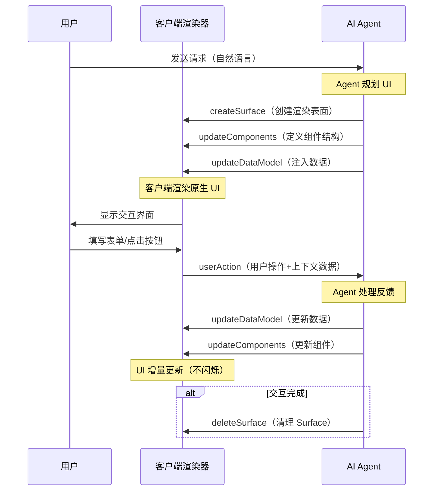

# Live Canvas 与 A2UI 协议

> **本章导读**: AI Agent 的对话界面从诞生之初就以"聊天窗口"为主要交互形态。但随着 Agent 能力的增强，纯文本对话在处理数据可视化、表单填写、实时仪表盘等场景时显得捉襟见肘。OpenClaw 的 Live Canvas 特性引入了一种全新的交互范式——让 Agent 不仅能"说"，还能"画"。本章将从 A2UI 协议的底层规范出发，深入剖析 Live Canvas 的渲染引擎、安全边界、应用场景与协议扩展，并与 Claude Artifacts、GPT Code Interpreter 等方案进行全面对比。
>
> **前置知识**: 基础模块 10-04 Skills 与记忆系统中的 Live Canvas 简介、本章 07 Skill 开发进阶、本章 11 安全模型中的沙箱概念
>
> **难度等级**: ⭐⭐⭐⭐☆

---

## 一、A2UI 协议：Agent 到 UI 的桥梁

### 1.1 什么是 A2UI 协议

A2UI（Agent-to-User Interface）是 Google 于 2025 年底发布的开源协议规范，旨在解决一个核心问题：**AI Agent 如何安全地向用户发送富交互界面**。

传统方案面临两难选择：

| 方案 | 优点 | 缺点 |
|------|------|------|
| **代码生成**（直接输出 HTML/JS） | 灵活、表达力强 | 存在 XSS 风险、Prompt 注入可导致任意代码执行 |
| **Iframe/WebView**（嵌入静态页面） | 安全性好、隔离性强 | UI 风格不一致、无法动态生成、交互感受"割裂" |
| **A2UI 协议** | 安全（声明式）、动态、跨平台 | 需要预先注册组件目录 |

A2UI 的核心理念是**声明式范式（Declarative Paradigm）**：Agent 不再生成可执行代码，而是发送结构化的 JSON 消息来描述 UI 意图。客户端负责将这些声明翻译为原生 UI 组件。Agent 说"**要什么**"，客户端决定"**怎么画**"。

### 1.2 协议的核心消息类型

A2UI v0.9 定义了四种核心消息，构成了 Agent 与 UI 之间的通信语言：

| 消息类型 | 方向 | 作用 |
|---------|------|------|
| `createSurface` | Agent → Client | 创建一个新的渲染表面（Surface） |
| `updateComponents` | Agent → Client | 添加或更新 Surface 上的组件定义 |
| `updateDataModel` | Agent → Client | 更新 Surface 绑定的数据模型 |
| `deleteSurface` | Agent → Client | 删除 Surface 及其所有内容 |

Agent 向客户端发送的是扁平化的 JSONL 流，每个 JSON 对象包含恰好一个顶级消息类型：

```json
{"createSurface":{"surfaceId":"main","catalogId":"basic"}}
{"updateComponents":{"surfaceId":"main","components":[
  {"id":"root","component":"Card","child":"content"},
  {"id":"content","component":"Column","children":["title","chart","button"]},
  {"id":"title","component":"Text","text":"月度销售报告","variant":"h2"},
  {"id":"chart","component":"Chart","type":"bar","data":{"path":"/sales/byMonth"}},
  {"id":"button","component":"Button","child":"btn-label",
    "action":{"event":{"name":"refresh","context":{"source":"main"}}}},
  {"id":"btn-label","component":"Text","text":"刷新数据"}
]}}
{"updateDataModel":{"surfaceId":"main","path":"/sales/byMonth","value":[
  {"month":"1月","amount":128000},
  {"month":"2月","amount":145000},
  {"month":"3月","amount":132000}
]}}
```

在整个消息流中，`createSurface` 通常最先发出以初始化 Surface，`updateComponents` 定义组件树的结构，`updateDataModel` 注入数据，而 `deleteSurface` 则在交互完成时清理资源。

### 1.3 邻接表模型：为何比嵌套 JSON 更优

传统的 UI 描述（如 HTML DOM 或 Flutter Widget 树）使用嵌套结构。但 LLM 的生成方式是逐个 Token 流式输出——如果嵌套层次深、括号错位，整个渲染就会失败。

A2UI 采用**邻接表模型（Adjacency List Model）**：所有组件平铺在一个扁平数组中，通过 ID 引用建立父子关系：

```json
{
  "components": [
    {"id": "root",     "component": "Column", "children": ["header", "form", "footer"]},
    {"id": "header",   "component": "Text",   "text": "预订确认"},
    {"id": "form",     "component": "Row",    "children": ["date-picker", "submit"]},
    {"id": "date-picker", "component": "DateTimeInput", "label": "选择日期"},
    {"id": "submit",   "component": "Button", "child": "btn-text"},
    {"id": "btn-text", "component": "Text",   "text": "提交"}
  ]
}
```

这种设计带来的优势包括：
- **渐进式渲染（Progressive Rendering）**：组件可以逐一出现，无需等整棵树生成完毕
- **局部更新**：修改某个组件不会影响整棵树的其它节点
- **LLM 友好**：扁平结构降低了对 LLM 生成能力的精确度要求

### 1.4 工作流程

A2UI 的完整交互生命周期如下：



这个流程有两个关键设计：数据绑定使得用户操作可以在客户端本地即时响应，而结构化的事件反馈则让 Agent 能够准确理解用户意图。

---

## 二、OpenClaw Live Canvas 架构

### 2.1 Live Canvas 的设计定位

OpenClaw 的 Live Canvas 是对 A2UI 协议的一个具体实现和扩展。它在 OpenClaw Gateway 中内嵌了一个 **Canvas 渲染服务**，让 Agent 能够向用户展示可交互的 Web 界面。

Live Canvas 的定位可以用一句话概括：**Agent 工作区的可视化扩展**。它不是一个完整的 SPA 框架，而是一个轻量级的动态 UI 渲染层。

启用方式：

```yaml
# ~/.openclaw/config.yaml
features:
  live_canvas:
    enabled: true
    port: 18790           # Canvas 渲染服务端口
    rootDir: ~/.openclaw/canvas  # Canvas 文件目录
    liveReload: true      # 开发时热重载
```

### 2.2 架构组成

Live Canvas 由两个核心组件构成：

**1. Canvas Host Server**

一个本地 HTTP 服务器，负责：
- 提供 Canvas HTML/CSS/JS 文件的静态服务
- 注入 WebSocket 客户端用于热重载
- 转发用户操作到 Agent

关键实现：

```typescript
// OpenClaw Canvas Host 示意
async function startCanvasHost(config: CanvasConfig) {
  const server = await createServer({
    port: config.port,
    host: "127.0.0.1",  // 仅本地访问
    handler: createCanvasHandler({
      rootDir: config.rootDir,
      liveReload: config.liveReload,
    }),
  });

  // WebSocket 用于热重载和 A2UI 通信
  const wss = new WebSocketServer({ server });
  wss.on("connection", (ws) => {
    ws.on("message", (data) => {
      // 处理来自 Canvas 的用户操作
      const action = parseUserAction(data.toString());
      forwardToAgent(action);
    });
  });
}
```

**2. A2UI Bridge**

在客户端注入的桥接层，负责客户端与 Agent 之间的双向通信：

```javascript
// 注入到 Canvas 页面中的桥接代码
// 提供统一的用户操作发送接口
window.__openclaw_canvas = {
  // 向 Agent 发送用户操作
  sendUserAction: function(action) {
    const payload = {
      name: action.name,          // 操作名称
      surfaceId: action.surfaceId, // 目标 Surface
      sourceComponentId: action.sourceComponentId, // 来源组件
      context: action.context || {} // 上下文数据
    };
    // 通过 WebSocket 发送给 Gateway
    this.ws.send(JSON.stringify({
      type: "user_action",
      payload
    }));
  },

  // 接收来自 Agent 的 UI 更新
  onA2UIMessage: function(message) {
    // 解析 A2UI 消息并更新 DOM
    processA2UIMessage(message);
  }
};
```

A2UI Bridge 在注入了 `window.__openclaw_canvas` 桥接对象后，还注入 WebSocket 连接代码和 A2UI 消息处理器，将 Gateway 发送的 A2UI 消息转换为实际的 DOM 操作。

### 2.3 Canvas 的渲染策略

Live Canvas 的渲染采用了一种混合策略：

| 场景 | 渲染方式 | 适用情况 |
|------|---------|---------|
| **Agent 直接输出 HTML/CSS** | iframe 沙箱渲染 | Agent 生成完整页面 |
| **Agent 使用 A2UI 协议** | 客户端组件渲染 | 使用预注册组件的声明式 UI |
| **混合渲染** | A2UI + HTML 片段 | 复杂页面中嵌入动态组件 |

对于 A2UI 消息，渲染引擎执行以下步骤：

1. **解析**：将 JSONL 流解析为消息对象
2. **缓冲**：在收到 `beginRendering` 之前缓冲所有消息
3. **构建**：根据邻接表构建虚拟组件树
4. **映射**：将抽象组件映射到实际 DOM 元素
5. **数据绑定**：将数据模型中的值注入组件属性
6. **挂载**：将组件树渲染到 Surface 容器中

---

## 三、安全边界

Live Canvas 将 Agent 生成的代码直接呈现在用户面前，这意味着它打开了一个**代码执行平面**。如果不加限制，恶意 Prompt 注入可能导致 XSS 攻击、数据窃取甚至主机沦陷。

### 3.1 安全威胁模型

| 威胁类型 | 描述 | 影响 |
|---------|------|------|
| XSS 注入 | Agent 生成的 UI 中包含恶意脚本 | 窃取用户 Cookie/Token |
| DOM 篡改 | 修改页面 DOM 插入钓鱼表单 | 诱导用户输入敏感信息 |
| 资源耗尽 | 无限循环或巨大 DOM 导致浏览器崩溃 | DoS |
| 网络探测 | Canvas 中的脚本发起内网请求 | 信息泄露、SSRF |
| 沙箱逃逸 | 突破 iframe 限制访问父页面 | 任意代码执行 |

### 3.2 四层防护体系

OpenClaw 为 Live Canvas 建立了四层安全屏障：

**第一层：内容安全策略（CSP）**

Canvas 页面严格执行 CSP，限制脚本执行来源：

```html
<meta http-equiv="Content-Security-Policy" content="
  default-src 'self';
  script-src 'self' 'unsafe-inline';
  style-src 'self' 'unsafe-inline';
  connect-src 'self' ws://127.0.0.1:*;
  img-src 'self' https: data:;
  frame-src 'none';
  base-uri 'none';
">
```

关键限制包括禁止加载外部脚本、禁止使用 `<base>` 标签、仅允许本地 WebSocket 连接。

**第二层：iframe 沙箱**

所有 Agent 生成的 HTML/JS 在隔离的 iframe 中渲染：

```html
<iframe
  sandbox="allow-scripts allow-same-origin"
  src="/canvas/agent-output/{{surfaceId}}"
  class="live-canvas-frame"
></iframe>
```

iframe 的 `sandbox` 属性移除了 `allow-popups`、`allow-top-navigation`、`allow-forms` 等权限，确保恶意脚本无法打开新窗口或导航到外部站点。

**第三层：文件路径验证**

Canvas 服务器对文件访问路径做严格校验，防止目录穿越：

```typescript
async function resolveCanvasFile(rootDir: string, requestPath: string) {
  // 规范化路径
  const normalized = path.normalize(requestPath).replace(/^[/\\]+/, "");

  // 防止目录穿越
  const resolved = path.resolve(rootDir, normalized);

  // 验证在 rootDir 之下
  if (!resolved.startsWith(path.resolve(rootDir))) {
    throw new SecurityError("Path traversal denied");
  }

  // 检查文件存在性
  return await fs.realpath(resolved);
}
```

**第四层：资源限制**

| 限制类型 | 上限 | 说明 |
|---------|------|------|
| DOM 节点数 | ≤ 5000 | 防止巨大 DOM 导致的浏览器卡死 |
| 渲染超时 | 10 秒 | 超过时间后终止渲染 |
| WebSocket 频率 | 100 条/秒 | 限制消息洪泛 |
| 网络请求白名单 | 仅 `https://api.openclaw.org/*` | 禁止内网探测 |
| Canvas 存储 | ≤ 10MB | Agent 生成的文件总大小限制 |

### 3.3 XSS 防护的"纵深防御"

A2UI 协议的声明式特性天然提供了第一道防线——Agent 只能使用预注册的组件，无法直接嵌入脚本。但 Live Canvas 还允许 Agent 输出原始 HTML，这需要额外的防御措施。

渲染引擎在将 Agent 生成的 HTML 注入 DOM 之前，会经过一个**净化管道**：

```typescript
function sanitizeAgentHTML(raw: string): string {
  return raw
    // 移除所有 <script> 标签
    .replace(/<script[\s\S]*?<\/script>/gi, "")
    // 移除所有事件处理器
    .replace(/\son\w+\s*=\s*["'][^"']*["']/gi, "")
    // 移除 javascript: 协议
    .replace(/javascript:\s*/gi, "")
    // 移除 data: 协议中的脚本
    .replace(/data:\s*text\/html/gi, "")
    // 清理危险的 SVG 属性
    .replace(/<svg[\s\S]*?<\/svg>/gi, (match) => {
      return match.replace(/<script[\s\S]*?<\/script>/gi, "");
    });
}
```

---

## 四、组件目录与数据绑定

### 4.1 基础组件目录

A2UI 的基础组件目录定义了 Agent 可以引用的组件集合。OpenClaw 在 A2UI 基础目录之上，增加了 Canvas 环境下特有的组件：

| 类别 | 组件 | 说明 |
|------|------|------|
| **显示** | Text、Image、Icon、Video | 内容展示类 |
| **布局** | Row、Column、List、Grid | 页面结构 |
| **容器** | Card、Tabs、Divider、Modal | 分组与弹窗 |
| **输入** | Button、CheckBox、TextField、DateTimeInput、ChoicePicker、Slider | 用户交互 |
| **数据** | Chart、Table、DataGrid、Sparkline | 数据可视化 |
| **Canvas 特有** | MarkdownViewer、CodeBlock、FilePreview、Terminal | 开发者工具 |

### 4.2 数据绑定机制

A2UI 的数据绑定使用 **JSON Pointer（RFC 6901）** 路径来关联组件属性与数据模型：

```json
{
  "id": "revenue-display",
  "component": "Text",
  "text": {
    "call": "formatCurrency",
    "args": {
      "value": { "path": "/dashboard/revenue/total" },
      "currency": "CNY"
    },
    "returnType": "string"
  },
  "variant": "h3"
}
```

当数据模型更新时：

```json
{
  "updateDataModel": {
    "surfaceId": "main",
    "path": "/dashboard/revenue",
    "value": {
      "total": 2850000,
      "growth": 0.12,
      "byMonth": [
        { "month": "1月", "amount": 850000 },
        { "month": "2月", "amount": 920000 },
        { "month": "3月", "amount": 1080000 }
      ]
    }
  }
}
```

所有绑定到 `/dashboard/revenue/total` 的组件会自动刷新，无需重新发送整个 UI 结构。

### 4.3 本地状态管理

A2UI 支持客户端本地状态管理，这对表单等交互密集场景至关重要。用户在填写表单时，输入数据由客户端数据模型管理，不需要每次按键都向 Agent 发送请求。只有在点击提交按钮时，`Button` 组件的 `action` 中声明的 `context` 才会将数据打包发送回 Agent：

```json
{
  "id": "submit-btn",
  "component": "Button",
  "child": "submit-label",
  "action": {
    "event": {
      "name": "submitOrder",
      "context": {
        "customerName": { "path": "/form/name" },
        "items": { "path": "/form/cartItems" },
        "total": { "path": "/form/totalAmount" }
      }
    }
  }
}
```

这种设计确保了两件事情：用户操作的即时响应（客户端本地）和数据回传的结构化准确性（Agent 可解析）。

---

## 五、事件系统

### 5.1 事件类型

A2UI 定义了三种基本事件类型：

| 事件类型 | 触发时机 | 示例 |
|---------|---------|------|
| **`click`** | 用户点击交互组件 | Button、CheckBox、List Item |
| **`change`** | 输入组件的值变化 | TextField、DateTimeInput、Slider |
| **`submit`** | 表单提交 | 通常绑定在 Button 的 action 上 |

### 5.2 事件流与 Action 处理

用户操作通过 `userAction` 消息从客户端流向 Agent。Agent 处理后通过 `updateDataModel` 或 `updateComponents` 更新 UI：

```
用户点击 → client: userAction → Agent: 处理 → Agent: updateComponents/updateDataModel → UI 更新
```

Agent 在接收到 `userAction` 消息后，`context` 字段携带的结构化上下文数据可以帮助 Agent 准确理解用户做了什么、需要如何处理，而无需从对话历史中推断。

### 5.3 Surface 生命周期管理

Surface 是 A2UI 中 UI 片段的基本管理单元。一个 Surface 的完整生命周期如下：

```typescript
// 阶段1：创建
agent.send({
  createSurface: { surfaceId: "booking-form", catalogId: "basic" }
});

// 阶段2：填充
agent.send({
  updateComponents: {
    surfaceId: "booking-form",
    components: [ /* ... */ ]
  }
});

// 阶段3：交互循环
// 用户操作 → Agent 更新 UI，可重复多次

// 阶段4：销毁
agent.send({
  deleteSurface: { surfaceId: "booking-form" }
});
```

在 OpenClaw 中，Surface 默认与对话线程绑定：新对话时创建，对话结束时清理。Agent 也可以在对话中动态创建多个 Surface，例如一个用于显示数据图表，另一个用于显示操作面板。

---

## 六、应用场景与局限

### 6.1 适合的场景

**数据可视化**

Agent 分析数据后直接生成图表，这是 Live Canvas 最自然的应用场景。Agent 可以读取用户的数据（如 CSV 报表），分析后以柱状图、折线图、饼图等形式展示，用户无需切换工具。

**表单填写**

当需要收集结构化信息时（如预订会议室、填写报销单），Agent 直接生成交互式表单，用户填写后一键提交。表单的验证逻辑在客户端本地执行，减少了与 Agent 的往返通信。

**投票与调查**

在群聊场景中，Agent 生成投票页面，成员直接在 Canvas 中投票。结果实时更新并以图表展示。

**实时仪表盘**

Agent 定时刷新数据，Canvas 中的仪表盘自动更新。结合 Heartbeat 调度引擎，可以实现"早上自动在 Canvas 上展示今日日程和核心指标"的场景。

**简易原型制作**

开发者可以要求 Agent 生成 UI 原型，在 Canvas 中即时交互验证，显著降低前端原型制作的时间成本。

### 6.2 不适合的场景

**复杂单页应用（SPA）**

Live Canvas 的设计目标不是替代 React、Vue 等前端框架。需多页面路由、复杂状态管理和深层组件嵌套的大型应用，不适合在 Live Canvas 中实现。Agent 生成的 UI 缺乏完善的打包构建工具、性能优化能力和离线支持。

**高交互性应用**

需要实时更新（如 Canvas 2D/3D 游戏、实时协作编辑器）、毫秒级响应或复杂拖拽操作的应用，超出了 Live Canvas 的能力范畴。Agent 生成的 UI 更新存在网络延迟，且缺乏 GPU 加速等底层优化。

**本地化与无障碍**

Live Canvas 生成的 UI 在本地化（i18n）和无障碍（a11y）方面能力有限。Agent 可以输出符合 ARIA 规范的 HTML，但深度的无障碍优化需要人工干预。

### 6.3 用户实际体验案例

在 OpenClaw 社区中，一些用户已经在实际场景中使用 Live Canvas：

> 一位开发者利用 Live Canvas 构建了个人 CRM 仪表盘，让 Agent 从日历和邮件中提取信息，自动生成客户交互时间线和待办事项列表。Agent 通过 A2UI 的 `updateDataModel` 消息实时更新数据，用户无需刷新页面即可看到新内容。

> 另一个案例是团队电报群中的"每日站会助手"：Agent 每天早上生成一个互动面板，包含团队成员的昨日工作、今日计划和阻塞事项。每个团队成员都可以在 Canvas 中更新自己的状态，Agent 将更新写回记忆系统，并在第二天生成增量报告。

---

## 七、协议扩展与自定义

### 7.1 自定义组件注册

OpenClaw 允许用户注册自定义组件，扩展 A2UI 基础目录：

```typescript
// 注册自定义"天气卡片"组件
OpenClawCanvas.registerComponent({
  name: "WeatherCard",
  renderer: (props, data) => {
    const { city, temperature, condition, icon } = props;
    return `
      <div class="weather-card">
        <div class="weather-icon">${icon}</div>
        <div class="weather-city">${city}</div>
        <div class="weather-temp">${temperature}°C</div>
        <div class="weather-condition">${condition}</div>
      </div>
    `;
  },
  validate: (props) => {
    return typeof props.temperature === "number"
      && typeof props.city === "string";
  },
});
```

注册后，Agent 可以在 A2UI 消息中直接引用：

```json
{
  "id": "beijing-weather",
  "component": "WeatherCard",
  "city": "北京",
  "temperature": 24,
  "condition": "晴",
  "icon": "☀️"
}
```

### 7.2 渲染器适配

A2UI 的渲染器不限于 Web 端。理论上，同一套 A2UI 消息可以渲染到不同的客户端：

| 客户端 | 渲染框架 | 适用场景 |
|--------|---------|---------|
| Web | Lit / React / Angular | 桌面浏览器 |
| 移动端 | Flutter / SwiftUI | 手机伴侣 App |
| 桌面 | Electron | 桌面应用通知 |
| 命令行 | Ink（React 终端渲染） | 无 GUI 的服务端场景 |

### 7.3 数据转换函数

A2UI 协议内置了多个数据转换函数，供 Agent 在组件属性中引用，无需自行计算：

| 函数 | 作用 | 示例 |
|------|------|------|
| `formatNumber` | 数字格式化 | `{call:"formatNumber",args:{value:1234567,decimals:0}}` → `"1,234,567"` |
| `formatCurrency` | 货币格式化 | `{call:"formatCurrency",args:{value:99.9,currency:"USD"}}` → `"$99.90"` |
| `formatDate` | 日期格式化 | `{call:"formatDate",args:{value:"2026-05-04",pattern:"yyyy年M月d日"}}` → `"2026年5月4日"` |
| `pluralize` | 复数处理 | `{call:"pluralize",args:{count:3,one:"item",other:"items"}}` → `"3 items"` |
| `openUrl` | 打开链接 | `{call:"openUrl",args:{url:"https://example.com"}}` |

---

## 八、与其他方案的对比

### 8.1 Claude Artifacts

Claude Artifacts 是 Claude 中内置的代码渲染功能。当 Claude 生成 HTML/CSS/JS 代码时，Artifacts 会在沙箱中渲染并展示给用户。

| 维度 | Claude Artifacts | OpenClaw Live Canvas |
|------|-----------------|---------------------|
| **协议** | 无标准协议，直接执行 HTML/JS | 基于 A2UI 标准协议 |
| **安全性** | iframe 沙箱 + DOM 净化 | A2UI 声明式 + iframe 沙箱 + CSP 四层防护 |
| **交互** | 用户可预览但无法回传结构化操作 | 通过 A2UI Action 机制回传结构化事件 |
| **复用性** | 每次单独渲染，难以增量更新 | Surface 机制支持增量更新 |
| **跨平台** | 仅在 Claude 网页端 | 可通过不同渲染器在 Web/移动/桌面使用 |
| **自定义** | 无组件目录 | 支持自定义组件注册和扩展 |

### 8.2 GPT Code Interpreter

GPT Code Interpreter 通过执行 Python 代码生成图表和分析结果。

| 维度 | GPT Code Interpreter | OpenClaw Live Canvas |
|------|---------------------|---------------------|
| **渲染机制** | Python 生成静态图片/HTML | A2UI 协议实时渲染交互式 UI |
| **交互性** | 输出为静态内容 | 支持表单、按钮、图表等交互 |
| **安全模型** | Python 沙箱 | A2UI 组件目录 + iframe 沙箱 |
| **数据绑定** | 无 | JSON Pointer 双向绑定 |
| **适用场景** | 数据分析、文件处理 | 数据可视化、表单、仪表盘 |

### 8.3 OpenClaw Live Canvas 的独特优势

1. **协议标准化**：基于 Google A2UI 标准，不是临时实现的私有格式，具备社区生态基础
2. **声明式安全**：Agent 不生成可执行代码，只生成组件声明，从根本上杜绝了代码注入
3. **增量更新**：Surface 机制支持无需刷新整个页面的局部更新
4. **跨平台潜力**：相同的 A2UI 消息可以在 Web、移动端、桌面端渲染
5. **与 Heartbeat 集成**：可以结合心跳调度，实现定时刷新的自动仪表盘

### 8.4 当前局限

1. **组件目录有限**：基础目录的组件种类有限，自定义组件需要编写代码注册
2. **生态未成熟**：A2UI 协议 v0.9 仍为草案，协议细节可能变化
3. **LLM Token 开销**：发送 UI 描述会占用 LLM 的上下文窗口，复杂页面 Token 消耗显著
4. **前端工作量**：自定义组件目录需要前端开发者投入预置工作
5. **移动端支持**：OpenClaw 的 Canvas 移动端渲染器仍在开发中

---

## 九、未来方向

A2UI 协议的演进路线图显示出几个清晰的方向：

- **v1.0 稳定版**（预计 2026 年下半年）：将 v0.9 的草案功能（`createSurface`、客户端函数、扩展规范）标准化
- **多平台渲染器**：Flutter GenUI SDK 已在生产中使用 A2UI，更多框架的支持将陆续到来
- **认证与授权**：跨 Agent 的 UI 渲染中的身份验证和权限管理
- **离线支持**：缓存的组件目录和离线渲染能力

对于 OpenClaw 而言，Live Canvas 的下一步将聚焦于：
- 与 Heartbeat 深度集成，实现"定时刷新+自动推送"的仪表盘体验
- 完善移动端 Canvas 渲染，让手机伴侣 App 也能展示 Live Canvas
- 开放 Canvas SDK，让第三方开发者能够构建自定义组件库并分发

---

## 本章小结

- A2UI 协议定义了 Agent 与 UI 之间的声明式通信标准，通过四种核心消息类型（createSurface、updateComponents、updateDataModel、deleteSurface）完成 UI 生命周期管理
- 邻接表模型将组件平铺为扁平结构，支持渐进式渲染和 LLM 友好生成
- OpenClaw Live Canvas 基于 A2UI 构建，提供四层安全防护（CSP、iframe 沙箱、路径验证、资源限制）
- 数据绑定使用 JSON Pointer 实现组件属性与数据模型的关联，支持增量更新
- 适合数据可视化、表单、投票和仪表盘场景；不适合复杂 SPA 和高交互性应用
- 自定义组件注册和渲染器适配为协议扩展提供了空间
- 与 Claude Artifacts、GPT Code Interpreter 相比，A2UI 的声明式安全模型是核心差异化优势

---

[← 上一章：安全模型](/deep-dive/openclaw/11-security-model) | [下一章：生态对比与混合架构决策 →](/deep-dive/openclaw/13-ecosystem-comparison)
