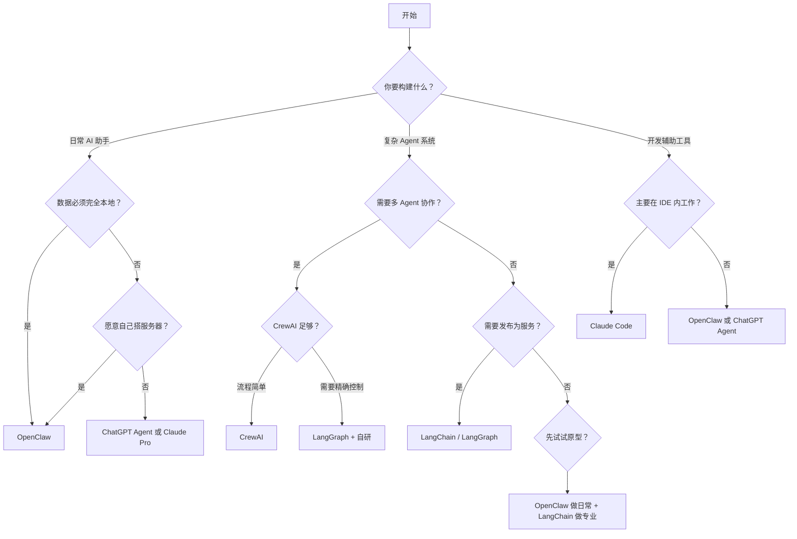
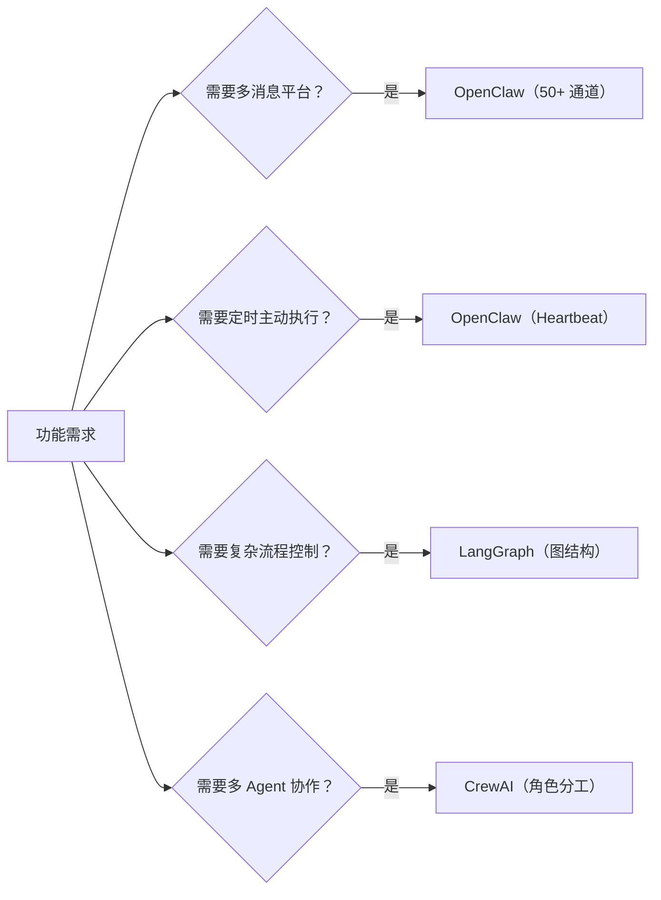
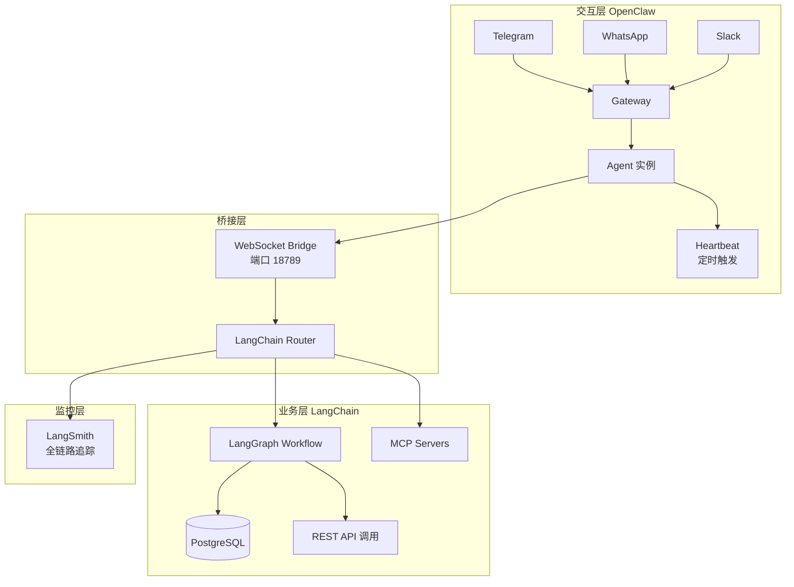
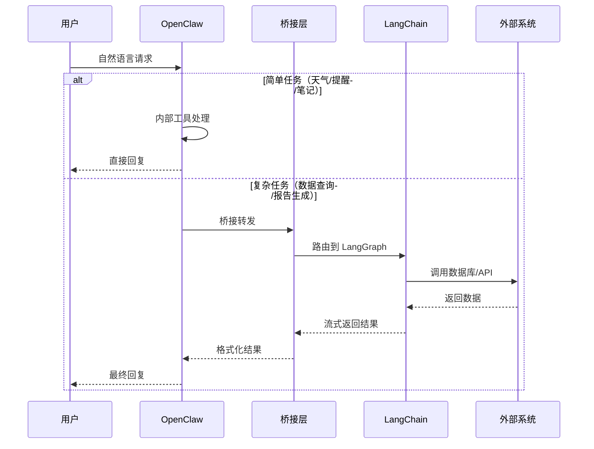
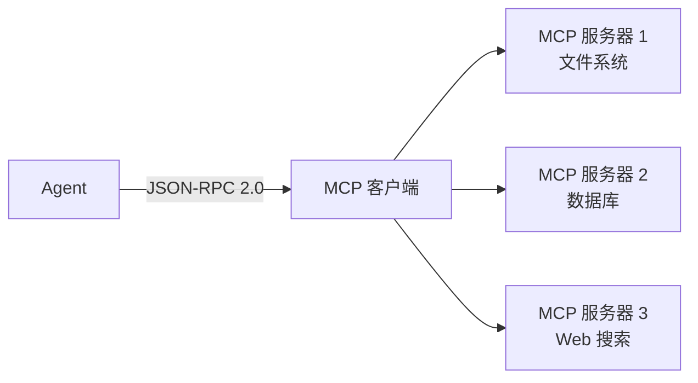
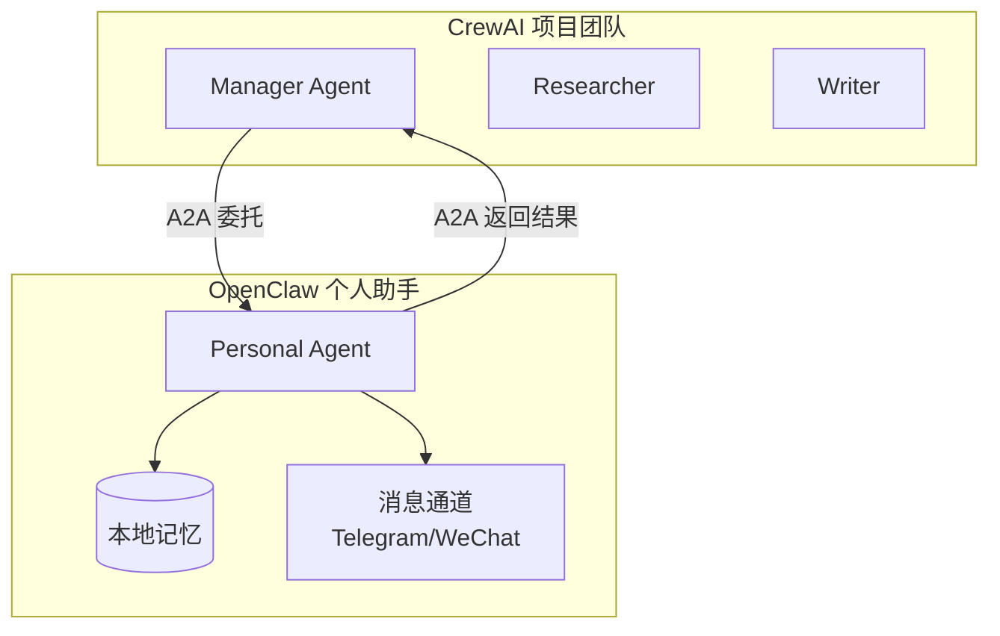

# 生态对比与混合架构决策

> **本章导读**: 前几章我们从架构到安全、从性能到界面，完整解析了 OpenClaw 的内部机制。但一个关键问题始终悬而未决：**什么时候该用 OpenClaw，什么时候该用其他方案？能不能两者一起用？** 本章不讨论"谁更好"，而是提供一套可量化的决策框架——从开发效率、功能丰富度、安全性、扩展性、学习成本等多个维度，将 OpenClaw 与 LangChain、CrewAI、ChatGPT Agent、Claude Code 进行系统性对比，并深入探讨混合架构、MCP 协议集成和 A2A 协议融合的前沿方向。
>
> **前置知识**: 基础模块 05 社区生态与展望、基础模块 07 Agent 生态与协议、本章 07 Skill 开发进阶
>
> **难度等级**: ⭐⭐⭐☆☆

---

## 一、与主流方案的深度对比

在开始对比之前，有必要先厘清一个前提：**OpenClaw 与 LangChain、CrewAI 并非同一物种。** OpenClaw 是一个开箱即用的 AI 助手运行时（Runtime），而 LangChain 是一个 Agent 开发框架（Framework），CrewAI 是一个多 Agent 协作框架。它们的定位差异决定了对比维度必须超越"谁功能多"的浅层比较。

### 1.1 LangChain：开发框架 vs OpenClaw 运行时

**LangChain**（及其下一代 LangGraph）是目前生态最完整的 Agent 开发框架。它的核心理念是**"用代码定义 Agent 行为"**——你写 Python/TypeScript 代码来组装 LLM 调用、工具链、记忆管理和执行流程。

```python
# LangChain 的典型模式：代码定义一切
from langchain.agents import create_react_agent, AgentExecutor
from langchain.tools import Tool

tools = [Tool(name="search", func=search_api, description="搜索")]
agent = create_react_agent(llm, tools, prompt)
executor = AgentExecutor(agent=agent, tools=tools)
result = executor.invoke({"input": "今天天气如何？"})
```

**OpenClaw** 的核心理念则是**"用配置定义 Agent 行为"**——你通过 YAML/JSON 配置和 Markdown 指令（SOUL.md）来定义 Agent 的行为，无需编写代码。

```yaml
# OpenClaw 的典型模式：配置定义一切
# ~/.openclaw/agents/weather/config.yaml
brain:
  model: claude-sonnet-4-20250514
  provider: anthropic
  instructions: |
    你是一个天气助手。
    使用 weather_search 工具查询天气。
    回答要简洁友好。

skills:
  - clawhub:weather
```

**核心差异**：

| 对比维度 | OpenClaw（运行时） | LangChain（框架） |
|---------|-------------------|------------------|
| **代码量** | 零代码 / 低代码 | 大量 Python/JS |
| **上手时间** | 30 分钟可运行 | 1-3 天基础入门 |
| **消息平台** | 内置 50+ 通道 | 需自行实现 |
| **心跳/主动执行** | 内置 Heartbeat | 需自行实现 |
| **记忆系统** | 内置四层记忆（Markdown） | 需自行集成向量库 |
| **流程控制** | 固定管道模式 | 自由图结构（LangGraph） |
| **扩展灵活性** | 通过 Skills 和插件 | 完全编程自由 |
| **调试工具** | 日志 + 基础 CLI | LangSmith 全链路追踪 |
| **生产就绪** | 单进程，适合个人/小团队 | 可分布式部署 |

**本质区别在于**：OpenClaw 提供的是一个**完整的 Agent 应用**——自带消息通道、记忆系统、调度引擎、安全沙箱，你只需要配置它、告诉它你是谁。LangChain 提供的是**构建 Agent 应用的砖块**——你可以自由组装，但也需要自己砌墙、铺管、接电线。

### 1.2 CrewAI：多 Agent 协作 vs 个人助手

CrewAI 定位为**多 Agent 协作框架**，通过"角色-任务-流程"模型让多个 Agent 像团队一样分工协作。

```python
# CrewAI：角色驱动分工协作
researcher = Agent(role="研究员", goal="收集数据", ...)
writer = Agent(role="作家", goal="撰写文章", ...)

task1 = Task(description="调研 AI 趋势", agent=researcher)
task2 = Task(description="写技术博客", agent=writer, context=[task1])

crew = Crew(agents=[researcher, writer], tasks=[task1, task2])
crew.kickoff()  # 多 Agent 协作执行
```

OpenClaw 到目前为止（2026 年 5 月）的核心定位仍然是**个人 AI 助手**——一个 Agent 服务一个用户。虽然可以通过多通道和 Heartbeat 间接实现一些"类多 Agent"效果，但它不具备 CrewAI 那种原生多 Agent 协作能力。

**关键差异**：

| 对比维度 | OpenClaw | CrewAI |
|---------|----------|--------|
| **核心模式** | 1 Agent : 1 用户 | N Agent : 1 任务 |
| **角色分工** | 单角色（由 SOUL.md 定义） | 多角色（每个 Agent 独立角色） |
| **任务编排** | 线性（消息→思考→回答） | 多种模式（顺序/分层/并行） |
| **Agent 间通信** | 无原生支持 | 内置任务结果传递和委托 |
| **部署方式** | 守护进程 | 脚本式运行 |
| **适用场景** | 日常助手 | 复杂项目自动化 |

**一个形象的类比**：OpenClaw 像是你的私人助理——知道你的习惯、偏好、日程，能替你处理日常事务。CrewAI 像一个项目团队——有人做调研、有人写报告、有人做审核，各司其职完成一个复杂项目。两者不是替代关系，而是互补关系。

### 1.3 ChatGPT Agent：云端 vs 自托管

ChatGPT Agent（OpenAI 的云端 Agent 产品，含 GPTs 和 Assistants API）是 OpenClaw 在"零代码 AI 助手"赛道上最直接的竞品。

| 对比维度 | OpenClaw | ChatGPT Agent |
|---------|----------|---------------|
| **托管方式** | 自托管（完全本地） | 云端（OpenAI 服务器） |
| **数据隐私** | 数据不出设备 | 数据存储在 OpenAI |
| **LLM 提供商** | 所有主流（Ollama/Claude/GPT/Gemini） | 仅 OpenAI |
| **消息平台** | 50+ 通道 | 仅 ChatGPT Web/App |
| **主动执行** | Heartbeat 定时任务 | 有限（需手动触发） |
| **记忆容量** | 不限（本地 Markdown） | 受限（上下文窗口） |
| **自定义指令** | SOUL.md + Skills 深度定制 | GPTs Instructions（受限） |
| **费用** | API 按量付费 | $20/月（Plus）起 |
| **离线能力** | 支持本地模型 | 完全在线 |

ChatGPT Agent 最大的优势是**零部署成本**——注册即用，不需要任何基础设施。OpenClaw 最大的优势是**数据主权**——所有数据掌握在自己手中，而且可以通过本地模型实现零 API 成本的运行。

### 1.4 Claude Code：IDE 终端 vs 聊天应用

Claude Code 是 Anthropic 推出的**IDE 内 Agent 工具**，运行在终端中，深度绑定开发工作流。它和 OpenClaw 不是竞品而是**场景互补**——Claude Code 解决的是"写代码时需要一个 AI 结对程序员"，OpenClaw 解决的是"日常生活中需要一个 AI 助手"。

| 对比维度 | OpenClaw | Claude Code |
|---------|----------|-------------|
| **运行环境** | 后台守护进程（端口 18789） | IDE 终端/命令行 |
| **交互方式** | 聊天消息（Telegram/微信/Slack 等） | 命令行对话 |
| **核心能力** | 日常助手（信息聚合、提醒、笔记） | 代码编辑、文件操作、终端命令 |
| **工具系统** | ClawHub Skills + MCP | MCP + 内置文件/终端工具 |
| **文件操作** | 受限（安全沙箱） | 直接操作项目文件 |
| **主动能力** | Heartbeat 定时执行 | 无（始终由用户发起） |
| **适用人群** | 所有用户 | 开发者 |

一个典型的**协同场景**：你用 Claude Code 在终端里写代码，累了切到 Telegram 问 OpenClaw"今天下午有会吗？"、"帮我查一下那个 Bug 的 Jira 工单"——两个 Agent 各司其职。

### 1.5 量化对比总表

以下从 8 个维度对五个方案进行量化评分（1-10 分，10 分为最优）：

| 维度 | OpenClaw | LangChain | CrewAI | ChatGPT Agent | Claude Code |
|------|----------|-----------|--------|--------------|-------------|
| **开发效率**（快速上手） | 9 | 4 | 6 | 10 | 7 |
| **功能丰富度** | 7 | 9 | 7 | 5 | 6 |
| **安全性/数据隐私** | 9 | 8 | 8 | 2 | 6 |
| **扩展性/灵活性** | 5 | 10 | 7 | 3 | 4 |
| **学习成本**（越低越好） | 9 | 4 | 6 | 10 | 7 |
| **运营成本**（越低越好） | 8 | 7 | 7 | 5 | 8 |
| **社区生态** | 6 | 10 | 8 | 10 | 7 |
| **生产就绪度** | 5 | 8 | 6 | 10 | 5 |

**各方案的"甜蜜点"**：

| 方案 | 最佳适用场景 |
|------|-------------|
| **OpenClaw** | 个人 AI 助手、信息聚合、日程管理、多平台聊天、本地数据优先 |
| **LangChain/LangGraph** | 复杂 Agent 系统、流程自动化、生产级 Agent 应用开发 |
| **CrewAI** | 多 Agent 协作项目、内容生产流水线、研究报告生成 |
| **ChatGPT Agent** | 快速原型、轻度使用、不想碰基础设施 |
| **Claude Code** | IDE 内开发辅助、代码重构、项目级自动化 |

---

## 二、适用场景的决策框架

### 2.1 决策树

面对众多方案，普通用户往往会陷入"选择瘫痪"。以下决策树通过 5 个问题帮你快速锁定最适合的方案：



### 2.2 决策考虑因素

**技术能力**：

| 你的技术背景 | 推荐方案 | 原因 |
|-------------|---------|------|
| 非技术用户 | OpenClaw / ChatGPT Agent | 零代码，配置即用 |
| 初级开发者 | OpenClaw + ClawHub Skills | 无需造轮子，快速见效 |
| 中级开发者 | CrewAI / OpenClaw + SDK | 可定制但不上手太难 |
| 高级开发者/团队 | LangChain/LangGraph | 完全掌控，灵活度最高 |

**预算考虑**：

| 预算 | 推荐方案 | 月成本估算 |
|------|---------|-----------|
| 零成本 | OpenClaw + Ollama 本地模型 | 0 元（仅电费） |
| 低成本 | OpenClaw + 混合 API | 5-20 美元 |
| 中等成本 | ChatGPT Plus / Claude Pro | 20-30 美元 |
| 无上限 | LangChain + 企业级 LLM | 100-10000+ 美元 |

**隐私要求**：

| 数据敏感度 | 推荐方案 | 说明 |
|-----------|---------|------|
| 极度敏感（医疗/金融/法律） | OpenClaw（纯本地） | 数据不出设备 |
| 较敏感（企业内部数据） | OpenClaw / LangChain（自托管） | 自建服务器 |
| 一般敏感 | 任何方案 | 可接受云端处理 |
| 不敏感 | ChatGPT Agent | 最省事 |

**功能需求优先级**：



### 2.3 组合策略：不是单选题

最高效的使用方式往往不是"选一个"，而是**根据场景组合使用**：

```
┌─────────────────────────────────────────────────────────┐
│                   你的 AI 能力栈                        │
│                                                         │
│  ┌──────────────────┐  ┌──────────────────────┐        │
│  │  日常层           │  │  专业层               │        │
│  │  OpenClaw        │  │  LangChain / CrewAI   │        │
│  │                  │  │                      │        │
│  │  • 消息助手       │  │  • 复杂业务流程       │        │
│  │  • 日程管理       │  │  • 多 Agent 协作     │        │
│  │  • 信息聚合       │  │  • 生产级 API 服务   │        │
│  │  • 定时提醒       │  │  • 自定义工作流       │        │
│  │  • 多平台接入     │  │  • 全链路监控        │        │
│  └────────┬─────────┘  └───────────┬──────────┘        │
│           │                        │                    │
│           └──────────┬─────────────┘                    │
│                      │                                  │
│                      ▼                                  │
│           ┌─────────────────────┐                       │
│           │  共享层              │                       │
│           │  • 同一 LLM API     │                       │
│           │  • 同一 MCP 服务器   │                       │
│           │  • 同一知识库       │                       │
│           └─────────────────────┘                       │
└─────────────────────────────────────────────────────────┘
```

---

## 三、混合架构设计

第二节的"组合策略"提出了愿景，本节给出具体可落地的混合架构方案。

### 3.1 OpenClaw + LangChain 双层架构

这是最实用也最常用的混合模式：**OpenClaw 负责日常交互层，LangChain 负责业务逻辑层。**



**这个架构的工作流程**：

1. 用户在 Telegram 上对 OpenClaw 说："帮我查一下上个月所有延迟交付的订单"
2. OpenClaw 识别这是一个"需要专业处理"的任务——调用 WebSocket Bridge 将请求转发给 LangChain Router
3. LangChain Router 启动一个 LangGraph 工作流：查询数据库、分析数据、生成报告
4. 执行过程中通过 LangSmith 进行追踪和调试
5. 结果通过 WebSocket 返回给 OpenClaw
6. OpenClaw 将结果格式化为友好的消息发送回 Telegram

**关键设计——桥接层（WebSocket Bridge）**：

```typescript
// OpenClaw 侧的桥接插件（概念示例）
// ~/.openclaw/extensions/langchain-bridge/index.js

class LangChainBridge {
  constructor() {
    this.ws = new WebSocket('ws://localhost:19890/bridge');
    this.pending = new Map();

    this.ws.onmessage = (event) => {
      const { requestId, result } = JSON.parse(event.data);
      const resolve = this.pending.get(requestId);
      if (resolve) {
        resolve(result);
        this.pending.delete(requestId);
      }
    };
  }

  async callLangChain(task) {
    const requestId = crypto.randomUUID();
    return new Promise((resolve) => {
      this.pending.set(requestId, resolve);
      this.ws.send(JSON.stringify({ requestId, task }));
    });
  }
}

// 注册为一个 Skill 工具
module.exports = {
  name: 'langchain-bridge',
  tools: [{
    name: 'submit_complex_task',
    description: '提交复杂任务给 LangChain 处理引擎',
    parameters: {
      type: 'object',
      properties: {
        task: { type: 'string', description: '任务描述' },
        context: { type: 'object', description: '附加上下文' }
      },
      required: ['task']
    },
    handler: async (args) => {
      const bridge = new LangChainBridge();
      return await bridge.callLangChain(args);
    }
  }]
};
```

**数据流传递关系**：

```
用户消息
  → OpenClaw Agent（理解意图）
    → [简单任务] OpenClaw 内部处理（查天气、设置提醒、记录笔记）
    → [复杂任务] WebSocket Bridge → LangChain Router
      → LangGraph Workflow（多步推理、数据库操作、API 调用）
        → 中间结果流式返回 OpenClaw
          → OpenClaw 格式化后推送到消息平台
```

### 3.2 OpenClaw + Agent SDK 扩展

对于不需要 LangChain 全部重量的场景，可以直接利用 Agent SDK 进行轻量级扩展。

**方案一：OpenClaw Plugin SDK**

OpenClaw 本身提供了插件机制，可以编写自定义工具来扩展能力：

```typescript
// ~/.openclaw/extensions/custom-tools/index.js
// 一个自定义数据分析工具的示例

module.exports = {
  name: 'data-analyzer',
  version: '1.0.0',

  tools: [
    {
      name: 'run_sql_query',
      description: '执行 SQL 查询并返回结果（只读）',
      parameters: {
        type: 'object',
        properties: {
          query: { type: 'string', description: 'SQL 查询语句' },
          limit: { type: 'number', default: 100 }
        },
        required: ['query']
      },
      handler: async ({ query, limit }) => {
        // 安全检查：只允许 SELECT
        if (!/^\s*SELECT/i.test(query)) {
          throw new Error('只允许执行 SELECT 查询');
        }
        const results = await db.query(`${query} LIMIT ${limit}`);
        return JSON.stringify(results);
      }
    }
  ]
};
```

**方案二：外部微服务调用**

通过 OpenClaw 的 `http` 工具或自定义插件，调用外部分布式微服务：

```yaml
# ~/.openclaw/openclaw.json
plugins:
  entries:
    http-service-bridge:
      enabled: true
      config:
        services:
          document-processor: "http://localhost:8001"
          image-generator: "http://localhost:8002"
          data-pipeline: "http://localhost:8003"
```

**混合架构的分层原则**：

```
┌─────────────────────────────────────────────┐
│  第 1 层：OpenClaw 核心                     │
│  消息路由、身份认证、基础工具、记忆管理       │
│  适合：日常交互、简单任务                    │
├─────────────────────────────────────────────┤
│  第 2 层：Plugin / Skill 扩展               │
│  ClawHub 社区 Skills、自定义插件            │
│  适合：垂直能力扩展                          │
├─────────────────────────────────────────────┤
│  第 3 层：MCP 服务器                        │
│  标准化工具接口、外部数据源                  │
│  适合：通用工具集成                          │
├─────────────────────────────────────────────┤
│  第 4 层：外部框架/微服务                    │
│  LangChain 工作流、CrewAI 协作、自研服务     │
│  适合：复杂业务逻辑、多 Agent 协作           │
└─────────────────────────────────────────────┘
```

### 3.3 数据流在多系统间的传递

混合架构的核心挑战是**数据流的设计**。以下是推荐的多层数据流架构：



**最佳实践**：

1. **职责分离**：OpenClaw 只做"交互编排"（理解意图、格式化输出），不做"业务计算"
2. **状态共享**：使用共享的文件系统或 Redis 实现跨系统状态传递
3. **错误处理**：OpenClaw 应捕获所有桥接调用异常，优雅降级到"这个问题我需要转给后端系统"
4. **安全隔离**：OpenClaw 所在网络与后端系统网络之间应设置防火墙规则

---

## 四、与 MCP 协议的关系与集成方式

### 4.1 MCP 协议的本质

**MCP（Model Context Protocol）** 是 Anthropic 于 2024 年推出的开放协议，用于标准化 AI Agent 与外部工具/数据源之间的通信。它只解决一个问题：**让 Agent 以一种统一的方式发现和调用外部工具**。

```
"MCP 是 Agent 的 USB-C 接口"
—— Anthropic MCP 官方文档
```

MCP 的核心架构极其简洁：



所有工具通过同一协议暴露，Agent 不需要知道底层实现是文件 API、SQL 查询还是 HTTP 调用。

截至 2026 年 5 月的 MCP 生态数据：

| 指标 | 数据 |
|------|------|
| GitHub MCP 服务器数量 | 13,000+ |
| 公开支持组织 | 237 家 |
| 治理机构 | Linux Foundation（AAIF） |
| 主流支持方 | AWS、Anthropic、Google、Microsoft、OpenAI |

### 4.2 OpenClaw 的 MCP 集成方式

OpenClaw 通过两种方式支持 MCP：

**方式一：ClawHub MCP Plugin（插件级集成）**

社区插件 `openclaw-mcp-plugin` 实现了完整的 MCP Streamable HTTP 传输规范，让 OpenClaw 可以连接任意 MCP 服务器：

```json
{
  "plugins": {
    "entries": {
      "mcp-integration": {
        "enabled": true,
        "config": {
          "servers": {
            "filesystem": {
              "enabled": true,
              "transport": "http",
              "url": "http://localhost:3000/mcp"
            },
            "database": {
              "enabled": true,
              "transport": "http",
              "url": "http://localhost:3001/mcp"
            }
          }
        }
      }
    }
  }
}
```

配置完成后，Agent 通过统一的 `mcp` 工具访问所有 MCP 工具：

```
用户：帮我查一下数据库里最近的订单

Agent：[调用 mcp(action=call, server=database, tool=query, args={sql: "..."})]
→ 返回最近 10 条订单记录
```

**方式二：原生 mcpServers 配置（原生级集成）**

最新版 OpenClaw（2026.1.0+）将 MCP 支持直接内建于核心，无需安装插件：

```json
// ~/.openclaw/openclaw.json
{
  "mcpServers": {
    "filesystem": {
      "command": "npx",
      "args": ["-y", "@modelcontextprotocol/server-filesystem", "/home/openclaw/data"],
      "transport": "stdio"
    },
    "brave-search": {
      "command": "npx",
      "args": ["-y", "@modelcontextprotocol/server-brave-search"],
      "env": { "BRAVE_API_KEY": "${BRAVE_API_KEY}" }
    }
  }
}
```

配置完成后重启 Gateway：

```bash
openclaw gateway restart
openclaw mcp list
# 输出：
# SERVER        STATUS    TOOLS   TRANSPORT
# filesystem    running   11      stdio
# brave-search  running   2       stdio
```

**Per-Agent 路由**（生产环境最佳实践）：

不同 Agent 应只看到它们需要的 MCP 服务器，避免上下文膨胀和不必要的权限暴露：

```json
{
  "agents": {
    "coder": {
      "mcpServers": ["github", "git", "filesystem", "postgres"]
    },
    "personal": {
      "mcpServers": ["obsidian", "memory", "filesystem"]
    }
  }
}
```

### 4.3 MCP Server 配置示例

以下是一套完整的生产级 MCP 配置（12 个服务器，总 Token 开销约 5,200 tokens）：

```json
{
  "mcpServers": {
    "filesystem": {
      "command": "npx",
      "args": ["-y", "@modelcontextprotocol/server-filesystem", "/home/openclaw/data"],
      "description": "文件读写搜索，共 11 个工具，约 400 tokens"
    },
    "brave-search": {
      "command": "npx",
      "args": ["-y", "@modelcontextprotocol/server-brave-search"],
      "env": { "BRAVE_API_KEY": "${BRAVE_API_KEY}" },
      "description": "网络搜索，2 个工具，约 200 tokens"
    },
    "postgres": {
      "command": "npx",
      "args": ["-y", "@modelcontextprotocol/server-postgres", "postgresql://localhost:5432/mydb"],
      "description": "数据库查询，6 个工具，约 450 tokens"
    },
    "github": {
      "command": "npx",
      "args": ["-y", "@modelcontextprotocol/server-github"],
      "env": { "GITHUB_PERSONAL_ACCESS_TOKEN": "${GITHUB_TOKEN}" },
      "description": "Issues/PRs/代码搜索，30 个工具，约 800 tokens"
    },
    "memory": {
      "command": "npx",
      "args": ["-y", "@modelcontextprotocol/server-memory"],
      "description": "跨会话持久记忆，9 个工具，约 200 tokens"
    }
  }
}
```

**生产级注意事项**：

- API 密钥应使用系统环境变量引用（`${VAR}`），而非硬编码在配置文件中
- 使用 `openclaw mcp test <server>` 测试服务器是否正常启动
- 内存泄漏风险：Puppeteer 等浏览器自动化 MCP 服务器可能积累孤儿进程，建议设置定时重启

### 4.4 自有工具系统 vs MCP：异同分析

OpenClaw 拥有两套工具系统——**自有 CLI-based 工具系统**（通过 Skills 注册）和 **MCP 协议集成**。它们并非竞争关系，而是互补关系：

| 对比维度 | OpenClaw Skills（自有工具） | MCP 协议集成 |
|---------|---------------------------|-------------|
| **定义方式** | SKILL.md 声明式定义 | JSON-RPC 2.0 接口 |
| **实现语言** | 任意（通过 CLI 命令） | 任意（SDK 支持 Python/TS/Java） |
| **生态规模** | ClawHub 1,700+ Skills | 13,000+ MCP 服务器 |
| **传输方式** | 本地子进程（stdin/stdout） | stdio 或 HTTP/SSE |
| **安全模型** | 沙箱 + 权限声明（SKILL.md） | 进程隔离 + 授权管理 |
| **安装方式** | `openclaw skill install` | 配置 openclaw.json |
| **更新管理** | 版本化，可通过 ClawHub 更新 | 自维护，需手动更新 |

**选择建议**：

```
需要什么？                               推荐方式
─────────────────────────────────────────────────
社区已有的成熟能力（天气、新闻、翻译）   → ClawHub Skills
企业/个人开发的特定工具                   → 自定义 Skill
行业标准化的外部数据源                     → MCP 服务器
需要远程访问的工具                         → MCP（HTTP 传输）
安全要求极高（数据不出进程）               → 自有 Skill（沙箱内执行）
```

**一个有意思的趋势**：截至 2026 年，OpenClaw 社区中约 65% 的 Skills 在底层封装了 MCP 服务器。Skills 提供行为指令 + 工具访问，MCP 提供底层工具实现——两者在实践中的边界越来越模糊。

---

## 五、与 A2A 协议的对比与融合展望

### 5.1 A2A 协议简介

**A2A（Agent-to-Agent Protocol）** 是 Google 于 2025 年 4 月推出的开放协议，专门解决 AI Agent 之间的通信和协作问题。不同于 MCP 解决的是"Agent 如何用工具"，A2A 解决的是"Agent 如何与其他 Agent 交流"。

```
MCP = Agent ↔ 工具
A2A = Agent ↔ Agent
```

A2A 的核心设计包含四个概念：

1. **Agent Card**：每个 Agent 发布一个 JSON 格式的能力声明，让其他 Agent 可以发现它
2. **Task 生命周期**：Client Agent 向 Remote Agent 提交任务，任务可同步完成或异步执行数小时
3. **Artifact**：任务的输出结果，支持多种媒体类型（文本、图像、视频）
4. **协作协商**：Agent 之间可以协商输出格式、UI 能力、安全策略

**A2A 的特点**：

- 基于 HTTP、SSE、JSON-RPC 等已有标准，易于集成现有 IT 基础设施
- 安全默认设计：支持企业级认证和授权（与 OpenAPI 认证方案同等能力）
- 长任务支持：任务可以持续数分钟到数天，实时推送状态更新
- 多模态：不限于文本，支持音频和视频流

A2A 已被 Google 捐赠给 Linux Foundation 治理，合作伙伴包括 Atlassian、Cohere、LangChain、MongoDB、PayPal、Salesforce、SAP、ServiceNow 等 50+ 家企业。

### 5.2 A2A 与 MCP 的关系

A2A 和 MCP 不是竞争关系，而是**互补关系**：

```
                    ┌─────────────────────┐
                    │    Agent 生态        │
                    │                     │
                    │  ┌───────────────┐  │
                    │  │  A2A 协议      │  │
                    │  │  (Agent ↔ Agent) │  │
                    │  └───────┬───────┘  │
                    │          │          │
                    │  ┌───────▼───────┐  │
                    │  │  MCP 协议      │  │
                    │  │  (Agent ↔ 工具) │  │
                    │  └───────────────┘  │
                    └─────────────────────┘
```

| 对比维度 | MCP | A2A |
|---------|-----|-----|
| **通信方向** | Agent → 工具 | Agent → Agent |
| **发起者** | Anthropic | Google |
| **核心模式** | 客户端-服务器（Client-Server） | 对等（Peer-to-Peer） |
| **通信方式** | JSON-RPC 2.0 | HTTP + SSE + JSON |
| **任务模型** | 同步 RPC 调用 | 异步任务生命周期 |
| **发现机制** | 手动配置 | Agent Card 自动发现 |
| **适用场景** | 工具集成、数据源访问 | 多 Agent 协作、任务委托 |

### 5.3 OpenClaw 与 A2A 的未来融合方向

A2A 为 OpenClaw 打开了几个激动人心的可能性：

**方向一：Agent Market（Agent 市场）**

如果 OpenClaw 实现了 A2A 协议，你的个人助手可以在需要时动态发现和委托任务给其他专业 Agent：

```
你：帮我写一份下周的项目周报

OpenClaw 个人助手：
  → 发现 A2A Agent "周报生成器"
  → 从你的日历和任务管理系统中收集数据
  → 委托给周报 Agent 生成初稿
  → 返回给你审阅
```

**方向二：多 OpenClaw 实例协作**

多个用户各自运行 OpenClaw 实例，通过 A2A 协议实现跨实例协作：

```
用户 A 的 OpenClaw ←→ A2A ←→ 用户 B 的 OpenClaw
     │                               │
     │ 共享日程、委托任务、同步状态     │
     ▼                               ▼
  个人助手                          个人助手
```

**方向三：OpenClaw + CrewAI 桥接**

OpenClaw 作为 CrewAI 团队中的一个 Agent 成员，或者反过来 CrewAI 通过 A2A 将任务委托给 OpenClaw：



**方向四：MCP + A2A 融合**

最理想的状态是 MCP 处理工具调用、A2A 处理 Agent 间通信，OpenClaw 同时支持两种协议：

```
OpenClaw Agent
  ├─ MCP 客户端 → 调用 13,000+ 工具
  └─ A2A 客户端 → 发现和协作其他 Agent

  ═> 组合效果：OpenClaw 既有丰富的工具生态，又能融入更大的 Agent 网络
```

**当前状态与预期时间线**：

| 时间 | 预期进展 |
|------|---------|
| 2026 Q1-Q2 | A2A 协议成为 Linux Foundation 标准项目 |
| 2026 Q3-Q4 | 主流 Agent 框架开始集成 A2A（LangChain、CrewAI 已宣布支持） |
| 2027 | OpenClaw 社区可能出现 A2A 集成插件或原生支持 |
| 2027+ | Agent 互联互通成为标配，MCP + A2A 双协议栈成为 Agent 的"TCP/IP" |

---

## 本章小结

- **OpenClaw 的定位是个人 AI 助手运行时**，与 LangChain（开发框架）、CrewAI（多 Agent 协作）、ChatGPT Agent（云端服务）、Claude Code（IDE 工具）在定位上互补而非替代
- 选择方案应基于**四个核心维度**：技术能力、预算、隐私要求、功能需求——没有万能方案，只有最适合的方案
- **混合架构**是最佳实践：OpenClaw 负责日常交互层，LangChain/CrewAI 负责业务逻辑层，通过 WebSocket Bridge 桥接
- **MCP 协议**为 OpenClaw 打开了 13,000+ 标准化工具的生态，65% 的社区 Skills 背后封装了 MCP 服务器
- **A2A 协议**代表着 Agent 间协作的未来方向，OpenClaw 未来可通过 A2A 融入更大的 Agent 网络
- **MCP（Agent ↔ 工具） + A2A（Agent ↔ Agent）** 的双协议栈组合，正在成为 Agent 生态的事实标准

---

**下一步**: 在[第 14 章](/deep-dive/openclaw/14-practical-scenarios)中，我们将通过完整实战案例，展示如何综合运用本章的架构决策和混合模式，构建真正可用的 Agent 系统。

---

[← 第 12 章：Live Canvas 与 A2UI 协议](/deep-dive/openclaw/12-live-canvas-a2ui) | [返回目录](/deep-dive/openclaw/)
